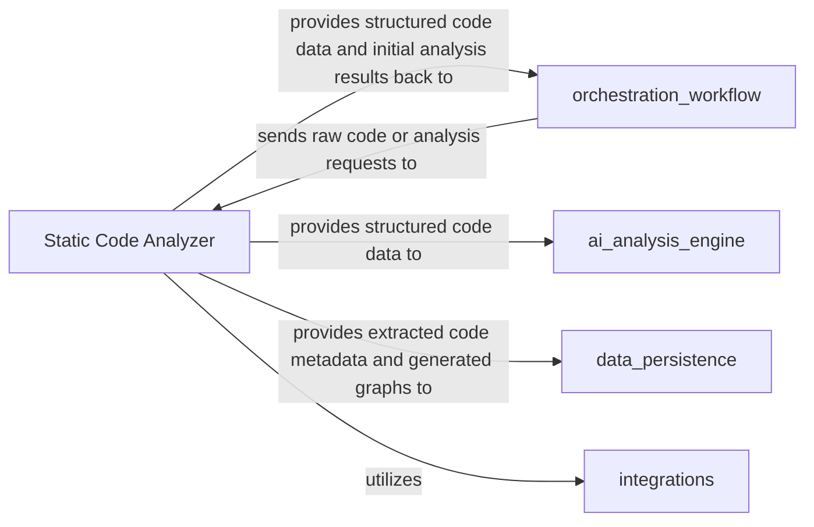

## Details

One paragraph explaining the functionality which is represented by this graph. What the main flow is and what is its purpose.

### Static Code Analyzer [[Expand]](./Static_Code_Analyzer.md)
The Static Code Analyzer component is responsible for the initial, non-AI parsing of source code. It leverages Abstract Syntax Tree (AST)-based techniques to build foundational data structures such as ASTs, Call Graphs, and Structure Graphs. Its primary role is to transform raw code into a structured, machine-readable format, extracting essential code metadata that can then be interpreted and further processed by the AI analysis engine. This component is fundamental as it provides the structured input necessary for all subsequent AI-driven analysis.

**Related Classes/Methods**:

- `static_analyzer/pylint_analyze/call_graph_builder.py`
- `static_analyzer/pylint_analyze/structure_graph_builder.py`

### orchestration_workflow
This component acts as the central coordinator for the code analysis process. It is responsible for receiving raw code or analysis requests, initiating the static analysis process, and managing the flow of data between different analysis stages. It orchestrates the interaction with the `Static Code Analyzer` and potentially other downstream components, ensuring that the analysis pipeline executes correctly.

**Related Classes/Methods**: _None_

### ai_analysis_engine
The `AI Analysis Engine` component is responsible for performing advanced, AI-driven analysis on the structured code data provided by the `Static Code Analyzer`. It leverages machine learning models and algorithms to identify complex patterns, potential vulnerabilities, or areas for optimization that go beyond traditional static analysis.

**Related Classes/Methods**: _None_

### data_persistence
The `Data Persistence` component is responsible for securely storing and retrieving all generated analysis artifacts, including extracted code metadata, Abstract Syntax Trees (ASTs), Call Graphs, and Structure Graphs. It ensures the long-term availability and integrity of the analysis results for historical tracking, reporting, and further processing.

**Related Classes/Methods**: _None_

### integrations
The `Integrations` component provides a standardized interface for interacting with external systems, tools, or services. It handles the communication protocols and data formats required to exchange information with external platforms, such as version control systems, CI/CD pipelines, or reporting dashboards, enabling the seamless flow of code and analysis results.

**Related Classes/Methods**: _None_

### [FAQ](https://github.com/CodeBoarding/GeneratedOnBoardings/tree/main?tab=readme-ov-file#faq)
