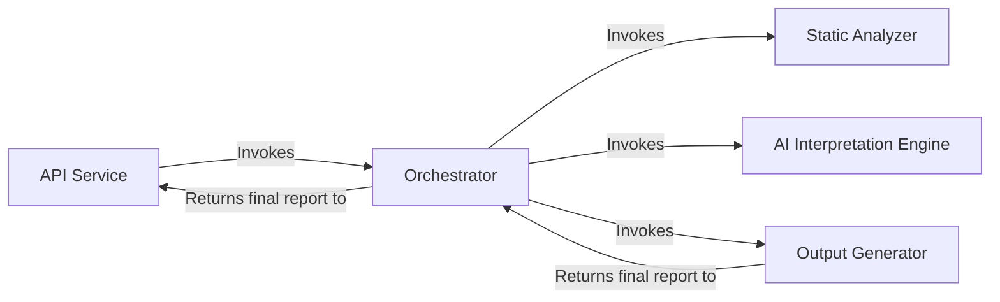

## Details

An analysis of the project's file structure and the initial abstract components reveals a clear mapping between the conceptual architecture and the source code. The feedback provided was valid and has been integrated by grounding the abstract components in specific source files and correcting the data flow between them.

### API Service
Serves as the primary entry point for all external interactions. It exposes the system's capabilities, handling incoming requests and returning the final generated analysis.

**Related Classes/Methods**:

- `local_app.py`
- `github_action.py`

### Orchestrator
Acts as the central coordinator of the analysis pipeline. It manages the sequence of operations, directing the flow of data between the various components to ensure the end-to-end process runs smoothly.

**Related Classes/Methods**:

- `agents/meta_agent.py`

### Static Analyzer [[Expand]](./Static_Analyzer.md)
Performs language-aware static analysis of the source code. It builds foundational data structures, including call graphs and package dependencies, which form the basis for the AI interpretation.

**Related Classes/Methods**:

- `static_analyzer/scanner.py`
- `static_analyzer/lsp_client/`

### AI Interpretation Engine [[Expand]](./AI_Interpretation_Engine.md)
A suite of specialized AI agents responsible for interpreting the static analysis data. It uses a planner, abstraction, and validator agents, along with a toolkit for reading code artifacts, to generate high-level architectural insights.

**Related Classes/Methods**:

- `agents/planner_agent.py`
- `agents/abstraction_agent.py`
- `agents/validator_agent.py`
- `agents/tools/`

### Output Generator
Responsible for converting the final, validated analysis from the AI engine into human-readable formats. It serializes the analysis data and renders it as diagrams and text.

**Related Classes/Methods**:

- `output_generators/html.py`
- `output_generators/markdown.py`
- `diagram_analysis/diagram_generator.py`

### [FAQ](https://github.com/CodeBoarding/GeneratedOnBoardings/tree/main?tab=readme-ov-file#faq)
