```mermaid
graph LR
    CodeBoarding_Core_Agent["CodeBoarding Core Agent"]
    Specialized_Analysis_Agents["Specialized Analysis Agents"]
    Codebase_Interaction_Tools["Codebase Interaction Tools"]
    Static_Analysis_Engine["Static Analysis Engine"]
    Static_Analysis_Utilities["Static Analysis Utilities"]
    External_Interaction_Utilities["External Interaction Utilities"]
    CodeBoarding_Core_Agent -- "orchestrates" --> Specialized_Analysis_Agents
    Specialized_Analysis_Agents -- "extends" --> CodeBoarding_Core_Agent
    CodeBoarding_Core_Agent -- "utilizes" --> Codebase_Interaction_Tools
    CodeBoarding_Core_Agent -- "leverages" --> Static_Analysis_Utilities
    Specialized_Analysis_Agents -- "requests analysis from" --> Static_Analysis_Engine
    Static_Analysis_Engine -- "depends on" --> Static_Analysis_Utilities
    Codebase_Interaction_Tools -- "provides source code to" --> Static_Analysis_Engine
    click CodeBoarding_Core_Agent href "https://github.com/CodeBoarding/CodeBoarding/blob/main/.codeboarding//CodeBoarding/CodeBoarding Core Agent.md" "Details"
    click Specialized_Analysis_Agents href "https://github.com/CodeBoarding/CodeBoarding/blob/main/.codeboarding//CodeBoarding/Specialized Analysis Agents.md" "Details"
    click Codebase_Interaction_Tools href "https://github.com/CodeBoarding/CodeBoarding/blob/main/.codeboarding//CodeBoarding/Codebase Interaction Tools.md" "Details"
    click Static_Analysis_Engine href "https://github.com/CodeBoarding/CodeBoarding/blob/main/.codeboarding//CodeBoarding/Static Analysis Engine.md" "Details"
    click Static_Analysis_Utilities href "https://github.com/CodeBoarding/CodeBoarding/blob/main/.codeboarding//CodeBoarding/Static Analysis Utilities.md" "Details"
    click External_Interaction_Utilities href "https://github.com/CodeBoarding/CodeBoarding/blob/main/.codeboarding//CodeBoarding/External Interaction Utilities.md" "Details"
```

## Component Details

This architecture describes the `CodeBoarding` system, which is designed to perform comprehensive code analysis. The main flow involves a central `CodeBoarding Core Agent` orchestrating specialized analysis agents and utilizing various tools for code exploration, structural analysis, and static analysis to generate detailed insights into the codebase.

### CodeBoarding Core Agent
The central orchestrator responsible for setting up the environment, parsing invocations, and coordinating various code analysis tasks.

**Related Classes/Methods**:

- <a href="https://github.com/CodeBoarding/CodeBoarding/blob/master/agents/agent.py#L19-L38" target="_blank" rel="noopener noreferrer">`agents.agent.CodeBoardingAgent:__init__` (19:38)</a>
- <a href="https://github.com/CodeBoarding/CodeBoarding/blob/master/agents/agent.py#L64-L71" target="_blank" rel="noopener noreferrer">`agents.agent.CodeBoardingAgent:_parse_invoke` (64:71)</a>
- <a href="https://github.com/CodeBoarding/CodeBoarding/blob/master/agents/agent.py#L73-L94" target="_blank" rel="noopener noreferrer">`agents.agent.CodeBoardingAgent.fix_source_code_reference_lines` (73:94)</a>
- <a href="https://github.com/CodeBoarding/CodeBoarding/blob/master/agents/agent.py#L40-L44" target="_blank" rel="noopener noreferrer">`agents.agent.CodeBoardingAgent._setup_env_vars` (40:44)</a>
- <a href="https://github.com/CodeBoarding/CodeBoarding/blob/master/agents/agent.py#L46-L62" target="_blank" rel="noopener noreferrer">`agents.agent.CodeBoardingAgent._invoke` (46:62)</a>

### Specialized Analysis Agents
Agents that extend the core functionality to perform high-level abstractions and detailed code analysis, stepping through CFGs and enhancing code structure.

**Related Classes/Methods**:

- <a href="https://github.com/CodeBoarding/CodeBoarding/blob/master/agents/abstraction_agent.py#L12-L38" target="_blank" rel="noopener noreferrer">`agents.abstraction_agent.AbstractionAgent:__init__` (12:38)</a>
- <a href="https://github.com/CodeBoarding/CodeBoarding/blob/master/agents/abstraction_agent.py#L40-L45" target="_blank" rel="noopener noreferrer">`agents.abstraction_agent.AbstractionAgent:step_cfg` (40:45)</a>
- <a href="https://github.com/CodeBoarding/CodeBoarding/blob/master/agents/abstraction_agent.py#L47-L62" target="_blank" rel="noopener noreferrer">`agents.abstraction_agent.AbstractionAgent:step_source` (47:62)</a>
- <a href="https://github.com/CodeBoarding/CodeBoarding/blob/master/agents/abstraction_agent.py#L64-L72" target="_blank" rel="noopener noreferrer">`agents.abstraction_agent.AbstractionAgent:generate_analysis` (64:72)</a>
- <a href="https://github.com/CodeBoarding/CodeBoarding/blob/master/agents/details_agent.py#L13-L40" target="_blank" rel="noopener noreferrer">`agents.details_agent.DetailsAgent:__init__` (13:40)</a>
- <a href="https://github.com/CodeBoarding/CodeBoarding/blob/master/agents/details_agent.py#L42-L47" target="_blank" rel="noopener noreferrer">`agents.details_agent.DetailsAgent:step_subcfg` (42:47)</a>
- <a href="https://github.com/CodeBoarding/CodeBoarding/blob/master/agents/details_agent.py#L49-L56" target="_blank" rel="noopener noreferrer">`agents.details_agent.DetailsAgent:step_cfg` (49:56)</a>
- <a href="https://github.com/CodeBoarding/CodeBoarding/blob/master/agents/details_agent.py#L58-L67" target="_blank" rel="noopener noreferrer">`agents.details_agent.DetailsAgent:step_enhance_structure` (58:67)</a>
- <a href="https://github.com/CodeBoarding/CodeBoarding/blob/master/agents/details_agent.py#L69-L76" target="_blank" rel="noopener noreferrer">`agents.details_agent.DetailsAgent:step_analysis` (69:76)</a>

### Codebase Interaction Tools
A collection of tools for reading and exploring Python source code, including file content, package relationships, and overall file/directory structure.

**Related Classes/Methods**:

- <a href="https://github.com/CodeBoarding/CodeBoarding/blob/master/agents/tools/read_source.py#L22-L164" target="_blank" rel="noopener noreferrer">`agents.tools.read_source.CodeReferenceReader` (22:164)</a>
- <a href="https://github.com/CodeBoarding/CodeBoarding/blob/master/agents/tools/read_file.py#L16-L105" target="_blank" rel="noopener noreferrer">`agents.tools.read_file.ReadFileTool` (16:105)</a>
- <a href="https://github.com/CodeBoarding/CodeBoarding/blob/master/agents/tools/read_packages.py#L29-L83" target="_blank" rel="noopener noreferrer">`agents.tools.read_packages.PackageRelationsTool` (29:83)</a>
- <a href="https://github.com/CodeBoarding/CodeBoarding/blob/master/agents/tools/read_structure.py#L12-L66" target="_blank" rel="noopener noreferrer">`agents.tools.read_structure.CodeStructureTool` (12:66)</a>
- <a href="https://github.com/CodeBoarding/CodeBoarding/blob/master/agents/tools/read_file_structure.py#L20-L86" target="_blank" rel="noopener noreferrer">`agents.tools.read_file_structure.FileStructureTool` (20:86)</a>
- <a href="https://github.com/CodeBoarding/CodeBoarding/blob/master/agents/tools/utils.py#L6-L22" target="_blank" rel="noopener noreferrer">`agents.tools.utils.read_dot_file` (6:22)</a>
- `agents.tools.GetCFGTool` (full file reference)
- `agents.tools.MethodInvocationsTool` (full file reference)

### Static Analysis Engine
Core components responsible for performing static analysis, including building call graphs and structural graphs from Python source code, and transforming graph data.

**Related Classes/Methods**:

- <a href="https://github.com/CodeBoarding/CodeBoarding/blob/master/static_analyzer/pylint_analyze/call_graph_builder.py#L90-L245" target="_blank" rel="noopener noreferrer">`static_analyzer.pylint_analyze.call_graph_builder.CallGraphBuilder` (90:245)</a>
- <a href="https://github.com/CodeBoarding/CodeBoarding/blob/master/static_analyzer/pylint_analyze/structure_graph_builder.py#L10-L51" target="_blank" rel="noopener noreferrer">`static_analyzer.pylint_analyze.structure_graph_builder.StructureGraphBuilder` (10:51)</a>
- <a href="https://github.com/CodeBoarding/CodeBoarding/blob/master/static_analyzer/pylint_graph_transform.py#L9-L69" target="_blank" rel="noopener noreferrer">`static_analyzer.pylint_graph_transform.DotGraphTransformer` (9:69)</a>

### Static Analysis Utilities
Utility functions specifically designed to assist static analysis, primarily by locating precise line numbers for fully qualified names within source files.

**Related Classes/Methods**:

- <a href="https://github.com/CodeBoarding/CodeBoarding/blob/master/static_analyzer/reference_lines.py#L4-L52" target="_blank" rel="noopener noreferrer">`static_analyzer.reference_lines:find_fqn_location` (4:52)</a>

### External Interaction Utilities
Utility functions for interacting with external systems, such as extracting repository names and executing shell commands, often related to pull request management.

**Related Classes/Methods**:

- <a href="https://github.com/CodeBoarding/CodeBoarding/blob/master/outreach_utils/pr_util.py#L34-L113" target="_blank" rel="noopener noreferrer">`outreach_utils.pr_util:main` (34:113)</a>
- <a href="https://github.com/CodeBoarding/CodeBoarding/blob/master/outreach_utils/pr_util.py#L10-L19" target="_blank" rel="noopener noreferrer">`outreach_utils.pr_util.extract_repo_name` (10:19)</a>
- <a href="https://github.com/CodeBoarding/CodeBoarding/blob/master/outreach_utils/pr_util.py#L22-L31" target="_blank" rel="noopener noreferrer">`outreach_utils.pr_util.run_command` (22:31)</a>

### [FAQ](https://github.com/CodeBoarding/GeneratedOnBoardings/tree/main?tab=readme-ov-file#faq)
