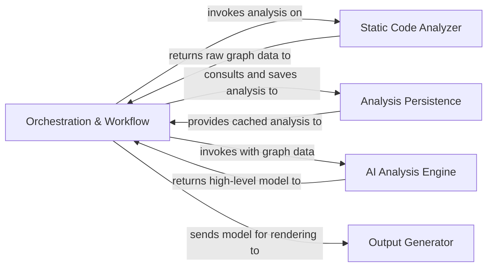

## Details

Abstract Components Overview

### Orchestration & Workflow [[Expand]](./Orchestration_Workflow.md)
The central coordinator that manages the end-to-end analysis pipeline. It initiates static analysis, triggers the AI engine, coordinates with the persistence layer for caching and differential checks, and sends the final, validated results to the output generator.

**Related Classes/Methods**:

- `local_app.py`
- `github_action.py`

### Static Code Analyzer [[Expand]](./Static_Code_Analyzer.md)
Responsible for the initial, non-AI parsing of the source code. It uses AST-based techniques to build foundational data structures like call graphs and structure graphs, transforming raw code into a structured format that the AI engine can interpret.

**Related Classes/Methods**:

- `static_analyzer/pylint_analyze/call_graph_builder.py`
- `static_analyzer/pylint_analyze/structure_graph_builder.py`
- `static_analyzer/pylint_graph_transform.py`

### AI Analysis Engine [[Expand]](./AI_Analysis_Engine.md)
The cognitive core of the system. It is a multi-agent framework that interprets the data from the static analyzer. It uses a collection of specialized agents (e.g., Planner, Abstraction, Diff Analyzer) to collaboratively identify architectural patterns, understand component roles, and build a comprehensive model of the codebase.

**Related Classes/Methods**:

- `agents/agent.py`
- `agents/planner_agent.py`
- `agents/abstraction_agent.py`
- `agents/diff_analyzer.py`

### Analysis Persistence
Handles the serialization and deserialization of the analysis model to a storable format (JSON). This enables the caching of results, which is critical for performance and for supporting efficient incremental analysis by providing a baseline for comparison.

**Related Classes/Methods**:

- `diagram_analysis/analysis_json.py`

### Output Generator
The final stage in the pipeline. It consumes the rich, structured analysis model produced by the AI Engine and renders it into various human-readable formats, such as Markdown, HTML, and Sphinx documentation. Recent changes indicate a streamlining or simplification of its output capabilities.

**Related Classes/Methods**:

- `output_generators/markdown.py`
- `output_generators/html.py`
- `output_generators/sphinx.py`
- `output_generators/mdx.py`

### [FAQ](https://github.com/CodeBoarding/GeneratedOnBoardings/tree/main?tab=readme-ov-file#faq)
