```mermaid
graph LR
    Agent_Orchestration_Workflow["Agent Orchestration & Workflow"]
    AI_Agent_Core["AI Agent Core"]
    Specialized_AI_Agents["Specialized AI Agents"]
    Codebase_Interaction_Analysis_Layer["Codebase Interaction & Analysis Layer"]
    Output_External_Services["Output & External Services"]
    Agent_Orchestration_Workflow -- "Interacts with" --> Specialized_AI_Agents
    Agent_Orchestration_Workflow -- "Uses" --> Output_External_Services
    AI_Agent_Core -- "Provides foundation for" --> Specialized_AI_Agents
    AI_Agent_Core -- "Interacts with" --> Codebase_Interaction_Analysis_Layer
    Specialized_AI_Agents -- "Extends" --> AI_Agent_Core
    Specialized_AI_Agents -- "Uses" --> Codebase_Interaction_Analysis_Layer
    Codebase_Interaction_Analysis_Layer -- "Provides services to" --> AI_Agent_Core
    Codebase_Interaction_Analysis_Layer -- "Provides services to" --> Specialized_AI_Agents
    Output_External_Services -- "Receives data from" --> Agent_Orchestration_Workflow
    Output_External_Services -- "Receives data from" --> Specialized_AI_Agents
    click Agent_Orchestration_Workflow href "https://github.com/CodeBoarding/CodeBoarding/blob/main/.codeboarding/Agent_Orchestration_Workflow.md" "Details"
    click AI_Agent_Core href "https://github.com/CodeBoarding/CodeBoarding/blob/main/.codeboarding/AI_Agent_Core.md" "Details"
    click Specialized_AI_Agents href "https://github.com/CodeBoarding/CodeBoarding/blob/main/.codeboarding/Specialized_AI_Agents.md" "Details"
    click Codebase_Interaction_Analysis_Layer href "https://github.com/CodeBoarding/CodeBoarding/blob/main/.codeboarding/Codebase_Interaction_Analysis_Layer.md" "Details"
    click Output_External_Services href "https://github.com/CodeBoarding/CodeBoarding/blob/main/.codeboarding/Output_External_Services.md" "Details"
```

## Details

The `CodeBoarding` project, an AI-powered Software Engineering (AI4SE) tool, is architected as an intelligent agent system with a clear separation of concerns, promoting modularity and scalability. The analysis of its Control Flow Graph (CFG) and source code reveals five core components that orchestrate the AI-driven code analysis and documentation generation process.

### Agent Orchestration & Workflow [[Expand]](./Agent_Orchestration_Workflow.md)
This is the central control unit responsible for initiating, managing, and coordinating the entire analysis workflow. It orchestrates the execution of various AI agents, processes their outputs, and directs the generation of final documentation. It defines the overall pipeline for code analysis and documentation.

**Related Classes/Methods**:

- <a href="https://github.com/CodeBoarding/CodeBoarding/blob/main/diagram_analysis/diagram_generator.py#L1-L1" target="_blank" rel="noopener noreferrer">`diagram_analysis/diagram_generator.py` (1:1)</a>

### AI Agent Core [[Expand]](./AI_Agent_Core.md)
Provides the foundational structure and common functionalities for all AI agents and many tools within the system. It defines the base class (`CodeBoardingAgent`) and mechanisms for parsing agent invocations, handling responses, and fixing source code references, ensuring consistency and reusability across agents.

**Related Classes/Methods**:

- <a href="https://github.com/CodeBoarding/CodeBoarding/blob/main/agents/agent.py#L1-L1" target="_blank" rel="noopener noreferrer">`agents/agent.py` (1:1)</a>

### Specialized AI Agents [[Expand]](./Specialized_AI_Agents.md)
A collection of AI agents, each designed for a specific analysis task within the software engineering workflow. These agents inherit from the AI Agent Core and leverage the Codebase Interaction & Analysis Layer to perform their specialized functions, such as generating abstractions, extracting details, analyzing diffs, or validating code.

**Related Classes/Methods**:

- <a href="https://github.com/CodeBoarding/CodeBoarding/blob/main/agents/abstraction_agent.py#L1-L1" target="_blank" rel="noopener noreferrer">`agents/abstraction_agent.py` (1:1)</a>
- <a href="https://github.com/CodeBoarding/CodeBoarding/blob/main/agents/details_agent.py#L1-L1" target="_blank" rel="noopener noreferrer">`agents/details_agent.py` (1:1)</a>
- <a href="https://github.com/CodeBoarding/CodeBoarding/blob/main/agents/diff_analyzer.py#L1-L1" target="_blank" rel="noopener noreferrer">`agents/diff_analyzer.py` (1:1)</a>
- <a href="https://github.com/CodeBoarding/CodeBoarding/blob/main/agents/meta_agent.py#L1-L1" target="_blank" rel="noopener noreferrer">`agents/meta_agent.py` (1:1)</a>
- <a href="https://github.com/CodeBoarding/CodeBoarding/blob/main/agents/planner_agent.py#L1-L1" target="_blank" rel="noopener noreferrer">`agents/planner_agent.py` (1:1)</a>
- <a href="https://github.com/CodeBoarding/CodeBoarding/blob/main/agents/validator_agent.py#L1-L1" target="_blank" rel="noopener noreferrer">`agents/validator_agent.py` (1:1)</a>

### Codebase Interaction & Analysis Layer [[Expand]](./Codebase_Interaction_Analysis_Layer.md)
This comprehensive layer provides tools for AI agents to interact with the codebase, file system, and repository. It also encompasses the static code analysis engine, performing tasks like building call graphs and structure graphs. This component abstracts away the complexities of data retrieval and static analysis, serving as the primary data source for the AI agents.

**Related Classes/Methods**:

- <a href="https://github.com/CodeBoarding/CodeBoarding/blob/main/agents/tools/read_source.py#L1-L1" target="_blank" rel="noopener noreferrer">`agents/tools/read_source.py` (1:1)</a>
- <a href="https://github.com/CodeBoarding/CodeBoarding/blob/main/agents/tools/read_packages.py#L1-L1" target="_blank" rel="noopener noreferrer">`agents/tools/read_packages.py` (1:1)</a>
- <a href="https://github.com/CodeBoarding/CodeBoarding/blob/main/agents/tools/read_file_structure.py#L1-L1" target="_blank" rel="noopener noreferrer">`agents/tools/read_file_structure.py` (1:1)</a>
- <a href="https://github.com/CodeBoarding/CodeBoarding/blob/main/agents/tools/read_cfg.py#L1-L1" target="_blank" rel="noopener noreferrer">`agents/tools/read_cfg.py` (1:1)</a>
- <a href="https://github.com/CodeBoarding/CodeBoarding/blob/main/agents/tools/get_method_invocations.py#L1-L1" target="_blank" rel="noopener noreferrer">`agents/tools/get_method_invocations.py` (1:1)</a>
- <a href="https://github.com/CodeBoarding/CodeBoarding/blob/main/agents/tools/read_file.py#L1-L1" target="_blank" rel="noopener noreferrer">`agents/tools/read_file.py` (1:1)</a>
- <a href="https://github.com/CodeBoarding/CodeBoarding/blob/main/agents/tools/read_docs.py#L1-L1" target="_blank" rel="noopener noreferrer">`agents/tools/read_docs.py` (1:1)</a>
- <a href="https://github.com/CodeBoarding/CodeBoarding/blob/main/agents/tools/external_deps.py#L1-L1" target="_blank" rel="noopener noreferrer">`agents/tools/external_deps.py` (1:1)</a>
- <a href="https://github.com/CodeBoarding/CodeBoarding/blob/main/agents/tools/read_git_diff.py#L1-L1" target="_blank" rel="noopener noreferrer">`agents/tools/read_git_diff.py` (1:1)</a>
- <a href="https://github.com/CodeBoarding/CodeBoarding/blob/main/agents/tools/read_structure.py#L1-L1" target="_blank" rel="noopener noreferrer">`agents/tools/read_structure.py` (1:1)</a>
- <a href="https://github.com/CodeBoarding/CodeBoarding/blob/main/static_analyzer/pylint_analyze/call_graph_builder.py#L1-L1" target="_blank" rel="noopener noreferrer">`static_analyzer/pylint_analyze/call_graph_builder.py` (1:1)</a>
- <a href="https://github.com/CodeBoarding/CodeBoarding/blob/main/static_analyzer/pylint_analyze/structure_graph_builder.py#L1-L1" target="_blank" rel="noopener noreferrer">`static_analyzer/pylint_analyze/structure_graph_builder.py` (1:1)</a>
- <a href="https://github.com/CodeBoarding/CodeBoarding/blob/main/static_analyzer/pylint_graph_transform.py#L1-L1" target="_blank" rel="noopener noreferrer">`static_analyzer/pylint_graph_transform.py` (1:1)</a>
- <a href="https://github.com/CodeBoarding/CodeBoarding/blob/main/static_analyzer/reference_lines.py#L1-L1" target="_blank" rel="noopener noreferrer">`static_analyzer/reference_lines.py` (1:1)</a>
- <a href="https://github.com/CodeBoarding/CodeBoarding/blob/main/repo_utils/git_diff.py#L1-L1" target="_blank" rel="noopener noreferrer">`repo_utils/git_diff.py` (1:1)</a>

### Output & External Services [[Expand]](./Output_External_Services.md)
This component is responsible for transforming the analysis results into various human-readable output formats (e.g., HTML, Markdown, Sphinx RST) and handling external communications. It ensures that the generated documentation is well-formatted and facilitates integration with external systems, such as updating pull request links.

**Related Classes/Methods**:

- <a href="https://github.com/CodeBoarding/CodeBoarding/blob/main/output_generators/html.py#L1-L1" target="_blank" rel="noopener noreferrer">`output_generators/html.py` (1:1)</a>
- <a href="https://github.com/CodeBoarding/CodeBoarding/blob/main/output_generators/markdown.py#L1-L1" target="_blank" rel="noopener noreferrer">`output_generators/markdown.py` (1:1)</a>
- <a href="https://github.com/CodeBoarding/CodeBoarding/blob/main/output_generators/sphinx.py#L1-L1" target="_blank" rel="noopener noreferrer">`output_generators/sphinx.py` (1:1)</a>
- <a href="https://github.com/CodeBoarding/CodeBoarding/blob/main/outreach_utils/pr_util.py#L1-L1" target="_blank" rel="noopener noreferrer">`outreach_utils/pr_util.py` (1:1)</a>

### [FAQ](https://github.com/CodeBoarding/GeneratedOnBoardings/tree/main?tab=readme-ov-file#faq)
