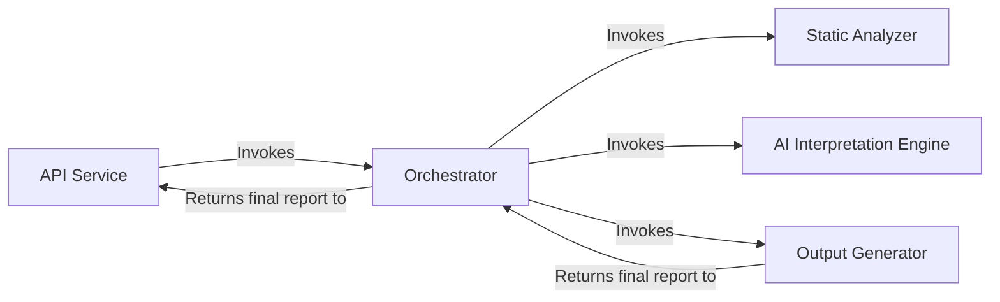

## Details

The system operates by receiving requests through its API Service, which then delegates the analysis process to the Orchestrator. The Orchestrator coordinates the entire workflow, first invoking the Static Analyzer to gather foundational code data through language-aware static analysis. This data is then passed to the AI Interpretation Engine, where specialized AI agents process and interpret it to generate high-level architectural insights. Finally, the Output Generator transforms these insights into human-readable reports, which then returned through the Orchestrator back to the API Service.

### API Service [[Expand]](./API_Service.md)
Serves as the primary entry point for all external interactions. It exposes the system's capabilities, handling incoming requests and returning the final generated analysis.

**Related Classes/Methods**:

- <a href="https://github.com/CodeBoarding/CodeBoarding/blob/main/local_app.py" target="_blank" rel="noopener noreferrer">`local_app.py`</a>
- <a href="https://github.com/CodeBoarding/CodeBoarding/blob/main/github_action.py" target="_blank" rel="noopener noreferrer">`github_action.py`</a>

### Orchestrator [[Expand]](./Orchestrator.md)
Acts as the central coordinator of the analysis pipeline. It manages the sequence of operations, directing the flow of data between the various components to ensure the end-to-end process runs smoothly.

**Related Classes/Methods**:

- <a href="https://github.com/CodeBoarding/CodeBoarding/blob/main/agents/meta_agent.py" target="_blank" rel="noopener noreferrer">`agents/meta_agent.py`</a>

### Static Analyzer [[Expand]](./Static_Analyzer.md)
Performs language-aware static analysis of the source code. It builds foundational data structures, including call graphs and package dependencies, which form the basis for the AI interpretation. Significant internal refactoring of its Language Server Protocol (LSP) client has likely led to improved efficiency, stability, or expanded capabilities in how static analysis data is collected.

**Related Classes/Methods**:

- <a href="https://github.com/CodeBoarding/CodeBoarding/blob/main/static_analyzer/scanner.py" target="_blank" rel="noopener noreferrer">`static_analyzer/scanner.py`</a>
- <a href="https://github.com/CodeBoarding/CodeBoarding/blob/main/static_analyzer/lsp_client/" target="_blank" rel="noopener noreferrer">`static_analyzer/lsp_client/`</a>

### AI Interpretation Engine [[Expand]](./AI_Interpretation_Engine.md)
A suite of specialized AI agents responsible for interpreting the static analysis data. It uses a planner, abstraction, and validator agents, along with a toolkit for reading code artifacts, to generate high-level architectural insights. Recent updates to the prompts used by these AI agents suggest a refinement, expansion, or introduction of new instructions and contexts, potentially leading to more nuanced, accurate, or comprehensive architectural insights.

**Related Classes/Methods**:

- <a href="https://github.com/CodeBoarding/CodeBoarding/blob/main/agents/planner_agent.py" target="_blank" rel="noopener noreferrer">`agents/planner_agent.py`</a>
- <a href="https://github.com/CodeBoarding/CodeBoarding/blob/main/agents/abstraction_agent.py" target="_blank" rel="noopener noreferrer">`agents/abstraction_agent.py`</a>
- <a href="https://github.com/CodeBoarding/CodeBoarding/blob/main/agents/validator_agent.py" target="_blank" rel="noopener noreferrer">`agents/validator_agent.py`</a>
- <a href="https://github.com/CodeBoarding/CodeBoarding/blob/main/agents/tools/" target="_blank" rel="noopener noreferrer">`agents/tools/`</a>
- <a href="https://github.com/CodeBoarding/CodeBoarding/blob/main/agents/agent.py" target="_blank" rel="noopener noreferrer">`agents/agent.py`</a>

### Output Generator [[Expand]](./Output_Generator.md)
Responsible for converting the final, validated analysis from the AI engine into human-readable formats. It serializes the analysis data and renders it as diagrams and text.

**Related Classes/Methods**:

- <a href="https://github.com/CodeBoarding/CodeBoarding/blob/main/output_generators/html.py" target="_blank" rel="noopener noreferrer">`output_generators/html.py`</a>
- <a href="https://github.com/CodeBoarding/CodeBoarding/blob/main/output_generators/markdown.py" target="_blank" rel="noopener noreferrer">`output_generators/markdown.py`</a>
- <a href="https://github.com/CodeBoarding/CodeBoarding/blob/main/diagram_analysis/diagram_generator.py" target="_blank" rel="noopener noreferrer">`diagram_analysis/diagram_generator.py`</a>

### [FAQ](https://github.com/CodeBoarding/GeneratedOnBoardings/tree/main?tab=readme-ov-file#faq)
