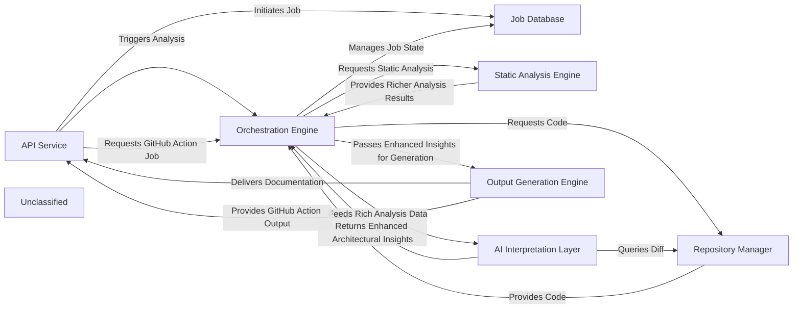

## Details

CodeBoarding's architecture is centered around an `API Service` that acts as the primary external interface, now with expanded capabilities to handle both direct user requests and automated documentation generation via GitHub Actions. This service initiates jobs, which are then managed by the `Job Database` for persistent storage of job status and results. The `Orchestration Engine` is the core control unit, coordinating the entire documentation generation pipeline. It interacts with the `Repository Manager` to fetch and manage source code, and with the `Static Analysis Engine` to perform deep code analysis. The resulting rich analysis data is then fed to the `AI Interpretation Layer`, a collection of specialized AI agents that generate high-level architectural insights. Finally, the `Output Generation Engine` transforms these insights into various documentation formats, delivering them back to the `API Service` for user consumption or GitHub Action integration. This modular design ensures clear separation of concerns and facilitates efficient processing of documentation generation requests.

### API Service [[Expand]](./API_Service.md)
The external interface for CodeBoarding, handling user requests, job initiation, status retrieval, and now specifically integrating with GitHub Actions for automated documentation generation.

**Related Classes/Methods**:

- <a href="https://github.com/CodeBoarding/CodeBoarding/blob/main/local_app.py" target="_blank" rel="noopener noreferrer">`local_app`</a>

### Job Database
Persistent storage for managing the lifecycle, status, and results of all documentation generation jobs.

**Related Classes/Methods**:

- <a href="https://github.com/CodeBoarding/CodeBoarding/blob/main/duckdb_crud.py" target="_blank" rel="noopener noreferrer">`duckdb_crud`</a>

### Orchestration Engine [[Expand]](./Orchestration_Engine.md)
The central control unit that manages the entire documentation generation pipeline, coordinating all analysis and generation stages.

**Related Classes/Methods**:

- <a href="https://github.com/CodeBoarding/CodeBoarding/blob/main/diagram_analysis/diagram_generator.py" target="_blank" rel="noopener noreferrer">`diagram_generator`</a>

### Repository Manager
Manages all interactions with source code repositories, including cloning, fetching, and extracting version differences.

**Related Classes/Methods**:

- <a href="https://github.com/CodeBoarding/CodeBoarding/blob/main/agents/diff_analyzer.py#L21-L32" target="_blank" rel="noopener noreferrer">`__init__`:21-32</a>
- <a href="https://github.com/CodeBoarding/CodeBoarding/blob/main/repo_utils/git_diff.py#L27-L76" target="_blank" rel="noopener noreferrer">`git_diff`:27-76</a>

### Static Analysis Engine [[Expand]](./Static_Analysis_Engine.md)
Performs deep, language-specific analysis of source code to extract richer, more detailed, and comprehensive structural information without semantic interpretation.

**Related Classes/Methods**:

- <a href="https://github.com/CodeBoarding/CodeBoarding/blob/main/static_analyzer/scanner.py#L13-L82" target="_blank" rel="noopener noreferrer">`scanner`:13-82</a>
- <a href="https://github.com/CodeBoarding/CodeBoarding/blob/main/static_analyzer/lsp_client/typescript_client.py#L10-L214" target="_blank" rel="noopener noreferrer">`client`:10-214</a>
- <a href="https://github.com/CodeBoarding/CodeBoarding/blob/main/agents/abstraction_agent.py" target="_blank" rel="noopener noreferrer">`analysis_result`</a>

### AI Interpretation Layer [[Expand]](./AI_Interpretation_Layer.md)
A collection of specialized AI agents that perform sophisticated interpretation of static analysis data, generating enhanced high-level architectural insights, including detailed abstractions, refined planning, robust validation, and comprehensive diff analysis, with structured outputs.

**Related Classes/Methods**:

- <a href="https://github.com/CodeBoarding/CodeBoarding/blob/main/diagram_analysis/diagram_generator.py" target="_blank" rel="noopener noreferrer">`meta_agent`</a>
- <a href="https://github.com/CodeBoarding/CodeBoarding/blob/main/diagram_analysis/diagram_generator.py" target="_blank" rel="noopener noreferrer">`abstraction_agent`</a>
- <a href="https://github.com/CodeBoarding/CodeBoarding/blob/main/diagram_analysis/diagram_generator.py" target="_blank" rel="noopener noreferrer">`details_agent`</a>
- <a href="https://github.com/CodeBoarding/CodeBoarding/blob/main/diagram_analysis/diagram_generator.py" target="_blank" rel="noopener noreferrer">`planner_agent`</a>
- <a href="https://github.com/CodeBoarding/CodeBoarding/blob/main/diagram_analysis/diagram_generator.py" target="_blank" rel="noopener noreferrer">`validator_agent`</a>
- <a href="https://github.com/CodeBoarding/CodeBoarding/blob/main/agents/diff_analyzer.py" target="_blank" rel="noopener noreferrer">`diff_analyzer`</a>
- <a href="https://github.com/CodeBoarding/CodeBoarding/blob/main/agents/diff_analyzer.py#L20-L136" target="_blank" rel="noopener noreferrer">`agent`:20-136</a>
- <a href="https://github.com/CodeBoarding/CodeBoarding/blob/main/agents/agent_responses.py" target="_blank" rel="noopener noreferrer">`agent_responses`</a>
- <a href="https://github.com/CodeBoarding/CodeBoarding/blob/main/agents/details_agent.py" target="_blank" rel="noopener noreferrer">`prompts`</a>

### Output Generation Engine [[Expand]](./Output_Generation_Engine.md)
Transforms the final, validated architectural insights into various human-readable and diagram-friendly documentation formats, with enhanced capabilities for specific output formats and external integrations like GitHub Actions.

**Related Classes/Methods**:

- <a href="https://github.com/CodeBoarding/CodeBoarding/blob/main/github_action.py#L37-L51" target="_blank" rel="noopener noreferrer">`html`:37-51</a>
- <a href="https://github.com/CodeBoarding/CodeBoarding/blob/main/github_action.py#L20-L34" target="_blank" rel="noopener noreferrer">`markdown`:20-34</a>
- <a href="https://github.com/CodeBoarding/CodeBoarding/blob/main/github_action.py#L54-L68" target="_blank" rel="noopener noreferrer">`mdx`:54-68</a>
- <a href="https://github.com/CodeBoarding/CodeBoarding/blob/main/output_generators/sphinx.py" target="_blank" rel="noopener noreferrer">`sphinx`</a>
- <a href="https://github.com/CodeBoarding/CodeBoarding/blob/main/github_action.py" target="_blank" rel="noopener noreferrer">`github_action`</a>

### Unclassified
Component for all unclassified files and utility functions (Utility functions/External Libraries/Dependencies)

**Related Classes/Methods**: _None_

### [FAQ](https://github.com/CodeBoarding/GeneratedOnBoardings/tree/main?tab=readme-ov-file#faq)
