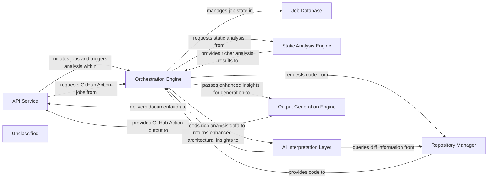

## Details

The CodeBoarding project is structured around a robust, modular architecture designed for automated software documentation generation. At its core, an Orchestration Engine manages the entire workflow, from receiving user requests via the API Service to delivering final documentation through the Output Generation Engine. A critical aspect of this system is the AI Interpretation Layer, which has been significantly enhanced to support multiple Large Language Models (LLMs), including Gemini Flash and Claude, through a sophisticated and extensible prompt management system. This layer processes detailed static analysis data provided by the Static Analysis Engine and repository information from the Repository Manager to generate high-level architectural insights. All job-related data is persistently managed by the Job Database. This design emphasizes clear component boundaries, enabling efficient data flow and facilitating future expansion of supported languages, LLMs, and output formats. The CodeBoarding architecture is a pipeline-driven system centered around an Orchestration Engine that manages the automated generation of software documentation. User interactions and job requests are handled by the API Service, which then delegates the workflow to the Orchestration Engine. This engine coordinates with the Job Database for state management, the Repository Manager for source code access, and the Static Analysis Engine for in-depth code analysis. The core intelligence resides in the AI Interpretation Layer, which now robustly supports multiple LLMs, including Gemini Flash and Claude, through a sophisticated and extensible prompt management system, transforming static analysis data into high-level architectural insights. Finally, the Output Generation Engine converts these insights into various documentation formats, completing the cycle by delivering them back through the API Service. This modular design ensures scalability, maintainability, and adaptability to evolving AI models and documentation needs.

### API Service [[Expand]](./API_Service.md)
The external interface for CodeBoarding, handling user requests, job initiation, status retrieval, and integrating with GitHub Actions for automated documentation generation.

**Related Classes/Methods**:

- <a href="https://github.com/CodeBoarding/CodeBoarding/blob/mainlocal_app.py" target="_blank" rel="noopener noreferrer">`local_app`</a>

### Job Database
Persistent storage for managing the lifecycle, status, and results of all documentation generation jobs.

**Related Classes/Methods**:

- <a href="https://github.com/CodeBoarding/CodeBoarding/blob/mainduckdb_crud.py" target="_blank" rel="noopener noreferrer">`duckdb_crud`</a>

### Orchestration Engine [[Expand]](./Orchestration_Engine.md)
The central control unit that manages the entire documentation generation pipeline, coordinating all analysis and generation stages.

**Related Classes/Methods**:

- <a href="https://github.com/CodeBoarding/CodeBoarding/blob/maindiagram_analysis/diagram_generator.py" target="_blank" rel="noopener noreferrer">`diagram_generator`</a>

### Repository Manager [[Expand]](./Repository_Manager.md)
Manages all interactions with source code repositories, including cloning, fetching, and extracting version differences.

**Related Classes/Methods**:

- <a href="https://github.com/CodeBoarding/CodeBoarding/blob/mainagents/diff_analyzer.py#L21-L32" target="_blank" rel="noopener noreferrer">`__init__`:21-32</a>
- <a href="https://github.com/CodeBoarding/CodeBoarding/blob/mainrepo_utils/git_diff.py#L27-L76" target="_blank" rel="noopener noreferrer">`git_diff`:27-76</a>

### Static Analysis Engine [[Expand]](./Static_Analysis_Engine.md)
Performs deep, language-specific analysis of source code, now explicitly including reference resolution capabilities, enhanced integration with the VS Code environment, and comprehensive TypeScript configuration scanning for deeper analysis of TypeScript projects. It potentially leverages VS Code-specific settings or protocols.

**Related Classes/Methods**:

- <a href="https://github.com/CodeBoarding/CodeBoarding/blob/mainstatic_analyzer/scanner.py#L13-L82" target="_blank" rel="noopener noreferrer">`scanner`:13-82</a>
- <a href="https://github.com/CodeBoarding/CodeBoarding/blob/mainstatic_analyzer/lsp_client/typescript_client.py#L10-L214" target="_blank" rel="noopener noreferrer">`client`:10-214</a>
- <a href="https://github.com/CodeBoarding/CodeBoarding/blob/mainagents/abstraction_agent.py" target="_blank" rel="noopener noreferrer">`analysis_result`</a>
- <a href="https://github.com/CodeBoarding/CodeBoarding/blob/mainstatic_analyzer/reference_resolve_mixin.py" target="_blank" rel="noopener noreferrer">`reference_resolve_mixin`</a>
- <a href="https://github.com/CodeBoarding/CodeBoarding/blob/mainvscode_constants.py" target="_blank" rel="noopener noreferrer">`vscode_constants`</a>
- <a href="https://github.com/CodeBoarding/CodeBoarding/blob/mainstatic_analyzer/typescript_config_scanner.py" target="_blank" rel="noopener noreferrer">`typescript_config_scanner`</a>

### AI Interpretation Layer [[Expand]](./AI_Interpretation_Layer.md)
A collection of specialized AI agents that perform sophisticated interpretation of static analysis data, generating enhanced high-level architectural insights, including detailed abstractions, refined planning, robust validation, and comprehensive diff analysis. This layer now features a significantly enhanced prompt management system, utilizing an `abstract_prompt_factory` and concrete implementations (e.g., `gemini_flash_prompts_bidirectional`, `gemini_flash_prompts_unidirectional`, `claude_prompts_bidirectional`, `claude_prompts_unidirectional`) for structured prompt definition, selection, and application, supporting various language models (e.g., Gemini Flash, Claude) and prompting strategies. The `prompt_factory` has been refactored to integrate this modular and extensible system.

**Related Classes/Methods**:

- <a href="https://github.com/CodeBoarding/CodeBoarding/blob/maindiagram_analysis/diagram_generator.py" target="_blank" rel="noopener noreferrer">`meta_agent`</a>
- <a href="https://github.com/CodeBoarding/CodeBoarding/blob/mainagents/abstraction_agent.py" target="_blank" rel="noopener noreferrer">`abstraction_agent`</a>
- <a href="https://github.com/CodeBoarding/CodeBoarding/blob/mainagents/details_agent.py" target="_blank" rel="noopener noreferrer">`details_agent`</a>
- <a href="https://github.com/CodeBoarding/CodeBoarding/blob/maindiagram_analysis/diagram_generator.py" target="_blank" rel="noopener noreferrer">`planner_agent`</a>
- <a href="https://github.com/CodeBoarding/CodeBoarding/blob/maindiagram_analysis/diagram_generator.py" target="_blank" rel="noopener noreferrer">`validator_agent`</a>
- <a href="https://github.com/CodeBoarding/CodeBoarding/blob/mainagents/diff_analyzer.py" target="_blank" rel="noopener noreferrer">`diff_analyzer`</a>
- <a href="https://github.com/CodeBoarding/CodeBoarding/blob/mainagents/agent.py" target="_blank" rel="noopener noreferrer">`agent`</a>
- <a href="https://github.com/CodeBoarding/CodeBoarding/blob/mainagents/agent_responses.py" target="_blank" rel="noopener noreferrer">`agent_responses`</a>
- <a href="https://github.com/CodeBoarding/CodeBoarding/blob/mainagents/details_agent.py" target="_blank" rel="noopener noreferrer">`prompts`</a>
- <a href="https://github.com/CodeBoarding/CodeBoarding/blob/mainagents/prompts/abstract_prompt_factory.py" target="_blank" rel="noopener noreferrer">`abstract_prompt_factory`</a>
- <a href="https://github.com/CodeBoarding/CodeBoarding/blob/mainagents/prompts/gemini_flash_prompts_bidirectional.py" target="_blank" rel="noopener noreferrer">`gemini_flash_prompts_bidirectional`</a>
- <a href="https://github.com/CodeBoarding/CodeBoarding/blob/mainagents/prompts/gemini_flash_prompts_unidirectional.py" target="_blank" rel="noopener noreferrer">`gemini_flash_prompts_unidirectional`</a>
- <a href="https://github.com/CodeBoarding/CodeBoarding/blob/mainagents/prompts/claude_prompts_bidirectional.py" target="_blank" rel="noopener noreferrer">`claude_prompts_bidirectional`</a>
- <a href="https://github.com/CodeBoarding/CodeBoarding/blob/mainagents/prompts/claude_prompts_unidirectional.py" target="_blank" rel="noopener noreferrer">`claude_prompts_unidirectional`</a>
- <a href="https://github.com/CodeBoarding/CodeBoarding/blob/mainagents/prompts/prompt_factory.py#L37-L53" target="_blank" rel="noopener noreferrer">`prompt_factory`:37-53</a>

### Output Generation Engine [[Expand]](./Output_Generation_Engine.md)
Transforms the final, validated architectural insights into various human-readable and diagram-friendly documentation formats, with enhanced capabilities for specific output formats and external integrations like GitHub Actions.

**Related Classes/Methods**:

- <a href="https://github.com/CodeBoarding/CodeBoarding/blob/maingithub_action.py#L37-L51" target="_blank" rel="noopener noreferrer">`html`:37-51</a>
- <a href="https://github.com/CodeBoarding/CodeBoarding/blob/maingithub_action.py#L20-L34" target="_blank" rel="noopener noreferrer">`markdown`:20-34</a>
- <a href="https://github.com/CodeBoarding/CodeBoarding/blob/maingithub_action.py#L54-L68" target="_blank" rel="noopener noreferrer">`mdx`:54-68</a>
- <a href="https://github.com/CodeBoarding/CodeBoarding/blob/mainoutput_generators/sphinx.py" target="_blank" rel="noopener noreferrer">`sphinx`</a>
- <a href="https://github.com/CodeBoarding/CodeBoarding/blob/maingithub_action.py" target="_blank" rel="noopener noreferrer">`github_action`</a>

### Unclassified
Component for all unclassified files and utility functions (Utility functions/External Libraries/Dependencies)

**Related Classes/Methods**: _None_

### Unclassified
Component for all unclassified files and utility functions (Utility functions/External Libraries/Dependencies)

**Related Classes/Methods**: _None_

### Unclassified
Component for all unclassified files and utility functions (Utility functions/External Libraries/Dependencies)

**Related Classes/Methods**: _None_

### [FAQ](https://github.com/CodeBoarding/GeneratedOnBoardings/tree/main?tab=readme-ov-file#faq)
