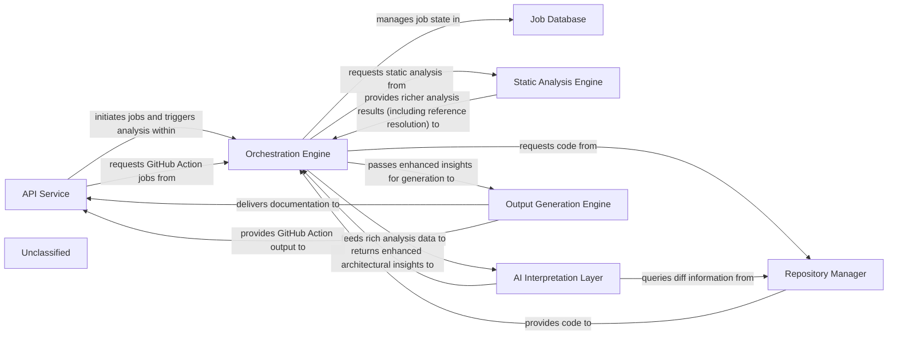

## Details

The CodeBoarding architecture is designed for automated documentation generation, centered around an `Orchestration Engine` that manages the entire pipeline. User interactions are handled by the `API Service`, which initiates jobs stored in the `Job Database`. The `Repository Manager` provides source code and versioning information for analysis. The `Static Analysis Engine` performs deep, language-specific code analysis, now significantly enhanced with reference resolution capabilities, to extract comprehensive structural data. This detailed information is then processed by the `AI Interpretation Layer`, a suite of specialized AI agents operating on a refined and more robust framework, to generate high-level architectural insights. Finally, the `Output Generation Engine` transforms these insights into various documentation formats, including outputs for GitHub Actions, which are then delivered back to the user via the `API Service`.

### API Service [[Expand]](./API_Service.md)
The external interface for CodeBoarding, handling user requests, job initiation, status retrieval, and integrating with GitHub Actions for automated documentation generation.

**Related Classes/Methods**:

- `local_app`

### Job Database
Persistent storage for managing the lifecycle, status, and results of all documentation generation jobs.

**Related Classes/Methods**:

- `duckdb_crud`

### Orchestration Engine [[Expand]](./Orchestration_Engine.md)
The central control unit that manages the entire documentation generation pipeline, coordinating all analysis and generation stages.

**Related Classes/Methods**:

- `diagram_generator`

### Repository Manager [[Expand]](./Repository_Manager.md)
Manages all interactions with source code repositories, including cloning, fetching, and extracting version differences.

**Related Classes/Methods**:

- `__init__`:21-32
- `git_diff`:27-76

### Static Analysis Engine [[Expand]](./Static_Analysis_Engine.md)
Performs deep, language-specific analysis of source code, now explicitly including **reference resolution capabilities**, to extract richer, more detailed, and comprehensive structural information without semantic interpretation.

**Related Classes/Methods**:

- `scanner`:13-82
- `client`:10-214
- `analysis_result`
- `reference_resolve_mixin`

### AI Interpretation Layer [[Expand]](./AI_Interpretation_Layer.md)
A collection of specialized AI agents that perform sophisticated interpretation of static analysis data, generating enhanced high-level architectural insights, including detailed abstractions, refined planning, robust validation, and comprehensive diff analysis, now operating on a **streamlined and more robust underlying agent framework**.

**Related Classes/Methods**:

- `meta_agent`
- `abstraction_agent`
- `details_agent`
- `planner_agent`
- `validator_agent`
- `diff_analyzer`
- `agent`
- `agent_responses`
- `prompts`

### Output Generation Engine [[Expand]](./Output_Generation_Engine.md)
Transforms the final, validated architectural insights into various human-readable and diagram-friendly documentation formats, with enhanced capabilities for specific output formats and external integrations like GitHub Actions.

**Related Classes/Methods**:

- `html`:37-51
- `markdown`:20-34
- `mdx`:54-68
- `sphinx`
- `github_action`

### Unclassified
Component for all unclassified files and utility functions (Utility functions/External Libraries/Dependencies)

**Related Classes/Methods**: _None_

### Unclassified
Component for all unclassified files and utility functions (Utility functions/External Libraries/Dependencies)

**Related Classes/Methods**: _None_

### [FAQ](https://github.com/CodeBoarding/GeneratedOnBoardings/tree/main?tab=readme-ov-file#faq)
