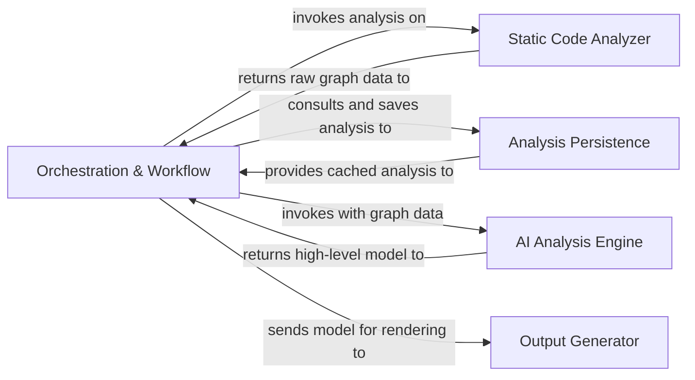
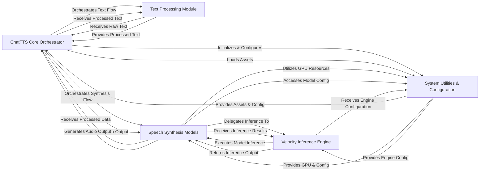
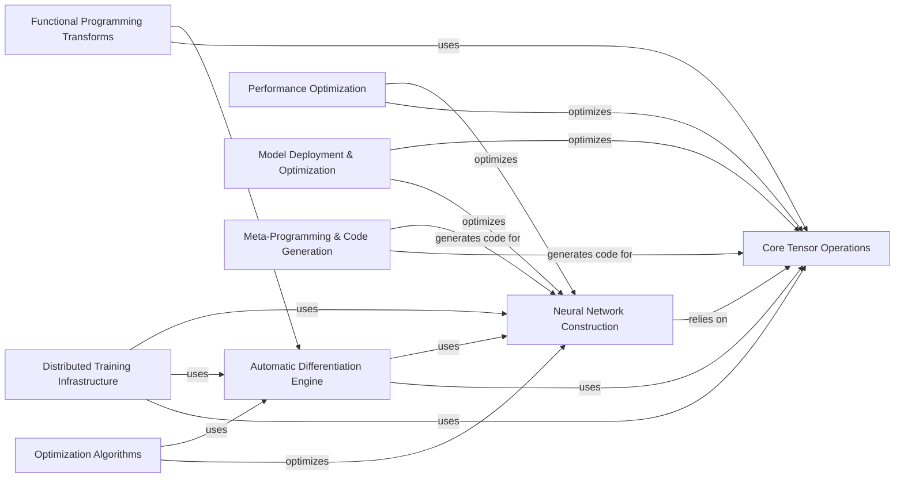
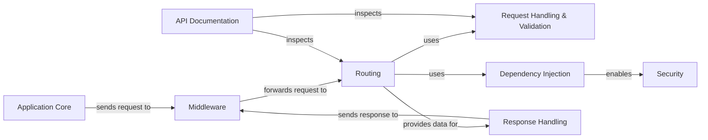

#  CodeBoarding


[](LICENSE)
[](https://codeboarding.org)
[](https://discord.gg/zaWg3Tfn)

**CodeBoarding** is an open-source codebase analysis tool that generates high-level diagram representations of codebases
using static analysis and LLM agents, that humans and agents can interact with.  
It’s designed to support onboarding, documentation, and comprehension for large, complex systems.

- Extract modules and their relationships based on the control flow graph of the project.
- Builds different levels of abstraction with an LLM agent (multi-provider support)
- Outputs interactive diagrams (Mermaid.js) for integration into docs, IDEs, CI/CD.

📄 Existing visual generations: [GeneratedOnBoardings](https://github.com/CodeBoarding/GeneratedOnBoardings)  
🌐 Try for your open-source project: [www.codeboarding.org/demo](https://www.codeboarding.org/demo)

## 🧩 How it works

For detailed architecture information, see our [diagram documentation](.codeboarding/on_boarding.md).



## 📌 Setup

Setup the environment:

```bash
uv venv --python 3.11
uv pip sync requirements.txt
```

Language Scanning:

MacOS:

```bash
brew install cmake pkg-config icu4c
gem install github-linguist
```

Linux:

```bash
sudo apt-get install build-essential cmake pkg-config libicu-dev zlib1g-dev libcurl4-openssl-dev libssl-dev ruby-dev
gem install github-linguist
```

Installing langservers for different technologies:

```bash
pip install pyright # Python
npm install --save typescript-language-server typescript # Typescript
```

> [!IMPORTANT]  
> After installing the dependencies and servers you wanted to use, please update the configuration to use them.
> This configuration can be found in the (static_analysis_config.yml)[./static_analysis_config.yml] file.

### Environment Variables

```bash
# LLM Provider (choose one)
OPENAI_API_KEY=                 
ANTHROPIC_API_KEY=                 
GOOGLE_API_KEY=                  
AWS_BEARER_TOKEN_BEDROCK=         

# Core Configuration
CACHING_DOCUMENTATION=false        # Enable/disable documentation caching
REPO_ROOT=./repos                  # Directory for downloaded repositories
ROOT_RESULT=./results              # Directory for generated outputs
PROJECT_ROOT=/path/to/CodeBoarding # Source project root (must end with /CodeBoarding)
DIAGRAM_DEPTH_LEVEL=1              # Max depth level for diagram generation
STATIC_ANALYSIS_CONFIG=./static_analysis_config.yml # Path to static analysis config

# Optional
GITHUB_TOKEN=                     # For accessing private repositories
LANGSMITH_TRACING=false           # Optional: Enable LangSmith tracing
LANGSMITH_ENDPOINT=               # Optional: LangSmith endpoint
LANGSMITH_PROJECT=                # Optional: LangSmith project name
LANGCHAIN_API_KEY=                # Optional: LangChain API key
```

> 💡 **Tip:** Our experience has shown that using **Google Gemini‑2.5‑Pro** yields the best results for complex diagram
> generation tasks.

### Run it

```bash
python demo.py <github_repo_url> --output-dir <output_path>
```

## 🖥️ Examples:

We have visualized **over 300+ popular open-source projects**. See examples:

### ChatTTS:



## PyTorch:



### FastAPI:



Browse more examples: [GeneratedOnBoardings Repository](https://github.com/CodeBoarding/GeneratedOnBoardings)

## 🚀 Integrations

Codeboarding is integrated with everything we use:

- 📦 [**VS Code Extension**](https://marketplace.visualstudio.com/items?itemName=Codeboarding.codeboarding): Interact with the diagram directly in your IDE.
- ⚙️ [**GitHub Action**](https://github.com/marketplace/actions/codeboarding-diagram-first-documentation): Automate diagram generation in CI/CD.
- 🔗 [**MCP Server**](https://github.com/CodeBoarding/CodeBoarding-MCP): Serves the consize documentation to your AI Agent assistant (ClaudeCode, VSCode, Cursor, etc.)

## 🤝 Contributing

We’re just getting started and would love your help!
If you have ideas, spot bugs, or want to improve anything -
please [open an issue](https://github.com/CodeBoarding/CodeBoarding/issues) or tackle an existing one.
We actively track suggestions and welcome pull requests of all sizes.

## 🔮 Vision

**Unified high-level representation for codebases that is accurate** (hence static analysis). This representation is
used by both people and agents → fully integrated in IDEs, MCP servers, and development workflows.
