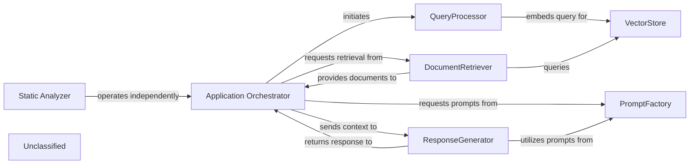
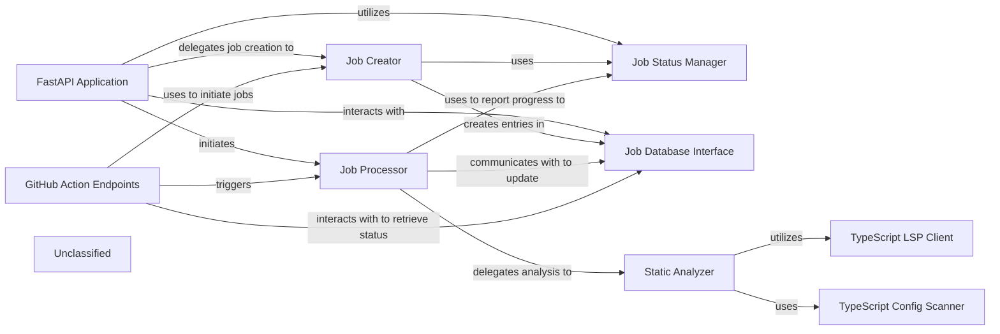
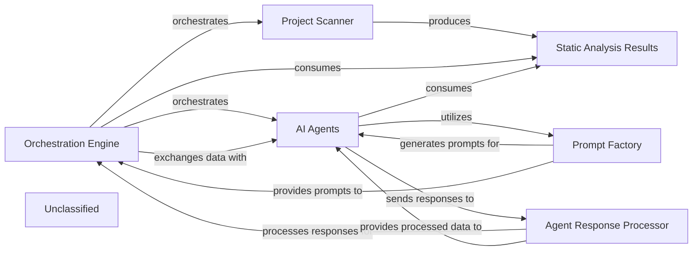
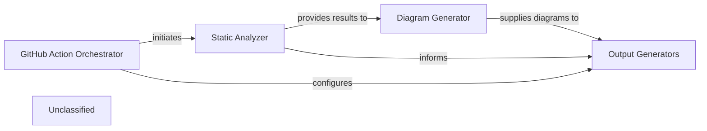
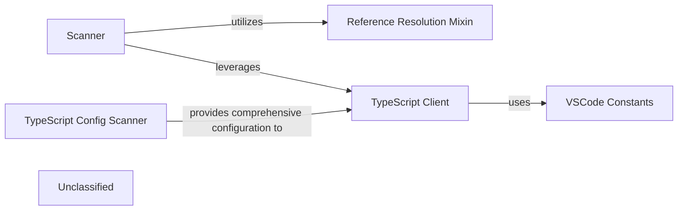
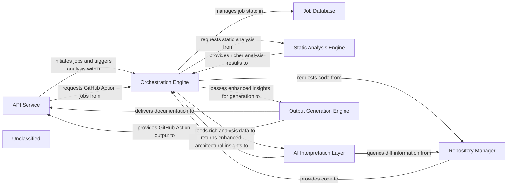

```mermaid
graph LR
    Repository_Manager["Repository Manager"]
    Orchestration_Engine["Orchestration Engine"]
    Static_Analysis_Engine["Static Analysis Engine"]
    AI_Interpretation_Layer["AI Interpretation Layer"]
    Output_Generation_Engine["Output Generation Engine"]
    API_Service["API Service"]
    Job_Database["Job Database"]
    Configuration_Management["Configuration Management"]
    Unclassified["Unclassified"]
    Repository_Manager -- "provides fetched source code to" --> Static_Analysis_Engine
    Repository_Manager -- "queries to retrieve settings for repository access" --> Configuration_Management
    Orchestration_Engine -- "dispatches analysis tasks to" --> Static_Analysis_Engine
    Orchestration_Engine -- "submits jobs to for tracking and persistence" --> Job_Database
    Static_Analysis_Engine -- "sends extracted code insights to for further processing" --> AI_Interpretation_Layer
    Static_Analysis_Engine -- "retrieves analysis rules and configurations from" --> Configuration_Management
    AI_Interpretation_Layer -- "sends interpreted insights and documentation drafts to" --> Output_Generation_Engine
    Output_Generation_Engine -- "provides final documentation and diagrams to for delivery" --> API_Service
    Output_Generation_Engine -- "uses templates and styling rules from" --> Configuration_Management
    API_Service -- "submits new analysis jobs to" --> Orchestration_Engine
    API_Service -- "retrieves final outputs from" --> Output_Generation_Engine
    Job_Database -- "is queried by for job status and results" --> API_Service
    click Repository_Manager href "https://github.com/CodeBoarding/CodeBoarding/blob/main/.codeboarding/Repository_Manager.md" "Details"
    click Orchestration_Engine href "https://github.com/CodeBoarding/CodeBoarding/blob/main/.codeboarding/Orchestration_Engine.md" "Details"
    click Static_Analysis_Engine href "https://github.com/CodeBoarding/CodeBoarding/blob/main/.codeboarding/Static_Analysis_Engine.md" "Details"
    click AI_Interpretation_Layer href "https://github.com/CodeBoarding/CodeBoarding/blob/main/.codeboarding/AI_Interpretation_Layer.md" "Details"
    click Output_Generation_Engine href "https://github.com/CodeBoarding/CodeBoarding/blob/main/.codeboarding/Output_Generation_Engine.md" "Details"
    click API_Service href "https://github.com/CodeBoarding/CodeBoarding/blob/main/.codeboarding/API_Service.md" "Details"
```

## Details

The system is primarily a Retrieval-Augmented Generation (RAG) application orchestrated by the Application Orchestrator. It processes user queries by embedding them via the QueryProcessor and retrieving relevant documents from the VectorStore through the DocumentRetriever. A ResponseGenerator then synthesizes a natural language response using an LLM, heavily relying on structured prompts provided by the PromptFactory. In parallel, an independent Static Analyzer component performs in-depth static analysis of TypeScript configurations, now significantly enhanced by a dedicated Language Server Protocol (LSP) client for more sophisticated analysis.

### Application Orchestrator
Manages the overall application flow, coordinating interactions between QueryProcessor, DocumentRetriever, ResponseGenerator, and leveraging the PromptFactory for agent prompt generation. It receives user queries and delivers final responses, adapting its agent coordination mechanisms due to recent core agent logic refactoring and the new prompt management system.

**Related Classes/Methods**:

- <a href="https://github.com/CodeBoarding/CodeBoarding/blob/mainagents/agent.py" target="_blank" rel="noopener noreferrer">`agents.agent`</a>

### QueryProcessor
Handles incoming user queries, embeds them, and prepares them for similarity search, potentially utilizing refined prompts from the PromptFactory for enhanced query understanding.

**Related Classes/Methods**:

- <a href="https://github.com/CodeBoarding/CodeBoarding/blob/main." target="_blank" rel="noopener noreferrer">`langchain_core.embeddings.Embeddings:embed_query`</a>

### VectorStore
Stores and retrieves document embeddings based on similarity search.

**Related Classes/Methods**:

- `langchain_community.vectorstores.chroma.Chroma:similarity_search`

### DocumentRetriever
Retrieves relevant documents from the vector store.

**Related Classes/Methods**:

- <a href="https://github.com/CodeBoarding/CodeBoarding/blob/main." target="_blank" rel="noopener noreferrer">`langchain_core.retrievers.BaseRetriever:get_relevant_documents`</a>

### ResponseGenerator
Generates a natural language response using a large language model based on the query and retrieved documents, now significantly enhanced by leveraging structured prompts from the PromptFactory, including specialized prompts for models like Gemini Flash and Claude.

**Related Classes/Methods**:

- <a href="https://github.com/CodeBoarding/CodeBoarding/blob/main." target="_blank" rel="noopener noreferrer">`langchain_core.language_models.llms.BaseLLM:invoke`</a>

### PromptFactory
Centralizes the creation and management of prompts for various agents and language models through an abstract factory pattern. It provides a structured and standardized approach to prompt generation, leveraging an AbstractPromptFactory interface and specialized implementations like GeminiFlashPromptsBidirectional, GeminiFlashPromptsUnidirectional, ClaudePromptsBidirectional, and ClaudePromptsUnidirectional. This ensures consistent and optimized interactions with LLMs, notably for Gemini Flash and Claude models, by managing an expanded library of prompts.

**Related Classes/Methods**:

- <a href="https://github.com/CodeBoarding/CodeBoarding/blob/mainagents/prompts/prompt_factory.py#L29-L98" target="_blank" rel="noopener noreferrer">`prompt_factory.PromptFactory`:29-98</a>

### Static Analyzer
A new, independent functional area responsible for performing static analysis, specifically focusing on scanning TypeScript configurations. This component has been significantly enhanced with the integration of a dedicated Language Server Protocol (LSP) client for TypeScript, enabling more sophisticated and in-depth analysis by leveraging the full capabilities of a TypeScript Language Server. It operates in parallel to the core RAG system, providing distinct capabilities without directly altering the RAG data flow.

**Related Classes/Methods**:

- <a href="https://github.com/CodeBoarding/CodeBoarding/blob/mainstatic_analyzer/typescript_config_scanner.py" target="_blank" rel="noopener noreferrer">`static_analyzer.typescript_config_scanner`</a>
- <a href="https://github.com/CodeBoarding/CodeBoarding/blob/mainstatic_analyzer/lsp_client/typescript_client.py" target="_blank" rel="noopener noreferrer">`static_analyzer.lsp_client.typescript_client`</a>

### Unclassified
Component for all unclassified files and utility functions (Utility functions/External Libraries/Dependencies)

**Related Classes/Methods**:

### Unclassified
Component for all unclassified files and utility functions (Utility functions/External Libraries/Dependencies)

**Related Classes/Methods**: _None_

### [FAQ](https://github.com/CodeBoarding/GeneratedOnBoardings/tree/main?tab=readme-ov-file#faq)

## Details

The system is centered around a FastAPI Application that serves as the primary entry point for all client interactions, managing API endpoints for job initiation and status retrieval. It delegates job creation to the Job Creator and interacts with the Job Database Interface for persistent storage, while the Job Status Manager oversees job lifecycle states. The Job Processor is an asynchronous component orchestrating the documentation generation pipeline, which now explicitly delegates code analysis to the Static Analyzer. The Static Analyzer is a critical subsystem, especially for TypeScript projects, leveraging a TypeScript LSP Client for deep language server interactions and a TypeScript Config Scanner for understanding project build contexts. Specialized GitHub Action Endpoints facilitate automated job initiation and status monitoring for GitHub workflows, interacting with the Job Creator, Job Processor, and Job Database Interface. This architecture highlights a clear separation of concerns, with the Static Analyzer providing enhanced language-specific analysis capabilities to the core Job Processor.

### FastAPI Application
The core web server, responsible for defining and managing API endpoints, handling incoming HTTP requests, and routing them to appropriate handlers for job initiation, status retrieval, and external integrations. It serves as the primary entry point for all client interactions.

**Related Classes/Methods**:

- <a href="https://github.com/CodeBoarding/CodeBoarding/blob/mainlocal_app.py" target="_blank" rel="noopener noreferrer">`local_app.app`</a>

### Job Creator
Responsible for initializing new documentation generation job records. It assigns unique identifiers and sets the initial status (e.g., PENDING) for each new job, preparing it for processing.

**Related Classes/Methods**:

- <a href="https://github.com/CodeBoarding/CodeBoarding/blob/mainlocal_app.py" target="_blank" rel="noopener noreferrer">`local_app.make_job`</a>

### Job Status Manager
Defines and manages the lifecycle states of documentation generation jobs (e.g., PENDING, RUNNING, COMPLETED, FAILED). It provides a consistent mechanism for updating and retrieving the current status of any job within the system.

**Related Classes/Methods**:

- <a href="https://github.com/CodeBoarding/CodeBoarding/blob/mainlocal_app.py" target="_blank" rel="noopener noreferrer">`local_app.JobStatus`</a>
- <a href="https://github.com/CodeBoarding/CodeBoarding/blob/mainduckdb_crud.py" target="_blank" rel="noopener noreferrer">`duckdb_crud.update_job`</a>
- <a href="https://github.com/CodeBoarding/CodeBoarding/blob/mainduckdb_crud.py" target="_blank" rel="noopener noreferrer">`duckdb_crud.fetch_job`</a>

### Job Database Interface
Provides an abstraction layer for persistent storage and retrieval of job-related data. It encapsulates CRUD (Create, Read, Update, Delete) operations for job records, ensuring data integrity and accessibility across the API service.

**Related Classes/Methods**:

- <a href="https://github.com/CodeBoarding/CodeBoarding/blob/mainduckdb_crud.py" target="_blank" rel="noopener noreferrer">`duckdb_crud.init_db`</a>
- <a href="https://github.com/CodeBoarding/CodeBoarding/blob/mainduckdb_crud.py" target="_blank" rel="noopener noreferrer">`duckdb_crud.insert_job`</a>
- <a href="https://github.com/CodeBoarding/CodeBoarding/blob/mainduckdb_crud.py" target="_blank" rel="noopener noreferrer">`duckdb_crud.fetch_job`</a>
- <a href="https://github.com/CodeBoarding/CodeBoarding/blob/mainduckdb_crud.py" target="_blank" rel="noopener noreferrer">`duckdb_crud.update_job`</a>
- <a href="https://github.com/CodeBoarding/CodeBoarding/blob/mainduckdb_crud.py" target="_blank" rel="noopener noreferrer">`duckdb_crud.fetch_all_jobs`</a>

### Job Processor
An asynchronous component that orchestrates the end-to-end documentation generation pipeline for a single job. It handles repository cloning, invokes the core analysis and generation logic (delegating to the Static Analyzer), and manages the processing results, updating job status throughout its execution.

**Related Classes/Methods**:

- <a href="https://github.com/CodeBoarding/CodeBoarding/blob/mainlocal_app.py" target="_blank" rel="noopener noreferrer">`local_app.generate_onboarding`</a>

### Static Analyzer
Responsible for performing in-depth code analysis, particularly for TypeScript projects. It leverages an LSP client for language server interactions and a configuration scanner to understand project build settings, providing structured insights to the Job Processor.

**Related Classes/Methods**:

- <a href="https://github.com/CodeBoarding/CodeBoarding/blob/mainstatic_analyzer/scanner.py" target="_blank" rel="noopener noreferrer">`static_analyzer/scanner.py`</a>
- <a href="https://github.com/CodeBoarding/CodeBoarding/blob/mainstatic_analyzer/lsp_client/client.py" target="_blank" rel="noopener noreferrer">`static_analyzer/lsp_client/client.py`</a>

### TypeScript LSP Client
A specialized client within the Static Analyzer that interacts with the TypeScript Language Server Protocol. It enables sophisticated code understanding, symbol resolution, and semantic analysis for TypeScript projects.

**Related Classes/Methods**:

- <a href="https://github.com/CodeBoarding/CodeBoarding/blob/mainstatic_analyzer/lsp_client/typescript_client.py" target="_blank" rel="noopener noreferrer">`static_analyzer/lsp_client/typescript_client.py`</a>

### TypeScript Config Scanner
A component within the Static Analyzer responsible for parsing and interpreting TypeScript configuration files (e.g., `tsconfig.json`). It extracts crucial project settings, build contexts, and file inclusions necessary for accurate static analysis.

**Related Classes/Methods**:

- <a href="https://github.com/CodeBoarding/CodeBoarding/blob/mainstatic_analyzer/typescript_config_scanner.py" target="_blank" rel="noopener noreferrer">`static_analyzer/typescript_config_scanner.py`</a>

### GitHub Action Endpoints
A specialized set of API endpoints within the FastAPI Application designed for seamless integration with GitHub Actions workflows. These endpoints facilitate automated job initiation and status monitoring specifically for GitHub-driven documentation generation requests.

**Related Classes/Methods**:

- <a href="https://github.com/CodeBoarding/CodeBoarding/blob/mainlocal_app.py" target="_blank" rel="noopener noreferrer">`local_app.start_docs_generation_job`</a>
- <a href="https://github.com/CodeBoarding/CodeBoarding/blob/mainlocal_app.py" target="_blank" rel="noopener noreferrer">`local_app.get_github_action_job_status`</a>

### Unclassified
Component for all unclassified files and utility functions (Utility functions/External Libraries/Dependencies)

**Related Classes/Methods**: _None_

### [FAQ](https://github.com/CodeBoarding/GeneratedOnBoardings/tree/main?tab=readme-ov-file#faq)

## Details

The system operates around an Orchestration Engine that manages the entire documentation generation pipeline. It initiates the process by leveraging the Project Scanner to gather static analysis data, which is then stored in Static Analysis Results. The Orchestration Engine then coordinates a suite of AI Agents, each with specialized roles, to analyze this data. These agents utilize a sophisticated Prompt Factory to construct dynamic prompts for the LLM, enabling both "bidirectional" and "unidirectional" communication patterns. Agent responses are processed by the Agent Response Processor before being fed back to the Orchestration Engine for further coordination, feedback application, and final result saving. This architecture emphasizes a modular, agent-based approach with a highly adaptable prompting mechanism for intelligent code analysis and documentation generation.

### Orchestration Engine [[Expand]](./Orchestration_Engine.md)
The central control unit that manages the entire documentation generation pipeline, coordinating all analysis and generation stages. It initializes and coordinates AI agents, handles pre-analysis, processes components, determines update needs, applies feedback, and saves results.

**Related Classes/Methods**:

- <a href="https://github.com/CodeBoarding/CodeBoarding/blob/maindiagram_analysis/diagram_generator.py" target="_blank" rel="noopener noreferrer">`diagram_generator`</a>

### Project Scanner
A component responsible for initiating and collecting static analysis data from the codebase, including specialized scanning for TypeScript configurations, serving as the primary input for the analysis pipeline.

**Related Classes/Methods**:

- <a href="https://github.com/CodeBoarding/CodeBoarding/blob/mainstatic_analyzer/scanner.py" target="_blank" rel="noopener noreferrer">`scanner`</a>
- <a href="https://github.com/CodeBoarding/CodeBoarding/blob/mainstatic_analyzer/typescript_config_scanner.py" target="_blank" rel="noopener noreferrer">`typescript_config_scanner`</a>

### Static Analysis Results
A data structure that holds the comprehensive results of static analysis, making this information accessible to the Orchestration Engine and AI agents.

**Related Classes/Methods**:

- <a href="https://github.com/CodeBoarding/CodeBoarding/blob/mainstatic_analyzer/analysis_result.py" target="_blank" rel="noopener noreferrer">`analysis_result`</a>

### AI Agents
A collective component representing all specialized AI agents (MetaAgent, AbstractionAgent, DetailsAgent, PlannerAgent, ValidatorAgent) responsible for various stages of code analysis and documentation generation. These agents now incorporate advanced prompting strategies for more complex reasoning.

**Related Classes/Methods**:

- <a href="https://github.com/CodeBoarding/CodeBoarding/blob/mainagents/meta_agent.py" target="_blank" rel="noopener noreferrer">`meta_agent`</a>
- <a href="https://github.com/CodeBoarding/CodeBoarding/blob/mainagents/abstraction_agent.py" target="_blank" rel="noopener noreferrer">`abstraction_agent`</a>
- <a href="https://github.com/CodeBoarding/CodeBoarding/blob/mainagents/details_agent.py" target="_blank" rel="noopener noreferrer">`details_agent`</a>
- <a href="https://github.com/CodeBoarding/CodeBoarding/blob/mainagents/planner_agent.py" target="_blank" rel="noopener noreferrer">`planner_agent`</a>
- <a href="https://github.com/CodeBoarding/CodeBoarding/blob/mainagents/validator_agent.py" target="_blank" rel="noopener noreferrer">`validator_agent`</a>

### Prompt Factory
Responsible for dynamically constructing and managing prompts for the LLM, supporting both "bidirectional" and "unidirectional" communication patterns, enabling sophisticated reasoning and interaction strategies for the AI Agents.

**Related Classes/Methods**:

- <a href="https://github.com/CodeBoarding/CodeBoarding/blob/mainagents/prompts/prompt_factory.py#L37-L53" target="_blank" rel="noopener noreferrer">`prompt_factory`:37-53</a>
- <a href="https://github.com/CodeBoarding/CodeBoarding/blob/mainagents/prompts/claude_prompts_bidirectional.py" target="_blank" rel="noopener noreferrer">`claude_prompts_bidirectional`</a>
- <a href="https://github.com/CodeBoarding/CodeBoarding/blob/mainagents/prompts/claude_prompts_unidirectional.py" target="_blank" rel="noopener noreferrer">`claude_prompts_unidirectional`</a>

### Agent Response Processor
Handles the parsing, validation, and structuring of responses received from the LLM, ensuring that the output is correctly interpreted and formatted for subsequent processing by the Orchestration Engine and other AI Agents.

**Related Classes/Methods**:

- <a href="https://github.com/CodeBoarding/CodeBoarding/blob/mainagents/agent_responses.py" target="_blank" rel="noopener noreferrer">`agent_responses`</a>

### Unclassified
Component for all unclassified files and utility functions (Utility functions/External Libraries/Dependencies)

**Related Classes/Methods**: _None_

### [FAQ](https://github.com/CodeBoarding/GeneratedOnBoardings/tree/main?tab=readme-ov-file#faq)

## Details

The system operates by first orchestrating a static analysis of the codebase via the GitHub Action Orchestrator, which delegates this task to the Static Analyzer. The Static Analyzer, with its enhanced TypeScript capabilities, processes the source code and generates detailed analysis results. These results are then fed into the Diagram Generator, which visualizes the architectural insights into various diagram formats. Finally, both the raw analysis data and the generated diagrams are consumed by the Output Generators to produce comprehensive documentation in desired formats, completing the automated documentation and diagram generation pipeline.

### GitHub Action Orchestrator
Serves as the primary entry point for initiating the analysis and documentation generation process within a GitHub Actions workflow. It orchestrates the execution flow, configuring and delegating tasks to other components based on user-defined inputs and project context.

**Related Classes/Methods**:

- <a href="https://github.com/CodeBoarding/CodeBoarding/blob/maingithub_action.py" target="_blank" rel="noopener noreferrer">`github_action`</a>

### Static Analyzer
This component performs in-depth static analysis of the project's source code. It includes specialized capabilities for TypeScript, utilizing a Language Server Protocol (LSP) client for detailed code understanding and a configuration scanner to interpret `tsconfig.json` files. The output is a structured analysis result, often represented as a graph, detailing code relationships and properties.

**Related Classes/Methods**:

- <a href="https://github.com/CodeBoarding/CodeBoarding/blob/mainstatic_analyzer/lsp_client/typescript_client.py" target="_blank" rel="noopener noreferrer">`static_analyzer.lsp_client.typescript_client`</a>
- <a href="https://github.com/CodeBoarding/CodeBoarding/blob/mainstatic_analyzer/typescript_config_scanner.py" target="_blank" rel="noopener noreferrer">`static_analyzer.typescript_config_scanner`</a>
- <a href="https://github.com/CodeBoarding/CodeBoarding/blob/mainstatic_analyzer/scanner.py" target="_blank" rel="noopener noreferrer">`static_analyzer.scanner`</a>
- <a href="https://github.com/CodeBoarding/CodeBoarding/blob/mainstatic_analyzer/graph.py" target="_blank" rel="noopener noreferrer">`static_analyzer.graph`</a>
- <a href="https://github.com/CodeBoarding/CodeBoarding/blob/mainstatic_analyzer/analysis_result.py" target="_blank" rel="noopener noreferrer">`static_analyzer.analysis_result`</a>

### Diagram Generator
Responsible for consuming the structured analysis results provided by the `Static Analyzer` and transforming them into visual diagrams. It focuses on creating clear and informative representations of code architecture and relationships, which can then be embedded into various documentation formats.

**Related Classes/Methods**:

- <a href="https://github.com/CodeBoarding/CodeBoarding/blob/maindiagram_analysis/diagram_generator.py" target="_blank" rel="noopener noreferrer">`diagram_analysis.diagram_generator`</a>
- <a href="https://github.com/CodeBoarding/CodeBoarding/blob/maindiagram_analysis/analysis_json.py" target="_blank" rel="noopener noreferrer">`diagram_analysis.analysis_json`</a>

### Output Generators
This component is a collection of specialized modules, each responsible for producing documentation in a specific format (e.g., Markdown, HTML, MDX, Sphinx/reStructuredText). It integrates the raw analysis data and generated diagrams into the final, human-readable documentation.

**Related Classes/Methods**:

- <a href="https://github.com/CodeBoarding/CodeBoarding/blob/mainoutput_generators/markdown.py" target="_blank" rel="noopener noreferrer">`output_generators.markdown`</a>
- <a href="https://github.com/CodeBoarding/CodeBoarding/blob/mainoutput_generators/html.py" target="_blank" rel="noopener noreferrer">`output_generators.html`</a>
- <a href="https://github.com/CodeBoarding/CodeBoarding/blob/mainoutput_generators/mdx.py" target="_blank" rel="noopener noreferrer">`output_generators.mdx`</a>
- <a href="https://github.com/CodeBoarding/CodeBoarding/blob/mainoutput_generators/sphinx.py" target="_blank" rel="noopener noreferrer">`output_generators.sphinx`</a>

### Unclassified
Component for all unclassified files and utility functions (Utility functions/External Libraries/Dependencies)

**Related Classes/Methods**: _None_

### [FAQ](https://github.com/CodeBoarding/GeneratedOnBoardings/tree/main?tab=readme-ov-file#faq)

## Details

The system operates by orchestrating a series of analysis and generation tasks. The `Orchestration Engine` initiates and manages the entire workflow. It instructs the `Repository Manager` to fetch or update the codebase, which then provides the source code to the `Static Analysis Engine`. The `Static Analysis Engine`, now with enhanced and specialized capabilities for TypeScript analysis, performs in-depth code analysis, extracting structural information and dependencies. It also retrieves analysis rules and configurations from `Configuration Management`. The extracted code insights are then passed to the `AI Interpretation Layer`, which leverages LLMs to interpret the context and generate architectural patterns and documentation drafts. These drafts are subsequently sent to the `Output Generation Engine` for formatting and rendering into various output formats, utilizing templates and styling rules from `Configuration Management`. Finally, the `API Service` provides an interface for users to submit jobs, monitor status, and retrieve the generated documentation and analysis results, querying the `Job Database` for job status and results.

### Repository Manager [[Expand]](./Repository_Manager.md)
Manages all interactions with source code repositories, including cloning, fetching, and extracting version differences, to provide the necessary codebase for analysis.

**Related Classes/Methods**:

- <a href="https://github.com/CodeBoarding/CodeBoarding/blob/mainagents/diff_analyzer.py#L21-L32" target="_blank" rel="noopener noreferrer">`__init__`:21-32</a>
- <a href="https://github.com/CodeBoarding/CodeBoarding/blob/mainrepo_utils/git_diff.py#L27-L76" target="_blank" rel="noopener noreferrer">`git_diff`:27-76</a>

### Orchestration Engine [[Expand]](./Orchestration_Engine.md)
Coordinates the overall workflow of codebase analysis, managing the sequence of operations from repository ingestion to final output generation. It acts as the central control for job execution.

**Related Classes/Methods**:

- <a href="https://github.com/CodeBoarding/CodeBoarding/blob/mainagents/diff_analyzer.py" target="_blank" rel="noopener noreferrer">`agents.diff_analyzer.DiffAnalyzingAgent`</a>
- <a href="https://github.com/CodeBoarding/CodeBoarding/blob/mainagents/agent.py" target="_blank" rel="noopener noreferrer">`agents.agent.CodeBoardingAgent`</a>

### Static Analysis Engine [[Expand]](./Static_Analysis_Engine.md)
Performs in-depth analysis of the source code provided by the Repository Manager, extracting structural information, dependencies, and other relevant metrics without executing the code. Its capabilities for TypeScript analysis have been significantly enhanced and specialized, including dedicated modules for scanning TypeScript configuration files and leveraging Language Server Protocol (LSP) for deeper code analysis.

**Related Classes/Methods**:

- <a href="https://github.com/CodeBoarding/CodeBoarding/blob/mainstatic_analyzer/scanner.py" target="_blank" rel="noopener noreferrer">`static_analyzer.scanner.ProjectScanner`</a>
- <a href="https://github.com/CodeBoarding/CodeBoarding/blob/mainstatic_analyzer/lsp_client/typescript_client.py" target="_blank" rel="noopener noreferrer">`static_analyzer/lsp_client/typescript_client.py`</a>
- <a href="https://github.com/CodeBoarding/CodeBoarding/blob/mainstatic_analyzer/typescript_config_scanner.py" target="_blank" rel="noopener noreferrer">`static_analyzer/typescript_config_scanner.py`</a>

### AI Interpretation Layer [[Expand]](./AI_Interpretation_Layer.md)
Processes the raw analysis data from the Static Analysis Engine using Large Language Models (LLMs) to interpret code context, identify architectural patterns, and generate human-readable insights and documentation drafts.

**Related Classes/Methods**:

- <a href="https://github.com/CodeBoarding/CodeBoarding/blob/mainagents/agent.py" target="_blank" rel="noopener noreferrer">`agents.agent.CodeBoardingAgent`</a>

### Output Generation Engine [[Expand]](./Output_Generation_Engine.md)
Formats and renders the interpreted insights and documentation into various output formats (e.g., Mermaid diagrams, Markdown, JSON), making them consumable by users or other systems.

**Related Classes/Methods**:

- <a href="https://github.com/CodeBoarding/CodeBoarding/blob/mainoutput_generators/markdown.py" target="_blank" rel="noopener noreferrer">`output_generators.markdown`</a>

### API Service [[Expand]](./API_Service.md)
Provides external interfaces for users and other systems to interact with the tool, enabling job submission, status monitoring, and retrieval of analysis results and generated documentation.

**Related Classes/Methods**:

- <a href="https://github.com/CodeBoarding/CodeBoarding/blob/mainagents/agent.py" target="_blank" rel="noopener noreferrer">`agents.agent.CodeBoardingAgent`</a>

### Job Database
Persists information about analysis jobs, their status, parameters, and results, ensuring durability and enabling asynchronous processing and historical tracking.

**Related Classes/Methods**:

- <a href="https://github.com/CodeBoarding/CodeBoarding/blob/mainagents/diff_analyzer.py#L39-L41" target="_blank" rel="noopener noreferrer">`agents/diff_analyzer.py`:39-41</a>
- <a href="https://github.com/CodeBoarding/CodeBoarding/blob/mainagents/diff_analyzer.py#L48-L53" target="_blank" rel="noopener noreferrer">`agents/diff_analyzer.py`:48-53</a>

### Configuration Management
Centralizes and manages all system configurations, including repository access credentials, analysis rules, LLM API keys, and output preferences, ensuring consistent behavior across components.

**Related Classes/Methods**:

- <a href="https://github.com/CodeBoarding/CodeBoarding/blob/mainagents/agent.py#L55-L64" target="_blank" rel="noopener noreferrer">`agents.agent.CodeBoardingAgent`:55-64</a>

### Unclassified
Component for all unclassified files and utility functions (Utility functions/External Libraries/Dependencies)

**Related Classes/Methods**: _None_

### [FAQ](https://github.com/CodeBoarding/GeneratedOnBoardings/tree/main?tab=readme-ov-file#faq)

## Details

The system's architecture is centered around a `Scanner` that performs initial code ingestion and AST generation. For TypeScript projects, the `TypeScript Config Scanner` provides essential and comprehensive project configuration to the `TypeScript Client`. The `TypeScript Client`, now with significantly enhanced capabilities, then communicates with an external TypeScript Language Server (LSP) to extract rich semantic information, leveraging `VSCode Constants` for environment-specific parameters. The `Scanner` further utilizes a `Reference Resolution Mixin` to resolve code references, enabling deep code understanding and navigation across the project. This integrated approach ensures comprehensive and accurate static analysis, particularly for TypeScript codebases, with a strong emphasis on detailed semantic understanding and configuration-driven analysis.

### Scanner
Performs the initial parsing, lexical analysis, and Abstract Syntax Tree (AST) generation for various programming languages. It's the primary component for raw code ingestion and initial structural analysis.

**Related Classes/Methods**:

- <a href="https://github.com/CodeBoarding/CodeBoarding/blob/mainstatic_analyzer/scanner.py" target="_blank" rel="noopener noreferrer">`static_analyzer.scanner.ProjectScanner`</a>

### TypeScript Client
Manages robust and extensive communication with an external TypeScript Language Server (LSP). It now leverages LSP capabilities more deeply and broadly to retrieve richer, more detailed semantic information about TypeScript code, including advanced type definitions, comprehensive symbol references, and enhanced diagnostics, significantly expanding beyond basic syntactic analysis.

**Related Classes/Methods**:

- <a href="https://github.com/CodeBoarding/CodeBoarding/blob/mainstatic_analyzer/lsp_client/typescript_client.py" target="_blank" rel="noopener noreferrer">`static_analyzer.lsp_client.typescript_client.TypeScriptClient`</a>

### Reference Resolution Mixin
Provides a set of functionalities or methods for resolving code references (e.g., finding definitions, usages, and call hierarchies). This is a critical capability for deep code understanding and navigation.

**Related Classes/Methods**:

- <a href="https://github.com/CodeBoarding/CodeBoarding/blob/mainstatic_analyzer/reference_resolve_mixin.py" target="_blank" rel="noopener noreferrer">`static_analyzer.reference_resolve_mixin.ReferenceResolverMixin`</a>

### TypeScript Config Scanner
Specifically designed to comprehensively parse and interpret TypeScript configuration files (e.g., `tsconfig.json`). It now extracts a wider scope and deeper set of project-specific settings, module resolution strategies, and compilation options, providing more comprehensive and accurate configuration crucial for advanced TypeScript analysis.

**Related Classes/Methods**:

- <a href="https://github.com/CodeBoarding/CodeBoarding/blob/mainstatic_analyzer/typescript_config_scanner.py#L8-L57" target="_blank" rel="noopener noreferrer">`static_analyzer.typescript_config_scanner.TypeScriptConfigScanner`:8-57</a>

### VSCode Constants
Defines constants, enums, or configuration parameters that are specific to the Visual Studio Code environment. Its presence indicates a strong integration or dependency on VS Code's ecosystem, influencing how analysis is performed or how results are consumed within a VS Code context.

**Related Classes/Methods**:

- <a href="https://github.com/CodeBoarding/CodeBoarding/blob/mainvscode_constants.py" target="_blank" rel="noopener noreferrer">`vscode_constants`</a>

### Unclassified
Component for all unclassified files and utility functions (Utility functions/External Libraries/Dependencies)

**Related Classes/Methods**: _None_

### [FAQ](https://github.com/CodeBoarding/GeneratedOnBoardings/tree/main?tab=readme-ov-file#faq)

## Details

The CodeBoarding system is orchestrated by the `Orchestration Engine`, which serves as the central control unit for the documentation generation pipeline. User interactions and job initiations are managed by the `API Service`, which also handles integration with GitHub Actions. The `Orchestration Engine` persists job states and results in the `Job Database` and interacts with the `Repository Manager` to retrieve and manage source code. For in-depth code analysis, the `Orchestration Engine` leverages the `Static Analysis Engine`, which now features significantly enhanced capabilities for TypeScript projects, including a more robust Language Server Protocol (LSP) client and comprehensive configuration scanning. The rich analysis data from the `Static Analysis Engine` is then fed to the `AI Interpretation Layer`, a collection of specialized AI agents that generate high-level architectural insights, abstractions, and perform diff analysis, supported by an enhanced modular prompt management system. Finally, the `Orchestration Engine` passes these refined insights to the `Output Generation Engine` to produce various documentation formats, which are then delivered back through the `API Service`.

### API Service [[Expand]](./API_Service.md)
The external interface for CodeBoarding, handling user requests, job initiation, status retrieval, and integrating with GitHub Actions for automated documentation generation.

**Related Classes/Methods**:

- <a href="https://github.com/CodeBoarding/CodeBoarding/blob/mainlocal_app.py" target="_blank" rel="noopener noreferrer">`local_app`</a>

### Job Database
Persistent storage for managing the lifecycle, status, and results of all documentation generation jobs.

**Related Classes/Methods**:

- <a href="https://github.com/CodeBoarding/CodeBoarding/blob/mainduckdb_crud.py" target="_blank" rel="noopener noreferrer">`duckdb_crud`</a>

### Orchestration Engine [[Expand]](./Orchestration_Engine.md)
The central control unit that manages the entire documentation generation pipeline, coordinating all analysis and generation stages.

**Related Classes/Methods**:

- <a href="https://github.com/CodeBoarding/CodeBoarding/blob/maindiagram_analysis/diagram_generator.py" target="_blank" rel="noopener noreferrer">`diagram_generator`</a>

### Repository Manager [[Expand]](./Repository_Manager.md)
Manages all interactions with source code repositories, including cloning, fetching, and extracting version differences.

**Related Classes/Methods**:

- <a href="https://github.com/CodeBoarding/CodeBoarding/blob/mainagents/diff_analyzer.py#L21-L32" target="_blank" rel="noopener noreferrer">`__init__`:21-32</a>
- <a href="https://github.com/CodeBoarding/CodeBoarding/blob/mainrepo_utils/git_diff.py#L27-L76" target="_blank" rel="noopener noreferrer">`git_diff`:27-76</a>

### Static Analysis Engine [[Expand]](./Static_Analysis_Engine.md)
Performs deep, language-specific analysis of source code, now with significantly enhanced capabilities for TypeScript projects. This includes a more robust TypeScript Language Server Protocol (LSP) client for deeper interaction with language services, comprehensive TypeScript configuration scanning, and explicit reference resolution capabilities, leveraging enhanced integration with the VS Code environment.

**Related Classes/Methods**:

- <a href="https://github.com/CodeBoarding/CodeBoarding/blob/mainstatic_analyzer/scanner.py#L13-L82" target="_blank" rel="noopener noreferrer">`scanner`:13-82</a>
- <a href="https://github.com/CodeBoarding/CodeBoarding/blob/mainstatic_analyzer/lsp_client/typescript_client.py#L10-L214" target="_blank" rel="noopener noreferrer">`client`:10-214</a>
- <a href="https://github.com/CodeBoarding/CodeBoarding/blob/mainagents/abstraction_agent.py" target="_blank" rel="noopener noreferrer">`analysis_result`</a>
- <a href="https://github.com/CodeBoarding/CodeBoarding/blob/mainstatic_analyzer/reference_resolve_mixin.py" target="_blank" rel="noopener noreferrer">`reference_resolve_mixin`</a>
- <a href="https://github.com/CodeBoarding/CodeBoarding/blob/mainvscode_constants.py" target="_blank" rel="noopener noreferrer">`vscode_constants`</a>
- <a href="https://github.com/CodeBoarding/CodeBoarding/blob/mainstatic_analyzer/typescript_config_scanner.py" target="_blank" rel="noopener noreferrer">`typescript_config_scanner`</a>

### AI Interpretation Layer [[Expand]](./AI_Interpretation_Layer.md)
A collection of specialized AI agents that perform sophisticated interpretation of static analysis data, generating enhanced high-level architectural insights, including detailed abstractions, refined planning, robust validation, and comprehensive diff analysis. This layer now features a significantly enhanced prompt management system, utilizing an `abstract_prompt_factory` and concrete implementations (e.g., `gemini_flash_prompts_bidirectional`, `gemini_flash_prompts_unidirectional`, `claude_prompts_bidirectional`, `claude_prompts_unidirectional`) for structured prompt definition, selection, and application, supporting various language models (e.g., Gemini Flash, Claude) and prompting strategies. The `prompt_factory` has been refactored to integrate this modular and extensible system.

**Related Classes/Methods**:

- <a href="https://github.com/CodeBoarding/CodeBoarding/blob/maindiagram_analysis/diagram_generator.py" target="_blank" rel="noopener noreferrer">`meta_agent`</a>
- <a href="https://github.com/CodeBoarding/CodeBoarding/blob/mainagents/abstraction_agent.py" target="_blank" rel="noopener noreferrer">`abstraction_agent`</a>
- <a href="https://github.com/CodeBoarding/CodeBoarding/blob/mainagents/details_agent.py" target="_blank" rel="noopener noreferrer">`details_agent`</a>
- <a href="https://github.com/CodeBoarding/CodeBoarding/blob/maindiagram_analysis/diagram_generator.py" target="_blank" rel="noopener noreferrer">`planner_agent`</a>
- <a href="https://github.com/CodeBoarding/CodeBoarding/blob/maindiagram_analysis/diagram_generator.py" target="_blank" rel="noopener noreferrer">`validator_agent`</a>
- <a href="https://github.com/CodeBoarding/CodeBoarding/blob/mainagents/diff_analyzer.py" target="_blank" rel="noopener noreferrer">`diff_analyzer`</a>
- <a href="https://github.com/CodeBoarding/CodeBoarding/blob/mainagents/agent.py" target="_blank" rel="noopener noreferrer">`agent`</a>
- <a href="https://github.com/CodeBoarding/CodeBoarding/blob/mainagents/agent_responses.py" target="_blank" rel="noopener noreferrer">`agent_responses`</a>
- <a href="https://github.com/CodeBoarding/CodeBoarding/blob/mainagents/details_agent.py" target="_blank" rel="noopener noreferrer">`prompts`</a>
- <a href="https://github.com/CodeBoarding/CodeBoarding/blob/mainagents/prompts/abstract_prompt_factory.py" target="_blank" rel="noopener noreferrer">`abstract_prompt_factory`</a>
- `gemini_flash_prompts_bidirectional`:1-10
- <a href="https://github.com/CodeBoarding/CodeBoarding/blob/mainagents/prompts/gemini_flash_prompts_unidirectional.py" target="_blank" rel="noopener noreferrer">`gemini_flash_prompts_unidirectional`</a>
- <a href="https://github.com/CodeBoarding/CodeBoarding/blob/mainagents/prompts/claude_prompts_bidirectional.py" target="_blank" rel="noopener noreferrer">`claude_prompts_bidirectional`</a>
- <a href="https://github.com/CodeBoarding/CodeBoarding/blob/mainagents/prompts/claude_prompts_unidirectional.py" target="_blank" rel="noopener noreferrer">`claude_prompts_unidirectional`</a>
- <a href="https://github.com/CodeBoarding/CodeBoarding/blob/mainagents/prompts/prompt_factory.py#L37-L53" target="_blank" rel="noopener noreferrer">`prompt_factory`:37-53</a>

### Output Generation Engine [[Expand]](./Output_Generation_Engine.md)
Transforms the final, validated architectural insights into various human-readable and diagram-friendly documentation formats, with enhanced capabilities for specific output formats and external integrations like GitHub Actions.

**Related Classes/Methods**:

- <a href="https://github.com/CodeBoarding/CodeBoarding/blob/maingithub_action.py#L37-L51" target="_blank" rel="noopener noreferrer">`html`:37-51</a>
- <a href="https://github.com/CodeBoarding/CodeBoarding/blob/maingithub_action.py#L20-L34" target="_blank" rel="noopener noreferrer">`markdown`:20-34</a>
- <a href="https://github.com/CodeBoarding/CodeBoarding/blob/maingithub_action.py#L54-L68" target="_blank" rel="noopener noreferrer">`mdx`:54-68</a>
- <a href="https://github.com/CodeBoarding/CodeBoarding/blob/mainoutput_generators/sphinx.py" target="_blank" rel="noopener noreferrer">`sphinx`</a>
- <a href="https://github.com/CodeBoarding/CodeBoarding/blob/maingithub_action.py" target="_blank" rel="noopener noreferrer">`github_action`</a>

### Unclassified
Component for all unclassified files and utility functions (Utility functions/External Libraries/Dependencies)

**Related Classes/Methods**: _None_

### [FAQ](https://github.com/CodeBoarding/GeneratedOnBoardings/tree/main?tab=readme-ov-file#faq)

