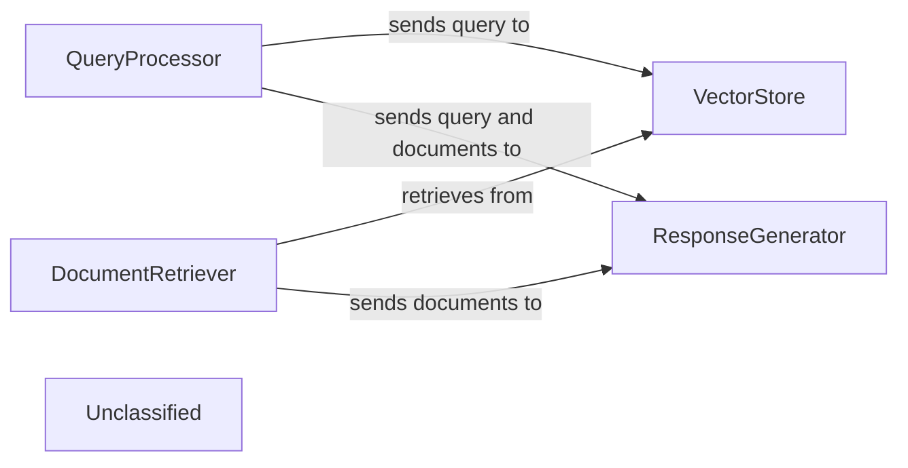
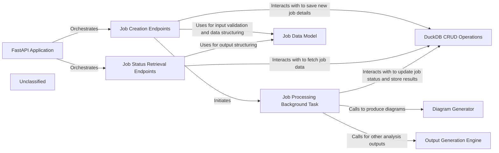
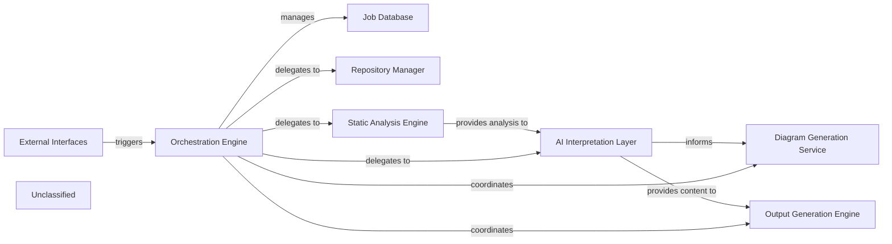
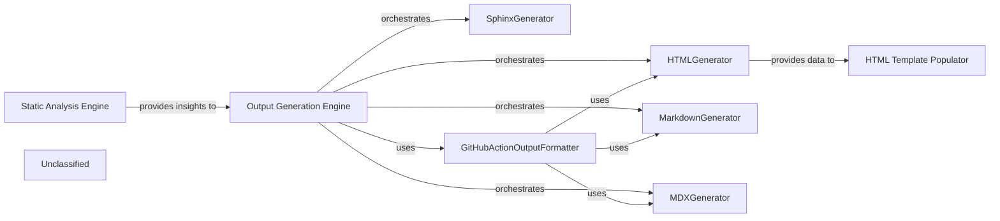
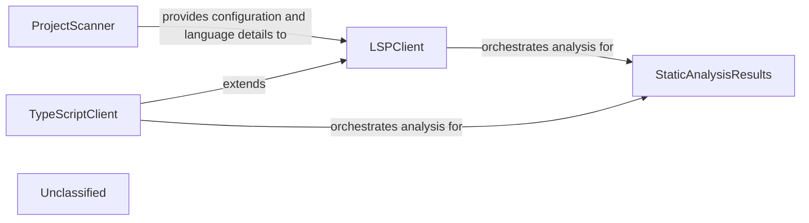
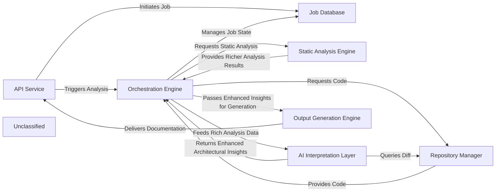

## Details

This graph represents the core functionality of a LangChain-based application that processes user queries, retrieves relevant documents, and generates responses. The main flow involves receiving a query, embedding it, searching a vector store, retrieving documents, and then using a language model to synthesize an answer based on the query and retrieved information. Its purpose is to provide an intelligent question-answering system over a corpus of documents.

### QueryProcessor
Handles incoming user queries, embeds them, and prepares them for similarity search.

**Related Classes/Methods**:

- `langchain_core.embeddings.Embeddings:embed_query`:100-110

### VectorStore
Stores and retrieves document embeddings based on similarity search.

**Related Classes/Methods**:

- `langchain_community.vectorstores.chroma.Chroma:similarity_search`:200-250

### DocumentRetriever
Retrieves relevant documents from the vector store.

**Related Classes/Methods**:

- `langchain_core.retrievers.BaseRetriever:get_relevant_documents`:50-70

### ResponseGenerator
Generates a natural language response using a large language model based on the query and retrieved documents.

**Related Classes/Methods**:

- `langchain_core.language_models.llms.BaseLLM:invoke`:150-180

### Unclassified
Component for all unclassified files and utility functions (Utility functions/External Libraries/Dependencies)

**Related Classes/Methods**: _None_

### [FAQ](https://github.com/CodeBoarding/GeneratedOnBoardings/tree/main?tab=readme-ov-file#faq)

## Details

The system is built around a FastAPI Application that serves as the central entry point for all client interactions. It exposes Job Creation Endpoints for initiating new code analysis and documentation generation tasks, and Job Status Retrieval Endpoints for monitoring their progress and fetching results. All job-related data is managed persistently through DuckDB CRUD Operations. When a job is created, the Job Creation Endpoints initiate a Job Processing Background Task to handle the heavy computational work asynchronously. This background task interacts with the DuckDB CRUD Operations to update job statuses and store results. Depending on the job type, it may also invoke the Diagram Generator for visual documentation or the Output Generation Engine for other analysis outputs. The Job Data Model ensures consistent data structures and validation across the entire system.

### FastAPI Application
The core web server instance, responsible for defining and managing all API routes, middleware, and overall request/response handling. It serves as the central orchestrator for all incoming API calls.

**Related Classes/Methods**:

- <a href="https://github.com/CodeBoarding/CodeBoarding/blob/main/local_app.py" target="_blank" rel="noopener noreferrer">`local_app.py:app`</a>

### Job Creation Endpoints
Provides the API endpoints for users to submit new code analysis and documentation generation requests, validating input and initiating the job lifecycle.

**Related Classes/Methods**:

- <a href="https://github.com/CodeBoarding/CodeBoarding/blob/main/local_app.py" target="_blank" rel="noopener noreferrer">`local_app.py:start_generation_job`</a>
- <a href="https://github.com/CodeBoarding/CodeBoarding/blob/main/local_app.py" target="_blank" rel="noopener noreferrer">`local_app.py:start_docs_generation_job`</a>

### Job Status Retrieval Endpoints
Offers API endpoints for clients to query the current status, progress, and results of previously submitted jobs.

**Related Classes/Methods**:

- <a href="https://github.com/CodeBoarding/CodeBoarding/blob/main/local_app.py" target="_blank" rel="noopener noreferrer">`local_app.py:get_job`</a>
- <a href="https://github.com/CodeBoarding/CodeBoarding/blob/main/local_app.py" target="_blank" rel="noopener noreferrer">`local_app.py:get_github_action_status`</a>
- <a href="https://github.com/CodeBoarding/CodeBoarding/blob/main/local_app.py" target="_blank" rel="noopener noreferrer">`local_app.py:list_jobs`</a>

### Job Processing Background Task
Asynchronously executes the core job logic, offloading heavy computation from the main API thread to ensure responsiveness. It coordinates the actual analysis and generation steps.

**Related Classes/Methods**:

- <a href="https://github.com/CodeBoarding/CodeBoarding/blob/main/local_app.py" target="_blank" rel="noopener noreferrer">`local_app.py:generate_onboarding`</a>
- <a href="https://github.com/CodeBoarding/CodeBoarding/blob/main/local_app.py" target="_blank" rel="noopener noreferrer">`local_app.py:process_docs_generation_job`</a>

### Job Data Model
Defines the data structures (e.g., Pydantic models) for jobs and incoming documentation generation requests, ensuring data consistency and validation across the API.

**Related Classes/Methods**:

- <a href="https://github.com/CodeBoarding/CodeBoarding/blob/main/local_app.py" target="_blank" rel="noopener noreferrer">`local_app.py:JobStatus`</a>
- <a href="https://github.com/CodeBoarding/CodeBoarding/blob/main/local_app.py" target="_blank" rel="noopener noreferrer">`local_app.py:DocsGenerationRequest`</a>
- <a href="https://github.com/CodeBoarding/CodeBoarding/blob/main/local_app.py" target="_blank" rel="noopener noreferrer">`local_app.py:make_job`</a>

### DuckDB CRUD Operations
Handles persistent job management by interacting with the DuckDB database for storing, retrieving, and updating job records.

**Related Classes/Methods**: _None_

### Diagram Generator
A specialized component responsible for generating architectural diagrams and other visual documentation based on the analysis results.

**Related Classes/Methods**:

- <a href="https://github.com/CodeBoarding/CodeBoarding/blob/main/demo.py" target="_blank" rel="noopener noreferrer">`demo.py:generate_docs_remote`</a>

### Output Generation Engine [[Expand]](./Output_Generation_Engine.md)
A component responsible for generating various analysis outputs, potentially triggered by external events like GitHub Actions, beyond just diagrams.

**Related Classes/Methods**:

- <a href="https://github.com/CodeBoarding/CodeBoarding/blob/main/github_action.py" target="_blank" rel="noopener noreferrer">`github_action.py:generate_analysis`</a>

### Unclassified
Component for all unclassified files and utility functions (Utility functions/External Libraries/Dependencies)

**Related Classes/Methods**: _None_

### [FAQ](https://github.com/CodeBoarding/GeneratedOnBoardings/tree/main?tab=readme-ov-file#faq)

## Details

This graph represents the core functionality of a LangChain-based application that processes user queries, retrieves relevant documents, and generates responses. The main flow involves receiving a query, embedding it, searching a vector store, retrieving documents, and then using a language model to synthesize an answer based on the query and retrieved information. Its purpose is to provide an intelligent question-answering system over a corpus of documents.

### QueryProcessor
Handles incoming user queries, embeds them, and prepares them for similarity search.

**Related Classes/Methods**:

### VectorStore
Stores and retrieves document embeddings based on similarity search.

**Related Classes/Methods**:

- `langchain_community.vectorstores.chroma.Chroma:similarity_search`:200-250

### DocumentRetriever
Retrieves relevant documents from the vector store.

**Related Classes/Methods**:

- `langchain_core.retrievers.BaseRetriever:get_relevant_documents`:50-70

### ResponseGenerator
Generates a natural language response using a large language model based on the query and retrieved documents.

**Related Classes/Methods**:

- `langchain_core.language_models.llms.BaseLLM:invoke`:150-180

### Unclassified
Component for all unclassified files and utility functions (Utility functions/External Libraries/Dependencies)

**Related Classes/Methods**: _None_

### [FAQ](https://github.com/CodeBoarding/GeneratedOnBoardings/tree/main?tab=readme-ov-file#faq)

## Details

The system is orchestrated by the `Orchestration Engine`, which manages the end-to-end process of generating documentation. This engine interacts with `External Interfaces` to initiate jobs and persists job status in the `Job Database`. For code analysis, it delegates to the `Repository Manager` to access source code, which is then fed into the `Static Analysis Engine`. The `Static Analysis Engine` performs in-depth structural and semantic analysis, with recent updates significantly enhancing its internal logic and capabilities for extracting richer code insights. The results from static analysis are then passed to the `AI Interpretation Layer` for generating high-level insights and content. Subsequently, the `Diagram Generation Service` creates visual representations, and the `Output Generation Engine` compiles the final documentation. The CodeBoarding system is structured around an `Orchestration Engine` that manages the entire documentation generation workflow. This engine is initiated via `External Interfaces` and maintains job states in a `Job Database`. It delegates core tasks to specialized components: the `Repository Manager` for code retrieval, and the `Static Analysis Engine` for in-depth code analysis. The `Static Analysis Engine`, recently enhanced for more sophisticated analysis, feeds its findings to the `AI Interpretation Layer`. This layer processes the analysis to generate documentation content and insights, which are then used by the `Diagram Generation Service` for visual representations and the `Output Generation Engine` for final documentation production.

### Orchestration Engine [[Expand]](./Orchestration_Engine.md)
The central component responsible for managing the documentation generation pipeline, including job status and delegating the core generation process to other pipeline stages.

**Related Classes/Methods**: _None_

### Job Database [[Expand]](./Job_Database.md)
Manages the persistence and status of documentation generation jobs.

**Related Classes/Methods**: _None_

### External Interfaces
Provides API endpoints for interacting with the documentation generation system.

**Related Classes/Methods**: _None_

### Repository Manager
Manages access and retrieval of code repositories for analysis within the documentation generation pipeline.

**Related Classes/Methods**: _None_

### Static Analysis Engine [[Expand]](./Static_Analysis_Engine.md)
Performs advanced static code analysis to extract detailed structural and semantic information from source code. Recent enhancements have refined its internal logic, potentially leading to improved accuracy, performance, or the ability to analyze new language constructs and complex patterns.

**Related Classes/Methods**: _None_

### AI Interpretation Layer [[Expand]](./AI_Interpretation_Layer.md)
Interprets analysis results and generates insights using AI models for documentation content.

**Related Classes/Methods**: _None_

### Diagram Generation Service
Generates visual diagrams based on the interpreted code structure and relationships.

**Related Classes/Methods**: _None_

### Output Generation Engine [[Expand]](./Output_Generation_Engine.md)
Formats and produces the final documentation output in various formats.

**Related Classes/Methods**: _None_

### Unclassified
Component for all unclassified files and utility functions (Utility functions/External Libraries/Dependencies)

**Related Classes/Methods**: _None_

### [FAQ](https://github.com/CodeBoarding/GeneratedOnBoardings/tree/main?tab=readme-ov-file#faq)

## Details

The system's architecture is centered around the generation of comprehensive architectural documentation from source code. The process begins with the Static Analysis Engine, which meticulously scans the codebase to extract raw architectural insights. These insights are then fed into the Output Generation Engine, the central orchestrator that manages the overall documentation workflow. The Output Generation Engine dispatches the insights to various specialized generators: HTMLGenerator, MarkdownGenerator, MDXGenerator, and SphinxGenerator, each responsible for producing documentation in its respective format. The HTML Template Populator further refines the HTML output by integrating generated data into predefined templates. Additionally, the GitHubActionOutputFormatter ensures that the generated documentation is appropriately formatted for seamless integration into GitHub Actions workflows, leveraging the capabilities of the other generators. This structured approach ensures accurate, consistent, and versatile architectural documentation.

### Static Analysis Engine [[Expand]](./Static_Analysis_Engine.md)
This foundational component is responsible for scanning the source code, performing static analysis, and generating the initial architectural insights. It extracts critical data, identifies relationships, and prepares the raw information that downstream components will consume to generate documentation.

**Related Classes/Methods**: _None_

### Output Generation Engine [[Expand]](./Output_Generation_Engine.md)
The primary component responsible for orchestrating the overall process of generating documentation in various formats. It consumes architectural insights from the `Static Analysis Engine`, handles repository cloning, initiates the analysis generation, and dispatches the actual documentation generation to specific format generators based on the desired output.

**Related Classes/Methods**:

- <a href="https://github.com/CodeBoarding/CodeBoarding/blob/main/demo.py#L57-L80" target="_blank" rel="noopener noreferrer">`demo.py`:57-80</a>
- <a href="https://github.com/CodeBoarding/CodeBoarding/blob/main/demo.py#L82-L101" target="_blank" rel="noopener noreferrer">`demo.py`:82-101</a>

### HTMLGenerator
This component is dedicated to converting the processed architectural insights into a structured HTML format. It handles the rendering of diagrams, text, and other elements into web-friendly documentation. It prepares data (e.g., Cytoscape.js compatible JSON) for interactive architectural diagrams.

**Related Classes/Methods**: _None_

### MarkdownGenerator
Responsible for generating documentation in standard Markdown format. This component ensures that architectural insights are presented in a widely compatible and easily readable text-based format, suitable for various platforms and tools. It includes embedded Mermaid diagrams and basic component details.

**Related Classes/Methods**: _None_

### MDXGenerator
This component extends Markdown generation by incorporating JSX capabilities, allowing for more dynamic and interactive documentation. It transforms insights into MDX, enabling the embedding of React components within the documentation, including Mermaid diagrams and frontmatter.

**Related Classes/Methods**: _None_

### SphinxGenerator
Focuses on generating documentation in reStructuredText (RST) format, specifically tailored for use with the Sphinx documentation generator. This component ensures compatibility with Sphinx's powerful features for technical documentation, including embedded Mermaid diagrams and structured component information.

**Related Classes/Methods**: _None_

### GitHubActionOutputFormatter
This component acts as an integration layer, specifically formatting and preparing the generated documentation for consumption within GitHub Actions workflows. It leverages the capabilities of the other generators (HTML, Markdown, MDX) to produce output suitable for GitHub's environment.

**Related Classes/Methods**: _None_

### HTML Template Populator
Integrates generated architectural data (like Cytoscape JSON and component-specific HTML snippets) into a predefined HTML template to produce the final, complete, and styled HTML output.

**Related Classes/Methods**: _None_

### Unclassified
Component for all unclassified files and utility functions (Utility functions/External Libraries/Dependencies)

**Related Classes/Methods**: _None_

### [FAQ](https://github.com/CodeBoarding/GeneratedOnBoardings/tree/main?tab=readme-ov-file#faq)

## Details

The static analysis subsystem orchestrates the extraction of comprehensive code insights. It begins with the `ProjectScanner`, which identifies programming languages and their associated LSP server configurations using an external scanning tool. This initial data is then consumed by the `LSPClient`, a generic component responsible for managing communication with Language Server Protocol servers. For specific languages like TypeScript, the `TypeScriptClient` extends `LSPClient` to handle language-specific configurations. Both `LSPClient` and `TypeScriptClient` perform detailed static analysis, extracting symbols, call graphs, and class hierarchies, and then populate the `StaticAnalysisResults` component, which serves as the central repository for all aggregated analysis data.

### ProjectScanner
Initiates the static analysis process by leveraging the external `tokei` tool to scan the project repository. It identifies programming languages used, their code distribution, and relevant file suffixes. Crucially, it also determines the appropriate Language Server Protocol (LSP) server commands for each detected language, preparing a structured list of `ProgrammingLanguage` objects. This component acts as the initial data gatherer, providing the necessary configuration and language-specific details for subsequent LSP-based analysis.

**Related Classes/Methods**:

- <a href="https://github.com/CodeBoarding/CodeBoarding/blob/main/static_analyzer/scanner.py#L13-L82" target="_blank" rel="noopener noreferrer">`ProjectScanner`:13-82</a>

### LSPClient
Serves as the generic Language Server Protocol client. It manages the communication lifecycle with an LSP server (initialization, sending requests, receiving responses, shutdown). It orchestrates the detailed static analysis for individual files and the entire workspace, extracting symbols, imports, call graphs, and class hierarchies. It populates the `StaticAnalysisResults` with its findings.

**Related Classes/Methods**:

- <a href="https://github.com/CodeBoarding/CodeBoarding/blob/main/static_analyzer/lsp_client/client.py#L37-L924" target="_blank" rel="noopener noreferrer">`LSPClient`:37-924</a>

### TypeScriptClient
A specialized implementation of `LSPClient` tailored for TypeScript projects. It handles TypeScript-specific initialization parameters, workspace configuration (e.g., processing `tsconfig.json`), and file discovery, ensuring the LSP server is correctly set up for TypeScript analysis. This component exemplifies the extensibility of the static analysis engine for different programming languages and also populates `StaticAnalysisResults`.

**Related Classes/Methods**:

- <a href="https://github.com/CodeBoarding/CodeBoarding/blob/main/static_analyzer/lsp_client/typescript_client.py#L10-L214" target="_blank" rel="noopener noreferrer">`TypeScriptClient`:10-214</a>

### StaticAnalysisResults
This central component acts as a repository for all aggregated static analysis results across different programming languages. It collects and manages various types of analysis data, including class hierarchies, control flow graphs, package dependencies, and source code references, provided by the LSP clients. It offers methods to add and retrieve these structured results for downstream processing and consumption.

**Related Classes/Methods**:

- <a href="https://github.com/CodeBoarding/CodeBoarding/blob/main/static_analyzer/analysis_result.py#L6-L171" target="_blank" rel="noopener noreferrer">`StaticAnalysisResults`:6-171</a>

### Unclassified
Component for all unclassified files and utility functions (Utility functions/External Libraries/Dependencies)

**Related Classes/Methods**: _None_

### Unclassified
Component for all unclassified files and utility functions (Utility functions/External Libraries/Dependencies)

**Related Classes/Methods**: _None_

### [FAQ](https://github.com/CodeBoarding/GeneratedOnBoardings/tree/main?tab=readme-ov-file#faq)

## Details

The CodeBoarding system operates through a robust, multi-layered architecture designed for comprehensive code analysis and documentation generation. The API Service serves as the primary external interface, initiating jobs and managing user interactions. All job lifecycle and status information is persistently stored and managed by the Job Database. The Orchestration Engine acts as the central coordinator, driving the entire documentation pipeline. It interacts with the Repository Manager to retrieve source code and then dispatches requests to the Static Analysis Engine. The Static Analysis Engine performs deep, language-specific analysis, now providing richer and more detailed structural information. This enhanced data is then fed by the Orchestration Engine to the AI Interpretation Layer. This layer, comprising specialized AI agents, performs sophisticated interpretation, generating enhanced high-level architectural insights, and may query the Repository Manager for diff analysis. Finally, the Orchestration Engine passes these refined insights to the Output Generation Engine, which transforms them into various documentation formats with enhanced capabilities, including integration with GitHub Actions, before delivering the final output back through the API Service. This updated architecture reflects significant internal enhancements in analysis depth and output quality, particularly within the AI interpretation and static analysis components.

### API Service [[Expand]](./API_Service.md)
The external interface for CodeBoarding, handling user requests, job initiation, and status retrieval.

**Related Classes/Methods**:

- `local_app`

### Job Database [[Expand]](./Job_Database.md)
Persistent storage for managing the lifecycle, status, and results of all documentation generation jobs.

**Related Classes/Methods**:

- `duckdb_crud`

### Orchestration Engine [[Expand]](./Orchestration_Engine.md)
The central control unit that manages the entire documentation generation pipeline, coordinating all analysis and generation stages.

**Related Classes/Methods**:

- <a href="https://github.com/CodeBoarding/CodeBoarding/blob/main/diagram_analysis/diagram_generator.py" target="_blank" rel="noopener noreferrer">`diagram_generator`</a>

### Repository Manager
Manages all interactions with source code repositories, including cloning, fetching, and extracting version differences.

**Related Classes/Methods**:

- <a href="https://github.com/CodeBoarding/CodeBoarding/blob/main/agents/diff_analyzer.py#L21-L32" target="_blank" rel="noopener noreferrer">`__init__`:21-32</a>
- <a href="https://github.com/CodeBoarding/CodeBoarding/blob/main/repo_utils/git_diff.py#L27-L76" target="_blank" rel="noopener noreferrer">`git_diff`:27-76</a>

### Static Analysis Engine [[Expand]](./Static_Analysis_Engine.md)
Performs deep, language-specific analysis of source code to extract richer, more detailed, and comprehensive structural information without semantic interpretation.

**Related Classes/Methods**:

- <a href="https://github.com/CodeBoarding/CodeBoarding/blob/main/static_analyzer/scanner.py#L13-L66" target="_blank" rel="noopener noreferrer">`scanner`:13-66</a>
- <a href="https://github.com/CodeBoarding/CodeBoarding/blob/main/static_analyzer/lsp_client/typescript_client.py#L10-L214" target="_blank" rel="noopener noreferrer">`client`:10-214</a>
- <a href="https://github.com/CodeBoarding/CodeBoarding/blob/main/agents/abstraction_agent.py" target="_blank" rel="noopener noreferrer">`analysis_result`</a>

### AI Interpretation Layer [[Expand]](./AI_Interpretation_Layer.md)
A collection of specialized AI agents that perform sophisticated interpretation of static analysis data, generating enhanced high-level architectural insights, including detailed abstractions, refined planning, robust validation, and comprehensive diff analysis, with structured outputs.

**Related Classes/Methods**:

- <a href="https://github.com/CodeBoarding/CodeBoarding/blob/main/diagram_analysis/diagram_generator.py" target="_blank" rel="noopener noreferrer">`meta_agent`</a>
- <a href="https://github.com/CodeBoarding/CodeBoarding/blob/main/diagram_analysis/diagram_generator.py" target="_blank" rel="noopener noreferrer">`abstraction_agent`</a>
- <a href="https://github.com/CodeBoarding/CodeBoarding/blob/main/diagram_analysis/diagram_generator.py" target="_blank" rel="noopener noreferrer">`details_agent`</a>
- <a href="https://github.com/CodeBoarding/CodeBoarding/blob/main/diagram_analysis/diagram_generator.py" target="_blank" rel="noopener noreferrer">`planner_agent`</a>
- <a href="https://github.com/CodeBoarding/CodeBoarding/blob/main/diagram_analysis/diagram_generator.py" target="_blank" rel="noopener noreferrer">`validator_agent`</a>
- <a href="https://github.com/CodeBoarding/CodeBoarding/blob/main/agents/diff_analyzer.py" target="_blank" rel="noopener noreferrer">`diff_analyzer`</a>
- <a href="https://github.com/CodeBoarding/CodeBoarding/blob/main/agents/diff_analyzer.py#L20-L136" target="_blank" rel="noopener noreferrer">`agent`:20-136</a>
- <a href="https://github.com/CodeBoarding/CodeBoarding/blob/main/agents/agent_responses.py" target="_blank" rel="noopener noreferrer">`agent_responses`</a>
- <a href="https://github.com/CodeBoarding/CodeBoarding/blob/main/agents/details_agent.py" target="_blank" rel="noopener noreferrer">`prompts`</a>

### Output Generation Engine [[Expand]](./Output_Generation_Engine.md)
Transforms the final, validated architectural insights into various human-readable and diagram-friendly documentation formats, with enhanced capabilities for specific output formats and external integrations like GitHub Actions.

**Related Classes/Methods**:

- <a href="https://github.com/CodeBoarding/CodeBoarding/blob/main/github_action.py#L37-L51" target="_blank" rel="noopener noreferrer">`html`:37-51</a>
- <a href="https://github.com/CodeBoarding/CodeBoarding/blob/main/github_action.py#L20-L34" target="_blank" rel="noopener noreferrer">`markdown`:20-34</a>
- <a href="https://github.com/CodeBoarding/CodeBoarding/blob/main/github_action.py#L54-L68" target="_blank" rel="noopener noreferrer">`mdx`:54-68</a>
- <a href="https://github.com/CodeBoarding/CodeBoarding/blob/main/output_generators/sphinx.py" target="_blank" rel="noopener noreferrer">`sphinx`</a>
- `github_action`

### Unclassified
Component for all unclassified files and utility functions (Utility functions/External Libraries/Dependencies)

**Related Classes/Methods**: _None_

### Unclassified
Component for all unclassified files and utility functions (Utility functions/External Libraries/Dependencies)

**Related Classes/Methods**: _None_

### Unclassified
Component for all unclassified files and utility functions (Utility functions/External Libraries/Dependencies)

**Related Classes/Methods**: _None_

### [FAQ](https://github.com/CodeBoarding/GeneratedOnBoardings/tree/main?tab=readme-ov-file#faq)

