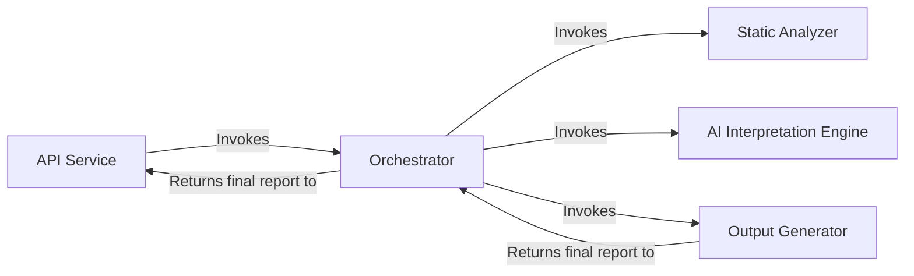
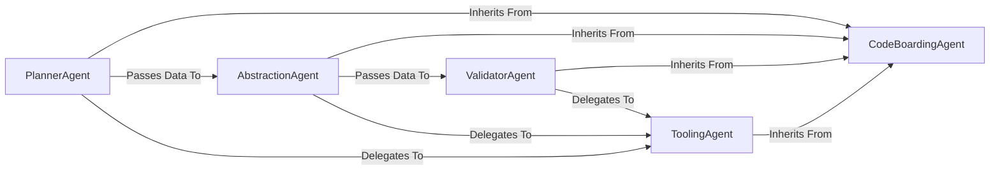
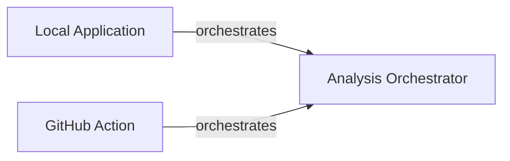
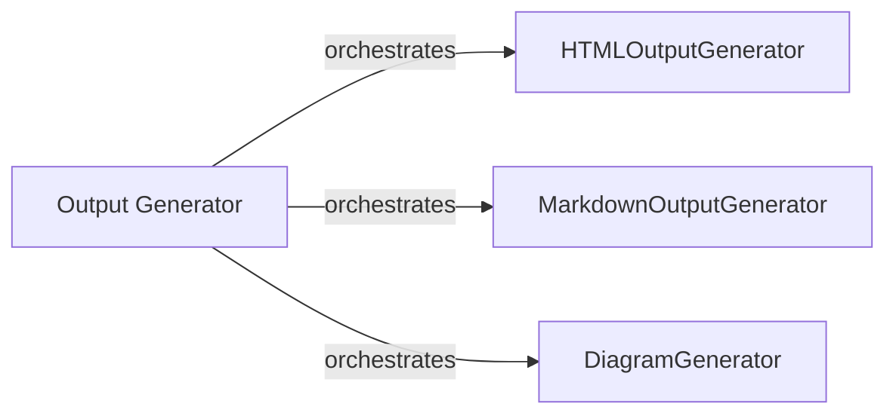
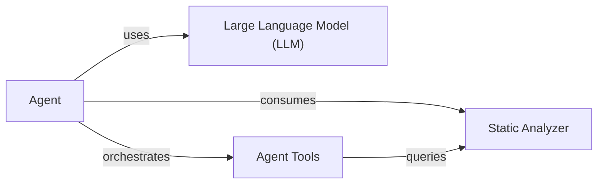

## Details

The system's main flow begins with the `API Service` receiving external requests, which then invokes the `Orchestrator`. The `Orchestrator` acts as the central coordinator, first initiating the `Static Analyzer` to perform code analysis and build foundational data structures. Subsequently, it passes this data to the `AI Interpretation Engine`, a suite of specialized AI agents that interpret the analysis and generate architectural insights. Finally, the `Orchestrator` directs the `Output Generator` to convert these insights into human-readable formats, with the final report being returned back through the `Orchestrator` to the `API Service`.

### API Service [[Expand]](./API_Service.md)
Serves as the primary entry point for all external interactions. It exposes the system's capabilities, handling incoming requests and returning the final generated analysis.

**Related Classes/Methods**:

- <a href="https://github.com/CodeBoarding/CodeBoarding/blob/main/local_app.py" target="_blank" rel="noopener noreferrer">`local_app.py`</a>
- <a href="https://github.com/CodeBoarding/CodeBoarding/blob/main/github_action.py" target="_blank" rel="noopener noreferrer">`github_action.py`</a>

### Orchestrator [[Expand]](./Orchestrator.md)
Acts as the central coordinator of the analysis pipeline. It manages the sequence of operations, directing the flow of data between the various components to ensure the end-to-end process runs smoothly.

**Related Classes/Methods**:

- <a href="https://github.com/CodeBoarding/CodeBoarding/blob/main/agents/meta_agent.py" target="_blank" rel="noopener noreferrer">`agents/meta_agent.py`</a>

### Static Analyzer [[Expand]](./Static_Analyzer.md)
Performs language-aware static analysis of the source code. It builds foundational data structures, including call graphs and package dependencies, which form the basis for the AI interpretation.

**Related Classes/Methods**:

- <a href="https://github.com/CodeBoarding/CodeBoarding/blob/main/static_analyzer/scanner.py" target="_blank" rel="noopener noreferrer">`static_analyzer/scanner.py`</a>
- <a href="https://github.com/CodeBoarding/CodeBoarding/blob/main/static_analyzer/lsp_client/" target="_blank" rel="noopener noreferrer">`static_analyzer/lsp_client/`</a>

### AI Interpretation Engine [[Expand]](./AI_Interpretation_Engine.md)
A suite of specialized AI agents responsible for interpreting the static analysis data. It uses a planner, abstraction, and validator agents, along with a toolkit for reading code artifacts, to generate high-level architectural insights. The core agent functionality, likely defined in `agents/agent.py`, has been updated to enhance or refine the capabilities shared by the specialized agents.

**Related Classes/Methods**:

- <a href="https://github.com/CodeBoarding/CodeBoarding/blob/main/agents/planner_agent.py" target="_blank" rel="noopener noreferrer">`agents/planner_agent.py`</a>
- <a href="https://github.com/CodeBoarding/CodeBoarding/blob/main/agents/abstraction_agent.py" target="_blank" rel="noopener noreferrer">`agents/abstraction_agent.py`</a>
- <a href="https://github.com/CodeBoarding/CodeBoarding/blob/main/agents/validator_agent.py" target="_blank" rel="noopener noreferrer">`agents/validator_agent.py`</a>
- <a href="https://github.com/CodeBoarding/CodeBoarding/blob/main/agents/tools/" target="_blank" rel="noopener noreferrer">`agents/tools/`</a>
- <a href="https://github.com/CodeBoarding/CodeBoarding/blob/main/agents/agent.py" target="_blank" rel="noopener noreferrer">`agents/agent.py`</a>

### Output Generator [[Expand]](./Output_Generator.md)
Responsible for converting the final, validated analysis from the AI engine into human-readable formats. It serializes the analysis data and renders it as diagrams and text.

**Related Classes/Methods**:

- <a href="https://github.com/CodeBoarding/CodeBoarding/blob/main/output_generators/html.py" target="_blank" rel="noopener noreferrer">`output_generators/html.py`</a>
- <a href="https://github.com/CodeBoarding/CodeBoarding/blob/main/output_generators/markdown.py" target="_blank" rel="noopener noreferrer">`output_generators/markdown.py`</a>
- <a href="https://github.com/CodeBoarding/CodeBoarding/blob/main/diagram_analysis/diagram_generator.py" target="_blank" rel="noopener noreferrer">`diagram_analysis/diagram_generator.py`</a>

### [FAQ](https://github.com/CodeBoarding/GeneratedOnBoardings/tree/main?tab=readme-ov-file#faq)

## Details

The CodeBoarding system operates as a multi-stage agentic pipeline designed to analyze project codebases. The process begins with the `PlannerAgent`, which establishes an initial analysis plan. This plan is then executed by the `AbstractionAgent`, responsible for synthesizing architectural components and their relationships. The `ValidatorAgent` subsequently ensures the correctness and integrity of the generated architectural insights. Throughout these stages, various `ToolingAgent` instances are leveraged to perform granular analysis tasks, providing essential data. The entire agentic framework is built upon the `CodeBoardingAgent`, an abstract base class that provides core functionalities and a standardized approach for LLM interactions, state management, and initialization. Recent significant updates to `CodeBoardingAgent` indicate an evolution of this foundational framework, impacting the interfaces and expected behaviors of all specialized agents.

### CodeBoardingAgent
An abstract base class that provides a foundational agentic framework. It standardizes LLM interactions, state management, and initialization for all specialized agents, ensuring consistent behavior and integration. Recent significant updates to this class suggest an evolution of its core functionalities, potentially altering the contract and common behavior expected from all agents in the system.

**Related Classes/Methods**:

- `agents.agent`

### PlannerAgent
The initial stage of the pipeline. It examines the project's overall structure to create a high-level analysis plan, guiding the subsequent abstraction phase. It inherits its core capabilities from the `CodeBoardingAgent`, and its implementation may have been updated to align with recent changes in the foundational agent framework.

**Related Classes/Methods**:

- `agents.planner_agent`

### AbstractionAgent
The central processing unit of the engine. It executes the plan from the `PlannerAgent`, synthesizing architectural components and relationships from the codebase by delegating to various `ToolingAgents`. Its behavior and interactions with the base class may have been modified due to recent updates in the `CodeBoardingAgent`.

**Related Classes/Methods**:

- `agents.abstraction_agent`

### ValidatorAgent
The final quality assurance stage. It systematically reviews the output from the `AbstractionAgent`, verifying the correctness of identified components and their relationships, often by delegating checks to `ToolingAgents`. Its responsibilities and internal logic may have been adjusted in response to the evolving `CodeBoardingAgent` framework.

**Related Classes/Methods**:

- `agents.validator_agent`

### ToolingAgent
A collection of specialized agents that perform fine-grained analysis tasks (e.g., reading files, parsing class structures, analyzing dependencies). They inherit from `CodeBoardingAgent` and are invoked by other agents to provide specific data points about the codebase. Their functionalities may have been refined to integrate with the updated foundational agent framework.

**Related Classes/Methods**:

- <a href="https://github.com/CodeBoarding/CodeBoarding/blob/main/" target="_blank" rel="noopener noreferrer">`agents.tools.*`</a>

### [FAQ](https://github.com/CodeBoarding/GeneratedOnBoardings/tree/main?tab=readme-ov-file#faq)

## Details

Initial analysis of the project components and their relations, with a focus on identifying the 'Analysis Orchestrator' and its interactions. Further refinement is needed to include specific code references for the 'Analysis Orchestrator' by examining 'github_action.py' and 'local_app.py'.

### Analysis Orchestrator
Orchestrates the analysis process, coordinating between different components.

**Related Classes/Methods**: _None_

### Local Application
Manages local application interactions.

**Related Classes/Methods**: _None_

### GitHub Action
Handles GitHub Actions workflows.

**Related Classes/Methods**: _None_

### [FAQ](https://github.com/CodeBoarding/GeneratedOnBoardings/tree/main?tab=readme-ov-file#faq)

## Details

The previous analysis lacked specific source code references for several key components, hindering the verification of their implementation boundaries and responsibilities. This revised analysis addresses those gaps by identifying the relevant code artifacts. The `Orchestrator`, embodied by `MetaAgent`, initiates the analysis process, leveraging various tools to gather initial project context. The `Static Code Analyzer`, primarily through the `Scanner` class, performs in-depth code analysis. The `AI Analysis Engine` (likely represented by `AbstractionAgent` and `DetailsAgent`) interprets these results, generating higher-level insights. `Analysis Persistence` (potentially handled by `AnalysisResult` and related mechanisms for storing data in the `.codeboarding` directory) ensures that all analysis data is stored and retrievable. Finally, the `Output Generator` (whose specific implementation needs further investigation but likely interacts with the stored analysis data to produce reports) transforms the processed data into user-friendly formats.

### Orchestrator [[Expand]](./Orchestrator.md)
Acts as the central coordinator of the analysis pipeline. It manages the sequence of operations, directing the flow of data between the various components to ensure the end-to-end process runs smoothly. The `MetaAgent` within this component is specifically responsible for initial project metadata analysis, establishing architectural context, and guiding subsequent analysis steps.

**Related Classes/Methods**:

### Static Code Analyzer
Responsible for performing in-depth static analysis on the codebase. This involves parsing source code, building abstract syntax trees (ASTs), identifying code patterns, and extracting structural information without executing the code.

**Related Classes/Methods**:

### AI Analysis Engine
Integrates AI/LLM capabilities to interpret the results from the Static Code Analyzer and the architectural context provided by the Orchestrator. It generates high-level insights, identifies complex relationships, and provides explanations or suggestions based on the analyzed code.

**Related Classes/Methods**:

### Analysis Persistence
Manages the storage, retrieval, and versioning of all analysis-related data, including raw static analysis outputs, AI-generated insights, project metadata, and configuration settings. This ensures data integrity and enables historical analysis.

**Related Classes/Methods**:

### Output Generator [[Expand]](./Output_Generator.md)
Transforms the processed analysis data into various user-friendly formats, including visual representations (e.g., Mermaid.js diagrams for architectural views) and structured reports. It is responsible for rendering the final output for user consumption.

**Related Classes/Methods**: _None_

### read_docs tool
Tool to access and process project documentation.

**Related Classes/Methods**:

### external_deps_tool
Tool to identify and analyze the project's external dependencies.

**Related Classes/Methods**:

### read_file_structure tool
Tool to obtain a comprehensive understanding of the project's file and directory organization.

**Related Classes/Methods**:

### [FAQ](https://github.com/CodeBoarding/GeneratedOnBoardings/tree/main?tab=readme-ov-file#faq)

## Details

The `Output Generator` subsystem is responsible for transforming processed analysis data into various user-consumable formats. It orchestrates the generation of HTML, Markdown, and diagrams, acting as the final presentation layer for the `CodeBoarding` project's analysis results. The core flow involves the `Output Generator` delegating specific formatting tasks to specialized components like `HTMLOutputGenerator`, `MarkdownOutputGenerator`, and `DiagramGenerator`, ensuring a modular and extensible output pipeline.

### Output Generator [[Expand]](./Output_Generator.md)
This is the core component responsible for taking the processed analysis data and rendering it into various output formats. It acts as the orchestrator for the final presentation layer.

**Related Classes/Methods**:

### HTMLOutputGenerator
Specifically handles the conversion of analysis data into HTML format.

**Related Classes/Methods**:

### MarkdownOutputGenerator
Specifically handles the conversion of analysis data into Markdown format.

**Related Classes/Methods**:

### DiagramGenerator
Focuses on generating diagrams (e.g., using Mermaid.js) based on the analysis data.

**Related Classes/Methods**:

### [FAQ](https://github.com/CodeBoarding/GeneratedOnBoardings/tree/main?tab=readme-ov-file#faq)

## Details

The CodeBoarding system is designed to provide comprehensive code analysis and insights, primarily driven by an AI Agent. At its core, the system leverages a Static Analyzer subsystem to generate detailed structural and relational data about the codebase, including call graphs and package dependencies. This rich static analysis data is then consumed by the Agent component, which acts as an intelligent orchestrator. The Agent utilizes a Large Language Model (LLM) for reasoning and decision-making, and interacts with the codebase through a suite of Agent Tools. These tools allow the Agent to dynamically query source code, file structures, and the static analysis results, enabling it to answer complex questions, identify architectural patterns, and provide actionable insights.

### Agent
The central orchestrator of the AI-driven analysis. It interprets user prompts, leverages a Large Language Model for reasoning, and coordinates the use of various specialized tools to interact with the codebase and static analysis data.

**Related Classes/Methods**:

- <a href="https://github.com/CodeBoarding/CodeBoarding/blob/main/agents/agent.py#L27-L207" target="_blank" rel="noopener noreferrer">`agents.agent.CodeBoardingAgent`:27-207</a>

### Static Analyzer [[Expand]](./Static_Analyzer.md)
A foundational subsystem responsible for performing deep static analysis of the codebase. It generates comprehensive structural and relational data, including call graphs, package dependencies, and code references, which serve as critical input for the Agent. This component encapsulates the functionalities of the Scanner, Programming Language identification, LSP Client interactions, Call Graph construction, and Graph Data Structures.

**Related Classes/Methods**:

- <a href="https://github.com/CodeBoarding/CodeBoarding/blob/main/static_analyzer/scanner.py" target="_blank" rel="noopener noreferrer">`static_analyzer.scanner`</a>
- <a href="https://github.com/CodeBoarding/CodeBoarding/blob/main/static_analyzer/programming_language.py" target="_blank" rel="noopener noreferrer">`static_analyzer.programming_language`</a>
- <a href="https://github.com/CodeBoarding/CodeBoarding/blob/main/static_analyzer/lsp_client/client.py" target="_blank" rel="noopener noreferrer">`static_analyzer.lsp_client.client`</a>
- <a href="https://github.com/CodeBoarding/CodeBoarding/blob/main/static_analyzer/graph.py" target="_blank" rel="noopener noreferrer">`static_analyzer.graph.node`</a>
- <a href="https://github.com/CodeBoarding/CodeBoarding/blob/main/static_analyzer/graph.py" target="_blank" rel="noopener noreferrer">`static_analyzer.graph.edge`</a>

### Large Language Model (LLM)
An external or integrated AI model that provides the reasoning capabilities for the Agent. It processes prompts, generates responses, and assists the Agent in making decisions and formulating queries to the Agent Tools.

**Related Classes/Methods**:

### Agent Tools
A collection of specialized functionalities that enable the Agent to interact with the codebase and the results of the Static Analyzer. These tools abstract various data retrieval and analysis operations, allowing the Agent to focus on high-level reasoning.

**Related Classes/Methods**:

- <a href="https://github.com/CodeBoarding/CodeBoarding/blob/main/agents/tools/read_file.py" target="_blank" rel="noopener noreferrer">`agents.tools.ReadFileTool`</a>
- <a href="https://github.com/CodeBoarding/CodeBoarding/blob/main/agents/tools/read_docs.py#L19-L147" target="_blank" rel="noopener noreferrer">`agents.tools.read_docs.ReadDocsTool`:19-147</a>
- <a href="https://github.com/CodeBoarding/CodeBoarding/blob/main/agents/tools/external_deps.py#L17-L95" target="_blank" rel="noopener noreferrer">`agents.tools.external_deps.ExternalDepsTool`:17-95</a>

### [FAQ](https://github.com/CodeBoarding/GeneratedOnBoardings/tree/main?tab=readme-ov-file#faq)

