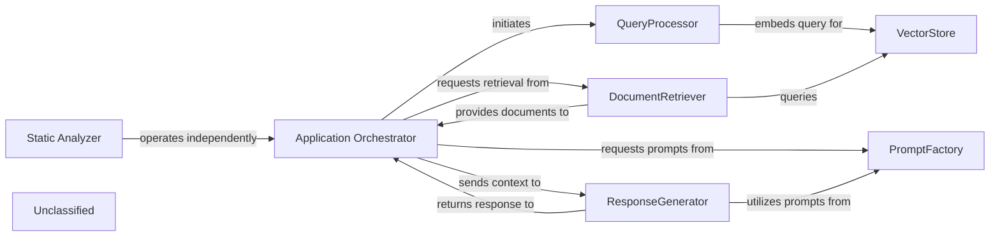
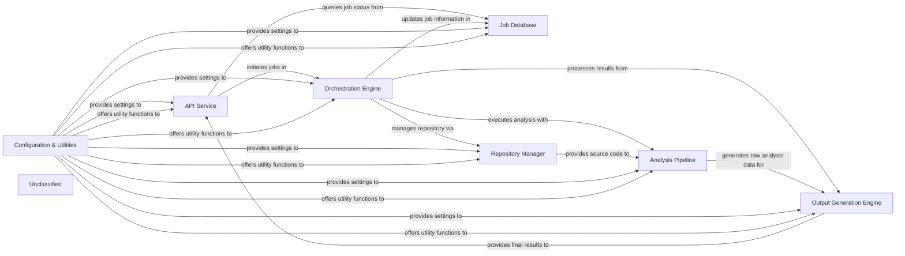
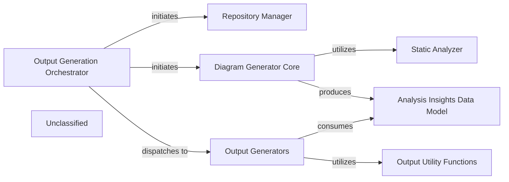
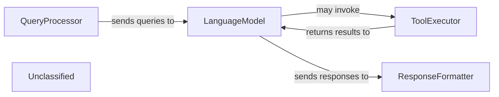
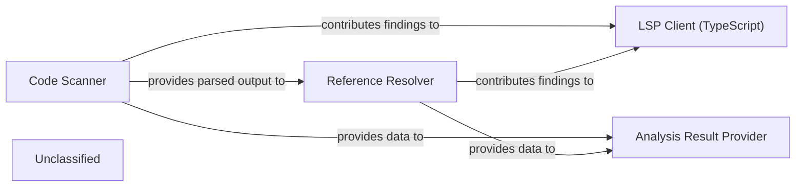
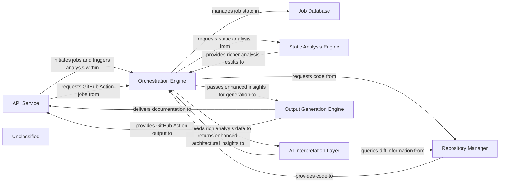

## Details

The project's architecture is primarily centered around a Retrieval Augmented Generation (RAG) system, orchestrated by the `Application Orchestrator`. This orchestrator initiates the `QueryProcessor` to embed user queries, which then interact with the `VectorStore` via the `DocumentRetriever` to fetch relevant documents. The `ResponseGenerator` synthesizes a final answer using a large language model, leveraging specialized prompts provided by the `PromptFactory`. Complementing this core RAG functionality, a new `Static Analyzer` component has been introduced. This component operates as a distinct, parallel functional area, focusing on static analysis, particularly for TypeScript configurations, and does not directly interact with the RAG system's data flow.

### Application Orchestrator
Manages the overall application flow, coordinating interactions between QueryProcessor, DocumentRetriever, ResponseGenerator, and leveraging the PromptFactory for agent prompt generation. It receives user queries and delivers final responses, adapting its agent coordination mechanisms due to recent core agent logic refactoring and the new prompt management system.

**Related Classes/Methods**:

- <a href="https://github.com/CodeBoarding/CodeBoarding/blob/mainagents/agent.py" target="_blank" rel="noopener noreferrer">`agents.agent`</a>

### QueryProcessor
Handles incoming user queries, embeds them, and prepares them for similarity search, potentially utilizing refined prompts from the PromptFactory for enhanced query understanding.

**Related Classes/Methods**:

- <a href="https://github.com/CodeBoarding/CodeBoarding/blob/main." target="_blank" rel="noopener noreferrer">`langchain_core.embeddings.Embeddings:embed_query`</a>

### VectorStore
Stores and retrieves document embeddings based on similarity search.

**Related Classes/Methods**:

- `langchain_community.vectorstores.chroma.Chroma:similarity_search`

### DocumentRetriever
Retrieves relevant documents from the vector store.

**Related Classes/Methods**:

- <a href="https://github.com/CodeBoarding/CodeBoarding/blob/main." target="_blank" rel="noopener noreferrer">`langchain_core.retrievers.BaseRetriever:get_relevant_documents`</a>

### ResponseGenerator
Generates a natural language response using a large language model based on the query and retrieved documents, now significantly enhanced by leveraging structured prompts from the PromptFactory, including specialized prompts for models like Gemini Flash.

**Related Classes/Methods**:

- <a href="https://github.com/CodeBoarding/CodeBoarding/blob/main." target="_blank" rel="noopener noreferrer">`langchain_core.language_models.llms.BaseLLM:invoke`</a>

### PromptFactory
Centralizes the creation and management of prompts for various agents and language models through an abstract factory pattern. It provides a structured and standardized approach to prompt generation, leveraging an AbstractPromptFactory interface and specialized implementations like GeminiFlashPromptsBidirectional and GeminiFlashPromptsUnidirectional. This ensures consistent and optimized interactions with LLMs, notably for Gemini Flash, by managing an expanded library of prompts.

**Related Classes/Methods**:

- <a href="https://github.com/CodeBoarding/CodeBoarding/blob/mainagents/prompts/prompt_factory.py#L29-L90" target="_blank" rel="noopener noreferrer">`prompt_factory.PromptFactory`:29-90</a>

### Static Analyzer
A new, independent functional area responsible for performing static analysis, specifically focusing on scanning TypeScript configurations. This component operates in parallel to the core RAG system, providing distinct capabilities without directly altering the RAG data flow.

**Related Classes/Methods**:

- <a href="https://github.com/CodeBoarding/CodeBoarding/blob/mainstatic_analyzer/typescript_config_scanner.py" target="_blank" rel="noopener noreferrer">`static_analyzer.typescript_config_scanner`</a>

### Unclassified
Component for all unclassified files and utility functions (Utility functions/External Libraries/Dependencies)

**Related Classes/Methods**: _None_

### [FAQ](https://github.com/CodeBoarding/GeneratedOnBoardings/tree/main?tab=readme-ov-file#faq)

## Details

The CodeBoarding system operates on a pipeline/event-driven and producer-consumer architectural pattern, centered around an `API Service` that handles user interactions and initiates analysis jobs. The `Orchestration Engine` coordinates these jobs, managing the workflow from repository access via the `Repository Manager` to the core `Analysis Pipeline`. The `Analysis Pipeline` performs static analysis, now including the scanning and analysis of TypeScript configuration files, and AI-driven interpretation of code. Results are then processed by the `Output Generation Engine` to produce user-consumable documentation and visualizations. All job states and metadata are persistently managed by the `Job Database`, while the `Configuration & Utilities` component provides essential shared services across the system.

### API Service [[Expand]](./API_Service.md)
The API Service acts as the primary external interface for CodeBoarding, responsible for receiving and processing user requests related to code analysis and visualization. It handles the initiation of new analysis jobs, provides mechanisms for users to retrieve the status of ongoing jobs, and serves the final analysis results, including generated documentation and visualizations. Furthermore, it integrates with external systems like GitHub Actions to trigger automated documentation generation workflows. This component is crucial for orchestrating the interaction between users and the backend analysis pipeline, aligning with the project's pipeline/event-driven and producer-consumer architectural patterns.

**Related Classes/Methods**:

- <a href="https://github.com/CodeBoarding/CodeBoarding/blob/mainlocal_app.py" target="_blank" rel="noopener noreferrer">`local_app.app`</a>

### Job Database
Manages the state and metadata of all analysis jobs, including their status, progress, and associated results. It acts as a central ledger for asynchronous operations, ensuring persistence and traceability of analysis tasks.

**Related Classes/Methods**:

- <a href="https://github.com/CodeBoarding/CodeBoarding/blob/mainduckdb_crud.py" target="_blank" rel="noopener noreferrer">`duckdb_crud`</a>

### Orchestration Engine [[Expand]](./Orchestration_Engine.md)
Coordinates the execution of analysis tasks, managing the flow of data and control between different engines. It's responsible for task scheduling, dependency management, and overall workflow execution, embodying the pipeline/event-driven architecture.

**Related Classes/Methods**:

- <a href="https://github.com/CodeBoarding/CodeBoarding/blob/mainlocal_app.py" target="_blank" rel="noopener noreferrer">`local_app.generate_onboarding`</a>

### Repository Manager [[Expand]](./Repository_Manager.md)
Handles interactions with code repositories (e.g., GitHub), including cloning, fetching, and managing local copies of the source code to be analyzed. It ensures the analysis engines have access to the correct code versions.

**Related Classes/Methods**:

- <a href="https://github.com/CodeBoarding/CodeBoarding/blob/mainrepo_utils" target="_blank" rel="noopener noreferrer">`repo_utils`</a>

### Analysis Pipeline
This component encapsulates the core logic for static analysis and AI-driven interpretation of the codebase. It takes the raw source code, extracts structural information, and then uses AI models to generate insights, summaries, and initial documentation drafts. Its capabilities have been enhanced to include scanning and analyzing TypeScript configuration files, further enriching the depth of static analysis.

**Related Classes/Methods**:

- <a href="https://github.com/CodeBoarding/CodeBoarding/blob/maindemo.py" target="_blank" rel="noopener noreferrer">`demo.generate_docs_remote`</a>

### Output Generation Engine [[Expand]](./Output_Generation_Engine.md)
Responsible for formatting and generating the final outputs, such as documentation (e.g., Markdown, HTML), visualizations (e.g., Mermaid.js diagrams), and structured data. It transforms processed information into user-consumable formats.

**Related Classes/Methods**:

- <a href="https://github.com/CodeBoarding/CodeBoarding/blob/mainlocal_app.py" target="_blank" rel="noopener noreferrer">`local_app.generate_onboarding`</a>

### Configuration & Utilities
Provides common utilities, configuration management, and helper functions used across various components. This component ensures consistency and reusability of common functionalities.

**Related Classes/Methods**:

- <a href="https://github.com/CodeBoarding/CodeBoarding/blob/mainutils.py" target="_blank" rel="noopener noreferrer">`utils`</a>

### Unclassified
Component for all unclassified files and utility functions (Utility functions/External Libraries/Dependencies)

**Related Classes/Methods**: _None_

### [FAQ](https://github.com/CodeBoarding/GeneratedOnBoardings/tree/main?tab=readme-ov-file#faq)

## Details

The core of the system is the Orchestration Engine, which drives the entire documentation generation process. It begins by engaging the ProjectScanner to gather comprehensive static analysis data from the codebase, now including specialized TypeScript configuration scanning. This collected data is then encapsulated within StaticAnalysisResults, serving as the foundational input for subsequent analysis stages. The Orchestration Engine then orchestrates a series of specialized AI agents (MetaAgent, AbstractionAgent, DetailsAgent, PlannerAgent, ValidatorAgent) to progressively analyze the project, generate architectural abstractions, detail component responsibilities, plan future analysis, and validate the generated documentation, ensuring accuracy and consistency. The system is centered around an Orchestration Engine that manages the entire documentation generation pipeline. It initiates the ProjectScanner to collect static analysis data, including specialized TypeScript configuration scans, which is then stored in StaticAnalysisResults. The Orchestration Engine then coordinates a suite of AI agents—MetaAgent, AbstractionAgent, DetailsAgent, PlannerAgent, and ValidatorAgent—to perform various analysis tasks, generate architectural insights, plan subsequent analysis, and validate the overall output, ensuring a comprehensive and accurate documentation process.

### Orchestration Engine [[Expand]](./Orchestration_Engine.md)
The central control unit that manages the entire documentation generation pipeline, coordinating all analysis and generation stages. It initializes and coordinates AI agents, handles pre-analysis, processes components, determines update needs, applies feedback, and saves results.

**Related Classes/Methods**:

- <a href="https://github.com/CodeBoarding/CodeBoarding/blob/maindiagram_analysis/diagram_generator.py" target="_blank" rel="noopener noreferrer">`diagram_generator`</a>

### MetaAgent
An AI agent responsible for performing initial project metadata analysis, providing foundational context for subsequent analysis stages.

**Related Classes/Methods**:

- <a href="https://github.com/CodeBoarding/CodeBoarding/blob/mainagents/meta_agent.py" target="_blank" rel="noopener noreferrer">`meta_agent`</a>

### AbstractionAgent
An AI agent that generates high-level architectural abstractions from the analyzed code, identifying major components and their relationships.

**Related Classes/Methods**:

- <a href="https://github.com/CodeBoarding/CodeBoarding/blob/mainagents/abstraction_agent.py" target="_blank" rel="noopener noreferrer">`abstraction_agent`</a>

### DetailsAgent
An AI agent that provides detailed analysis of individual components, delving into their responsibilities, internal structure, and specific interactions.

**Related Classes/Methods**:

- <a href="https://github.com/CodeBoarding/CodeBoarding/blob/mainagents/details_agent.py" target="_blank" rel="noopener noreferrer">`details_agent`</a>

### PlannerAgent
An AI agent that plans the next set of components to analyze, optimizing the analysis workflow based on dependencies and previous results.

**Related Classes/Methods**:

- <a href="https://github.com/CodeBoarding/CodeBoarding/blob/mainagents/planner_agent.py" target="_blank" rel="noopener noreferrer">`planner_agent`</a>

### ValidatorAgent
An AI agent that validates the generated analysis and provides feedback, ensuring accuracy and consistency of the documentation.

**Related Classes/Methods**:

- <a href="https://github.com/CodeBoarding/CodeBoarding/blob/mainagents/validator_agent.py" target="_blank" rel="noopener noreferrer">`validator_agent`</a>

### ProjectScanner
A component responsible for initiating and collecting static analysis data from the codebase, including specialized scanning for TypeScript configurations, serving as the primary input for the analysis pipeline.

**Related Classes/Methods**:

- <a href="https://github.com/CodeBoarding/CodeBoarding/blob/mainstatic_analyzer/scanner.py" target="_blank" rel="noopener noreferrer">`scanner`</a>
- <a href="https://github.com/CodeBoarding/CodeBoarding/blob/mainstatic_analyzer/typescript_config_scanner.py" target="_blank" rel="noopener noreferrer">`typescript_config_scanner`</a>

### StaticAnalysisResults
A data structure that holds the comprehensive results of static analysis, making this information accessible to the Orchestration Engine and AI agents.

**Related Classes/Methods**:

- <a href="https://github.com/CodeBoarding/CodeBoarding/blob/mainstatic_analyzer/analysis_result.py" target="_blank" rel="noopener noreferrer">`analysis_result`</a>

### Unclassified
Component for all unclassified files and utility functions (Utility functions/External Libraries/Dependencies)

**Related Classes/Methods**: _None_

### [FAQ](https://github.com/CodeBoarding/GeneratedOnBoardings/tree/main?tab=readme-ov-file#faq)

## Details

The system's architecture is centered around an Output Generation Orchestrator that manages the end-to-end process of generating architectural documentation. This orchestrator first leverages a Repository Manager to prepare the target codebase. It then initiates the Diagram Generator Core, which performs the core architectural analysis. The Diagram Generator Core now integrates a dedicated Static Analyzer component to perform specialized static code analysis, such as scanning TypeScript configurations. The findings from this analysis are structured and stored within the Analysis Insights Data Model. Finally, the Output Generation Orchestrator dispatches these insights to the Output Generators, which, supported by Output Utility Functions, transform the analysis results into various documentation formats.

### Output Generation Orchestrator
Manages the end-to-end process of generating architectural documentation, initiating repository preparation, architectural analysis, and dispatching insights for documentation generation.

**Related Classes/Methods**:

- `orchestrator.OutputGenerationOrchestrator`

### Repository Manager [[Expand]](./Repository_Manager.md)
Prepares the target repository for analysis.

**Related Classes/Methods**:

- `repository_manager.RepositoryManager`

### Diagram Generator Core
The central analytical component responsible for performing static analysis to generate architectural insights.

**Related Classes/Methods**:

- <a href="https://github.com/CodeBoarding/CodeBoarding/blob/maindiagram_analysis/diagram_generator.py#L25-L200" target="_blank" rel="noopener noreferrer">`diagram_generator_core.DiagramGeneratorCore`:25-200</a>

### Static Analyzer
Performs specialized static analysis, such as scanning TypeScript configuration files.

**Related Classes/Methods**:

- <a href="https://github.com/CodeBoarding/CodeBoarding/blob/mainstatic_analyzer/reference_resolve_mixin.py#L1-L100" target="_blank" rel="noopener noreferrer">`static_analyzer.StaticAnalyzer`:1-100</a>

### Analysis Insights Data Model
Structures and stores the results of the architectural analysis.

**Related Classes/Methods**:

- `analysis_insights_model.AnalysisInsightsDataModel`

### Output Generators
Produces the final documentation in various formats using the structured analysis insights.

**Related Classes/Methods**:

- <a href="https://github.com/CodeBoarding/CodeBoarding/blob/mainoutput_generators/__init__.py" target="_blank" rel="noopener noreferrer">`output_generators.OutputGenerators`</a>

### Output Utility Functions
Provides common formatting and utility tasks for the output generators.

**Related Classes/Methods**:

- `output_utils.OutputUtilityFunctions`

### Unclassified
Component for all unclassified files and utility functions (Utility functions/External Libraries/Dependencies)

**Related Classes/Methods**: _None_

### [FAQ](https://github.com/CodeBoarding/GeneratedOnBoardings/tree/main?tab=readme-ov-file#faq)

## Details

This graph represents the core functionality of a system that processes user queries, generates responses using a language model, and potentially interacts with external tools. The main flow involves receiving a query, parsing it, generating a response, and then presenting it to the user. Its purpose is to provide an intelligent conversational interface.

### QueryProcessor
Handles incoming user queries, including parsing and initial validation.

**Related Classes/Methods**:

- `QueryParser:parse`
- `QueryValidator:validate`

### LanguageModel
Generates responses based on processed queries using a large language model.

**Related Classes/Methods**:

- `LLM:generate_response`

### ToolExecutor
Executes external tools or APIs as directed by the language model.

**Related Classes/Methods**:

- `ToolRegistry:get_tool`
- <a href="https://github.com/CodeBoarding/CodeBoarding/blob/mainagents/tools/external_deps.py#L57-L95" target="_blank" rel="noopener noreferrer">`ExternalTool:execute`:57-95</a>

### ResponseFormatter
Formats the generated response for presentation to the user.

**Related Classes/Methods**:

- <a href="https://github.com/CodeBoarding/CodeBoarding/blob/mainoutput_generators/markdown.py#L42-L90" target="_blank" rel="noopener noreferrer">`Formatter:format`:42-90</a>

### Unclassified
Component for all unclassified files and utility functions (Utility functions/External Libraries/Dependencies)

**Related Classes/Methods**: _None_

### [FAQ](https://github.com/CodeBoarding/GeneratedOnBoardings/tree/main?tab=readme-ov-file#faq)

## Details

This static analysis subsystem is designed to process source code and configuration files, with a specialized focus on TypeScript projects. The `Code Scanner` initiates the process by performing lexical and syntactical analysis, now enhanced with dedicated capabilities for parsing TypeScript configuration files to provide richer context. The `Reference Resolver` then builds upon this foundation by identifying and resolving symbolic relationships within the code. The `LSP Client (TypeScript)` acts as the primary interface for developers, leveraging the combined outputs of the `Code Scanner` and `Reference Resolver` to deliver real-time code intelligence. Finally, the `Analysis Result Provider` aggregates and formats all generated analysis data, making it ready for further processing by an AI interpretation layer to derive architectural insights and documentation. This architecture ensures a robust and comprehensive analysis pipeline, particularly for complex TypeScript applications.

### Code Scanner
This component performs the initial lexical and syntactical analysis of source code, breaking it down into tokens and constructing an intermediate representation (e.g., an Abstract Syntax Tree). It now includes specialized capabilities for processing TypeScript configuration files, providing crucial context for TypeScript projects. This foundational input serves as the basis for further analysis.

**Related Classes/Methods**:

- <a href="https://github.com/CodeBoarding/CodeBoarding/blob/mainstatic_analyzer/scanner.py" target="_blank" rel="noopener noreferrer">`static_analyzer.scanner`</a>
- <a href="https://github.com/CodeBoarding/CodeBoarding/blob/mainstatic_analyzer/typescript_config_scanner.py" target="_blank" rel="noopener noreferrer">`static_analyzer.typescript_config_scanner`</a>

### Reference Resolver
This component identifies and resolves symbolic references within the code, such as variable declarations, function calls, class definitions, and imports. It builds a comprehensive understanding of how different code elements relate to each other, crucial for semantic analysis.

**Related Classes/Methods**:

- <a href="https://github.com/CodeBoarding/CodeBoarding/blob/mainstatic_analyzer/reference_resolve_mixin.py" target="_blank" rel="noopener noreferrer">`static_analyzer.reference_resolve_mixin`</a>

### LSP Client (TypeScript)
This component acts as the interface for integrating the static analysis capabilities with the VS Code environment, specifically tailored for TypeScript. It communicates via the Language Server Protocol (LSP) to enable real-time code intelligence features like go-to-definition, hover information, and diagnostics, leveraging the enhanced TypeScript configuration analysis.

**Related Classes/Methods**:

- <a href="https://github.com/CodeBoarding/CodeBoarding/blob/mainstatic_analyzer/lsp_client/typescript_client.py" target="_blank" rel="noopener noreferrer">`static_analyzer.lsp_client.typescript_client`</a>
- <a href="https://github.com/CodeBoarding/CodeBoarding/blob/mainvscode_constants.py" target="_blank" rel="noopener noreferrer">`vscode_constants`</a>

### Analysis Result Provider
This component is responsible for gathering and formatting the comprehensive output from the `Code Scanner` (including TypeScript configuration data) and `Reference Resolver`. It structures the analysis results into a consumable format specifically designed for subsequent processing by the `AI Interpretation Layer` to generate architectural insights and documentation.

**Related Classes/Methods**:

- <a href="https://github.com/CodeBoarding/CodeBoarding/blob/mainagents/abstraction_agent.py" target="_blank" rel="noopener noreferrer">`agents.abstraction_agent`</a>

### Unclassified
Component for all unclassified files and utility functions (Utility functions/External Libraries/Dependencies)

**Related Classes/Methods**: _None_

### [FAQ](https://github.com/CodeBoarding/GeneratedOnBoardings/tree/main?tab=readme-ov-file#faq)

## Details

The CodeBoarding system orchestrates the automated generation of software documentation. The `API Service` acts as the entry point, receiving user requests for documentation jobs. These jobs are then managed by the `Orchestration Engine`, which persists job states in the `Job Database`. The `Orchestration Engine` initiates the core analysis process by first interacting with the `Repository Manager` to retrieve the necessary source code. This code is then passed to the `Static Analysis Engine`, which performs deep, language-specific analysis, now including comprehensive TypeScript configuration scanning for deeper analysis of TypeScript projects. The rich analysis results from the `Static Analysis Engine` are fed into the `AI Interpretation Layer`. This layer, comprising various specialized AI agents and an enhanced prompt management system, interprets the static analysis data, generates high-level architectural insights, and performs diff analysis by querying the `Repository Manager` for version differences. Finally, these enhanced insights are passed to the `Output Generation Engine`, which transforms them into various documentation formats and integrates with external systems like GitHub Actions, delivering the final documentation back to the `API Service`.

### API Service [[Expand]](./API_Service.md)
The external interface for CodeBoarding, handling user requests, job initiation, status retrieval, and integrating with GitHub Actions for automated documentation generation.

**Related Classes/Methods**:

- <a href="https://github.com/CodeBoarding/CodeBoarding/blob/mainlocal_app.py" target="_blank" rel="noopener noreferrer">`local_app`</a>

### Job Database
Persistent storage for managing the lifecycle, status, and results of all documentation generation jobs.

**Related Classes/Methods**:

- <a href="https://github.com/CodeBoarding/CodeBoarding/blob/mainduckdb_crud.py" target="_blank" rel="noopener noreferrer">`duckdb_crud`</a>

### Orchestration Engine [[Expand]](./Orchestration_Engine.md)
The central control unit that manages the entire documentation generation pipeline, coordinating all analysis and generation stages.

**Related Classes/Methods**:

- <a href="https://github.com/CodeBoarding/CodeBoarding/blob/maindiagram_analysis/diagram_generator.py" target="_blank" rel="noopener noreferrer">`diagram_generator`</a>

### Repository Manager [[Expand]](./Repository_Manager.md)
Manages all interactions with source code repositories, including cloning, fetching, and extracting version differences.

**Related Classes/Methods**:

- <a href="https://github.com/CodeBoarding/CodeBoarding/blob/mainagents/diff_analyzer.py#L21-L32" target="_blank" rel="noopener noreferrer">`__init__`:21-32</a>
- <a href="https://github.com/CodeBoarding/CodeBoarding/blob/mainrepo_utils/git_diff.py#L27-L76" target="_blank" rel="noopener noreferrer">`git_diff`:27-76</a>

### Static Analysis Engine [[Expand]](./Static_Analysis_Engine.md)
Performs deep, language-specific analysis of source code, now explicitly including **reference resolution capabilities**, **enhanced integration with the VS Code environment**, and **comprehensive TypeScript configuration scanning** for deeper analysis of TypeScript projects. It potentially leverages VS Code-specific settings or protocols.

**Related Classes/Methods**:

- <a href="https://github.com/CodeBoarding/CodeBoarding/blob/mainstatic_analyzer/scanner.py#L13-L82" target="_blank" rel="noopener noreferrer">`scanner`:13-82</a>
- <a href="https://github.com/CodeBoarding/CodeBoarding/blob/mainstatic_analyzer/lsp_client/typescript_client.py#L10-L214" target="_blank" rel="noopener noreferrer">`client`:10-214</a>
- <a href="https://github.com/CodeBoarding/CodeBoarding/blob/mainagents/abstraction_agent.py" target="_blank" rel="noopener noreferrer">`analysis_result`</a>
- <a href="https://github.com/CodeBoarding/CodeBoarding/blob/mainstatic_analyzer/reference_resolve_mixin.py" target="_blank" rel="noopener noreferrer">`reference_resolve_mixin`</a>
- <a href="https://github.com/CodeBoarding/CodeBoarding/blob/mainvscode_constants.py" target="_blank" rel="noopener noreferrer">`vscode_constants`</a>
- <a href="https://github.com/CodeBoarding/CodeBoarding/blob/mainstatic_analyzer/typescript_config_scanner.py" target="_blank" rel="noopener noreferrer">`typescript_config_scanner`</a>

### AI Interpretation Layer [[Expand]](./AI_Interpretation_Layer.md)
A collection of specialized AI agents that perform sophisticated interpretation of static analysis data, generating enhanced high-level architectural insights, including detailed abstractions, refined planning, robust validation, and comprehensive diff analysis. This layer now features a **significantly enhanced prompt management system**, utilizing an `abstract_prompt_factory` and concrete implementations (e.g., `gemini_flash_prompts_bidirectional`, `gemini_flash_prompts_unidirectional`) for structured prompt definition, selection, and application, supporting various language models (e.g., Gemini Flash) and prompting strategies. The `prompt_factory` has been refactored to integrate this modular and extensible system.

**Related Classes/Methods**:

- <a href="https://github.com/CodeBoarding/CodeBoarding/blob/maindiagram_analysis/diagram_generator.py" target="_blank" rel="noopener noreferrer">`meta_agent`</a>
- <a href="https://github.com/CodeBoarding/CodeBoarding/blob/mainagents/abstraction_agent.py" target="_blank" rel="noopener noreferrer">`abstraction_agent`</a>
- <a href="https://github.com/CodeBoarding/CodeBoarding/blob/mainagents/details_agent.py" target="_blank" rel="noopener noreferrer">`details_agent`</a>
- <a href="https://github.com/CodeBoarding/CodeBoarding/blob/maindiagram_analysis/diagram_generator.py" target="_blank" rel="noopener noreferrer">`planner_agent`</a>
- <a href="https://github.com/CodeBoarding/CodeBoarding/blob/maindiagram_analysis/diagram_generator.py" target="_blank" rel="noopener noreferrer">`validator_agent`</a>
- <a href="https://github.com/CodeBoarding/CodeBoarding/blob/mainagents/diff_analyzer.py" target="_blank" rel="noopener noreferrer">`diff_analyzer`</a>
- <a href="https://github.com/CodeBoarding/CodeBoarding/blob/mainagents/agent.py" target="_blank" rel="noopener noreferrer">`agent`</a>
- <a href="https://github.com/CodeBoarding/CodeBoarding/blob/mainagents/agent_responses.py" target="_blank" rel="noopener noreferrer">`agent_responses`</a>
- <a href="https://github.com/CodeBoarding/CodeBoarding/blob/mainagents/details_agent.py" target="_blank" rel="noopener noreferrer">`prompts`</a>
- <a href="https://github.com/CodeBoarding/CodeBoarding/blob/mainagents/prompts/abstract_prompt_factory.py" target="_blank" rel="noopener noreferrer">`abstract_prompt_factory`</a>
- <a href="https://github.com/CodeBoarding/CodeBoarding/blob/mainagents/prompts/gemini_flash_prompts_bidirectional.py" target="_blank" rel="noopener noreferrer">`gemini_flash_prompts_bidirectional`</a>
- <a href="https://github.com/CodeBoarding/CodeBoarding/blob/mainagents/prompts/gemini_flash_prompts_unidirectional.py" target="_blank" rel="noopener noreferrer">`gemini_flash_prompts_unidirectional`</a>
- <a href="https://github.com/CodeBoarding/CodeBoarding/blob/mainagents/prompts/prompt_factory.py#L37-L46" target="_blank" rel="noopener noreferrer">`prompt_factory`:37-46</a>

### Output Generation Engine [[Expand]](./Output_Generation_Engine.md)
Transforms the final, validated architectural insights into various human-readable and diagram-friendly documentation formats, with enhanced capabilities for specific output formats and external integrations like GitHub Actions.

**Related Classes/Methods**:

- <a href="https://github.com/CodeBoarding/CodeBoarding/blob/maingithub_action.py#L37-L51" target="_blank" rel="noopener noreferrer">`html`:37-51</a>
- <a href="https://github.com/CodeBoarding/CodeBoarding/blob/maingithub_action.py#L20-L34" target="_blank" rel="noopener noreferrer">`markdown`:20-34</a>
- <a href="https://github.com/CodeBoarding/CodeBoarding/blob/maingithub_action.py#L54-L68" target="_blank" rel="noopener noreferrer">`mdx`:54-68</a>
- <a href="https://github.com/CodeBoarding/CodeBoarding/blob/mainoutput_generators/sphinx.py" target="_blank" rel="noopener noreferrer">`sphinx`</a>
- <a href="https://github.com/CodeBoarding/CodeBoarding/blob/maingithub_action.py" target="_blank" rel="noopener noreferrer">`github_action`</a>

### Unclassified
Component for all unclassified files and utility functions (Utility functions/External Libraries/Dependencies)

**Related Classes/Methods**: _None_

### [FAQ](https://github.com/CodeBoarding/GeneratedOnBoardings/tree/main?tab=readme-ov-file#faq)

