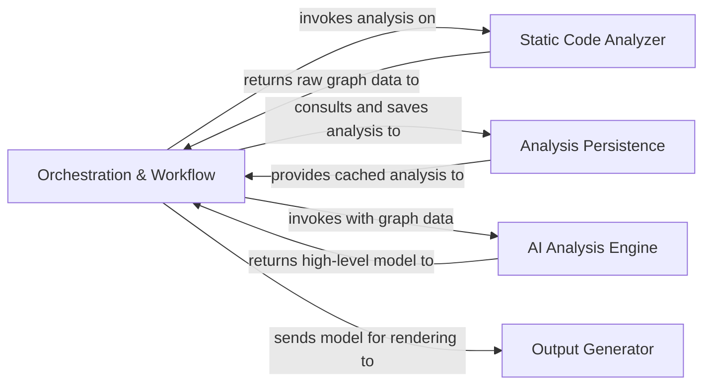
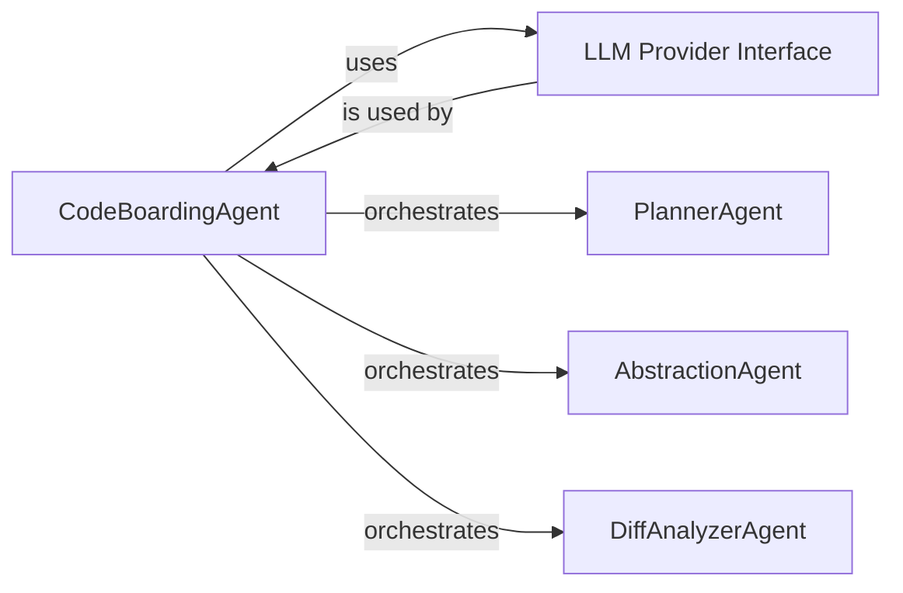
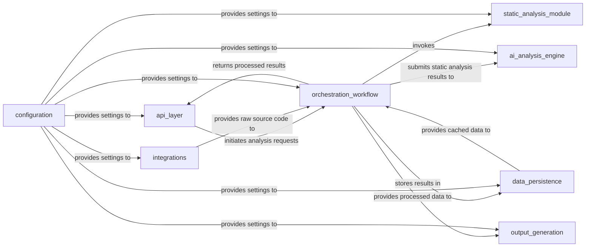
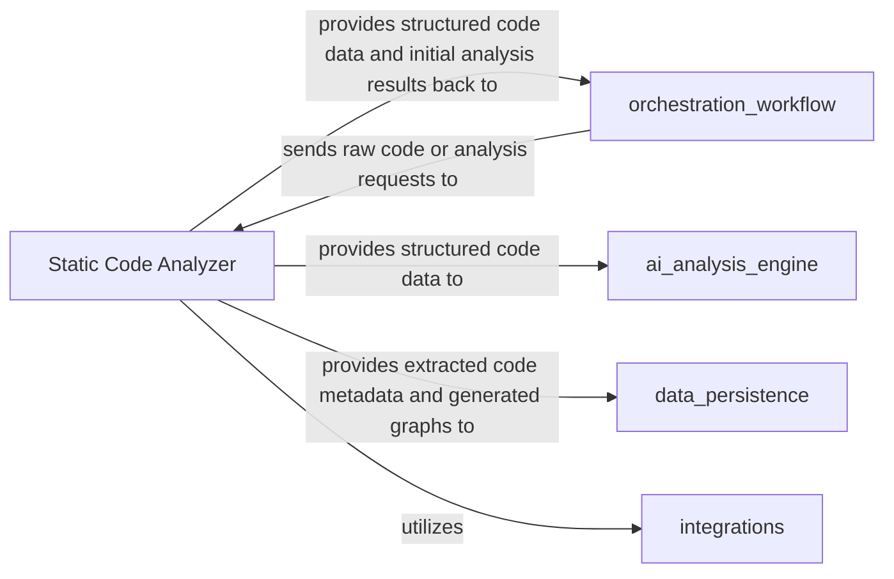

## Details

Abstract Components Overview

### Orchestration & Workflow [[Expand]](./Orchestration_Workflow.md)
The central coordinator that manages the end-to-end analysis pipeline. It initiates static analysis, triggers the AI engine, coordinates with the persistence layer for caching and differential checks, and sends the final, validated results to the output generator.

**Related Classes/Methods**:

- `local_app.py`
- `github_action.py`

### Static Code Analyzer [[Expand]](./Static_Code_Analyzer.md)
Responsible for the initial, non-AI parsing of the source code. It uses AST-based techniques to build foundational data structures like call graphs and structure graphs, transforming raw code into a structured format that the AI engine can interpret.

**Related Classes/Methods**:

- `static_analyzer/pylint_analyze/call_graph_builder.py`
- `static_analyzer/pylint_analyze/structure_graph_builder.py`
- `static_analyzer/pylint_graph_transform.py`

### AI Analysis Engine [[Expand]](./AI_Analysis_Engine.md)
The cognitive core of the system. It is a multi-agent framework that interprets the data from the static analyzer. It uses a collection of specialized agents (e.g., Planner, Abstraction, Diff Analyzer) to collaboratively identify architectural patterns, understand component roles, and build a comprehensive model of the codebase.

**Related Classes/Methods**:

- `agents/agent.py`
- `agents/planner_agent.py`
- `agents/abstraction_agent.py`
- `agents/diff_analyzer.py`

### Analysis Persistence
Handles the serialization and deserialization of the analysis model to a storable format (JSON). This enables the caching of results, which is critical for performance and for supporting efficient incremental analysis by providing a baseline for comparison.

**Related Classes/Methods**:

- `diagram_analysis/analysis_json.py`

### Output Generator
The final stage in the pipeline. It consumes the rich, structured analysis model produced by the AI Engine and renders it into various human-readable formats, such as Markdown, HTML, and Sphinx documentation. Recent changes indicate a streamlining or simplification of its output capabilities.

**Related Classes/Methods**:

- `output_generators/markdown.py`
- `output_generators/html.py`
- `output_generators/sphinx.py`
- `output_generators/mdx.py`

### [FAQ](https://github.com/CodeBoarding/GeneratedOnBoardings/tree/main?tab=readme-ov-file#faq)

## Details

The AI Analysis Engine subsystem is the cognitive core of the system, responsible for interpreting static analysis data through a multi-agent framework. It leverages specialized agents to identify architectural patterns, understand component roles, and build a comprehensive codebase model.

### CodeBoardingAgent
The central orchestrator of the AI analysis workflow. It manages analysis requests, initializes LLMs, invokes them with prompts, and processes their responses. It acts as the primary coordinator for all specialized agents within the engine.

**Related Classes/Methods**:

- `agents.agent`

### LLM Provider Interface
Provides an abstraction layer for interacting with various Large Language Model providers (e.g., OpenAI, Anthropic, Google Gemini, AWS Bedrock). It handles API calls, model selection, and standardizes response retrieval, decoupling the core logic from specific LLM vendor implementations.

**Related Classes/Methods**:

- `llm_providers.interface` (1:1)

### PlannerAgent
A specialized AI agent focused on strategic planning within the analysis workflow. It determines the sequence of steps and sub-tasks required to achieve a given analysis objective, guiding the overall process.

**Related Classes/Methods**:

- `agents.planner_agent`

### AbstractionAgent
A specialized AI agent responsible for identifying and generating higher-level abstractions from raw code data. This includes summarizing code sections, identifying design patterns, and distilling complex details into more manageable concepts.

**Related Classes/Methods**:

- `agents.abstraction_agent`

### DiffAnalyzerAgent
A specialized AI agent dedicated to analyzing differences between code versions or states. It identifies changes, assesses their impact, and provides insights into how modifications affect architectural patterns or component roles.

**Related Classes/Methods**:

- `agents.diff_analyzer`

### [FAQ](https://github.com/CodeBoarding/GeneratedOnBoardings/tree/main?tab=readme-ov-file#faq)

## Details

The `Orchestration & Workflow` component is central to the system, coordinating the entire analysis pipeline. Its interactions with other components are crucial for the system's functionality.

### api_layer
The primary interface for external communication, responsible for receiving analysis requests via HTTP and returning the final processed results. It acts as the system's public-facing entry point.

**Related Classes/Methods**:

- `local_app` (1:1)
- `github_action` (1:1)

### orchestration_workflow
The central coordinator that manages the end-to-end analysis pipeline. It initiates static analysis, triggers the AI engine, coordinates with the persistence layer for caching and differential checks, and sends the final, validated results to the output generator.

**Related Classes/Methods**:

- `local_app` (1:1)
- `github_action` (1:1)

### static_analysis_module
Responsible for parsing source code, building abstract syntax trees (ASTs), control flow graphs (CFGs), and extracting raw code metadata. It provides the foundational data for subsequent analysis steps.

**Related Classes/Methods**:

- `astroid` (1:1)
- `python-call-graph` (1:1)
- `networkx` (1:1)

### ai_analysis_engine
Encapsulates all interactions with Large Language Models (LLMs), including prompt engineering, multi-provider support (OpenAI, Anthropic, Google Gemini, AWS Bedrock), and processing LLM responses to derive high-level insights and recommendations.

**Related Classes/Methods**:

- `LangChain` (1:1)
- `LangGraph` (1:1)
- `OpenAI` (1:1)
- `Anthropic` (1:1)
- `Google Gemini` (1:1)
- `AWS Bedrock` (1:1)

### data_persistence
Manages data storage and retrieval for analysis results, intermediate data, and caching mechanisms. It abstracts the underlying database (e.g., DuckDB via SQLAlchemy) to provide a consistent data access layer.

**Related Classes/Methods**:

- `SQLAlchemy` (1:1)
- `DuckDB` (1:1)

### output_generation
Transforms processed analysis data into various user-consumable output formats, particularly interactive diagrams (e.g., Mermaid.js, pygraphviz, pydot) and other visualizations.

**Related Classes/Methods**:

- `pygraphviz` (1:1)
- `pydot` (1:1)
- `Mermaid.js` (1:1)

### integrations
Handles specific logic related to external services, such as cloning repositories from GitHub (using GitPython, Dulwich) and potential integrations with other platforms (VS Code, MCP Server).

**Related Classes/Methods**:

- `GitPython` (1:1)
- `Dulwich` (1:1)

### configuration
Centralizes application settings, environment variable loading, and credential management, ensuring consistent and secure configuration across all components of the system.

**Related Classes/Methods**:

- `config_module` (1:1)

### [FAQ](https://github.com/CodeBoarding/GeneratedOnBoardings/tree/main?tab=readme-ov-file#faq)

## Details

One paragraph explaining the functionality which is represented by this graph. What the main flow is and what is its purpose.

### Static Code Analyzer [[Expand]](./Static_Code_Analyzer.md)
The Static Code Analyzer component is responsible for the initial, non-AI parsing of source code. It leverages Abstract Syntax Tree (AST)-based techniques to build foundational data structures such as ASTs, Call Graphs, and Structure Graphs. Its primary role is to transform raw code into a structured, machine-readable format, extracting essential code metadata that can then be interpreted and further processed by the AI analysis engine. This component is fundamental as it provides the structured input necessary for all subsequent AI-driven analysis.

**Related Classes/Methods**:

- `static_analyzer/pylint_analyze/call_graph_builder.py`
- `static_analyzer/pylint_analyze/structure_graph_builder.py`

### orchestration_workflow
This component acts as the central coordinator for the code analysis process. It is responsible for receiving raw code or analysis requests, initiating the static analysis process, and managing the flow of data between different analysis stages. It orchestrates the interaction with the `Static Code Analyzer` and potentially other downstream components, ensuring that the analysis pipeline executes correctly.

**Related Classes/Methods**: _None_

### ai_analysis_engine
The `AI Analysis Engine` component is responsible for performing advanced, AI-driven analysis on the structured code data provided by the `Static Code Analyzer`. It leverages machine learning models and algorithms to identify complex patterns, potential vulnerabilities, or areas for optimization that go beyond traditional static analysis.

**Related Classes/Methods**: _None_

### data_persistence
The `Data Persistence` component is responsible for securely storing and retrieving all generated analysis artifacts, including extracted code metadata, Abstract Syntax Trees (ASTs), Call Graphs, and Structure Graphs. It ensures the long-term availability and integrity of the analysis results for historical tracking, reporting, and further processing.

**Related Classes/Methods**: _None_

### integrations
The `Integrations` component provides a standardized interface for interacting with external systems, tools, or services. It handles the communication protocols and data formats required to exchange information with external platforms, such as version control systems, CI/CD pipelines, or reporting dashboards, enabling the seamless flow of code and analysis results.

**Related Classes/Methods**: _None_

### [FAQ](https://github.com/CodeBoarding/GeneratedOnBoardings/tree/main?tab=readme-ov-file#faq)

