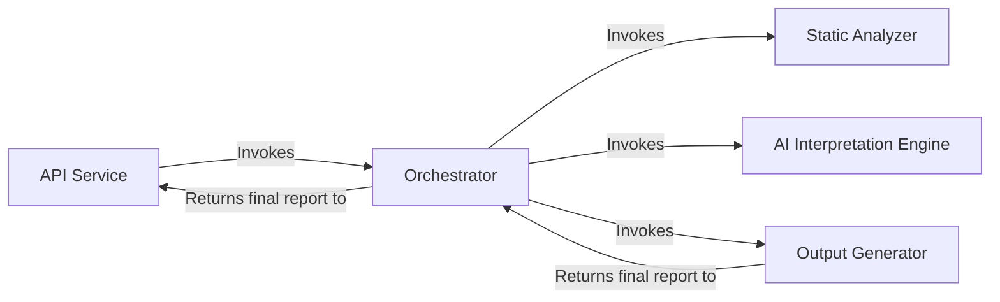
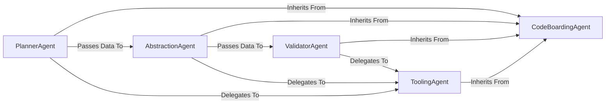
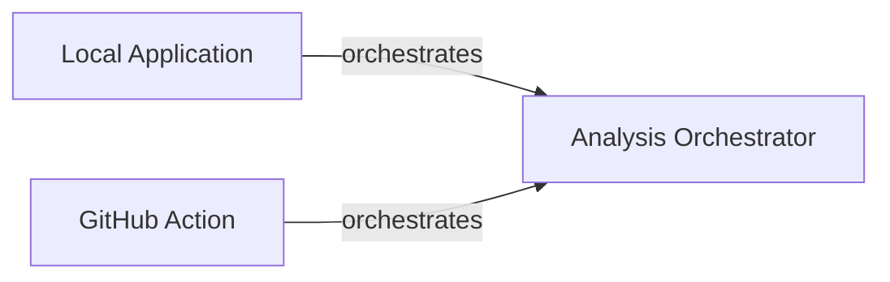
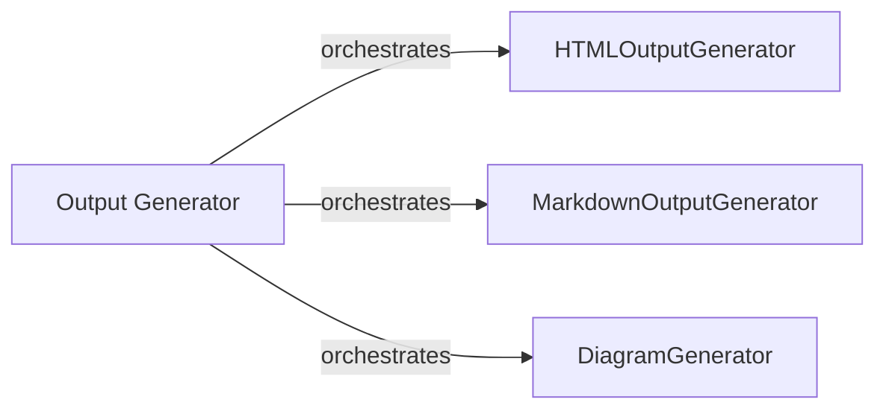
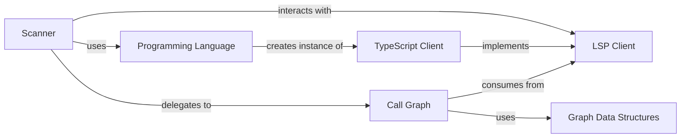

## Details

An analysis of the project's file structure and the initial abstract components reveals a clear mapping between the conceptual architecture and the source code. The feedback provided was valid and has been integrated by grounding the abstract components in specific source files and correcting the data flow between them.

### API Service [[Expand]](./API_Service.md)
Serves as the primary entry point for all external interactions. It exposes the system's capabilities, handling incoming requests and returning the final generated analysis.

**Related Classes/Methods**:

- <a href="https://github.com/CodeBoarding/CodeBoarding/blob/main/local_app.py" target="_blank" rel="noopener noreferrer">`local_app.py`</a>
- <a href="https://github.com/CodeBoarding/CodeBoarding/blob/main/github_action.py" target="_blank" rel="noopener noreferrer">`github_action.py`</a>

### Orchestrator [[Expand]](./Orchestrator.md)
Acts as the central coordinator of the analysis pipeline. It manages the sequence of operations, directing the flow of data between the various components to ensure the end-to-end process runs smoothly.

**Related Classes/Methods**:

- <a href="https://github.com/CodeBoarding/CodeBoarding/blob/main/agents/meta_agent.py" target="_blank" rel="noopener noreferrer">`agents/meta_agent.py`</a>

### Static Analyzer [[Expand]](./Static_Analyzer.md)
Performs language-aware static analysis of the source code. It builds foundational data structures, including call graphs and package dependencies, which form the basis for the AI interpretation.

**Related Classes/Methods**:

- <a href="https://github.com/CodeBoarding/CodeBoarding/blob/main/static_analyzer/scanner.py" target="_blank" rel="noopener noreferrer">`static_analyzer/scanner.py`</a>
- `static_analyzer/lsp_client/`

### AI Interpretation Engine [[Expand]](./AI_Interpretation_Engine.md)
A suite of specialized AI agents responsible for interpreting the static analysis data. It uses a planner, abstraction, and validator agents, along with a toolkit for reading code artifacts, to generate high-level architectural insights.

**Related Classes/Methods**:

- <a href="https://github.com/CodeBoarding/CodeBoarding/blob/main/agents/planner_agent.py" target="_blank" rel="noopener noreferrer">`agents/planner_agent.py`</a>
- <a href="https://github.com/CodeBoarding/CodeBoarding/blob/main/agents/abstraction_agent.py" target="_blank" rel="noopener noreferrer">`agents/abstraction_agent.py`</a>
- <a href="https://github.com/CodeBoarding/CodeBoarding/blob/main/agents/validator_agent.py" target="_blank" rel="noopener noreferrer">`agents/validator_agent.py`</a>
- `agents/tools/`

### Output Generator [[Expand]](./Output_Generator.md)
Responsible for converting the final, validated analysis from the AI engine into human-readable formats. It serializes the analysis data and renders it as diagrams and text.

**Related Classes/Methods**:

- <a href="https://github.com/CodeBoarding/CodeBoarding/blob/main/output_generators/html.py" target="_blank" rel="noopener noreferrer">`output_generators/html.py`</a>
- <a href="https://github.com/CodeBoarding/CodeBoarding/blob/main/output_generators/markdown.py" target="_blank" rel="noopener noreferrer">`output_generators/markdown.py`</a>
- <a href="https://github.com/CodeBoarding/CodeBoarding/blob/main/diagram_analysis/diagram_generator.py" target="_blank" rel="noopener noreferrer">`diagram_analysis/diagram_generator.py`</a>

### [FAQ](https://github.com/CodeBoarding/GeneratedOnBoardings/tree/main?tab=readme-ov-file#faq)

## Details

One paragraph explaining the functionality which is represented by this graph. What the main flow is and what is its purpose.

### CodeBoardingAgent
An abstract base class that provides a foundational agentic framework. It standardizes LLM interactions, state management, and initialization for all specialized agents, ensuring consistent behavior and integration.

**Related Classes/Methods**:

- <a href="https://github.com/CodeBoarding/CodeBoarding/blob/main/agents/agent.py" target="_blank" rel="noopener noreferrer">`agents.agent`</a>

### PlannerAgent
The initial stage of the pipeline. It examines the project's overall structure to create a high-level analysis plan, guiding the subsequent abstraction phase. It inherits its core capabilities from the CodeBoardingAgent.

**Related Classes/Methods**:

- <a href="https://github.com/CodeBoarding/CodeBoarding/blob/main/agents/planner_agent.py" target="_blank" rel="noopener noreferrer">`agents.planner_agent`</a>

### AbstractionAgent
The central processing unit of the engine. It executes the plan from the PlannerAgent, synthesizing architectural components and relationships from the codebase by delegating to various ToolingAgents.

**Related Classes/Methods**:

- <a href="https://github.com/CodeBoarding/CodeBoarding/blob/main/agents/abstraction_agent.py" target="_blank" rel="noopener noreferrer">`agents.abstraction_agent`</a>

### ValidatorAgent
The final quality assurance stage. It systematically reviews the output from the AbstractionAgent, verifying the correctness of identified components and their relationships, often by delegating checks to ToolingAgents.

**Related Classes/Methods**:

- <a href="https://github.com/CodeBoarding/CodeBoarding/blob/main/agents/validator_agent.py" target="_blank" rel="noopener noreferrer">`agents.validator_agent`</a>

### ToolingAgent
A collection of specialized agents that perform fine-grained analysis tasks (e.g., reading files, parsing class structures, analyzing dependencies). They inherit from CodeBoardingAgent and are invoked by other agents to provide specific data points about the codebase.

**Related Classes/Methods**:

### [FAQ](https://github.com/CodeBoarding/GeneratedOnBoardings/tree/main?tab=readme-ov-file#faq)

## Details

Initial analysis of the project components and their relations, with a focus on identifying the 'Analysis Orchestrator' and its interactions. Further refinement is needed to include specific code references for the 'Analysis Orchestrator' by examining 'github_action.py' and 'local_app.py'.

### Analysis Orchestrator
Orchestrates the analysis process, coordinating between different components.

**Related Classes/Methods**: _None_

### Local Application
Manages local application interactions.

**Related Classes/Methods**: _None_

### GitHub Action
Handles GitHub Actions workflows.

**Related Classes/Methods**: _None_

### [FAQ](https://github.com/CodeBoarding/GeneratedOnBoardings/tree/main?tab=readme-ov-file#faq)

## Details

The previous analysis lacked specific source code references for several key components, hindering the verification of their implementation boundaries and responsibilities. This revised analysis addresses those gaps by identifying the relevant code artifacts. The `Orchestrator`, embodied by `MetaAgent`, initiates the analysis process, leveraging various tools to gather initial project context. The `Static Code Analyzer`, primarily through the `Scanner` class, performs in-depth code analysis. The `AI Analysis Engine` (likely represented by `AbstractionAgent` and `DetailsAgent`) interprets these results, generating higher-level insights. `Analysis Persistence` (potentially handled by `AnalysisResult` and related mechanisms for storing data in the `.codeboarding` directory) ensures that all analysis data is stored and retrievable. Finally, the `Output Generator` (whose specific implementation needs further investigation but likely interacts with the stored analysis data to produce reports) transforms the processed data into user-friendly formats.

### Orchestrator [[Expand]](./Orchestrator.md)
Acts as the central coordinator of the analysis pipeline. It manages the sequence of operations, directing the flow of data between the various components to ensure the end-to-end process runs smoothly. The `MetaAgent` within this component is specifically responsible for initial project metadata analysis, establishing architectural context, and guiding subsequent analysis steps.

**Related Classes/Methods**:

### Static Code Analyzer
Responsible for performing in-depth static analysis on the codebase. This involves parsing source code, building abstract syntax trees (ASTs), identifying code patterns, and extracting structural information without executing the code.

**Related Classes/Methods**:

### AI Analysis Engine
Integrates AI/LLM capabilities to interpret the results from the Static Code Analyzer and the architectural context provided by the Orchestrator. It generates high-level insights, identifies complex relationships, and provides explanations or suggestions based on the analyzed code.

**Related Classes/Methods**:

### Analysis Persistence
Manages the storage, retrieval, and versioning of all analysis-related data, including raw static analysis outputs, AI-generated insights, project metadata, and configuration settings. This ensures data integrity and enables historical analysis.

**Related Classes/Methods**:

### Output Generator [[Expand]](./Output_Generator.md)
Transforms the processed analysis data into various user-friendly formats, including visual representations (e.g., Mermaid.js diagrams for architectural views) and structured reports. It is responsible for rendering the final output for user consumption.

**Related Classes/Methods**: _None_

### read_docs tool
Tool to access and process project documentation.

**Related Classes/Methods**:

### external_deps_tool
Tool to identify and analyze the project's external dependencies.

**Related Classes/Methods**:

### read_file_structure tool
Tool to obtain a comprehensive understanding of the project's file and directory organization.

**Related Classes/Methods**:

### [FAQ](https://github.com/CodeBoarding/GeneratedOnBoardings/tree/main?tab=readme-ov-file#faq)

## Details

The `Output Generator` subsystem is responsible for transforming processed analysis data into various user-consumable formats. It orchestrates the generation of HTML, Markdown, and diagrams, acting as the final presentation layer for the `CodeBoarding` project's analysis results. The core flow involves the `Output Generator` delegating specific formatting tasks to specialized components like `HTMLOutputGenerator`, `MarkdownOutputGenerator`, and `DiagramGenerator`, ensuring a modular and extensible output pipeline.

### Output Generator [[Expand]](./Output_Generator.md)
This is the core component responsible for taking the processed analysis data and rendering it into various output formats. It acts as the orchestrator for the final presentation layer.

**Related Classes/Methods**:

### HTMLOutputGenerator
Specifically handles the conversion of analysis data into HTML format.

**Related Classes/Methods**:

### MarkdownOutputGenerator
Specifically handles the conversion of analysis data into Markdown format.

**Related Classes/Methods**:

### DiagramGenerator
Focuses on generating diagrams (e.g., using Mermaid.js) based on the analysis data.

**Related Classes/Methods**:

### [FAQ](https://github.com/CodeBoarding/GeneratedOnBoardings/tree/main?tab=readme-ov-file#faq)

## Details

One paragraph explaining the functionality which is represented by this graph. What the main flow is and what is its purpose.

### Scanner
The primary orchestrator and entry point of the subsystem. It traverses the target project's file system, determines the language, and coordinates the analysis process by delegating to the appropriate LSP client and graph-building components.

**Related Classes/Methods**:

- <a href="https://github.com/CodeBoarding/CodeBoarding/blob/main/static_analyzer/scanner.py" target="_blank" rel="noopener noreferrer">`static_analyzer/scanner.py`</a>

### Programming Language
A factory component responsible for identifying the programming language of the source code and providing the corresponding language-specific LSP client instance. This isolates language-specific logic and simplifies the `Scanner`'s responsibilities.

**Related Classes/Methods**:

- <a href="https://github.com/CodeBoarding/CodeBoarding/blob/main/static_analyzer/programming_language.py" target="_blank" rel="noopener noreferrer">`static_analyzer/programming_language.py`</a>

### LSP Client
An abstract base class defining a standardized interface for communication with any Language Server Protocol server. It decouples the `Scanner` and `Call Graph` from the concrete implementation details of specific language servers.

**Related Classes/Methods**:

- <a href="https://github.com/CodeBoarding/CodeBoarding/blob/main/static_analyzer/lsp_client/client.py" target="_blank" rel="noopener noreferrer">`static_analyzer/lsp_client/client.py`</a>

### TypeScript Client
A concrete implementation of the `LSP Client` interface, specifically designed to manage and communicate with the TypeScript language server. It demonstrates the system's extensibility for different languages.

**Related Classes/Methods**:

- <a href="https://github.com/CodeBoarding/CodeBoarding/blob/main/static_analyzer/lsp_client/typescript_client.py" target="_blank" rel="noopener noreferrer">`static_analyzer/lsp_client/typescript_client.py`</a>

### Call Graph
Responsible for constructing the call graph data structure. It consumes information retrieved from an `LSP Client` and uses it to build a graph of nodes and edges representing the code's relationships.

**Related Classes/Methods**:

- `static_analyzer/graph/call_graph.py`

### Graph Data Structures
A set of data models (`Node`, `Edge`) that represent the fundamental elements of the call graph. These structures provide a clean, language-agnostic representation of code entities and their interactions.

**Related Classes/Methods**:

- `static_analyzer/graph/node.py`
- `static_analyzer/graph/edge.py`

### [FAQ](https://github.com/CodeBoarding/GeneratedOnBoardings/tree/main?tab=readme-ov-file#faq)

