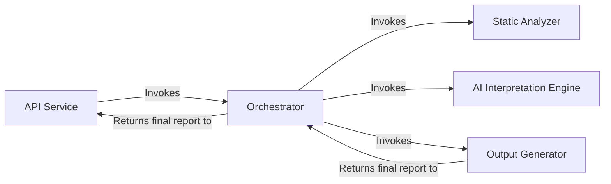
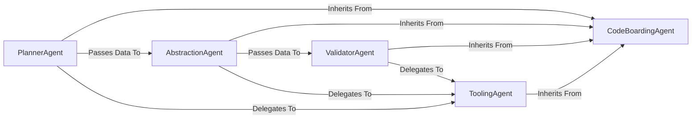
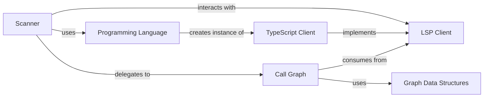

## Details

An analysis of the project's file structure and the initial abstract components reveals a clear mapping between the conceptual architecture and the source code. The feedback provided was valid and has been integrated by grounding the abstract components in specific source files and correcting the data flow between them.

### API Service
Serves as the primary entry point for all external interactions. It exposes the system's capabilities, handling incoming requests and returning the final generated analysis.

**Related Classes/Methods**:

- `local_app.py`
- `github_action.py`

### Orchestrator
Acts as the central coordinator of the analysis pipeline. It manages the sequence of operations, directing the flow of data between the various components to ensure the end-to-end process runs smoothly.

**Related Classes/Methods**:

- `agents/meta_agent.py`

### Static Analyzer [[Expand]](./Static_Analyzer.md)
Performs language-aware static analysis of the source code. It builds foundational data structures, including call graphs and package dependencies, which form the basis for the AI interpretation.

**Related Classes/Methods**:

- `static_analyzer/scanner.py`
- `static_analyzer/lsp_client/`

### AI Interpretation Engine [[Expand]](./AI_Interpretation_Engine.md)
A suite of specialized AI agents responsible for interpreting the static analysis data. It uses a planner, abstraction, and validator agents, along with a toolkit for reading code artifacts, to generate high-level architectural insights.

**Related Classes/Methods**:

- `agents/planner_agent.py`
- `agents/abstraction_agent.py`
- `agents/validator_agent.py`
- `agents/tools/`

### Output Generator
Responsible for converting the final, validated analysis from the AI engine into human-readable formats. It serializes the analysis data and renders it as diagrams and text.

**Related Classes/Methods**:

- `output_generators/html.py`
- `output_generators/markdown.py`
- `diagram_analysis/diagram_generator.py`

### [FAQ](https://github.com/CodeBoarding/GeneratedOnBoardings/tree/main?tab=readme-ov-file#faq)

## Details

One paragraph explaining the functionality which is represented by this graph. What the main flow is and what is its purpose.

### CodeBoardingAgent
An abstract base class that provides a foundational agentic framework. It standardizes LLM interactions, state management, and initialization for all specialized agents, ensuring consistent behavior and integration.

**Related Classes/Methods**:

- `agents.agent`

### PlannerAgent
The initial stage of the pipeline. It examines the project's overall structure to create a high-level analysis plan, guiding the subsequent abstraction phase. It inherits its core capabilities from the CodeBoardingAgent.

**Related Classes/Methods**:

- `agents.planner_agent`

### AbstractionAgent
The central processing unit of the engine. It executes the plan from the PlannerAgent, synthesizing architectural components and relationships from the codebase by delegating to various ToolingAgents.

**Related Classes/Methods**:

- `agents.abstraction_agent`

### ValidatorAgent
The final quality assurance stage. It systematically reviews the output from the AbstractionAgent, verifying the correctness of identified components and their relationships, often by delegating checks to ToolingAgents.

**Related Classes/Methods**:

- `agents.validator_agent`

### ToolingAgent
A collection of specialized agents that perform fine-grained analysis tasks (e.g., reading files, parsing class structures, analyzing dependencies). They inherit from CodeBoardingAgent and are invoked by other agents to provide specific data points about the codebase.

**Related Classes/Methods**:

- `agents.tools.*`

### [FAQ](https://github.com/CodeBoarding/GeneratedOnBoardings/tree/main?tab=readme-ov-file#faq)

## Details

One paragraph explaining the functionality which is represented by this graph. What the main flow is and what is its purpose.

### Scanner
The primary orchestrator and entry point of the subsystem. It traverses the target project's file system, determines the language, and coordinates the analysis process by delegating to the appropriate LSP client and graph-building components.

**Related Classes/Methods**:

- `static_analyzer/scanner.py`

### Programming Language
A factory component responsible for identifying the programming language of the source code and providing the corresponding language-specific LSP client instance. This isolates language-specific logic and simplifies the `Scanner`'s responsibilities.

**Related Classes/Methods**:

- `static_analyzer/programming_language.py`

### LSP Client
An abstract base class defining a standardized interface for communication with any Language Server Protocol server. It decouples the `Scanner` and `Call Graph` from the concrete implementation details of specific language servers.

**Related Classes/Methods**:

- `static_analyzer/lsp_client/client.py`

### TypeScript Client
A concrete implementation of the `LSP Client` interface, specifically designed to manage and communicate with the TypeScript language server. It demonstrates the system's extensibility for different languages.

**Related Classes/Methods**:

- `static_analyzer/lsp_client/typescript_client.py`

### Call Graph
Responsible for constructing the call graph data structure. It consumes information retrieved from an `LSP Client` and uses it to build a graph of nodes and edges representing the code's relationships.

**Related Classes/Methods**:

- `static_analyzer/graph/call_graph.py`

### Graph Data Structures
A set of data models (`Node`, `Edge`) that represent the fundamental elements of the call graph. These structures provide a clean, language-agnostic representation of code entities and their interactions.

**Related Classes/Methods**:

- `static_analyzer/graph/node.py`
- `static_analyzer/graph/edge.py`

### [FAQ](https://github.com/CodeBoarding/GeneratedOnBoardings/tree/main?tab=readme-ov-file#faq)

