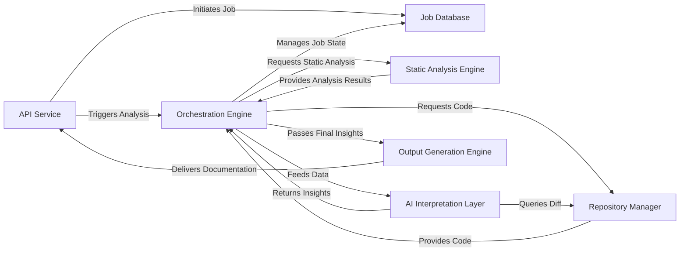
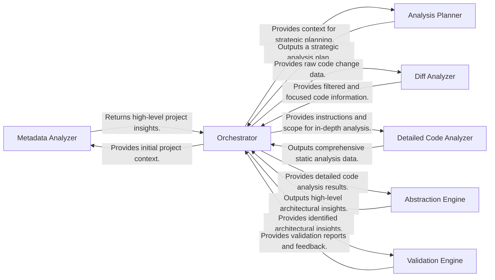
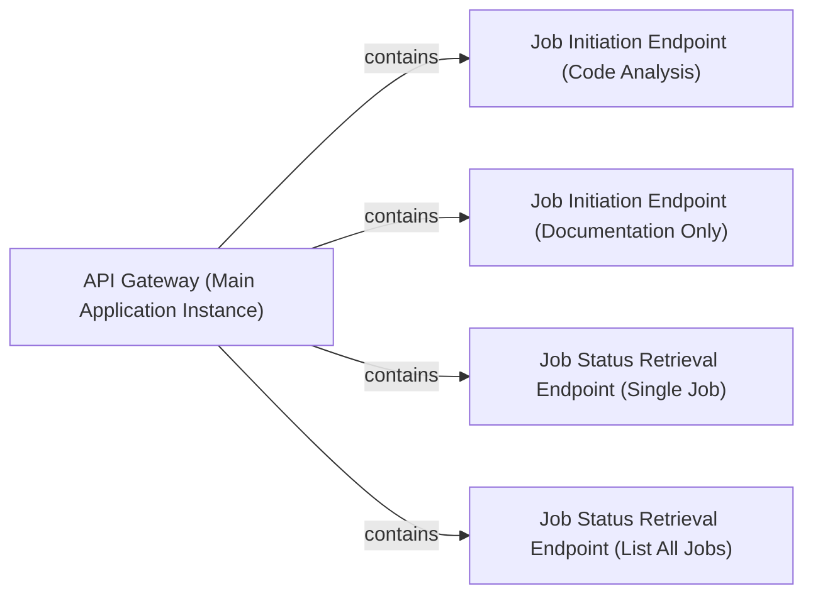
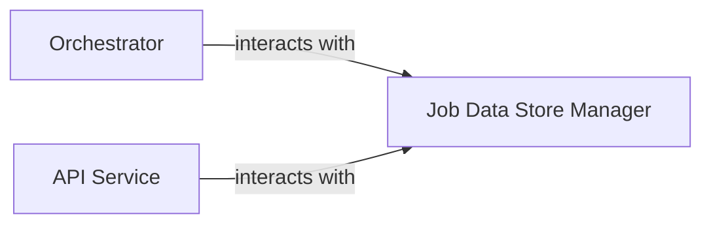
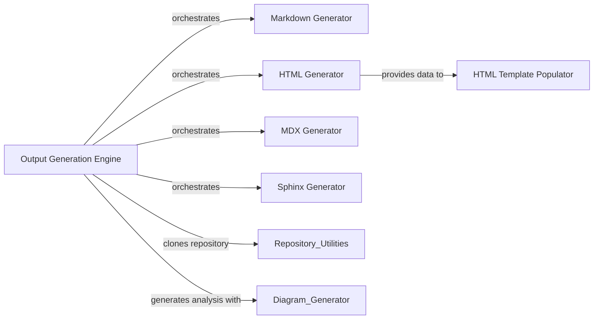
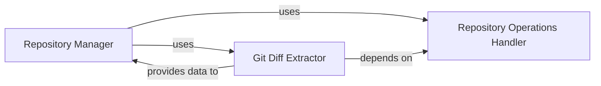
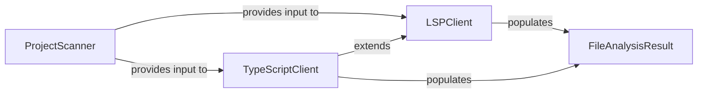

## Details

The CodeBoarding system operates as a sophisticated pipeline for automated architectural documentation. It begins with the API Service receiving a request, which is then logged and managed by the Job Database. The Orchestration Engine serves as the central nervous system, coordinating the entire analysis process. It first directs the Repository Manager to fetch the target codebase. This code then undergoes structural examination by the Static Analysis Engine. The resulting raw data is intelligently processed by the AI Interpretation Layer, a suite of agents that abstract, detail, plan, validate, and analyze changes within the architecture. Finally, the refined architectural insights are passed to the Output Generation Engine to produce various documentation formats, completing the cycle by making the output accessible via the API Service. This design emphasizes a clear, sequential flow, distinct component responsibilities, and extensibility for future language and AI model integrations.

### API Service [[Expand]](./API_Service.md)
The external interface for CodeBoarding, handling user requests, job initiation, and status retrieval.

**Related Classes/Methods**:

- <a href="https://github.com/CodeBoarding/CodeBoarding/blob/main/local_app.py" target="_blank" rel="noopener noreferrer">`local_app`</a>

### Job Database [[Expand]](./Job_Database.md)
Persistent storage for managing the lifecycle, status, and results of all documentation generation jobs.

**Related Classes/Methods**:

- <a href="https://github.com/CodeBoarding/CodeBoarding/blob/main/duckdb_crud.py" target="_blank" rel="noopener noreferrer">`duckdb_crud`</a>

### Orchestration Engine
The central control unit that manages the entire documentation generation pipeline, coordinating all analysis and generation stages.

**Related Classes/Methods**:

- <a href="https://github.com/CodeBoarding/CodeBoarding/blob/main/diagram_analysis/diagram_generator.py" target="_blank" rel="noopener noreferrer">`diagram_generator`</a>

### Repository Manager [[Expand]](./Repository_Manager.md)
Manages all interactions with source code repositories, including cloning, fetching, and extracting version differences.

**Related Classes/Methods**:

- <a href="https://github.com/CodeBoarding/CodeBoarding/blob/main/agents/diff_analyzer.py#L21-L32" target="_blank" rel="noopener noreferrer">`__init__`:21-32</a>
- <a href="https://github.com/CodeBoarding/CodeBoarding/blob/main/repo_utils/git_diff.py#L27-L76" target="_blank" rel="noopener noreferrer">`git_diff`:27-76</a>

### Static Analysis Engine [[Expand]](./Static_Analysis_Engine.md)
Performs deep, language-specific analysis of source code to extract structural information without semantic interpretation.

**Related Classes/Methods**:

- <a href="https://github.com/CodeBoarding/CodeBoarding/blob/main/static_analyzer/scanner.py#L13-L66" target="_blank" rel="noopener noreferrer">`scanner`:13-66</a>
- <a href="https://github.com/CodeBoarding/CodeBoarding/blob/main/static_analyzer/lsp_client/typescript_client.py#L10-L214" target="_blank" rel="noopener noreferrer">`client`:10-214</a>

### AI Interpretation Layer [[Expand]](./AI_Interpretation_Layer.md)
A collection of specialized AI agents that interpret static analysis data to generate high-level architectural insights, including abstraction, detailing, planning, validation, and diff analysis.

**Related Classes/Methods**:

- <a href="https://github.com/CodeBoarding/CodeBoarding/blob/main/diagram_analysis/diagram_generator.py" target="_blank" rel="noopener noreferrer">`meta_agent`</a>
- <a href="https://github.com/CodeBoarding/CodeBoarding/blob/main/diagram_analysis/diagram_generator.py" target="_blank" rel="noopener noreferrer">`abstraction_agent`</a>
- <a href="https://github.com/CodeBoarding/CodeBoarding/blob/main/diagram_analysis/diagram_generator.py" target="_blank" rel="noopener noreferrer">`details_agent`</a>
- <a href="https://github.com/CodeBoarding/CodeBoarding/blob/main/diagram_analysis/diagram_generator.py" target="_blank" rel="noopener noreferrer">`planner_agent`</a>
- <a href="https://github.com/CodeBoarding/CodeBoarding/blob/main/diagram_analysis/diagram_generator.py" target="_blank" rel="noopener noreferrer">`validator_agent`</a>
- <a href="https://github.com/CodeBoarding/CodeBoarding/blob/main/agents/diff_analyzer.py" target="_blank" rel="noopener noreferrer">`diff_analyzer`</a>

### Output Generation Engine [[Expand]](./Output_Generation_Engine.md)
Transforms the final, validated architectural insights into various human-readable and diagram-friendly documentation formats.

**Related Classes/Methods**:

- <a href="https://github.com/CodeBoarding/CodeBoarding/blob/main/github_action.py#L36-L50" target="_blank" rel="noopener noreferrer">`html`:36-50</a>
- <a href="https://github.com/CodeBoarding/CodeBoarding/blob/main/github_action.py#L19-L33" target="_blank" rel="noopener noreferrer">`markdown`:19-33</a>
- <a href="https://github.com/CodeBoarding/CodeBoarding/blob/main/github_action.py#L53-L67" target="_blank" rel="noopener noreferrer">`mdx`:53-67</a>
- <a href="https://github.com/CodeBoarding/CodeBoarding/blob/main/output_generators/sphinx.py" target="_blank" rel="noopener noreferrer">`sphinx`</a>

### [FAQ](https://github.com/CodeBoarding/GeneratedOnBoardings/tree/main?tab=readme-ov-file#faq)

## Details

The CodeBoarding project employs a multi-agent architecture orchestrated by the Orchestrator component (agents.agent.CodeBoardingAgent). This central component manages the entire analysis workflow, from initial project context establishment to the final validation of architectural insights. The process begins with the Orchestrator providing initial project context to the Metadata Analyzer, which then returns high-level project insights. Based on these insights, the Orchestrator directs the Analysis Planner to formulate a strategic analysis plan. For code changes, the Diff Analyzer processes raw diff data, providing focused information back to the Orchestrator. The Detailed Code Analyzer performs in-depth static analysis under the Orchestrator's guidance, generating comprehensive data. This detailed analysis is then fed to the Abstraction Engine, which synthesizes high-level architectural insights. Finally, the Validation Engine verifies these insights, reporting back to the Orchestrator to ensure the integrity and accuracy of the generated architecture.

### Metadata Analyzer
Analyzes high-level project metadata to establish the initial context for subsequent analysis. It provides foundational information about the codebase.

**Related Classes/Methods**:

- `agents.meta_agent`

### Analysis Planner
Formulates a strategic plan for the code analysis, identifying key areas or components for deeper inspection based on initial context.

**Related Classes/Methods**:

- `agents.planner_agent`

### Diff Analyzer
Identifies and processes code changes (diffs) to focus the analysis on modified or new code, optimizing the analysis scope and efficiency.

**Related Classes/Methods**:

- `agents.diff_analyzer`

### Detailed Code Analyzer
Performs in-depth static analysis, including generating control flow graphs (CFG) and enhancing the structural understanding of the code. This agent delves into the granular details.

**Related Classes/Methods**:

- `agents.details_agent`

### Abstraction Engine
Transforms detailed code analysis results into high-level architectural insights, identifying components, their responsibilities, and interactions. It's responsible for synthesizing complex data into abstract representations.

**Related Classes/Methods**:

- `agents.abstraction_agent`

### Validation Engine
Verifies the accuracy, consistency, and completeness of the identified architectural components, their relationships, and code references against the source code. Ensures the integrity of the generated insights.

**Related Classes/Methods**:

- `agents.validator_agent`

### Orchestrator
Central coordinator, managing the flow of data and control between AI agents.

**Related Classes/Methods**:

- <a href="https://github.com/CodeBoarding/CodeBoarding/blob/main/agents/agent.py#L27-L207" target="_blank" rel="noopener noreferrer">`agents.agent.CodeBoardingAgent`:27-207</a>

### [FAQ](https://github.com/CodeBoarding/GeneratedOnBoardings/tree/main?tab=readme-ov-file#faq)

## Details

The API Service (referred to as API Gateway in the analysis summary) forms the external interface of CodeBoarding. Its boundaries are defined by the local_app.py file, specifically the FastAPI application instance (local_app.app) and its exposed RESTful endpoints. This subsystem is responsible for handling all incoming user requests, initiating analysis jobs, and providing job status updates.

### API Gateway (Main Application Instance)
The core FastAPI application instance that defines and serves all external API endpoints for CodeBoarding. It acts as the central dispatcher for incoming HTTP requests, routing them to the appropriate handlers.

**Related Classes/Methods**:

- <a href="https://github.com/CodeBoarding/CodeBoarding/blob/main/local_app.py" target="_blank" rel="noopener noreferrer">`local_app.app`</a>

### Job Initiation Endpoint (Code Analysis)
Handles requests to initiate a comprehensive code analysis and documentation generation job. It validates input parameters and triggers the subsequent orchestration process.

**Related Classes/Methods**:

- <a href="https://github.com/CodeBoarding/CodeBoarding/blob/main/local_app.py#L133-L150" target="_blank" rel="noopener noreferrer">`local_app.start_generation_job`:133-150</a>

### Job Initiation Endpoint (Documentation Only)
Manages requests specifically for generating documentation, potentially for pre-analyzed code or a subset of the full analysis, providing a more focused entry point.

**Related Classes/Methods**:

- <a href="https://github.com/CodeBoarding/CodeBoarding/blob/main/local_app.py#L181-L231" target="_blank" rel="noopener noreferrer">`local_app.start_docs_generation_job`:181-231</a>

### Job Status Retrieval Endpoint (Single Job)
Provides an interface for clients to query the real-time status and detailed results of a specific, identified job using its unique ID.

**Related Classes/Methods**:

- <a href="https://github.com/CodeBoarding/CodeBoarding/blob/main/local_app.py#L161-L170" target="_blank" rel="noopener noreferrer">`local_app.get_job`:161-170</a>

### Job Status Retrieval Endpoint (List All Jobs)
Allows clients to retrieve a list of all ongoing or completed jobs, offering an overview of system activity and job history.

**Related Classes/Methods**:

- <a href="https://github.com/CodeBoarding/CodeBoarding/blob/main/local_app.py#L282-L311" target="_blank" rel="noopener noreferrer">`local_app.list_jobs`:282-311</a>

### [FAQ](https://github.com/CodeBoarding/GeneratedOnBoardings/tree/main?tab=readme-ov-file#faq)

## Details

One paragraph explaining the functionality which is represented by this graph. What the main flow is and what is its purpose.

### Job Data Store Manager
This component is the core of the `Job Database` subsystem. It is responsible for the complete lifecycle management of documentation generation jobs, including their status, progress, and results. It provides a comprehensive set of CRUD (Create, Read, Update, Delete) operations for job metadata, ensuring data persistence and retrieval using a DuckDB database. It also handles the underlying database connection management and schema initialization. This component aligns with the "Data Store/Cache" expected component pattern, providing the necessary persistence for the pipeline's state.

**Related Classes/Methods**:

- <a href="https://github.com/CodeBoarding/CodeBoarding/blob/main/duckdb_crud.py#L15-L44" target="_blank" rel="noopener noreferrer">`duckdb_crud.init_db`:15-44</a>
- <a href="https://github.com/CodeBoarding/CodeBoarding/blob/main/duckdb_crud.py#L48-L58" target="_blank" rel="noopener noreferrer">`duckdb_crud.insert_job`:48-58</a>
- <a href="https://github.com/CodeBoarding/CodeBoarding/blob/main/duckdb_crud.py#L61-L70" target="_blank" rel="noopener noreferrer">`duckdb_crud.update_job`:61-70</a>
- <a href="https://github.com/CodeBoarding/CodeBoarding/blob/main/duckdb_crud.py#L73-L93" target="_blank" rel="noopener noreferrer">`duckdb_crud.fetch_job`:73-93</a>
- <a href="https://github.com/CodeBoarding/CodeBoarding/blob/main/duckdb_crud.py#L96-L117" target="_blank" rel="noopener noreferrer">`duckdb_crud.fetch_all_jobs`:96-117</a>
- <a href="https://github.com/CodeBoarding/CodeBoarding/blob/main/duckdb_crud.py#L11-L12" target="_blank" rel="noopener noreferrer">`duckdb_crud._connect`:11-12</a>

### Orchestrator
The central coordinator of the documentation generation pipeline.

**Related Classes/Methods**: _None_

### API Service [[Expand]](./API_Service.md)
The external interface of the tool.

**Related Classes/Methods**: _None_

### [FAQ](https://github.com/CodeBoarding/GeneratedOnBoardings/tree/main?tab=readme-ov-file#faq)

## Details

The documentation generation process is orchestrated by the `Output Generation Engine`, primarily implemented in `demo.py`. This engine is responsible for cloning the target Git repository using `Repository Utilities` and then initiating the architectural analysis through the `Diagram Generator`. Once the analysis is complete, the `Output Generation Engine` dispatches the generation of documentation to various specialized generators, including the `Markdown Generator`, `HTML Generator`, `MDX Generator`, and `Sphinx Generator`, based on the desired output format. The `HTML Generator` further interacts with the `HTML Template Populator` to produce interactive HTML documentation. This modular design allows for flexible and extensible documentation generation across different formats.

### Output Generation Engine [[Expand]](./Output_Generation_Engine.md)
The primary component responsible for orchestrating the overall process of generating documentation in various formats. It handles repository cloning, initiates the analysis generation, and dispatches the actual documentation generation to specific format generators based on the desired output.

**Related Classes/Methods**:

- <a href="https://github.com/CodeBoarding/CodeBoarding/blob/main/demo.py#L57-L80" target="_blank" rel="noopener noreferrer">`demo.py`:57-80</a>
- <a href="https://github.com/CodeBoarding/CodeBoarding/blob/main/demo.py#L82-L101" target="_blank" rel="noopener noreferrer">`demo.py`:82-101</a>

### Markdown Generator
Generates standard Markdown documentation, including embedded Mermaid diagrams and basic component details, making the architectural insights easily readable in Markdown viewers.

**Related Classes/Methods**:

### HTML Generator
Creates standalone HTML documentation, specifically preparing data (e.g., Cytoscape.js compatible JSON) for interactive architectural diagrams.

**Related Classes/Methods**:

### MDX Generator
Produces MDX (Markdown with JSX) files, incorporating Mermaid diagrams and frontmatter for rich, interactive documentation experiences, suitable for modern documentation sites.

**Related Classes/Methods**:

### Sphinx Generator
Generates reStructuredText (RST) formatted documentation, including embedded Mermaid diagrams and structured component information, suitable for Sphinx documentation projects.

**Related Classes/Methods**:

### HTML Template Populator
Integrates generated architectural data (like Cytoscape JSON and component-specific HTML snippets) into a predefined HTML template to produce the final, complete, and styled HTML output.

**Related Classes/Methods**:

### [FAQ](https://github.com/CodeBoarding/GeneratedOnBoardings/tree/main?tab=readme-ov-file#faq)

## Details

The `Repository Manager` serves as the central orchestrator for all source code repository interactions. It delegates core repository operations such as cloning, checking out, and managing repository metadata to the `Repository Operations Handler`. For analyzing code changes, the `Repository Manager` utilizes the `Git Diff Extractor`, which in turn relies on the `Repository Operations Handler` for accessing repository data. The `Git Diff Extractor` then provides the processed diff information back to the `Repository Manager` for further system use. This clear separation of concerns ensures modularity and maintainability within the repository management subsystem.

### Repository Manager [[Expand]](./Repository_Manager.md)
This is the top-level component responsible for orchestrating all interactions with source code repositories. It provides a unified interface for the rest of the system to access repository functionalities, including cloning, checking out versions, and initiating diff operations. It acts as a facade, delegating specific tasks to its sub-components.

**Related Classes/Methods**:

- <a href="https://github.com/CodeBoarding/CodeBoarding/blob/main/repo_utils/__init__.py" target="_blank" rel="noopener noreferrer">`repo_utils`</a>
- <a href="https://github.com/CodeBoarding/CodeBoarding/blob/main/repo_utils/git_diff.py" target="_blank" rel="noopener noreferrer">`repo_utils.git_diff`</a>

### Repository Operations Handler
Manages the fundamental, low-level operations related to local Git repositories. This includes cloning repositories from remote URLs, sanitizing repository URLs, verifying the existence of remote repositories, checking out specific branches or commits, and retrieving essential repository metadata (e.g., current commit hash, branch name). It also handles authentication tokens and the uploading of generated materials.

**Related Classes/Methods**:

- <a href="https://github.com/CodeBoarding/CodeBoarding/blob/main/repo_utils/__init__.py" target="_blank" rel="noopener noreferrer">`repo_utils.clone_repository`</a>
- <a href="https://github.com/CodeBoarding/CodeBoarding/blob/main/repo_utils/__init__.py" target="_blank" rel="noopener noreferrer">`repo_utils.checkout_repo`</a>
- <a href="https://github.com/CodeBoarding/CodeBoarding/blob/main/repo_utils/__init__.py" target="_blank" rel="noopener noreferrer">`repo_utils.sanitize_repo_url`</a>
- <a href="https://github.com/CodeBoarding/CodeBoarding/blob/main/repo_utils/__init__.py" target="_blank" rel="noopener noreferrer">`repo_utils.remote_repo_exists`</a>
- <a href="https://github.com/CodeBoarding/CodeBoarding/blob/main/repo_utils/__init__.py" target="_blank" rel="noopener noreferrer">`repo_utils.get_git_commit_hash`</a>
- <a href="https://github.com/CodeBoarding/CodeBoarding/blob/main/repo_utils/__init__.py" target="_blank" rel="noopener noreferrer">`repo_utils.get_branch`</a>
- <a href="https://github.com/CodeBoarding/CodeBoarding/blob/main/repo_utils/__init__.py" target="_blank" rel="noopener noreferrer">`repo_utils.upload_onboarding_materials`</a>

### Git Diff Extractor
Focuses specifically on extracting and processing differences between various versions of the codebase within a Git repository. It identifies changes at the file and line level (additions, deletions, modifications) and structures this information for further analysis by other components of the system.

**Related Classes/Methods**:

- <a href="https://github.com/CodeBoarding/CodeBoarding/blob/main/repo_utils/git_diff.py" target="_blank" rel="noopener noreferrer">`repo_utils.git_diff.git_diff`</a>
- <a href="https://github.com/CodeBoarding/CodeBoarding/blob/main/repo_utils/git_diff.py#L9-L24" target="_blank" rel="noopener noreferrer">`repo_utils.git_diff.FileChange`:9-24</a>

### [FAQ](https://github.com/CodeBoarding/GeneratedOnBoardings/tree/main?tab=readme-ov-file#faq)

## Details

The `Static Analysis Engine` subsystem is primarily encapsulated within the `static_analyzer` package. Its core components include the `scanner` module for initial project scanning and the `lsp_client` subpackage, which handles Language Server Protocol (LSP) communication for detailed code analysis.

### ProjectScanner
Initiates the static analysis process by scanning the project repository. It identifies relevant source files, determines programming languages used, and extracts basic project metadata. This component acts as the initial data gatherer, preparing the input for more detailed LSP-based analysis.

**Related Classes/Methods**:

- <a href="https://github.com/CodeBoarding/CodeBoarding/blob/main/static_analyzer/scanner.py#L13-L66" target="_blank" rel="noopener noreferrer">`ProjectScanner`:13-66</a>

### LSPClient
Serves as the generic Language Server Protocol client. It manages the communication lifecycle with an LSP server (initialization, sending requests, receiving responses, shutdown). It orchestrates the detailed static analysis for individual files and the entire workspace, extracting symbols, imports, call graphs, and class hierarchies.

**Related Classes/Methods**:

- <a href="https://github.com/CodeBoarding/CodeBoarding/blob/main/static_analyzer/lsp_client/client.py#L37-L923" target="_blank" rel="noopener noreferrer">`LSPClient`:37-923</a>

### TypeScriptClient
A specialized implementation of `LSPClient` tailored for TypeScript projects. It handles TypeScript-specific initialization parameters, workspace configuration (e.g., processing `tsconfig.json`), and file discovery, ensuring the LSP server is correctly set up for TypeScript analysis. This component exemplifies the extensibility of the static analysis engine for different programming languages.

**Related Classes/Methods**:

- <a href="https://github.com/CodeBoarding/CodeBoarding/blob/main/static_analyzer/lsp_client/typescript_client.py#L10-L214" target="_blank" rel="noopener noreferrer">`TypeScriptClient`:10-214</a>

### FileAnalysisResult
A data structure used to encapsulate the comprehensive static analysis results for a single source file. It stores extracted information such as imports, symbols (functions, classes), call relationships, class hierarchies, and external references. This acts as the structured output of the static analysis phase.

**Related Classes/Methods**:

- <a href="https://github.com/CodeBoarding/CodeBoarding/blob/main/static_analyzer/lsp_client/client.py#L22-L34" target="_blank" rel="noopener noreferrer">`FileAnalysisResult`:22-34</a>

### [FAQ](https://github.com/CodeBoarding/GeneratedOnBoardings/tree/main?tab=readme-ov-file#faq)

