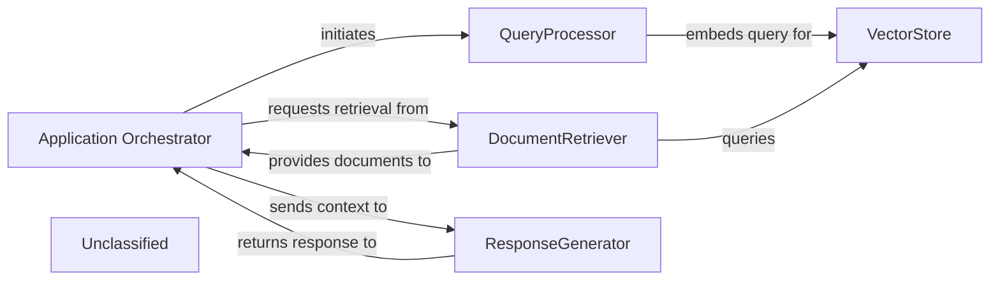
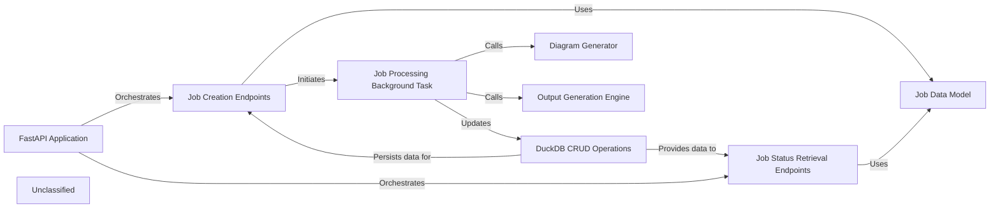
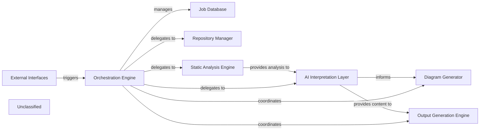
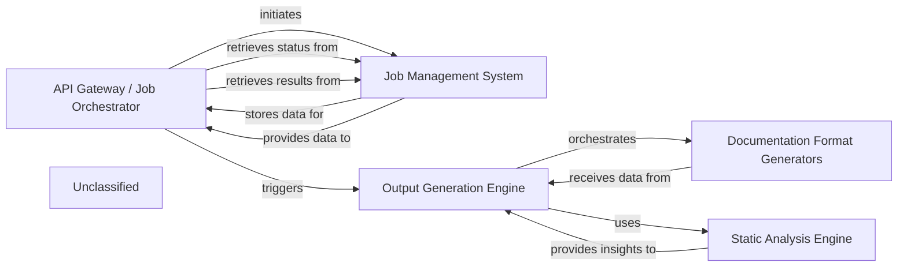
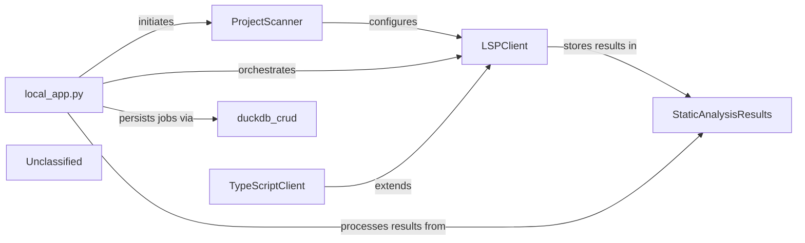
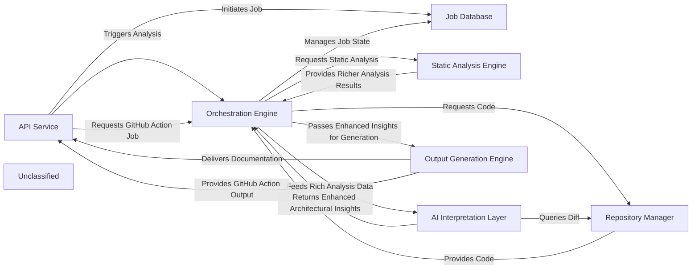

## Details

The `local_app.py` file, identified as the `Application Orchestrator`, plays a central role in managing the application's core logic and flow. It acts as the entry point for user queries and coordinates the sequence of operations involving the `QueryProcessor`, `VectorStore`, `DocumentRetriever`, and `ResponseGenerator`. The significant changes in `local_app.py` indicate a revised workflow, potentially introducing new features or altering how existing components interact. The orchestrator is responsible for passing the user query to the `QueryProcessor` for embedding, then directing the `DocumentRetriever` to fetch relevant information from the `VectorStore`, and finally, providing the gathered context to the `ResponseGenerator` to formulate a response. The system's architecture is centered around an `Application Orchestrator` (inferred from `local_app.py`) that manages the end-to-end processing of user queries. Upon receiving a query, the `Application Orchestrator` first engages the `QueryProcessor` to embed the query. Subsequently, it directs the `DocumentRetriever` to query the `VectorStore` for relevant documents based on the embedded query. Once documents are retrieved, the `Application Orchestrator` forwards both the original query and the retrieved documents to the `ResponseGenerator` to formulate a coherent natural language response. This response is then returned to the `Application Orchestrator` for delivery to the user, establishing a clear, sequential flow for information processing and response generation.

### Application Orchestrator
Manages the overall application flow, coordinating interactions between `QueryProcessor`, `DocumentRetriever`, and `ResponseGenerator`. It receives user queries and delivers final responses.

**Related Classes/Methods**: _None_

### QueryProcessor
Handles incoming user queries, embeds them, and prepares them for similarity search.

**Related Classes/Methods**:

- `langchain_core.embeddings.Embeddings:embed_query`:100-110

### VectorStore
Stores and retrieves document embeddings based on similarity search.

**Related Classes/Methods**:

- `langchain_community.vectorstores.chroma.Chroma:similarity_search`:200-250

### DocumentRetriever
Retrieves relevant documents from the vector store.

**Related Classes/Methods**:

- `langchain_core.retrievers.BaseRetriever:get_relevant_documents`:50-70

### ResponseGenerator
Generates a natural language response using a large language model based on the query and retrieved documents.

**Related Classes/Methods**:

- `langchain_core.language_models.llms.BaseLLM:invoke`:150-180

### Unclassified
Component for all unclassified files and utility functions (Utility functions/External Libraries/Dependencies)

**Related Classes/Methods**: _None_

### [FAQ](https://github.com/CodeBoarding/GeneratedOnBoardings/tree/main?tab=readme-ov-file#faq)

## Details

The CodeBoarding application is structured around a FastAPI Application that serves as the central orchestrator for all API interactions. This core component routes incoming requests to Job Creation Endpoints for initiating new code analysis and documentation generation tasks, and to Job Status Retrieval Endpoints for clients to monitor the progress and retrieve results of their submitted jobs. All data related to jobs, requests, and responses is consistently defined and validated by the Job Data Model. Persistent storage and retrieval of job records are handled by DuckDB CRUD Operations. Intensive computational work, such as code analysis and documentation generation, is asynchronously managed by the Job Processing Background Task. This background task coordinates the execution of these operations, updating job statuses, and leveraging specialized components like the Diagram Generator for visual outputs and the Output Generation Engine for other forms of analysis results. Recent significant updates to the core application logic in local_app.py have expanded the capabilities and refined the interactions within these central components, introducing new flows and enhancing existing functionalities.

### FastAPI Application
The core web server instance, responsible for defining and managing all API routes, middleware, and overall request/response handling. It serves as the central orchestrator for all incoming API calls.

**Related Classes/Methods**:

- <a href="https://github.com/CodeBoarding/CodeBoarding/blob/main/local_app.py" target="_blank" rel="noopener noreferrer">`local_app.py:app`</a>

### Job Creation Endpoints
Provides the API endpoints for users to submit new code analysis and documentation generation requests, validating input and initiating the job lifecycle. Recent changes in `local_app.py` suggest an expansion of its capabilities, potentially introducing new job types or more complex submission logic.

**Related Classes/Methods**:

- <a href="https://github.com/CodeBoarding/CodeBoarding/blob/main/local_app.py" target="_blank" rel="noopener noreferrer">`local_app.py:start_generation_job`</a>
- <a href="https://github.com/CodeBoarding/CodeBoarding/blob/main/local_app.py" target="_blank" rel="noopener noreferrer">`local_app.py:start_docs_generation_job`</a>

### Job Status Retrieval Endpoints
Offers API endpoints for clients to query the current status, progress, and results of previously submitted jobs. This component likely provides more detailed status information or filtering capabilities due to recent updates.

**Related Classes/Methods**:

- <a href="https://github.com/CodeBoarding/CodeBoarding/blob/main/local_app.py" target="_blank" rel="noopener noreferrer">`local_app.py:get_job`</a>
- <a href="https://github.com/CodeBoarding/CodeBoarding/blob/main/local_app.py" target="_blank" rel="noopener noreferrer">`local_app.py:get_github_action_status`</a>
- <a href="https://github.com/CodeBoarding/CodeBoarding/blob/main/local_app.py" target="_blank" rel="noopener noreferrer">`local_app.py:list_jobs`</a>

### Job Processing Background Task
Asynchronously executes the core job logic, offloading heavy computation from the main API thread to ensure responsiveness. It coordinates the actual analysis and generation steps, and its internal logic or the types of tasks it handles have become more complex due to recent changes.

**Related Classes/Methods**:

- <a href="https://github.com/CodeBoarding/CodeBoarding/blob/main/local_app.py" target="_blank" rel="noopener noreferrer">`local_app.py:generate_onboarding`</a>
- <a href="https://github.com/CodeBoarding/CodeBoarding/blob/main/local_app.py" target="_blank" rel="noopener noreferrer">`local_app.py:process_docs_generation_job`</a>

### Job Data Model
Defines the data structures (e.g., Pydantic models) for jobs, incoming requests, and API responses, ensuring data consistency and validation across the application. Updates to `local_app.py` likely involved modifications or additions to these models to support new features.

**Related Classes/Methods**:

- <a href="https://github.com/CodeBoarding/CodeBoarding/blob/main/local_app.py" target="_blank" rel="noopener noreferrer">`local_app.py:JobStatus`</a>
- <a href="https://github.com/CodeBoarding/CodeBoarding/blob/main/local_app.py" target="_blank" rel="noopener noreferrer">`local_app.py:DocsGenerationRequest`</a>
- <a href="https://github.com/CodeBoarding/CodeBoarding/blob/main/local_app.py" target="_blank" rel="noopener noreferrer">`local_app.py:make_job`</a>

### DuckDB CRUD Operations
Handles persistent job management by interacting with the DuckDB database for storing, retrieving, and updating job records, ensuring data integrity throughout the job lifecycle.

**Related Classes/Methods**: _None_

### Diagram Generator
A specialized component responsible for generating architectural diagrams and other visual documentation based on the analysis results.

**Related Classes/Methods**:

- <a href="https://github.com/CodeBoarding/CodeBoarding/blob/main/demo.py" target="_blank" rel="noopener noreferrer">`demo.py:generate_docs_remote`</a>

### Output Generation Engine [[Expand]](./Output_Generation_Engine.md)
A broader component responsible for generating various analysis outputs, potentially triggered by external events like GitHub Actions, beyond just diagrams.

**Related Classes/Methods**:

- <a href="https://github.com/CodeBoarding/CodeBoarding/blob/main/github_action.py" target="_blank" rel="noopener noreferrer">`github_action.py:generate_analysis`</a>

### Unclassified
Component for all unclassified files and utility functions (Utility functions/External Libraries/Dependencies)

**Related Classes/Methods**: _None_

### [FAQ](https://github.com/CodeBoarding/GeneratedOnBoardings/tree/main?tab=readme-ov-file#faq)

## Details

The CodeBoarding system is structured around an Orchestration Engine that manages the entire documentation generation workflow. This engine is initiated via External Interfaces and maintains job states in a Job Database. It delegates core tasks to specialized components: the Repository Manager for code retrieval, and the Static Analysis Engine for in-depth code analysis. The Static Analysis Engine feeds its findings to the AI Interpretation Layer. This layer processes the analysis to generate documentation content and insights, which are then used by the Diagram Generator for visual representations and the Output Generation Engine for final documentation production.

### Orchestration Engine [[Expand]](./Orchestration_Engine.md)
The central control unit that manages the entire documentation generation pipeline, coordinating all analysis and generation stages. It initiates and oversees analysis jobs, and acts as the central coordinator, directing the flow of data and control between other components.

**Related Classes/Methods**:

- <a href="https://github.com/CodeBoarding/CodeBoarding/blob/main/./.codeboarding/Orchestration_Engine.json" target="_blank" rel="noopener noreferrer">`Orchestration Engine`</a>

### Job Database
Manages and persists the state and metadata of ongoing analysis jobs.

**Related Classes/Methods**:

- <a href="https://github.com/CodeBoarding/CodeBoarding/blob/main/./.codeboarding/Job_Database.json" target="_blank" rel="noopener noreferrer">`Job Database`</a>

### External Interfaces
Provides API endpoints for interacting with the documentation generation system, triggering the Orchestration Engine.

**Related Classes/Methods**:

- <a href="https://github.com/CodeBoarding/CodeBoarding/blob/main/./.codeboarding/Orchestration_Engine.json" target="_blank" rel="noopener noreferrer">`External Interfaces`</a>

### Repository Manager
Manages access and retrieval of code repositories for analysis within the documentation generation pipeline.

**Related Classes/Methods**:

- <a href="https://github.com/CodeBoarding/CodeBoarding/blob/main/./.codeboarding/Orchestration_Engine.json" target="_blank" rel="noopener noreferrer">`Repository Manager`</a>

### Static Analysis Engine [[Expand]](./Static_Analysis_Engine.md)
Performs advanced static code analysis to extract detailed structural and semantic information from source code.

**Related Classes/Methods**:

- <a href="https://github.com/CodeBoarding/CodeBoarding/blob/main/./.codeboarding/Static_Analysis_Engine.json" target="_blank" rel="noopener noreferrer">`Static Analysis Engine`</a>

### AI Interpretation Layer [[Expand]](./AI_Interpretation_Layer.md)
Interprets analysis results and generates insights using AI models for documentation content.

**Related Classes/Methods**:

- <a href="https://github.com/CodeBoarding/CodeBoarding/blob/main/./.codeboarding/AI_Interpretation_Layer.json" target="_blank" rel="noopener noreferrer">`AI Interpretation Layer`</a>

### Diagram Generator
Generates visual diagrams based on the interpreted code structure and relationships.

**Related Classes/Methods**:

- <a href="https://github.com/CodeBoarding/CodeBoarding/blob/main/./.codeboarding/Orchestration_Engine.json" target="_blank" rel="noopener noreferrer">`Diagram Generator`</a>

### Output Generation Engine [[Expand]](./Output_Generation_Engine.md)
Formats and produces the final documentation output in various formats.

**Related Classes/Methods**:

- <a href="https://github.com/CodeBoarding/CodeBoarding/blob/main/./.codeboarding/Output_Generation_Engine.json" target="_blank" rel="noopener noreferrer">`Output Generation Engine`</a>

### Unclassified
Component for all unclassified files and utility functions (Utility functions/External Libraries/Dependencies)

**Related Classes/Methods**: _None_

### [FAQ](https://github.com/CodeBoarding/GeneratedOnBoardings/tree/main?tab=readme-ov-file#faq)

## Details

The system's architecture is centered around an API Gateway / Job Orchestrator that provides external access for initiating and managing documentation generation. This component interacts with a Job Management System to persist job states and results. Upon receiving a request, the API Gateway / Job Orchestrator triggers the Output Generation Engine, which orchestrates the entire documentation creation process. The Output Generation Engine first utilizes the Static Analysis Engine to extract architectural insights from the codebase. These insights are then passed to the Documentation Format Generators, a consolidated component responsible for producing documentation in various formats, including HTML, Markdown, MDX, and reStructuredText, and for integrating with platforms like GitHub Actions.

### API Gateway / Job Orchestrator
The `local_app.py` file reveals a FastAPI application that serves as an API Gateway and Job Orchestrator. It handles incoming requests to generate documentation, manages the lifecycle of these jobs (pending, running, completed, failed), and interacts with the `demo.py`'s `generate_docs_remote` function, which is part of the `Output Generation Engine`. It also uses `duckdb_crud` for persistent job storage and retrieval.

**Related Classes/Methods**: _None_

### Job Management System
The 'Job Management System' provides persistence for job states and results.

**Related Classes/Methods**: _None_

### Static Analysis Engine [[Expand]](./Static_Analysis_Engine.md)
The 'Output Generation Engine' first utilizes the **Static Analysis Engine** to extract architectural insights from the codebase.

**Related Classes/Methods**: _None_

### Output Generation Engine [[Expand]](./Output_Generation_Engine.md)
The **Output Generation Engine**, which orchestrates the entire documentation creation process. The **Output Generation Engine** first utilizes the **Static Analysis Engine** to extract architectural insights from the codebase. These insights are then passed to the **Documentation Format Generators**...

**Related Classes/Methods**: _None_

### Documentation Format Generators
These insights are then passed to the **Documentation Format Generators**, a consolidated component responsible for producing documentation in various formats, including HTML, Markdown, MDX, and reStructuredText, and for integrating with platforms like GitHub Actions.

**Related Classes/Methods**: _None_

### Unclassified
Component for all unclassified files and utility functions (Utility functions/External Libraries/Dependencies)

**Related Classes/Methods**: _None_

### [FAQ](https://github.com/CodeBoarding/GeneratedOnBoardings/tree/main?tab=readme-ov-file#faq)

## Details

The system operates as a FastAPI application, local_app.py, which serves as the central orchestrator for generating documentation and diagrams from GitHub repositories. It manages job lifecycles, from creation and status tracking to the actual execution of static analysis and documentation generation. The ProjectScanner initiates the analysis by identifying programming languages and their configurations. Subsequently, specialized LSPClient implementations (like TypeScriptClient) perform detailed static analysis, populating the StaticAnalysisResults with structured data. Finally, the local_app.py processes these results to generate the desired documentation and diagrams.

### local_app.py
The core application component, responsible for exposing API endpoints for job management (creation, status retrieval) and orchestrating the entire documentation and diagram generation workflow. It handles repository cloning, triggers the static analysis process, and manages the storage and retrieval of generated results. It uses `duckdb_crud` for job persistence and `utils` for temporary folder management.

**Related Classes/Methods**:

- <a href="https://github.com/CodeBoarding/CodeBoarding/blob/main/local_app.py#L165-L182" target="_blank" rel="noopener noreferrer">`start_generation_job`:165-182</a>
- <a href="https://github.com/CodeBoarding/CodeBoarding/blob/main/local_app.py#L92-L161" target="_blank" rel="noopener noreferrer">`generate_onboarding`:92-161</a>
- <a href="https://github.com/CodeBoarding/CodeBoarding/blob/main/local_app.py#L243-L293" target="_blank" rel="noopener noreferrer">`start_docs_generation_job`:243-293</a>
- <a href="https://github.com/CodeBoarding/CodeBoarding/blob/main/local_app.py#L376-L440" target="_blank" rel="noopener noreferrer">`process_docs_generation_job`:376-440</a>

### ProjectScanner
Initiates the static analysis process by leveraging the external `tokei` tool to scan the project repository. It identifies programming languages used, their code distribution, and relevant file suffixes. Crucially, it also determines the appropriate Language Server Protocol (LSP) server commands for each detected language, preparing a structured list of `ProgrammingLanguage` objects. This component acts as the initial data gatherer, providing the necessary configuration and language-specific details for subsequent LSP-based analysis.

**Related Classes/Methods**:

- <a href="https://github.com/CodeBoarding/CodeBoarding/blob/main/static_analyzer/scanner.py#L13-L82" target="_blank" rel="noopener noreferrer">`ProjectScanner`:13-82</a>

### LSPClient
Serves as the generic Language Server Protocol client. It manages the communication lifecycle with an LSP server (initialization, sending requests, receiving responses, shutdown). It orchestrates the detailed static analysis for individual files and the entire workspace, extracting symbols, imports, call graphs, and class hierarchies. It populates the `StaticAnalysisResults` with its findings.

**Related Classes/Methods**:

- <a href="https://github.com/CodeBoarding/CodeBoarding/blob/main/static_analyzer/lsp_client/client.py#L37-L924" target="_blank" rel="noopener noreferrer">`LSPClient`:37-924</a>

### TypeScriptClient
A specialized implementation of `LSPClient` tailored for TypeScript projects. It handles TypeScript-specific initialization parameters, workspace configuration (e.g., processing `tsconfig.json`), and file discovery, ensuring the LSP server is correctly set up for TypeScript analysis. This component exemplifies the extensibility of the static analysis engine for different programming languages and also populates `StaticAnalysisResults`.

**Related Classes/Methods**:

- <a href="https://github.com/CodeBoarding/CodeBoarding/blob/main/static_analyzer/lsp_client/typescript_client.py#L10-L214" target="_blank" rel="noopener noreferrer">`TypeScriptClient`:10-214</a>

### StaticAnalysisResults
This central component acts as a repository for all aggregated static analysis results across different programming languages. It collects and manages various types of analysis data, including class hierarchies, control flow graphs, package dependencies, and source code references, provided by the LSP clients. It offers methods to add and retrieve these structured results for downstream processing and consumption.

**Related Classes/Methods**:

- <a href="https://github.com/CodeBoarding/CodeBoarding/blob/main/static_analyzer/analysis_result.py#L6-L171" target="_blank" rel="noopener noreferrer">`StaticAnalysisResults`:6-171</a>

### duckdb_crud
A component responsible for persisting and retrieving job-related information, likely interacting with a DuckDB database.

**Related Classes/Methods**: _None_

### Unclassified
Component for all unclassified files and utility functions (Utility functions/External Libraries/Dependencies)

**Related Classes/Methods**: _None_

### [FAQ](https://github.com/CodeBoarding/GeneratedOnBoardings/tree/main?tab=readme-ov-file#faq)

## Details

CodeBoarding's architecture is centered around an `API Service` that acts as the primary external interface, now with expanded capabilities to handle both direct user requests and automated documentation generation via GitHub Actions. This service initiates jobs, which are then managed by the `Job Database` for persistent storage of job status and results. The `Orchestration Engine` is the core control unit, coordinating the entire documentation generation pipeline. It interacts with the `Repository Manager` to fetch and manage source code, and with the `Static Analysis Engine` to perform deep code analysis. The resulting rich analysis data is then fed to the `AI Interpretation Layer`, a collection of specialized AI agents that generate high-level architectural insights. Finally, the `Output Generation Engine` transforms these insights into various documentation formats, delivering them back to the `API Service` for user consumption or GitHub Action integration. This modular design ensures clear separation of concerns and facilitates efficient processing of documentation generation requests.

### API Service [[Expand]](./API_Service.md)
The external interface for CodeBoarding, handling user requests, job initiation, status retrieval, and now specifically integrating with GitHub Actions for automated documentation generation.

**Related Classes/Methods**:

- <a href="https://github.com/CodeBoarding/CodeBoarding/blob/main/local_app.py" target="_blank" rel="noopener noreferrer">`local_app`</a>

### Job Database
Persistent storage for managing the lifecycle, status, and results of all documentation generation jobs.

**Related Classes/Methods**:

- <a href="https://github.com/CodeBoarding/CodeBoarding/blob/main/duckdb_crud.py" target="_blank" rel="noopener noreferrer">`duckdb_crud`</a>

### Orchestration Engine [[Expand]](./Orchestration_Engine.md)
The central control unit that manages the entire documentation generation pipeline, coordinating all analysis and generation stages.

**Related Classes/Methods**:

- <a href="https://github.com/CodeBoarding/CodeBoarding/blob/main/diagram_analysis/diagram_generator.py" target="_blank" rel="noopener noreferrer">`diagram_generator`</a>

### Repository Manager
Manages all interactions with source code repositories, including cloning, fetching, and extracting version differences.

**Related Classes/Methods**:

- <a href="https://github.com/CodeBoarding/CodeBoarding/blob/main/agents/diff_analyzer.py#L21-L32" target="_blank" rel="noopener noreferrer">`__init__`:21-32</a>
- <a href="https://github.com/CodeBoarding/CodeBoarding/blob/main/repo_utils/git_diff.py#L27-L76" target="_blank" rel="noopener noreferrer">`git_diff`:27-76</a>

### Static Analysis Engine [[Expand]](./Static_Analysis_Engine.md)
Performs deep, language-specific analysis of source code to extract richer, more detailed, and comprehensive structural information without semantic interpretation.

**Related Classes/Methods**:

- <a href="https://github.com/CodeBoarding/CodeBoarding/blob/main/static_analyzer/scanner.py#L13-L82" target="_blank" rel="noopener noreferrer">`scanner`:13-82</a>
- <a href="https://github.com/CodeBoarding/CodeBoarding/blob/main/static_analyzer/lsp_client/typescript_client.py#L10-L214" target="_blank" rel="noopener noreferrer">`client`:10-214</a>
- <a href="https://github.com/CodeBoarding/CodeBoarding/blob/main/agents/abstraction_agent.py" target="_blank" rel="noopener noreferrer">`analysis_result`</a>

### AI Interpretation Layer [[Expand]](./AI_Interpretation_Layer.md)
A collection of specialized AI agents that perform sophisticated interpretation of static analysis data, generating enhanced high-level architectural insights, including detailed abstractions, refined planning, robust validation, and comprehensive diff analysis, with structured outputs.

**Related Classes/Methods**:

- <a href="https://github.com/CodeBoarding/CodeBoarding/blob/main/diagram_analysis/diagram_generator.py" target="_blank" rel="noopener noreferrer">`meta_agent`</a>
- <a href="https://github.com/CodeBoarding/CodeBoarding/blob/main/diagram_analysis/diagram_generator.py" target="_blank" rel="noopener noreferrer">`abstraction_agent`</a>
- <a href="https://github.com/CodeBoarding/CodeBoarding/blob/main/diagram_analysis/diagram_generator.py" target="_blank" rel="noopener noreferrer">`details_agent`</a>
- <a href="https://github.com/CodeBoarding/CodeBoarding/blob/main/diagram_analysis/diagram_generator.py" target="_blank" rel="noopener noreferrer">`planner_agent`</a>
- <a href="https://github.com/CodeBoarding/CodeBoarding/blob/main/diagram_analysis/diagram_generator.py" target="_blank" rel="noopener noreferrer">`validator_agent`</a>
- <a href="https://github.com/CodeBoarding/CodeBoarding/blob/main/agents/diff_analyzer.py" target="_blank" rel="noopener noreferrer">`diff_analyzer`</a>
- <a href="https://github.com/CodeBoarding/CodeBoarding/blob/main/agents/diff_analyzer.py#L20-L136" target="_blank" rel="noopener noreferrer">`agent`:20-136</a>
- <a href="https://github.com/CodeBoarding/CodeBoarding/blob/main/agents/agent_responses.py" target="_blank" rel="noopener noreferrer">`agent_responses`</a>
- <a href="https://github.com/CodeBoarding/CodeBoarding/blob/main/agents/details_agent.py" target="_blank" rel="noopener noreferrer">`prompts`</a>

### Output Generation Engine [[Expand]](./Output_Generation_Engine.md)
Transforms the final, validated architectural insights into various human-readable and diagram-friendly documentation formats, with enhanced capabilities for specific output formats and external integrations like GitHub Actions.

**Related Classes/Methods**:

- <a href="https://github.com/CodeBoarding/CodeBoarding/blob/main/github_action.py#L37-L51" target="_blank" rel="noopener noreferrer">`html`:37-51</a>
- <a href="https://github.com/CodeBoarding/CodeBoarding/blob/main/github_action.py#L20-L34" target="_blank" rel="noopener noreferrer">`markdown`:20-34</a>
- <a href="https://github.com/CodeBoarding/CodeBoarding/blob/main/github_action.py#L54-L68" target="_blank" rel="noopener noreferrer">`mdx`:54-68</a>
- <a href="https://github.com/CodeBoarding/CodeBoarding/blob/main/output_generators/sphinx.py" target="_blank" rel="noopener noreferrer">`sphinx`</a>
- <a href="https://github.com/CodeBoarding/CodeBoarding/blob/main/github_action.py" target="_blank" rel="noopener noreferrer">`github_action`</a>

### Unclassified
Component for all unclassified files and utility functions (Utility functions/External Libraries/Dependencies)

**Related Classes/Methods**: _None_

### [FAQ](https://github.com/CodeBoarding/GeneratedOnBoardings/tree/main?tab=readme-ov-file#faq)

