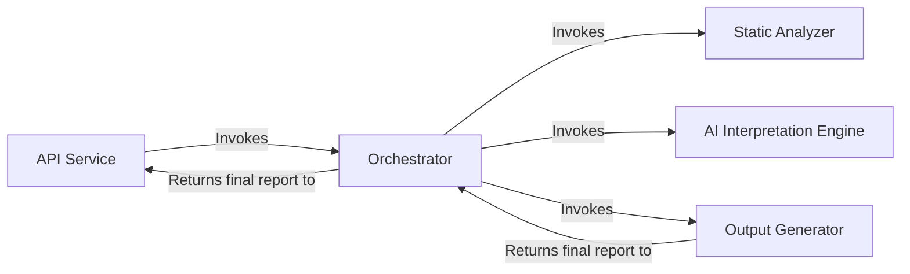
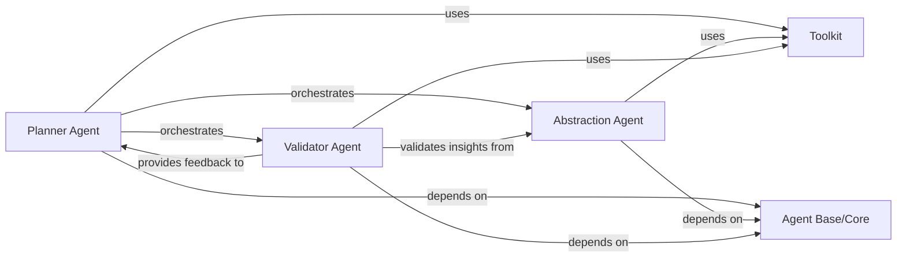
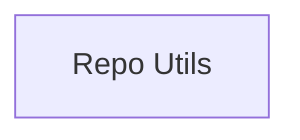
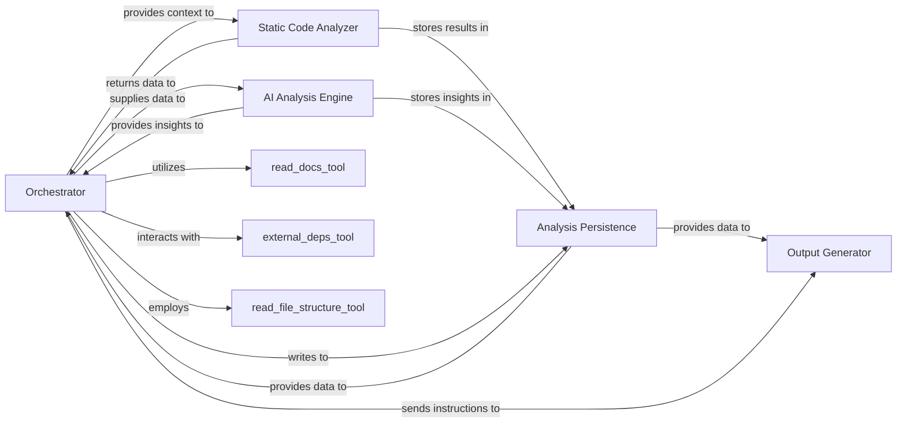
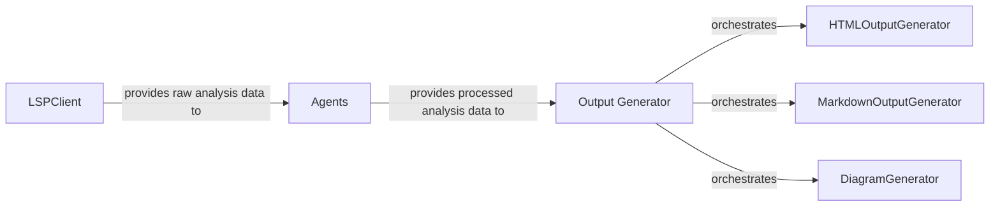
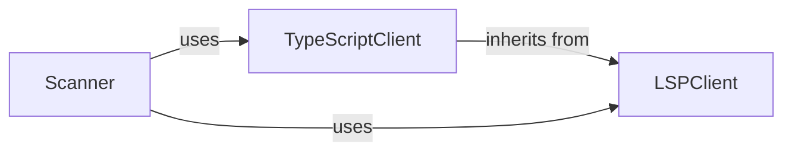

## Details

The system operates by receiving requests through its API Service, which then delegates the analysis process to the Orchestrator. The Orchestrator coordinates the entire workflow, first invoking the Static Analyzer to gather foundational code data through language-aware static analysis. This data is then passed to the AI Interpretation Engine, where specialized AI agents process and interpret it to generate high-level architectural insights. Finally, the Output Generator transforms these insights into human-readable reports, which then returned through the Orchestrator back to the API Service.

### API Service [[Expand]](./API_Service.md)
Serves as the primary entry point for all external interactions. It exposes the system's capabilities, handling incoming requests and returning the final generated analysis.

**Related Classes/Methods**:

- <a href="https://github.com/CodeBoarding/CodeBoarding/blob/main/local_app.py" target="_blank" rel="noopener noreferrer">`local_app.py`</a>
- <a href="https://github.com/CodeBoarding/CodeBoarding/blob/main/github_action.py" target="_blank" rel="noopener noreferrer">`github_action.py`</a>

### Orchestrator [[Expand]](./Orchestrator.md)
Acts as the central coordinator of the analysis pipeline. It manages the sequence of operations, directing the flow of data between the various components to ensure the end-to-end process runs smoothly.

**Related Classes/Methods**:

- <a href="https://github.com/CodeBoarding/CodeBoarding/blob/main/agents/meta_agent.py" target="_blank" rel="noopener noreferrer">`agents/meta_agent.py`</a>

### Static Analyzer [[Expand]](./Static_Analyzer.md)
Performs language-aware static analysis of the source code. It builds foundational data structures, including call graphs and package dependencies, which form the basis for the AI interpretation. Significant internal refactoring of its Language Server Protocol (LSP) client has likely led to improved efficiency, stability, or expanded capabilities in how static analysis data is collected.

**Related Classes/Methods**:

- <a href="https://github.com/CodeBoarding/CodeBoarding/blob/main/static_analyzer/scanner.py" target="_blank" rel="noopener noreferrer">`static_analyzer/scanner.py`</a>
- <a href="https://github.com/CodeBoarding/CodeBoarding/blob/main/static_analyzer/lsp_client/" target="_blank" rel="noopener noreferrer">`static_analyzer/lsp_client/`</a>

### AI Interpretation Engine [[Expand]](./AI_Interpretation_Engine.md)
A suite of specialized AI agents responsible for interpreting the static analysis data. It uses a planner, abstraction, and validator agents, along with a toolkit for reading code artifacts, to generate high-level architectural insights. Recent updates to the prompts used by these AI agents suggest a refinement, expansion, or introduction of new instructions and contexts, potentially leading to more nuanced, accurate, or comprehensive architectural insights.

**Related Classes/Methods**:

- <a href="https://github.com/CodeBoarding/CodeBoarding/blob/main/agents/planner_agent.py" target="_blank" rel="noopener noreferrer">`agents/planner_agent.py`</a>
- <a href="https://github.com/CodeBoarding/CodeBoarding/blob/main/agents/abstraction_agent.py" target="_blank" rel="noopener noreferrer">`agents/abstraction_agent.py`</a>
- <a href="https://github.com/CodeBoarding/CodeBoarding/blob/main/agents/validator_agent.py" target="_blank" rel="noopener noreferrer">`agents/validator_agent.py`</a>
- <a href="https://github.com/CodeBoarding/CodeBoarding/blob/main/agents/tools/" target="_blank" rel="noopener noreferrer">`agents/tools/`</a>
- <a href="https://github.com/CodeBoarding/CodeBoarding/blob/main/agents/agent.py" target="_blank" rel="noopener noreferrer">`agents/agent.py`</a>

### Output Generator [[Expand]](./Output_Generator.md)
Responsible for converting the final, validated analysis from the AI engine into human-readable formats. It serializes the analysis data and renders it as diagrams and text.

**Related Classes/Methods**:

- <a href="https://github.com/CodeBoarding/CodeBoarding/blob/main/output_generators/html.py" target="_blank" rel="noopener noreferrer">`output_generators/html.py`</a>
- <a href="https://github.com/CodeBoarding/CodeBoarding/blob/main/output_generators/markdown.py" target="_blank" rel="noopener noreferrer">`output_generators/markdown.py`</a>
- <a href="https://github.com/CodeBoarding/CodeBoarding/blob/main/diagram_analysis/diagram_generator.py" target="_blank" rel="noopener noreferrer">`diagram_analysis/diagram_generator.py`</a>

### [FAQ](https://github.com/CodeBoarding/GeneratedOnBoardings/tree/main?tab=readme-ov-file#faq)

## Details

The system operates with a clear division of labor among its core AI agents. The `Planner Agent` initiates the process, strategically determining the necessary steps and information required for architectural interpretation. It orchestrates the activities of the `Abstraction Agent`, which is responsible for transforming raw code data into high-level architectural insights, and the `Validator Agent`, which ensures the accuracy and consistency of these insights. All agents leverage the `Agent Base/Core` component for fundamental functionalities and shared utilities, promoting a cohesive and extensible design. The `Toolkit` serves as the agents' primary interface to the codebase, providing a comprehensive set of specialized tools for data retrieval, including source code, file structures, and control flow graphs, enabling informed decision-making and analysis throughout the architectural interpretation workflow.

### Planner Agent
This component acts as the strategic orchestrator of the entire architectural interpretation process. It determines the sequence of operations, decides which information to gather using the Toolkit, and coordinates the activities of the Abstraction and Validator Agents. Its centrality lies in guiding the overall strategy for generating architectural insights, making it the control hub of the AI interpretation workflow.

**Related Classes/Methods**:

- <a href="https://github.com/CodeBoarding/CodeBoarding/blob/main/diagram_analysis/diagram_generator.py" target="_blank" rel="noopener noreferrer">`planner_agent`</a>

### Abstraction Agent
The Abstraction Agent is responsible for synthesizing raw static analysis data and other code artifacts into high-level architectural abstractions, patterns, and insights. This component is crucial for transforming granular code details into meaningful architectural representations, embodying the core "interpretation" aspect of the engine. Its importance stems from its role in generating the primary architectural output.

**Related Classes/Methods**:

- <a href="https://github.com/CodeBoarding/CodeBoarding/blob/main/diagram_analysis/diagram_generator.py" target="_blank" rel="noopener noreferrer">`abstraction_agent`</a>

### Validator Agent
This component ensures the quality, accuracy, and consistency of the architectural insights produced by the Abstraction Agent. It performs checks and validations against the original code context and established architectural principles to refine and confirm the generated output. The Validator Agent is central for maintaining the integrity and reliability of the system's output, crucial for a developer tool where accuracy is paramount.

**Related Classes/Methods**:

- <a href="https://github.com/CodeBoarding/CodeBoarding/blob/main/diagram_analysis/diagram_generator.py" target="_blank" rel="noopener noreferrer">`validator_agent`</a>

### Agent Base/Core
The Agent Base/Core provides foundational functionalities, common interfaces, and shared utilities that are leveraged by all specialized agents (Planner, Abstraction, Validator). This component promotes code reusability, consistency, and simplifies the development of new agents. It is central as it establishes the common architectural pattern and infrastructure for all AI agents within the subsystem, ensuring a cohesive and extensible design.

**Related Classes/Methods**:

- <a href="https://github.com/CodeBoarding/CodeBoarding/blob/main/agents/diff_analyzer.py#L20-L136" target="_blank" rel="noopener noreferrer">`agent`:20-136</a>

### Toolkit
The Toolkit is a comprehensive suite of specialized tools that enable the AI agents to interact with the codebase and retrieve specific types of information. This includes reading source code, file structures, external dependencies, package relationships, Control Flow Graphs (CFG), method invocations, Git diffs, raw file content, code structure (class hierarchies), and documentation. The Toolkit is central because it acts as the agents' "eyes and ears" into the project, providing all the necessary data access for informed decision-making and analysis.

**Related Classes/Methods**:

- <a href="https://github.com/CodeBoarding/CodeBoarding/blob/main/agents/diff_analyzer.py#L21-L32" target="_blank" rel="noopener noreferrer">`__init__`:21-32</a>
- <a href="https://github.com/CodeBoarding/CodeBoarding/blob/main/agents/tools/read_source.py#L23-L97" target="_blank" rel="noopener noreferrer">`code_reference_reader`:23-97</a>
- <a href="https://github.com/CodeBoarding/CodeBoarding/blob/main/agents/tools/read_file_structure.py#L22-L175" target="_blank" rel="noopener noreferrer">`file_structure_tool`:22-175</a>
- <a href="https://github.com/CodeBoarding/CodeBoarding/blob/main/agents/agent.py" target="_blank" rel="noopener noreferrer">`external_deps_tool`</a>
- <a href="https://github.com/CodeBoarding/CodeBoarding/blob/main/agents/tools/read_packages.py#L29-L65" target="_blank" rel="noopener noreferrer">`package_relations_tool`:29-65</a>
- <a href="https://github.com/CodeBoarding/CodeBoarding/blob/main/agents/tools/read_cfg.py#L12-L67" target="_blank" rel="noopener noreferrer">`get_cfg_tool`:12-67</a>
- <a href="https://github.com/CodeBoarding/CodeBoarding/blob/main/agents/agent.py" target="_blank" rel="noopener noreferrer">`method_invocations_tool`</a>
- <a href="https://github.com/CodeBoarding/CodeBoarding/blob/main/agents/diff_analyzer.py" target="_blank" rel="noopener noreferrer">`read_diff_tool`</a>
- <a href="https://github.com/CodeBoarding/CodeBoarding/blob/main/agents/agent.py" target="_blank" rel="noopener noreferrer">`read_file_tool`</a>
- <a href="https://github.com/CodeBoarding/CodeBoarding/blob/main/agents/tools/read_structure.py#L19-L54" target="_blank" rel="noopener noreferrer">`code_structure_tool`:19-54</a>
- <a href="https://github.com/CodeBoarding/CodeBoarding/blob/main/agents/tools/read_docs.py#L19-L145" target="_blank" rel="noopener noreferrer">`read_docs_tool`:19-145</a>

### [FAQ](https://github.com/CodeBoarding/GeneratedOnBoardings/tree/main?tab=readme-ov-file#faq)

## Details

One paragraph explaining the functionality which is represented by this graph. What the main flow is and what is its purpose.

### Repo Utils
Manages temporary repositories for code analysis.

**Related Classes/Methods**:

### [FAQ](https://github.com/CodeBoarding/GeneratedOnBoardings/tree/main?tab=readme-ov-file#faq)

## Details

The `CodeBoarding` project operates as an automated software architecture analysis system. The `Orchestrator` serves as the central control unit, initiating the analysis process by leveraging its `MetaAgent` to gather initial project metadata and establish architectural context. This context, along with raw code, is then fed to the `Static Code Analyzer`, which performs in-depth code analysis, extracting structural information and building essential data structures like call graphs. The results from the static analysis are then passed to the `AI Analysis Engine`, which, powered by sophisticated prompt engineering, interprets these findings and generates high-level architectural insights. All intermediate and final analysis data are diligently stored and managed by the `Analysis Persistence` component, ensuring data integrity and historical traceability. Finally, the `Output Generator` takes the processed analysis data and renders it into various user-friendly formats, including visual diagrams and comprehensive reports, making the complex architectural insights accessible to users. The `Orchestrator` also integrates with various tools like `read_docs`, `external_deps_tool`, and `read_file_structure` to enrich the analysis with external information.

### Orchestrator [[Expand]](./Orchestrator.md)
Acts as the central coordinator of the analysis pipeline. It manages the sequence of operations, directing the flow of data between the various components to ensure the end-to-end process runs smoothly. The `MetaAgent` within this component has a streamlined role in initial project metadata analysis, establishing architectural context, and guiding subsequent analysis steps.

**Related Classes/Methods**:

### Static Code Analyzer
Responsible for performing in-depth static analysis on the codebase. This involves efficiently parsing source code, building abstract syntax trees (ASTs), identifying code patterns, and extracting structural information without executing the code, leveraging its refactored LSP client for enhanced capabilities.

**Related Classes/Methods**:

### AI Analysis Engine
Integrates AI/LLM capabilities to interpret the results from the Static Code Analyzer and the architectural context provided by the Orchestrator. It generates high-level insights, identifies complex relationships, and provides explanations or suggestions based on the analyzed code, with its refined prompt system enabling more nuanced interpretations.

**Related Classes/Methods**:

### Analysis Persistence
Manages the storage, retrieval, and versioning of all analysis-related data, including raw static analysis outputs, AI-generated insights, project metadata, and configuration settings. This ensures data integrity and enables historical analysis.

**Related Classes/Methods**:

### Output Generator [[Expand]](./Output_Generator.md)
Transforms the processed analysis data into various user-friendly formats, including visual representations (e.g., Mermaid.js diagrams for architectural views) and structured reports. It is responsible for rendering the final output for user consumption.

**Related Classes/Methods**: _None_

### [FAQ](https://github.com/CodeBoarding/GeneratedOnBoardings/tree/main?tab=readme-ov-file#faq)

## Details

The system's architecture is centered around a data processing pipeline that transforms raw code information into various human-readable outputs. The LSPClient initiates this process by acquiring raw static analysis data from language servers. This raw data is then fed to the Agents component, which, guided by dynamic prompts defined in agents/prompts.py, performs intelligent analysis and transforms the raw data into structured, processed analysis results. Finally, the Output Generator acts as the presentation layer orchestrator, taking these processed analysis results and delegating their rendering to specialized sub-components: HTMLOutputGenerator for web-based views, MarkdownOutputGenerator for text-based documentation, and DiagramGenerator for visual representations like Mermaid diagrams. This modular design allows for flexible data acquisition, intelligent processing, and diverse output generation, adapting to changes in upstream data sources and downstream presentation requirements.

### LSPClient
Responsible for acquiring raw code data from Language Servers.

**Related Classes/Methods**:

- <a href="https://github.com/CodeBoarding/CodeBoarding/blob/main/static_analyzer/lsp_client/client.py#L19-L900" target="_blank" rel="noopener noreferrer">`LSPClient`:19-900</a>

### Agents
Processes raw analysis data into structured analysis results, guided by prompts.

**Related Classes/Methods**:

- <a href="https://github.com/CodeBoarding/CodeBoarding/blob/main/agents/prompts.py" target="_blank" rel="noopener noreferrer">`agents/prompts.py`</a>

### Output Generator [[Expand]](./Output_Generator.md)
Orchestrates the generation of various output formats from processed analysis data.

**Related Classes/Methods**: _None_

### HTMLOutputGenerator
Generates HTML output.

**Related Classes/Methods**: _None_

### MarkdownOutputGenerator
Generates Markdown output.

**Related Classes/Methods**: _None_

### DiagramGenerator
Generates diagrams.

**Related Classes/Methods**: _None_

### [FAQ](https://github.com/CodeBoarding/GeneratedOnBoardings/tree/main?tab=readme-ov-file#faq)

## Details

The `Static Analyzer` subsystem is primarily defined by the `static_analyzer/scanner.py` module and the `static_analyzer/lsp_client/` package. This encompasses the core logic for language-aware static analysis, including the Language Server Protocol (LSP) client implementations and the orchestration of the scanning process.

### LSPClient
This is the abstract foundation for all language-specific static analysis. It encapsulates the generic Language Server Protocol (LSP) communication, managing the lifecycle of an LSP connection (initialization, request/response handling, shutdown). It provides methods for sending various LSP requests (e.g., for document symbols, call hierarchies, class hierarchies, references, definitions) and processing the server's responses to extract raw code insights. It also handles file filtering and directory exclusion.

**Related Classes/Methods**:

- <a href="https://github.com/CodeBoarding/CodeBoarding/blob/main/static_analyzer/lsp_client/client.py#L19-L900" target="_blank" rel="noopener noreferrer">`LSPClient`:19-900</a>

### TypeScriptClient
A concrete implementation extending `LSPClient`, specifically tailored for TypeScript projects. It inherits the core LSP communication capabilities and adds TypeScript-specific logic for project initialization, configuration, and bootstrapping the TypeScript Language Server. This specialization ensures accurate and efficient analysis of TypeScript codebases by correctly setting up the language server environment.

**Related Classes/Methods**:

- <a href="https://github.com/CodeBoarding/CodeBoarding/blob/main/static_analyzer/lsp_client/typescript_client.py#L10-L214" target="_blank" rel="noopener noreferrer">`TypeScriptClient`:10-214</a>

### Scanner
This component acts as the orchestrator and entry point for initiating the static analysis process within the subsystem. It is responsible for selecting the appropriate `LSPClient` implementation (e.g., `TypeScriptClient` for TypeScript projects), configuring it with project-specific details, and invoking its methods to perform the actual code scanning, data collection, and potentially initial processing of the raw analysis results.

**Related Classes/Methods**:

- <a href="https://github.com/CodeBoarding/CodeBoarding/blob/main/static_analyzer/scanner.py#L13-L66" target="_blank" rel="noopener noreferrer">`Scanner`:13-66</a>

### [FAQ](https://github.com/CodeBoarding/GeneratedOnBoardings/tree/main?tab=readme-ov-file#faq)

