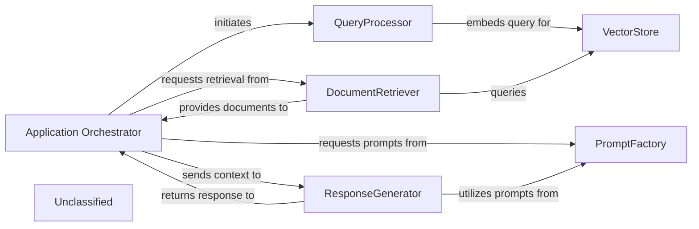
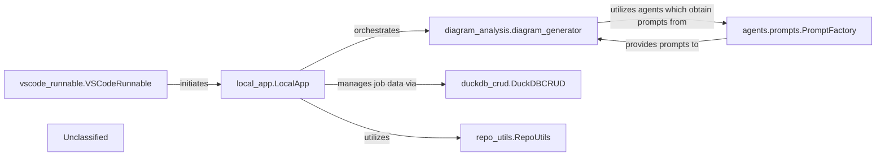
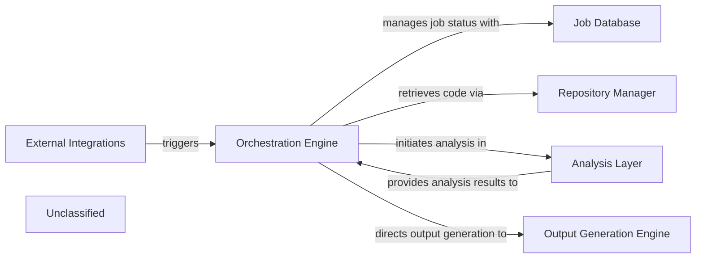
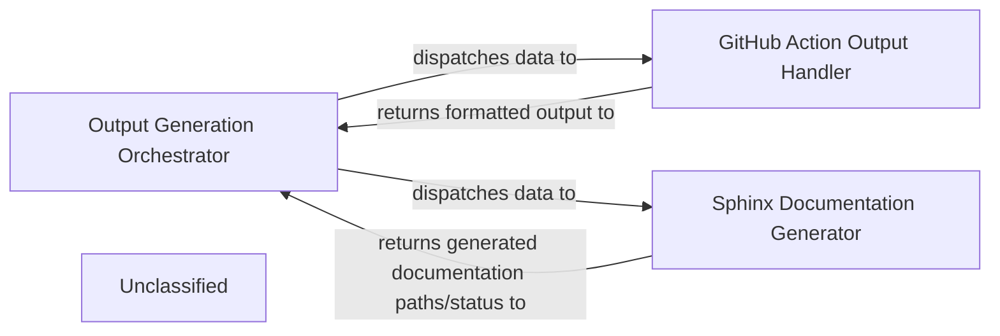
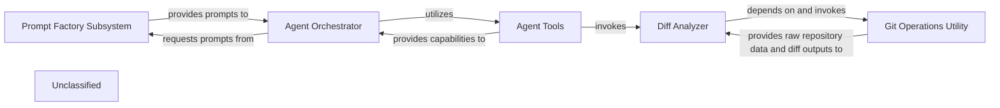
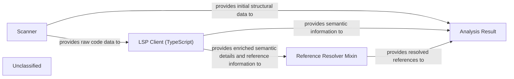
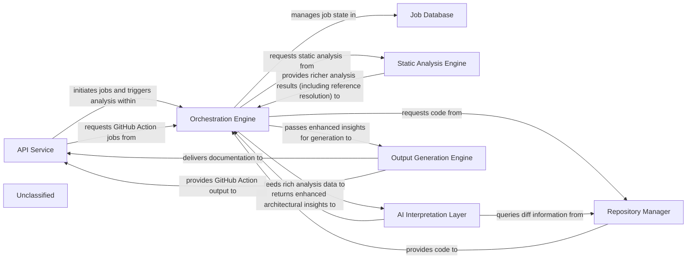

## Details

The system operates with an Application Orchestrator at its core, managing the overall flow from user query to final response. It initiates the QueryProcessor to handle and embed incoming queries, which are then used by the DocumentRetriever to query the VectorStore for relevant documents. A key enhancement is the PromptFactory, which now employs an abstract factory pattern to centralize and standardize prompt generation for various agents and language models, including specialized prompts for Gemini Flash. The Application Orchestrator and ResponseGenerator both interact with the PromptFactory to obtain optimized prompts, enabling the ResponseGenerator to craft accurate and contextually rich natural language responses based on the retrieved documents and the user's query. This modular design ensures extensibility and consistent interaction with large language models.

### Application Orchestrator
Manages the overall application flow, coordinating interactions between QueryProcessor, DocumentRetriever, ResponseGenerator, and now leveraging the PromptFactory for agent prompt generation. It receives user queries and delivers final responses, adapting its agent coordination mechanisms due to recent core agent logic refactoring and the new prompt management system.

**Related Classes/Methods**:

- <a href="https://github.com/CodeBoarding/CodeBoarding/blob/mainagents/agent.py" target="_blank" rel="noopener noreferrer">`agents.agent`</a>

### QueryProcessor
Handles incoming user queries, embeds them, and prepares them for similarity search, potentially utilizing refined prompts from the PromptFactory for enhanced query understanding.

**Related Classes/Methods**:

- <a href="https://github.com/CodeBoarding/CodeBoarding/blob/main." target="_blank" rel="noopener noreferrer">`langchain_core.embeddings.Embeddings:embed_query`</a>

### VectorStore
Stores and retrieves document embeddings based on similarity search.

**Related Classes/Methods**:

- `langchain_community.vectorstores.chroma.Chroma:similarity_search`

### DocumentRetriever
Retrieves relevant documents from the vector store.

**Related Classes/Methods**:

- <a href="https://github.com/CodeBoarding/CodeBoarding/blob/main." target="_blank" rel="noopener noreferrer">`langchain_core.retrievers.BaseRetriever:get_relevant_documents`</a>

### ResponseGenerator
Generates a natural language response using a large language model based on the query and retrieved documents, now significantly enhanced by leveraging structured prompts from the PromptFactory, including specialized prompts for models like Gemini Flash.

**Related Classes/Methods**:

- <a href="https://github.com/CodeBoarding/CodeBoarding/blob/main." target="_blank" rel="noopener noreferrer">`langchain_core.language_models.llms.BaseLLM:invoke`</a>

### PromptFactory
Centralizes the creation and management of prompts for various agents and language models through an abstract factory pattern. It provides a structured and standardized approach to prompt generation, leveraging an AbstractPromptFactory interface and specialized implementations like GeminiFlashPromptsBidirectional and GeminiFlashPromptsUnidirectional. This ensures consistent and optimized interactions with LLMs, notably for Gemini Flash, by managing an expanded library of prompts.

**Related Classes/Methods**:

- <a href="https://github.com/CodeBoarding/CodeBoarding/blob/mainagents/prompts/prompt_factory.py#L29-L90" target="_blank" rel="noopener noreferrer">`prompt_factory.PromptFactory`:29-90</a>

### Unclassified
Component for all unclassified files and utility functions (Utility functions/External Libraries/Dependencies)

**Related Classes/Methods**: _None_

### [FAQ](https://github.com/CodeBoarding/GeneratedOnBoardings/tree/main?tab=readme-ov-file#faq)

## Details

CodeBoarding's local application (`local_app.LocalApp`) serves as the central entry point, handling requests from external clients like the VS Code extension (`vscode_runnable.VSCodeRunnable`). It orchestrates the core functionality of the platform, primarily delegating to the `diagram_analysis.diagram_generator` for comprehensive code analysis and diagram creation. The `local_app.LocalApp` also relies on `duckdb_crud.DuckDBCRUD` for persistent storage of job metadata and `repo_utils.RepoUtils` for repository operations. A critical subsystem for LLM interaction is managed by `agents.prompts.PromptFactory`, which, through an Abstract Factory pattern, dynamically provides prompts to the agents utilized by the `diagram_analysis.diagram_generator`, ensuring modularity and extensibility in integrating diverse LLMs and prompt strategies.

### local_app.LocalApp
Serves as the primary local interface for CodeBoarding, enabling local users and the VS Code extension to initiate, manage, and retrieve the status of analysis jobs, and to trigger documentation generation. It acts as a local API endpoint, orchestrating interactions with core analysis and data management components.

**Related Classes/Methods**:

- <a href="https://github.com/CodeBoarding/CodeBoarding/blob/mainlocal_app.py" target="_blank" rel="noopener noreferrer">`local_app.LocalApp`</a>

### diagram_analysis.diagram_generator
Orchestrates the comprehensive code analysis and diagram generation workflow, initiated by the `local_app.LocalApp`. It's responsible for the core value proposition of the platform, leveraging various agents and LLMs for analysis.

**Related Classes/Methods**:

- <a href="https://github.com/CodeBoarding/CodeBoarding/blob/maindiagram_analysis/diagram_generator.py" target="_blank" rel="noopener noreferrer">`diagram_analysis.diagram_generator`</a>

### agents.prompts.PromptFactory
Manages the dynamic selection and retrieval of prompts used by various agents for interacting with Large Language Models (LLMs). It has been refactored to leverage an Abstract Factory pattern, centralizing prompt definitions and enhancing modularity, configurability, and maintainability of LLM interactions. This pattern allows for easy integration of new LLMs and prompt strategies through concrete factory implementations (e.g., `gemini_flash_prompts_bidirectional.py`, `gemini_flash_prompts_unidirectional.py`) based on an abstract interface (`abstract_prompt_factory.py`).

**Related Classes/Methods**:

- <a href="https://github.com/CodeBoarding/CodeBoarding/blob/mainagents/prompts/prompt_factory.py#L29-L90" target="_blank" rel="noopener noreferrer">`agents.prompts.prompt_factory.PromptFactory`:29-90</a>

### duckdb_crud.DuckDBCRUD
Manages persistent storage and retrieval of analysis job metadata and status, crucial for `local_app.LocalApp` to track and report on job progress.

**Related Classes/Methods**:

- <a href="https://github.com/CodeBoarding/CodeBoarding/blob/mainduckdb_crud.py" target="_blank" rel="noopener noreferrer">`duckdb_crud.DuckDBCRUD`</a>

### repo_utils.RepoUtils
Provides repository-related operations such as cloning or fetching diffs, potentially utilized by `local_app.LocalApp` to prepare repositories for analysis.

**Related Classes/Methods**:

- <a href="https://github.com/CodeBoarding/CodeBoarding/blob/mainrepo_utils/__init__.py" target="_blank" rel="noopener noreferrer">`repo_utils.RepoUtils`</a>

### vscode_runnable.VSCodeRunnable
An external client that consumes services provided by the `local_app.LocalApp` for VS Code extension functionalities, representing a key external integration point.

**Related Classes/Methods**:

- <a href="https://github.com/CodeBoarding/CodeBoarding/blob/mainvscode_runnable.py" target="_blank" rel="noopener noreferrer">`vscode_runnable.VSCodeRunnable`</a>

### Unclassified
Component for all unclassified files and utility functions (Utility functions/External Libraries/Dependencies)

**Related Classes/Methods**:

- `unclassified.UnclassifiedComponent`:1-10

### Unclassified
Component for all unclassified files and utility functions (Utility functions/External Libraries/Dependencies)

**Related Classes/Methods**: _None_

### [FAQ](https://github.com/CodeBoarding/GeneratedOnBoardings/tree/main?tab=readme-ov-file#faq)

## Details

The system orchestrates the generation of documentation and diagrams through a well-defined workflow. The Orchestration Engine serves as the central control, initiating and managing all jobs. It interacts with the Job Database to track job statuses and with the Repository Manager to retrieve necessary code. The core analysis is performed by the Analysis Layer, which conducts static code analysis, AI-driven interpretation, and extracts data for diagram generation. A key enhancement within the Analysis Layer is its formalized prompt management system, utilizing an abstract factory pattern for structured and scalable AI prompt generation. Upon completion of the analysis, the Orchestration Engine directs the Output Generation Engine to format and produce the final documentation and diagrams. External systems can seamlessly trigger this entire process via External Integrations. The system's architecture is centered around an Orchestration Engine that governs the end-to-end process of documentation and diagram generation. This engine coordinates with a Job Database for job lifecycle management and a Repository Manager for source code acquisition. The Analysis Layer is the intellectual core, performing detailed code analysis, including AI-driven interpretation facilitated by a newly formalized and extensible prompt management system. The results from the Analysis Layer are then channeled back to the Orchestration Engine, which subsequently instructs the Output Generation Engine to produce the final documentation and diagrams. The entire workflow can be initiated by external systems through External Integrations, ensuring broad applicability and ease of use.

### Orchestration Engine [[Expand]](./Orchestration_Engine.md)
The central control subsystem responsible for initiating, managing, and coordinating all analysis and documentation generation jobs, acting as the primary orchestrator for the end-to-end workflow.

**Related Classes/Methods**:

- <a href="https://github.com/CodeBoarding/CodeBoarding/blob/mainlocal_app.py" target="_blank" rel="noopener noreferrer">`local_app.py:start_generation_job`</a>
- <a href="https://github.com/CodeBoarding/CodeBoarding/blob/mainlocal_app.py" target="_blank" rel="noopener noreferrer">`local_app.py:start_docs_generation_job`</a>
- <a href="https://github.com/CodeBoarding/CodeBoarding/blob/mainlocal_app.py" target="_blank" rel="noopener noreferrer">`local_app.py:process_docs_generation_job`</a>

### Job Database
Manages the storage and retrieval of job details, including status updates, for the documentation generation pipeline.

**Related Classes/Methods**:

- <a href="https://github.com/CodeBoarding/CodeBoarding/blob/mainduckdb_crud.py" target="_blank" rel="noopener noreferrer">`duckdb_crud.py`</a>

### Repository Manager [[Expand]](./Repository_Manager.md)
Handles repository operations suchs as cloning code repositories and retrieving code differences for analysis.

**Related Classes/Methods**:

- <a href="https://github.com/CodeBoarding/CodeBoarding/blob/mainrepo_utils/git_diff.py" target="_blank" rel="noopener noreferrer">`repo_utils.git_diff.py`</a>

### Analysis Layer
Performs comprehensive code analysis, encompassing static code analysis, AI-driven interpretation, and specialized data extraction for diagram generation. This layer now incorporates a formalized and extensible prompt management system, leveraging an abstract factory pattern to generate and manage AI prompts, thereby enhancing modularity and scalability.

**Related Classes/Methods**:

- <a href="https://github.com/CodeBoarding/CodeBoarding/blob/mainstatic_analyzer/scanner.py" target="_blank" rel="noopener noreferrer">`static_analyzer.scanner.py`</a>
- <a href="https://github.com/CodeBoarding/CodeBoarding/blob/mainagents/agent.py" target="_blank" rel="noopener noreferrer">`agents.agent.py`</a>
- <a href="https://github.com/CodeBoarding/CodeBoarding/blob/maindiagram_analysis/diagram_generator.py" target="_blank" rel="noopener noreferrer">`diagram_analysis/diagram_generator.py:generate_analysis`</a>
- <a href="https://github.com/CodeBoarding/CodeBoarding/blob/mainagents/prompts/abstract_prompt_factory.py" target="_blank" rel="noopener noreferrer">`agents.prompts.abstract_prompt_factory.py`</a>
- <a href="https://github.com/CodeBoarding/CodeBoarding/blob/mainagents/prompts/prompt_factory.py" target="_blank" rel="noopener noreferrer">`agents.prompts.prompt_factory.py`</a>
- <a href="https://github.com/CodeBoarding/CodeBoarding/blob/mainagents/prompts/gemini_flash_prompts_bidirectional.py" target="_blank" rel="noopener noreferrer">`agents.prompts.gemini_flash_prompts_bidirectional.py`</a>
- <a href="https://github.com/CodeBoarding/CodeBoarding/blob/mainagents/prompts/gemini_flash_prompts_unidirectional.py" target="_blank" rel="noopener noreferrer">`agents.prompts.gemini_flash_prompts_unidirectional.py`</a>

### Output Generation Engine [[Expand]](./Output_Generation_Engine.md)
Responsible for the final formatting and generation of documentation and diagrams in various formats.

**Related Classes/Methods**:

- <a href="https://github.com/CodeBoarding/CodeBoarding/blob/mainoutput_generators/markdown.py" target="_blank" rel="noopener noreferrer">`output_generators.markdown.py`</a>

### External Integrations
Provides interfaces for external systems, such as VSCode and GitHub Actions, to trigger analysis workflows.

**Related Classes/Methods**:

- <a href="https://github.com/CodeBoarding/CodeBoarding/blob/maingithub_action.py" target="_blank" rel="noopener noreferrer">`github_action.py`</a>
- <a href="https://github.com/CodeBoarding/CodeBoarding/blob/mainvscode_runnable.py" target="_blank" rel="noopener noreferrer">`vscode_runnable.py`</a>

### Unclassified
Component for all unclassified files and utility functions (Utility functions/External Libraries/Dependencies)

**Related Classes/Methods**: _None_

### [FAQ](https://github.com/CodeBoarding/GeneratedOnBoardings/tree/main?tab=readme-ov-file#faq)

## Details

The `Output Generation Engine` is orchestrated by the `Output Generation Orchestrator`, which receives validated architectural insights. This orchestrator intelligently dispatches these insights to either the `GitHub Action Output Handler` for GitHub Actions-compatible formats (HTML, Markdown, MDX) or the `Sphinx Documentation Generator` for Sphinx-specific documentation. Each generator processes the data and returns the formatted output or generation status back to the orchestrator, ensuring a streamlined and adaptable documentation generation workflow.

### Output Generation Orchestrator
Acts as the central control point, receiving processed architectural insights. It intelligently determines the appropriate output format based on configuration or environment, then delegates the generation task to specialized components.

**Related Classes/Methods**:

- `output_generation_orchestrator.py`

### GitHub Action Output Handler
Responsible for transforming the insights into GitHub Actions-compatible formats (HTML, Markdown, MDX) and returning the results to the orchestrator.

**Related Classes/Methods**:

- `github_action_output_handler.py`

### Sphinx Documentation Generator
Responsible for transforming the insights into Sphinx-specific documentation and returning the generated documentation paths/status to the orchestrator.

**Related Classes/Methods**:

### Unclassified
Component for all unclassified files and utility functions (Utility functions/External Libraries/Dependencies)

**Related Classes/Methods**: _None_

### [FAQ](https://github.com/CodeBoarding/GeneratedOnBoardings/tree/main?tab=readme-ov-file#faq)

## Details

The system is structured around an Agent Orchestrator that drives various analytical tasks. This orchestrator dynamically obtains specialized prompt templates from the Prompt Factory Subsystem, which employs an Abstract Factory pattern to ensure flexible and context-specific prompt generation. To execute its tasks, the Agent Orchestrator leverages a suite of Agent Tools. These tools encapsulate specific functionalities, such as interacting with the Diff Analyzer to process code changes. The Diff Analyzer, in turn, relies on the Git Operations Utility for low-level Git interactions, providing a clear separation of concerns for repository data retrieval and processing. This architecture promotes modularity, allowing for easy extension of agents, prompts, and tools while maintaining a clear flow of information and control.

### Diff Analyzer
Orchestrates the process of identifying, analyzing, and preparing code differences from repositories. It leverages lower-level Git utilities to fetch raw data and then processes it into a usable format for subsequent analysis stages.

**Related Classes/Methods**:

- <a href="https://github.com/CodeBoarding/CodeBoarding/blob/mainagents/diff_analyzer.py" target="_blank" rel="noopener noreferrer">`agents.diff_analyzer:__init__`</a>

### Git Operations Utility
Provides low-level, atomic functionalities for interacting directly with Git repositories. This includes operations such as cloning repositories, fetching updates, and generating detailed version differences (diffs). It abstracts the complexities of Git commands.

**Related Classes/Methods**:

- <a href="https://github.com/CodeBoarding/CodeBoarding/blob/mainrepo_utils/git_diff.py" target="_blank" rel="noopener noreferrer">`repo_utils.git_diff:git_diff`</a>

### Prompt Factory Subsystem
Manages the creation and retrieval of various prompt templates used by different agents. It implements an Abstract Factory pattern, allowing for flexible and extensible prompt generation based on specific agent requirements (e.g., unidirectional or bidirectional communication).

**Related Classes/Methods**:

- <a href="https://github.com/CodeBoarding/CodeBoarding/blob/mainagents/prompts/abstract_prompt_factory.py" target="_blank" rel="noopener noreferrer">`agents.prompts.abstract_prompt_factory:AbstractPromptFactory`</a>
- <a href="https://github.com/CodeBoarding/CodeBoarding/blob/mainagents/prompts/prompt_factory.py" target="_blank" rel="noopener noreferrer">`agents.prompts.prompt_factory:PromptFactory`</a>
- <a href="https://github.com/CodeBoarding/CodeBoarding/blob/mainagents/prompts/gemini_flash_prompts_bidirectional.py" target="_blank" rel="noopener noreferrer">`agents.prompts.gemini_flash_prompts_bidirectional`</a>
- <a href="https://github.com/CodeBoarding/CodeBoarding/blob/mainagents/prompts/gemini_flash_prompts_unidirectional.py" target="_blank" rel="noopener noreferrer">`agents.prompts.gemini_flash_prompts_unidirectional`</a>

### Agent Orchestrator
Represents the core agent logic that utilizes prompts and tools to perform its tasks. This component interacts with the `Prompt Factory Subsystem` to obtain appropriate prompts and then executes its operational flow, potentially involving the `Diff Analyzer` and other tools.

**Related Classes/Methods**:

- <a href="https://github.com/CodeBoarding/CodeBoarding/blob/mainagents/agent.py" target="_blank" rel="noopener noreferrer">`agents.agent:Agent`</a>

### Agent Tools
Provides a collection of specialized tools that agents can utilize to interact with the environment, gather information, or perform specific actions. These tools encapsulate functionalities like reading files, analyzing code structures, or fetching Git diffs.

**Related Classes/Methods**:

- <a href="https://github.com/CodeBoarding/CodeBoarding/blob/mainagents/tools/read_file.py" target="_blank" rel="noopener noreferrer">`agents.tools.read_file`</a>
- <a href="https://github.com/CodeBoarding/CodeBoarding/blob/mainagents/tools/read_git_diff.py" target="_blank" rel="noopener noreferrer">`agents.tools.read_git_diff`</a>
- <a href="https://github.com/CodeBoarding/CodeBoarding/blob/mainagents/tools/read_source.py" target="_blank" rel="noopener noreferrer">`agents.tools.read_source`</a>

### Unclassified
Component for all unclassified files and utility functions (Utility functions/External Libraries/Dependencies)

**Related Classes/Methods**: _None_

### [FAQ](https://github.com/CodeBoarding/GeneratedOnBoardings/tree/main?tab=readme-ov-file#faq)

## Details

The Static Analysis Engine subsystem is responsible for performing deep, language-specific analysis and reference resolution on source code to produce comprehensive structural information. It begins with the Scanner parsing and tokenizing source code to generate an initial structural representation. The LSP Client (TypeScript) then enriches this data by interacting with Language Server Protocol servers to obtain detailed syntax and semantic information. Subsequently, the Reference Resolver Mixin leverages this enriched data to identify and link code references. Finally, all processed and enriched information, including initial structural data, semantic details, and resolved references, is aggregated and structured within the Analysis Result, which serves as the canonical output of the engine.

### Scanner
Initiates the code analysis process by parsing source code, tokenizing, and generating an initial structural representation (e.g., an Abstract Syntax Tree). It focuses on the foundational extraction of code elements.

**Related Classes/Methods**:

- <a href="https://github.com/CodeBoarding/CodeBoarding/blob/mainstatic_analyzer/scanner.py" target="_blank" rel="noopener noreferrer">`Scanner`</a>

### LSP Client (TypeScript)
Facilitates language-specific analysis by interacting with Language Server Protocol (LSP) servers. For TypeScript, it leverages LSP capabilities to obtain detailed syntax, semantic information, and crucial reference resolution data. This component is key to the 'language-specific analysis' aspect.

**Related Classes/Methods**:

- <a href="https://github.com/CodeBoarding/CodeBoarding/blob/mainstatic_analyzer/lsp_client/typescript_client.py" target="_blank" rel="noopener noreferrer">`LSP Client (TypeScript)`</a>

### Reference Resolver Mixin
Provides the core logic for identifying and linking code references (e.g., where a variable is defined and all its usages). This directly implements the 'reference resolution capabilities' of the engine, enhancing the extracted structural information with crucial contextual links.

**Related Classes/Methods**:

- <a href="https://github.com/CodeBoarding/CodeBoarding/blob/mainstatic_analyzer/reference_resolve_mixin.py" target="_blank" rel="noopener noreferrer">`Reference Resolver Mixin`</a>

### Analysis Result
Defines the standardized data structures and models used to store the comprehensive output of the static analysis process. This includes the extracted structural information and the resolved references, serving as the canonical representation of the analyzed codebase's structure.

**Related Classes/Methods**:

- <a href="https://github.com/CodeBoarding/CodeBoarding/blob/mainstatic_analyzer/analysis_result.py" target="_blank" rel="noopener noreferrer">`Analysis Result`</a>

### Unclassified
Component for all unclassified files and utility functions (Utility functions/External Libraries/Dependencies)

**Related Classes/Methods**: _None_

### [FAQ](https://github.com/CodeBoarding/GeneratedOnBoardings/tree/main?tab=readme-ov-file#faq)

## Details

The CodeBoarding system is designed around a robust, multi-stage documentation generation pipeline. The `API Service` acts as the primary external interface, receiving user requests and initiating documentation jobs. These jobs are then managed by the `Orchestration Engine`, which coordinates the entire workflow, leveraging the `Job Database` for persistent state management. Code acquisition and version difference analysis are handled by the `Repository Manager`. The `Static Analysis Engine` performs deep, language-specific code analysis, including reference resolution, to extract comprehensive structural information. The resulting analysis data is then fed to the `AI Interpretation Layer`, a collection of specialized AI agents that interpret this data to generate high-level architectural insights. This layer features a significantly enhanced and modular prompt management system, utilizing an abstract factory pattern to support various language models and prompting strategies. Finally, the `Output Generation Engine` transforms these insights into various documentation formats, including those suitable for GitHub Actions, which are then delivered back via the `API Service`. This architecture ensures a clear separation of concerns, enabling efficient processing, intelligent interpretation, and flexible output generation for diverse documentation needs.

### API Service [[Expand]](./API_Service.md)
The external interface for CodeBoarding, handling user requests, job initiation, status retrieval, and integrating with GitHub Actions for automated documentation generation.

**Related Classes/Methods**:

- <a href="https://github.com/CodeBoarding/CodeBoarding/blob/mainlocal_app.py" target="_blank" rel="noopener noreferrer">`local_app`</a>

### Job Database
Persistent storage for managing the lifecycle, status, and results of all documentation generation jobs.

**Related Classes/Methods**:

- <a href="https://github.com/CodeBoarding/CodeBoarding/blob/mainduckdb_crud.py" target="_blank" rel="noopener noreferrer">`duckdb_crud`</a>

### Orchestration Engine [[Expand]](./Orchestration_Engine.md)
The central control unit that manages the entire documentation generation pipeline, coordinating all analysis and generation stages.

**Related Classes/Methods**:

- <a href="https://github.com/CodeBoarding/CodeBoarding/blob/maindiagram_analysis/diagram_generator.py" target="_blank" rel="noopener noreferrer">`diagram_generator`</a>

### Repository Manager [[Expand]](./Repository_Manager.md)
Manages all interactions with source code repositories, including cloning, fetching, and extracting version differences.

**Related Classes/Methods**:

- <a href="https://github.com/CodeBoarding/CodeBoarding/blob/mainagents/diff_analyzer.py#L21-L32" target="_blank" rel="noopener noreferrer">`__init__`:21-32</a>
- <a href="https://github.com/CodeBoarding/CodeBoarding/blob/mainrepo_utils/git_diff.py#L27-L76" target="_blank" rel="noopener noreferrer">`git_diff`:27-76</a>

### Static Analysis Engine [[Expand]](./Static_Analysis_Engine.md)
Performs deep, language-specific analysis of source code, now explicitly including **reference resolution capabilities**, to extract richer, more detailed, and comprehensive structural information without semantic interpretation.

**Related Classes/Methods**:

- <a href="https://github.com/CodeBoarding/CodeBoarding/blob/mainstatic_analyzer/scanner.py#L13-L82" target="_blank" rel="noopener noreferrer">`scanner`:13-82</a>
- <a href="https://github.com/CodeBoarding/CodeBoarding/blob/mainstatic_analyzer/lsp_client/typescript_client.py#L10-L214" target="_blank" rel="noopener noreferrer">`client`:10-214</a>
- <a href="https://github.com/CodeBoarding/CodeBoarding/blob/mainagents/abstraction_agent.py" target="_blank" rel="noopener noreferrer">`analysis_result`</a>
- <a href="https://github.com/CodeBoarding/CodeBoarding/blob/mainstatic_analyzer/reference_resolve_mixin.py" target="_blank" rel="noopener noreferrer">`reference_resolve_mixin`</a>

### AI Interpretation Layer [[Expand]](./AI_Interpretation_Layer.md)
A collection of specialized AI agents that perform sophisticated interpretation of static analysis data, generating enhanced high-level architectural insights, including detailed abstractions, refined planning, robust validation, and comprehensive diff analysis. This layer now features a **significantly enhanced prompt management system**, utilizing an `abstract_prompt_factory` and concrete implementations (e.g., `gemini_flash_prompts_bidirectional`, `gemini_flash_prompts_unidirectional`) for structured prompt definition, selection, and application, supporting various language models (e.g., Gemini Flash) and prompting strategies. The `prompt_factory` has been refactored to integrate this modular and extensible system.

**Related Classes/Methods**:

- <a href="https://github.com/CodeBoarding/CodeBoarding/blob/maindiagram_analysis/diagram_generator.py" target="_blank" rel="noopener noreferrer">`meta_agent`</a>
- <a href="https://github.com/CodeBoarding/CodeBoarding/blob/mainagents/abstraction_agent.py" target="_blank" rel="noopener noreferrer">`abstraction_agent`</a>
- <a href="https://github.com/CodeBoarding/CodeBoarding/blob/mainagents/details_agent.py" target="_blank" rel="noopener noreferrer">`details_agent`</a>
- <a href="https://github.com/CodeBoarding/CodeBoarding/blob/maindiagram_analysis/diagram_generator.py" target="_blank" rel="noopener noreferrer">`planner_agent`</a>
- <a href="https://github.com/CodeBoarding/CodeBoarding/blob/maindiagram_analysis/diagram_generator.py" target="_blank" rel="noopener noreferrer">`validator_agent`</a>
- <a href="https://github.com/CodeBoarding/CodeBoarding/blob/mainagents/diff_analyzer.py" target="_blank" rel="noopener noreferrer">`diff_analyzer`</a>
- <a href="https://github.com/CodeBoarding/CodeBoarding/blob/mainagents/agent.py" target="_blank" rel="noopener noreferrer">`agent`</a>
- <a href="https://github.com/CodeBoarding/CodeBoarding/blob/mainagents/agent_responses.py" target="_blank" rel="noopener noreferrer">`agent_responses`</a>
- <a href="https://github.com/CodeBoarding/CodeBoarding/blob/mainagents/details_agent.py" target="_blank" rel="noopener noreferrer">`prompts`</a>
- `abstract_prompt_factory`
- `gemini_flash_prompts_bidirectional`:1-10
- `gemini_flash_prompts_unidirectional`
- <a href="https://github.com/CodeBoarding/CodeBoarding/blob/mainagents/prompts/prompt_factory.py#L37-L46" target="_blank" rel="noopener noreferrer">`prompt_factory`:37-46</a>

### Output Generation Engine [[Expand]](./Output_Generation_Engine.md)
Transforms the final, validated architectural insights into various human-readable and diagram-friendly documentation formats, with enhanced capabilities for specific output formats and external integrations like GitHub Actions.

**Related Classes/Methods**:

- <a href="https://github.com/CodeBoarding/CodeBoarding/blob/maingithub_action.py#L37-L51" target="_blank" rel="noopener noreferrer">`html`:37-51</a>
- <a href="https://github.com/CodeBoarding/CodeBoarding/blob/maingithub_action.py#L20-L34" target="_blank" rel="noopener noreferrer">`markdown`:20-34</a>
- <a href="https://github.com/CodeBoarding/CodeBoarding/blob/maingithub_action.py#L54-L68" target="_blank" rel="noopener noreferrer">`mdx`:54-68</a>
- <a href="https://github.com/CodeBoarding/CodeBoarding/blob/mainoutput_generators/sphinx.py" target="_blank" rel="noopener noreferrer">`sphinx`</a>
- <a href="https://github.com/CodeBoarding/CodeBoarding/blob/maingithub_action.py" target="_blank" rel="noopener noreferrer">`github_action`</a>

### Unclassified
Component for all unclassified files and utility functions (Utility functions/External Libraries/Dependencies)

**Related Classes/Methods**: _None_

### Unclassified
Component for all unclassified files and utility functions (Utility functions/External Libraries/Dependencies)

**Related Classes/Methods**: _None_

### Unclassified
Component for all unclassified files and utility functions (Utility functions/External Libraries/Dependencies)

**Related Classes/Methods**: _None_

### [FAQ](https://github.com/CodeBoarding/GeneratedOnBoardings/tree/main?tab=readme-ov-file#faq)

