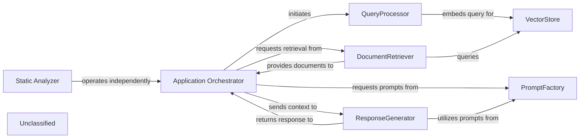
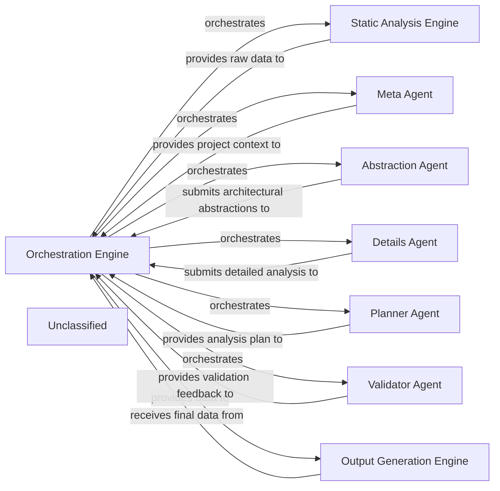
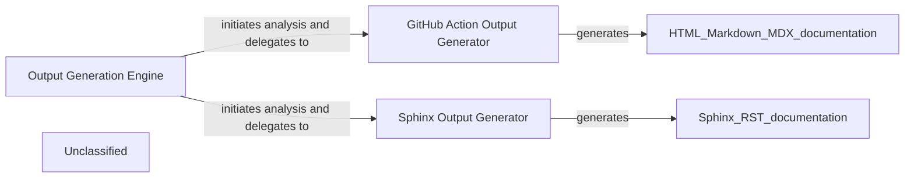
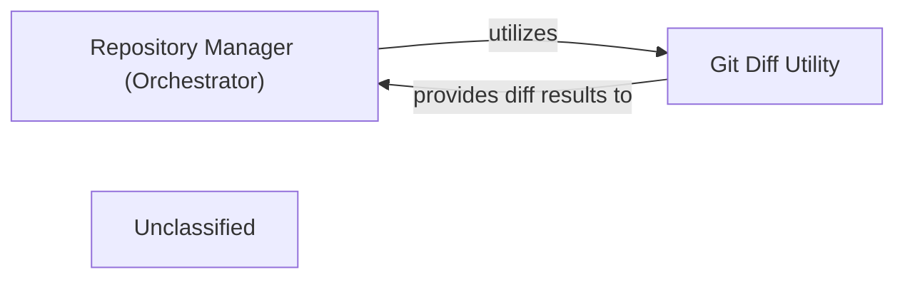
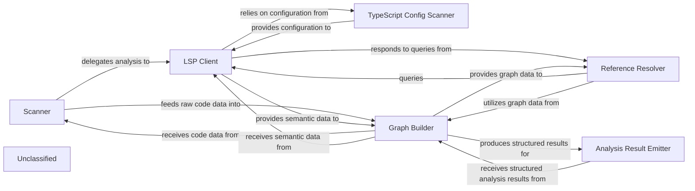
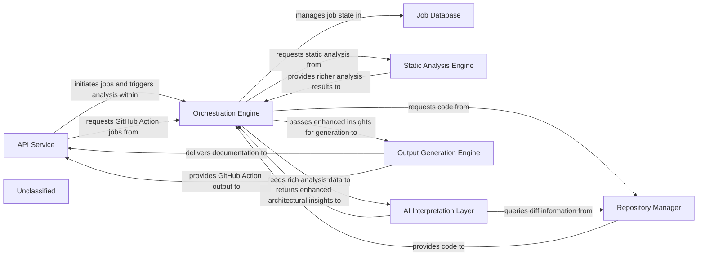

```mermaid
graph LR
    API_Service["API Service"]
    Orchestration_Engine["Orchestration Engine"]
    Repository_Manager["Repository Manager"]
    Static_Analysis_Engine["Static Analysis Engine"]
    AI_Interpretation_Layer["AI Interpretation Layer"]
    Output_Generation_Engine["Output Generation Engine"]
    Unclassified["Unclassified"]
    API_Service -- "submits jobs to" --> Orchestration_Engine
    Orchestration_Engine -- "sends status to" --> API_Service
    Output_Generation_Engine -- "provides artifacts to" --> API_Service
    Orchestration_Engine -- "invokes" --> Repository_Manager
    Repository_Manager -- "provides code to" --> Static_Analysis_Engine
    Static_Analysis_Engine -- "sends analysis results to" --> AI_Interpretation_Layer
    AI_Interpretation_Layer -- "sends interpreted insights to" --> Output_Generation_Engine
    click API_Service href "https://github.com/CodeBoarding/CodeBoarding/blob/main/.codeboarding/API_Service.md" "Details"
    click Orchestration_Engine href "https://github.com/CodeBoarding/CodeBoarding/blob/main/.codeboarding/Orchestration_Engine.md" "Details"
    click Repository_Manager href "https://github.com/CodeBoarding/CodeBoarding/blob/main/.codeboarding/Repository_Manager.md" "Details"
    click Static_Analysis_Engine href "https://github.com/CodeBoarding/CodeBoarding/blob/main/.codeboarding/Static_Analysis_Engine.md" "Details"
    click AI_Interpretation_Layer href "https://github.com/CodeBoarding/CodeBoarding/blob/main/.codeboarding/AI_Interpretation_Layer.md" "Details"
    click Output_Generation_Engine href "https://github.com/CodeBoarding/CodeBoarding/blob/main/.codeboarding/Output_Generation_Engine.md" "Details"
```

## Details

The system is structured around a Retrieval Augmented Generation (RAG) pipeline, with the Application Orchestrator serving as the central coordinator. It manages the flow from user query to response generation, leveraging the QueryProcessor for query embedding, the DocumentRetriever and VectorStore for document retrieval, and the ResponseGenerator for crafting natural language responses. The PromptFactory provides a standardized mechanism for generating and managing prompts, optimizing interactions with various language models. Operating in parallel and independently, the Static Analyzer component offers advanced static analysis capabilities, particularly for TypeScript configurations, incorporating graph-based analysis and a sophisticated Language Server Protocol (LSP) client to provide deep insights without directly influencing the RAG workflow.

### Application Orchestrator
Manages the overall application flow, coordinating interactions between QueryProcessor, DocumentRetriever, ResponseGenerator, and leveraging the PromptFactory for agent prompt generation. It receives user queries and delivers final responses, adapting its agent coordination mechanisms due to recent core agent logic refactoring and the new prompt management system.

**Related Classes/Methods**:

- <a href="https://github.com/CodeBoarding/CodeBoarding/blob/mainagents/agent.py" target="_blank" rel="noopener noreferrer">`agents.agent`</a>

### QueryProcessor
Handles incoming user queries, embeds them, and prepares them for similarity search, potentially utilizing refined prompts from the PromptFactory for enhanced query understanding.

**Related Classes/Methods**:

- <a href="https://github.com/CodeBoarding/CodeBoarding/blob/main." target="_blank" rel="noopener noreferrer">`langchain_core.embeddings.Embeddings:embed_query`</a>

### VectorStore
Stores and retrieves document embeddings based on similarity search.

**Related Classes/Methods**:

- `langchain_community.vectorstores.chroma.Chroma:similarity_search`

### DocumentRetriever
Retrieves relevant documents from the vector store.

**Related Classes/Methods**:

- <a href="https://github.com/CodeBoarding/CodeBoarding/blob/main." target="_blank" rel="noopener noreferrer">`langchain_core.retrievers.BaseRetriever:get_relevant_documents`</a>

### ResponseGenerator
Generates a natural language response using a large language model based on the query and retrieved documents, now significantly enhanced by leveraging structured prompts from the PromptFactory, including specialized prompts for models like Gemini Flash and Claude.

**Related Classes/Methods**:

- <a href="https://github.com/CodeBoarding/CodeBoarding/blob/main." target="_blank" rel="noopener noreferrer">`langchain_core.language_models.llms.BaseLLM:invoke`</a>

### PromptFactory
Centralizes the creation and management of prompts for various agents and language models through an abstract factory pattern. It provides a structured and standardized approach to prompt generation, leveraging an AbstractPromptFactory interface and specialized implementations like GeminiFlashPromptsBidirectional, GeminiFlashPromptsUnidirectional, ClaudePromptsBidirectional, and ClaudePromptsUnidirectional. This ensures consistent and optimized interactions with LLMs, notably for Gemini Flash and Claude models, by managing an expanded library of prompts.

**Related Classes/Methods**:

- <a href="https://github.com/CodeBoarding/CodeBoarding/blob/mainagents/prompts/prompt_factory.py#L29-L98" target="_blank" rel="noopener noreferrer">`prompt_factory.PromptFactory`:29-98</a>

### Static Analyzer
An independent functional area responsible for performing static analysis, primarily focusing on TypeScript configurations. This component has been significantly enhanced with the integration of a dedicated Language Server Protocol (LSP) client for TypeScript, enabling more sophisticated and in-depth analysis by leveraging the full capabilities of a TypeScript Language Server. It now also incorporates graph-based analysis capabilities to provide deeper insights. It operates in parallel to the core RAG system, providing distinct capabilities without directly altering the RAG data flow.

**Related Classes/Methods**:

- <a href="https://github.com/CodeBoarding/CodeBoarding/blob/mainstatic_analyzer/typescript_config_scanner.py" target="_blank" rel="noopener noreferrer">`static_analyzer.typescript_config_scanner`</a>
- <a href="https://github.com/CodeBoarding/CodeBoarding/blob/mainstatic_analyzer/lsp_client/typescript_client.py" target="_blank" rel="noopener noreferrer">`static_analyzer.lsp_client.typescript_client`</a>
- <a href="https://github.com/CodeBoarding/CodeBoarding/blob/mainstatic_analyzer/graph.py" target="_blank" rel="noopener noreferrer">`static_analyzer.graph`</a>

### Unclassified
Component for all unclassified files and utility functions (Utility functions/External Libraries/Dependencies)

**Related Classes/Methods**: _None_

### [FAQ](https://github.com/CodeBoarding/GeneratedOnBoardings/tree/main?tab=readme-ov-file#faq)

## Details

The CodeBoarding system is structured around a pipeline that processes code analysis requests and generates architectural insights. The API Service serves as the external entry point, receiving user requests and initiating analysis jobs. These jobs are then managed by the Orchestration Engine, which coordinates the entire analysis workflow. The Orchestration Engine interacts with the Repository Manager to fetch and prepare codebases for analysis. The prepared code is then fed into the Static Analysis Engine, which extracts structural and behavioral information. The raw analysis results are subsequently passed to the AI Interpretation Layer, where Large Language Models interpret the data to identify architectural patterns and generate high-level insights. Finally, the Output Generation Engine takes these interpreted insights to produce various artifacts, including architectural diagrams and documentation, which are then made available through the API Service. This architecture ensures a clear separation of concerns, allowing for modular development and efficient processing of code analysis tasks.

### API Service [[Expand]](./API_Service.md)
The primary external interface for CodeBoarding, handling user requests, initiating code analysis jobs, retrieving job status and results, and integrating with external systems like GitHub Actions for automated documentation generation.

**Related Classes/Methods**:

- <a href="https://github.com/CodeBoarding/CodeBoarding/blob/mainlocal_app.py" target="_blank" rel="noopener noreferrer">`local_app`</a>

### Orchestration Engine [[Expand]](./Orchestration_Engine.md)
Manages the lifecycle of code analysis jobs, including scheduling, execution, and status tracking. It acts as an orchestrator for the analysis pipeline, invoking other components as needed.

**Related Classes/Methods**:

- <a href="https://github.com/CodeBoarding/CodeBoarding/blob/main.codeboarding/Orchestration_Engine.json" target="_blank" rel="noopener noreferrer">`Orchestration_Engine`</a>

### Repository Manager [[Expand]](./Repository_Manager.md)
Handles interactions with code repositories (e.g., GitHub), including cloning, fetching, and managing codebases for analysis.

**Related Classes/Methods**:

- <a href="https://github.com/CodeBoarding/CodeBoarding/blob/main.codeboarding/Repository_Manager.json" target="_blank" rel="noopener noreferrer">`Repository_Manager`</a>

### Static Analysis Engine [[Expand]](./Static_Analysis_Engine.md)
Performs static code analysis on various programming languages (Python, Go, TypeScript) to extract structural and behavioral information from the codebase.

**Related Classes/Methods**:

- <a href="https://github.com/CodeBoarding/CodeBoarding/blob/main.codeboarding/Static_Analysis_Engine.json" target="_blank" rel="noopener noreferrer">`Static_Analysis_Engine`</a>

### AI Interpretation Layer [[Expand]](./AI_Interpretation_Layer.md)
Utilizes Large Language Models (LLMs) from various providers (OpenAI, Anthropic, Google Gemini, AWS Bedrock, Ollama) to interpret static analysis results, identify architectural patterns, and generate high-level insights.

**Related Classes/Methods**:

- <a href="https://github.com/CodeBoarding/CodeBoarding/blob/main.codeboarding/AI_Interpretation_Layer.json" target="_blank" rel="noopener noreferrer">`AI_Interpretation_Layer`</a>

### Output Generation Engine [[Expand]](./Output_Generation_Engine.md)
Responsible for generating various outputs, including architectural diagrams (Mermaid.js), reports, and documentation, based on the interpreted analysis results.

**Related Classes/Methods**:

- <a href="https://github.com/CodeBoarding/CodeBoarding/blob/main.codeboarding/Output_Generation_Engine.json" target="_blank" rel="noopener noreferrer">`Output_Generation_Engine`</a>

### Unclassified
Component for all unclassified files and utility functions (Utility functions/External Libraries/Dependencies)

**Related Classes/Methods**: _None_

### [FAQ](https://github.com/CodeBoarding/GeneratedOnBoardings/tree/main?tab=readme-ov-file#faq)

## Details

The system operates as a sophisticated analysis pipeline orchestrated by the Orchestration Engine. This engine initiates the process by leveraging the Static Analysis Engine to gather foundational code data. Subsequently, it coordinates a suite of specialized AI agents: the Meta Agent for initial project context, the Abstraction Agent for high-level architectural insights, the Details Agent for granular component analysis, the Planner Agent for dynamic task sequencing, and the Validator Agent for quality assurance. Each agent contributes to a progressively refined understanding of the codebase, with the Orchestration Engine managing the flow of information and feedback loops. Finally, the Output Generation Engine consolidates and formats the comprehensive architectural analysis into structured outputs, ready for documentation and visualization. This design emphasizes a modular, AI-driven approach to software architecture analysis, ensuring accuracy and adaptability.

### Orchestration Engine [[Expand]](./Orchestration_Engine.md)
The central control unit that manages the entire documentation generation pipeline. It initializes and coordinates various AI agents and analysis steps, manages parallel processing, saves analysis results, and handles error logging. This component embodies the "Orchestration" architectural pattern.

**Related Classes/Methods**:

- <a href="https://github.com/CodeBoarding/CodeBoarding/blob/maindiagram_analysis/diagram_generator.py" target="_blank" rel="noopener noreferrer">`DiagramGenerator`</a>

### Static Analysis Engine [[Expand]](./Static_Analysis_Engine.md)
Responsible for performing initial static analysis on the codebase to extract fundamental structural and relational data. This data serves as the raw input for subsequent AI interpretation, directly supporting the "Code Analysis" aspect.

**Related Classes/Methods**:

- <a href="https://github.com/CodeBoarding/CodeBoarding/blob/mainstatic_analyzer/__init__.py#L44-L67" target="_blank" rel="noopener noreferrer">`StaticAnalyzer`:44-67</a>
- <a href="https://github.com/CodeBoarding/CodeBoarding/blob/mainstatic_analyzer/__init__.py#L50-L67" target="_blank" rel="noopener noreferrer">`StaticAnalyzer:analyze`:50-67</a>

### Meta Agent
An AI agent dedicated to performing initial project metadata analysis. It establishes the foundational context and high-level understanding of the project, guiding subsequent detailed analysis. This is a key part of the "AI Interpretation Layer".

**Related Classes/Methods**:

- <a href="https://github.com/CodeBoarding/CodeBoarding/blob/mainagents/meta_agent.py#L15-L37" target="_blank" rel="noopener noreferrer">`MetaAgent`:15-37</a>
- <a href="https://github.com/CodeBoarding/CodeBoarding/blob/mainagents/meta_agent.py#L29-L37" target="_blank" rel="noopener noreferrer">`MetaAgent:analyze_project_metadata`:29-37</a>

### Abstraction Agent
An AI agent focused on generating high-level architectural abstractions from the analyzed code. It identifies and defines major components and their relationships, refining these abstractions based on feedback. This is a core function of the "AI Interpretation Layer".

**Related Classes/Methods**:

- <a href="https://github.com/CodeBoarding/CodeBoarding/blob/mainagents/abstraction_agent.py#L19-L160" target="_blank" rel="noopener noreferrer">`AbstractionAgent`:19-160</a>
- <a href="https://github.com/CodeBoarding/CodeBoarding/blob/mainagents/abstraction_agent.py#L155-L160" target="_blank" rel="noopener noreferrer">`AbstractionAgent:run`:155-160</a>
- <a href="https://github.com/CodeBoarding/CodeBoarding/blob/mainagents/abstraction_agent.py#L103-L111" target="_blank" rel="noopener noreferrer">`AbstractionAgent:apply_feedback`:103-111</a>

### Details Agent
An AI agent responsible for generating detailed analysis for identified components. It classifies files, extracts granular information, and refines its analysis based on feedback to provide in-depth insights. This component provides the detailed understanding within the "AI Interpretation Layer".

**Related Classes/Methods**:

- <a href="https://github.com/CodeBoarding/CodeBoarding/blob/mainagents/details_agent.py#L19-L154" target="_blank" rel="noopener noreferrer">`DetailsAgent`:19-154</a>
- <a href="https://github.com/CodeBoarding/CodeBoarding/blob/mainagents/details_agent.py#L104-L114" target="_blank" rel="noopener noreferrer">`DetailsAgent:run`:104-114</a>
- <a href="https://github.com/CodeBoarding/CodeBoarding/blob/mainagents/details_agent.py#L94-L102" target="_blank" rel="noopener noreferrer">`DetailsAgent:apply_feedback`:94-102</a>
- <a href="https://github.com/CodeBoarding/CodeBoarding/blob/mainagents/details_agent.py#L116-L154" target="_blank" rel="noopener noreferrer">`DetailsAgent:classify_files`:116-154</a>

### Planner Agent
An AI agent that dynamically determines the optimal sequence and scope of analysis steps. It plans which components to analyze next based on the current state of understanding and analysis goals, crucial for the "Pipeline/Event-Driven Architecture" flow.

**Related Classes/Methods**:

- <a href="https://github.com/CodeBoarding/CodeBoarding/blob/mainagents/planner_agent.py#L13-L31" target="_blank" rel="noopener noreferrer">`PlannerAgent`:13-31</a>
- <a href="https://github.com/CodeBoarding/CodeBoarding/blob/mainagents/planner_agent.py#L21-L31" target="_blank" rel="noopener noreferrer">`PlannerAgent:plan_analysis`:21-31</a>

### Validator Agent
An AI agent tasked with validating the analysis results produced by other agents. It provides critical feedback to ensure the accuracy, consistency, and completeness of the generated architectural insights, ensuring quality in the "AI Interpretation Layer".

**Related Classes/Methods**:

- <a href="https://github.com/CodeBoarding/CodeBoarding/blob/mainagents/validator_agent.py#L15-L143" target="_blank" rel="noopener noreferrer">`ValidatorAgent`:15-143</a>
- <a href="https://github.com/CodeBoarding/CodeBoarding/blob/mainagents/validator_agent.py#L116-L143" target="_blank" rel="noopener noreferrer">`ValidatorAgent:run`:116-143</a>

### Output Generation Engine [[Expand]](./Output_Generation_Engine.md)
Responsible for formatting and saving the final architectural analysis and diagram data into persistent storage, typically as structured JSON files, for consumption by visualization tools or other systems. This is the final stage of the "Visualization Tool" output.

**Related Classes/Methods**:

- <a href="https://github.com/CodeBoarding/CodeBoarding/blob/maindiagram_analysis/analysis_json.py" target="_blank" rel="noopener noreferrer">`from_analysis_to_json`</a>

### Unclassified
Component for all unclassified files and utility functions (Utility functions/External Libraries/Dependencies)

**Related Classes/Methods**: _None_

### [FAQ](https://github.com/CodeBoarding/GeneratedOnBoardings/tree/main?tab=readme-ov-file#faq)

## Details

The output generation subsystem is orchestrated by the `Output Generation Engine`, which manages the end-to-end process of transforming architectural insights into various documentation formats. This engine first performs repository setup and analysis generation, then dynamically dispatches the resulting insights to specialized generators based on the required output format. The `GitHub Action Output Generator` is responsible for producing documentation in HTML, Markdown, and MDX, primarily for integration into GitHub Actions workflows. Concurrently, the `Sphinx Output Generator` focuses on creating structured reStructuredText (RST) documentation, catering to projects that utilize Sphinx for comprehensive and customizable documentation. This modular design ensures flexibility in output formats while maintaining a clear separation of concerns for each generation process.

### Output Generation Engine [[Expand]](./Output_Generation_Engine.md)
Acts as the orchestrator for the entire output generation process. It receives architectural insights, delegates to specific format generators, and manages the overall flow of documentation creation and delivery. This component is central due to its role in coordinating all output activities and integrating with upstream (AI Interpretation Layer) and downstream (API Service) components.

**Related Classes/Methods**:

- <a href="https://github.com/CodeBoarding/CodeBoarding/blob/maingithub_action.py" target="_blank" rel="noopener noreferrer">`github_action.generate_analysis`</a>

### GitHub Action Output Generator
Specializes in generating documentation outputs tailored for GitHub Actions workflows. It handles the creation of HTML, Markdown, and MDX formats, ensuring compatibility and proper structuring for automated deployment within a GitHub Actions environment. This component is crucial for enabling automated documentation updates and integration into CI/CD pipelines.

**Related Classes/Methods**:

- <a href="https://github.com/CodeBoarding/CodeBoarding/blob/maingithub_action.py" target="_blank" rel="noopener noreferrer">`github_action.generate_html`</a>
- <a href="https://github.com/CodeBoarding/CodeBoarding/blob/maingithub_action.py" target="_blank" rel="noopener noreferrer">`github_action.generate_markdown`</a>
- <a href="https://github.com/CodeBoarding/CodeBoarding/blob/maingithub_action.py" target="_blank" rel="noopener noreferrer">`github_action.generate_mdx`</a>

### Sphinx Output Generator
Focuses exclusively on generating documentation in the Sphinx format. It processes the architectural insights and renders them into the structured and extensible format required by Sphinx, including reStructuredText or MyST Markdown. This component is vital for projects requiring comprehensive, versioned, and highly customizable documentation.

**Related Classes/Methods**:

- <a href="https://github.com/CodeBoarding/CodeBoarding/blob/mainoutput_generators/sphinx.py" target="_blank" rel="noopener noreferrer">`output_generators.sphinx.generate_rst_file`</a>

### Unclassified
Component for all unclassified files and utility functions (Utility functions/External Libraries/Dependencies)

**Related Classes/Methods**: _None_

### [FAQ](https://github.com/CodeBoarding/GeneratedOnBoardings/tree/main?tab=readme-ov-file#faq)

## Details

The core of this subsystem revolves around the `DiffAnalyzingAgent`, which acts as the orchestrator for analyzing code changes within a project. It is responsible for managing the overall diff analysis workflow, from retrieving existing analysis and fetching new diff data to processing and interpreting these changes. The `DiffAnalyzingAgent` directly leverages the `Git Diff Utility` to obtain granular file change information, which it then uses to determine the degree of update required for the project's analysis. This streamlined architecture ensures a clear separation of concerns, with the orchestrator managing the analysis process and the utility providing the essential diffing capabilities.

### Repository Manager (Orchestrator)
This is the overarching component for the subsystem, embodied by the `DiffAnalyzingAgent`. It orchestrates all repository-related operations for diff analysis, acting as the primary interface for managing and processing code changes. It directly utilizes the `Git Diff Utility` to obtain diff data and then uses an LLM to analyze these changes and determine the update degree.

**Related Classes/Methods**:

- <a href="https://github.com/CodeBoarding/CodeBoarding/blob/mainagents/diff_analyzer.py" target="_blank" rel="noopener noreferrer">`agents.diff_analyzer.DiffAnalyzingAgent`</a>

### Git Diff Utility
A specialized, stateless utility focused solely on calculating and providing version differences between specified code states (e.g., commits, branches, or working directory vs. index). It is fundamental for change analysis within the tool, providing the raw file change data to the `Repository Manager (Orchestrator)`.

**Related Classes/Methods**:

- <a href="https://github.com/CodeBoarding/CodeBoarding/blob/mainrepo_utils/git_diff.py" target="_blank" rel="noopener noreferrer">`repo_utils.git_diff:get_git_diff`</a>

### Unclassified
Component for all unclassified files and utility functions (Utility functions/External Libraries/Dependencies)

**Related Classes/Methods**: _None_

### [FAQ](https://github.com/CodeBoarding/GeneratedOnBoardings/tree/main?tab=readme-ov-file#faq)

## Details

The static analysis subsystem is designed to systematically process and understand a codebase. The `Scanner` initiates the analysis by identifying relevant files and programming languages. The `LSP Client` then interacts with language servers to extract rich semantic information, leveraging the `TypeScript Config Scanner` for language-specific configurations. This raw and semantic data is fed into the `Graph Builder`, which constructs various graph representations of the code, such as call graphs. The `Reference Resolver` utilizes these graphs and the `LSP Client` to trace and resolve code references. Finally, the `Analysis Result Emitter` formats the structured analysis results for consumption by other parts of the system, such as an AI interpretation layer. This architecture ensures a comprehensive and extensible approach to static code analysis.

### Scanner
Orchestrates the initial phase of code analysis. It's responsible for traversing the codebase, identifying files for analysis, and initiating the parsing process. It acts as the entry point for feeding raw code into the analysis pipeline.

**Related Classes/Methods**:

- <a href="https://github.com/CodeBoarding/CodeBoarding/blob/mainstatic_analyzer/scanner.py" target="_blank" rel="noopener noreferrer">`static_analyzer.scanner.ProjectScanner`</a>

### LSP Client
Establishes and manages communication with Language Servers (e.g., TypeScript Language Server). It queries language services for Abstract Syntax Trees (ASTs), symbol information, type definitions, and other rich semantic data. The `TypeScript Client` provides specialized capabilities for TypeScript projects.

**Related Classes/Methods**:

- <a href="https://github.com/CodeBoarding/CodeBoarding/blob/mainstatic_analyzer/lsp_client/client.py" target="_blank" rel="noopener noreferrer">`static_analyzer.lsp_client.client.LSPClient`</a>
- <a href="https://github.com/CodeBoarding/CodeBoarding/blob/mainstatic_analyzer/lsp_client/typescript_client.py" target="_blank" rel="noopener noreferrer">`static_analyzer.lsp_client.typescript_client.TypeScriptClient`</a>

### TypeScript Config Scanner
Specifically designed to scan and interpret TypeScript configuration files (e.g., `tsconfig.json`). It extracts crucial project settings, compiler options, and file inclusions/exclusions necessary for accurate TypeScript analysis.

**Related Classes/Methods**:

- <a href="https://github.com/CodeBoarding/CodeBoarding/blob/mainstatic_analyzer/typescript_config_scanner.py#L8-L57" target="_blank" rel="noopener noreferrer">`static_analyzer.typescript_config_scanner.TypeScriptConfigScanner`:8-57</a>

### Graph Builder
Constructs and manages graph-based representations of the source code. This includes building ASTs, Control Flow Graphs (CFGs), and Dependency Graphs from the data provided by the `Scanner` and `LSP Client`. It provides algorithms for graph traversal and querying to enable deep code relationship analysis.

**Related Classes/Methods**:

- <a href="https://github.com/CodeBoarding/CodeBoarding/blob/mainstatic_analyzer/graph.py" target="_blank" rel="noopener noreferrer">`static_analyzer.graph.CallGraph`</a>

### Reference Resolver
Identifies and resolves code references across the codebase. This involves tracing definitions, usages, and relationships between different code entities (e.g., variables, functions, classes). It leverages the LSP client's capabilities and the graph-based code representation.

**Related Classes/Methods**:

- <a href="https://github.com/CodeBoarding/CodeBoarding/blob/mainstatic_analyzer/reference_resolve_mixin.py" target="_blank" rel="noopener noreferrer">`static_analyzer.reference_resolve_mixin.ReferenceResolverMixin`</a>

### Analysis Result Emitter
Responsible for processing and formatting the structured analysis results produced by the `Graph Builder` into a consumable format. This component acts as the interface for external systems to receive the static analysis output.

**Related Classes/Methods**:

- <a href="https://github.com/CodeBoarding/CodeBoarding/blob/mainagents/abstraction_agent.py" target="_blank" rel="noopener noreferrer">`agents.abstraction_agent.AbstractionAgent`</a>

### Unclassified
Component for all unclassified files and utility functions (Utility functions/External Libraries/Dependencies)

**Related Classes/Methods**: _None_

### [FAQ](https://github.com/CodeBoarding/GeneratedOnBoardings/tree/main?tab=readme-ov-file#faq)

## Details

The CodeBoarding system orchestrates the generation of architectural documentation from source code. The process begins with the API Service receiving user requests, which are then managed by the Orchestration Engine. The Orchestration Engine coordinates the entire pipeline, interacting with the Repository Manager to fetch code, the Static Analysis Engine for deep code analysis, and the AI Interpretation Layer for generating high-level architectural insights. The Static Analysis Engine has been significantly enhanced with graph-based analysis and a more robust LSP client for detailed language-specific understanding. The AI Interpretation Layer leverages a sophisticated prompt management system to interpret static analysis data and produce architectural abstractions. Finally, the Output Generation Engine transforms these insights into various documentation formats, which are then delivered back via the API Service. The Job Database maintains the state and results of all ongoing and completed jobs.

### API Service [[Expand]](./API_Service.md)
The external interface for CodeBoarding, handling user requests, job initiation, status retrieval, and integrating with GitHub Actions for automated documentation generation.

**Related Classes/Methods**:

- <a href="https://github.com/CodeBoarding/CodeBoarding/blob/mainlocal_app.py" target="_blank" rel="noopener noreferrer">`local_app`</a>

### Job Database
Persistent storage for managing the lifecycle, status, and results of all documentation generation jobs.

**Related Classes/Methods**:

- <a href="https://github.com/CodeBoarding/CodeBoarding/blob/mainduckdb_crud.py" target="_blank" rel="noopener noreferrer">`duckdb_crud`</a>

### Orchestration Engine [[Expand]](./Orchestration_Engine.md)
The central control unit that manages the entire documentation generation pipeline, coordinating all analysis and generation stages.

**Related Classes/Methods**:

- <a href="https://github.com/CodeBoarding/CodeBoarding/blob/maindiagram_analysis/diagram_generator.py" target="_blank" rel="noopener noreferrer">`diagram_generator`</a>

### Repository Manager [[Expand]](./Repository_Manager.md)
Manages all interactions with source code repositories, including cloning, fetching, and extracting version differences.

**Related Classes/Methods**:

- <a href="https://github.com/CodeBoarding/CodeBoarding/blob/mainagents/diff_analyzer.py#L21-L32" target="_blank" rel="noopener noreferrer">`__init__`:21-32</a>
- <a href="https://github.com/CodeBoarding/CodeBoarding/blob/mainrepo_utils/git_diff.py#L27-L76" target="_blank" rel="noopener noreferrer">`git_diff`:27-76</a>

### Static Analysis Engine [[Expand]](./Static_Analysis_Engine.md)
Performs deep, language-specific analysis of source code. This component now integrates **graph-based data structures and algorithms** for representing code relationships and control flow. It features a significantly expanded and more robust **Language Server Protocol (LSP) client**, particularly enhanced for TypeScript projects, enabling deeper interaction with language services, comprehensive TypeScript configuration scanning, and explicit reference resolution capabilities, leveraging enhanced integration with the VS Code environment.

**Related Classes/Methods**:

- <a href="https://github.com/CodeBoarding/CodeBoarding/blob/mainstatic_analyzer/scanner.py#L13-L82" target="_blank" rel="noopener noreferrer">`scanner`:13-82</a>
- <a href="https://github.com/CodeBoarding/CodeBoarding/blob/mainstatic_analyzer/lsp_client/typescript_client.py#L10-L214" target="_blank" rel="noopener noreferrer">`client`:10-214</a>
- <a href="https://github.com/CodeBoarding/CodeBoarding/blob/mainstatic_analyzer/lsp_client/client.py" target="_blank" rel="noopener noreferrer">`client`</a>
- <a href="https://github.com/CodeBoarding/CodeBoarding/blob/mainstatic_analyzer/graph.py" target="_blank" rel="noopener noreferrer">`graph`</a>
- <a href="https://github.com/CodeBoarding/CodeBoarding/blob/mainagents/abstraction_agent.py" target="_blank" rel="noopener noreferrer">`analysis_result`</a>
- <a href="https://github.com/CodeBoarding/CodeBoarding/blob/mainstatic_analyzer/reference_resolve_mixin.py" target="_blank" rel="noopener noreferrer">`reference_resolve_mixin`</a>
- <a href="https://github.com/CodeBoarding/CodeBoarding/blob/mainvscode_constants.py" target="_blank" rel="noopener noreferrer">`vscode_constants`</a>
- <a href="https://github.com/CodeBoarding/CodeBoarding/blob/mainstatic_analyzer/typescript_config_scanner.py" target="_blank" rel="noopener noreferrer">`typescript_config_scanner`</a>

### AI Interpretation Layer [[Expand]](./AI_Interpretation_Layer.md)
A collection of specialized AI agents that perform sophisticated interpretation of static analysis data, generating enhanced high-level architectural insights, including detailed abstractions, refined planning, robust validation, and comprehensive diff analysis. This layer now features a significantly enhanced prompt management system, utilizing an `abstract_prompt_factory` and concrete implementations (e.g., `gemini_flash_prompts_bidirectional`, `gemini_flash_prompts_unidirectional`, `claude_prompts_bidirectional`, `claude_prompts_unidirectional`) for structured prompt definition, selection, and application, supporting various language models (e.g., Gemini Flash, Claude) and prompting strategies. The `prompt_factory` has been refactored to integrate this modular and extensible system.

**Related Classes/Methods**:

- <a href="https://github.com/CodeBoarding/CodeBoarding/blob/maindiagram_analysis/diagram_generator.py" target="_blank" rel="noopener noreferrer">`meta_agent`</a>
- <a href="https://github.com/CodeBoarding/CodeBoarding/blob/mainagents/abstraction_agent.py" target="_blank" rel="noopener noreferrer">`abstraction_agent`</a>
- <a href="https://github.com/CodeBoarding/CodeBoarding/blob/mainagents/details_agent.py" target="_blank" rel="noopener noreferrer">`details_agent`</a>
- <a href="https://github.com/CodeBoarding/CodeBoarding/blob/maindiagram_analysis/diagram_generator.py" target="_blank" rel="noopener noreferrer">`planner_agent`</a>
- <a href="https://github.com/CodeBoarding/CodeBoarding/blob/maindiagram_analysis/diagram_generator.py" target="_blank" rel="noopener noreferrer">`validator_agent`</a>
- <a href="https://github.com/CodeBoarding/CodeBoarding/blob/mainagents/diff_analyzer.py" target="_blank" rel="noopener noreferrer">`diff_analyzer`</a>
- <a href="https://github.com/CodeBoarding/CodeBoarding/blob/mainagents/agent.py" target="_blank" rel="noopener noreferrer">`agent`</a>
- <a href="https://github.com/CodeBoarding/CodeBoarding/blob/mainagents/agent_responses.py" target="_blank" rel="noopener noreferrer">`agent_responses`</a>
- <a href="https://github.com/CodeBoarding/CodeBoarding/blob/mainagents/details_agent.py" target="_blank" rel="noopener noreferrer">`prompts`</a>
- <a href="https://github.com/CodeBoarding/CodeBoarding/blob/mainagents/prompts/abstract_prompt_factory.py" target="_blank" rel="noopener noreferrer">`abstract_prompt_factory`</a>
- `gemini_flash_prompts_bidirectional`
- <a href="https://github.com/CodeBoarding/CodeBoarding/blob/mainagents/prompts/gemini_flash_prompts_unidirectional.py" target="_blank" rel="noopener noreferrer">`gemini_flash_prompts_unidirectional`</a>
- <a href="https://github.com/CodeBoarding/CodeBoarding/blob/mainagents/prompts/claude_prompts_bidirectional.py" target="_blank" rel="noopener noreferrer">`claude_prompts_bidirectional`</a>
- <a href="https://github.com/CodeBoarding/CodeBoarding/blob/mainagents/prompts/claude_prompts_unidirectional.py" target="_blank" rel="noopener noreferrer">`claude_prompts_unidirectional`</a>
- <a href="https://github.com/CodeBoarding/CodeBoarding/blob/mainagents/prompts/prompt_factory.py#L37-L53" target="_blank" rel="noopener noreferrer">`prompt_factory`:37-53</a>

### Output Generation Engine [[Expand]](./Output_Generation_Engine.md)
Transforms the final, validated architectural insights into various human-readable and diagram-friendly documentation formats, with enhanced capabilities for specific output formats and external integrations like GitHub Actions.

**Related Classes/Methods**:

- <a href="https://github.com/CodeBoarding/CodeBoarding/blob/maingithub_action.py#L37-L51" target="_blank" rel="noopener noreferrer">`html`:37-51</a>
- <a href="https://github.com/CodeBoarding/CodeBoarding/blob/maingithub_action.py#L20-L34" target="_blank" rel="noopener noreferrer">`markdown`:20-34</a>
- <a href="https://github.com/CodeBoarding/CodeBoarding/blob/maingithub_action.py#L54-L68" target="_blank" rel="noopener noreferrer">`mdx`:54-68</a>
- <a href="https://github.com/CodeBoarding/CodeBoarding/blob/mainoutput_generators/sphinx.py" target="_blank" rel="noopener noreferrer">`sphinx`</a>
- <a href="https://github.com/CodeBoarding/CodeBoarding/blob/maingithub_action.py" target="_blank" rel="noopener noreferrer">`github_action`</a>

### Unclassified
Component for all unclassified files and utility functions (Utility functions/External Libraries/Dependencies)

**Related Classes/Methods**: _None_

### [FAQ](https://github.com/CodeBoarding/GeneratedOnBoardings/tree/main?tab=readme-ov-file#faq)

