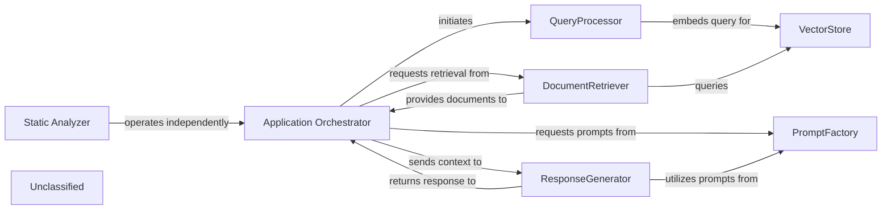
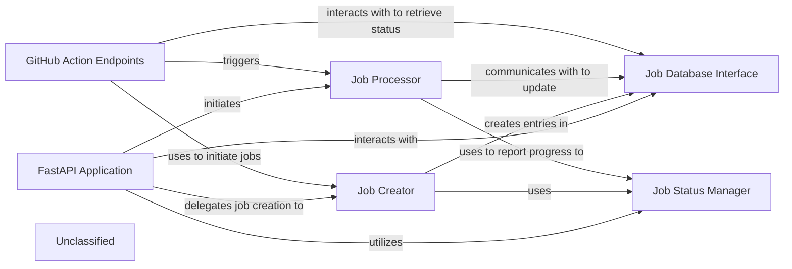
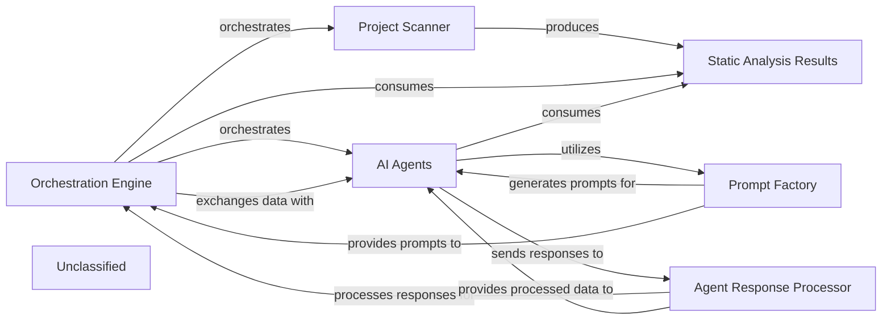
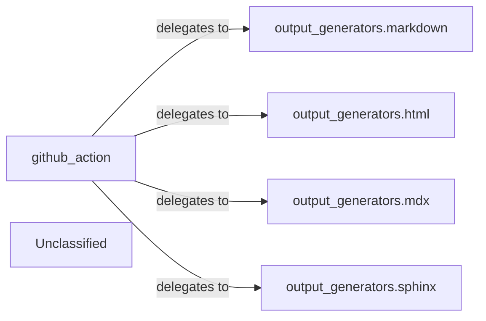
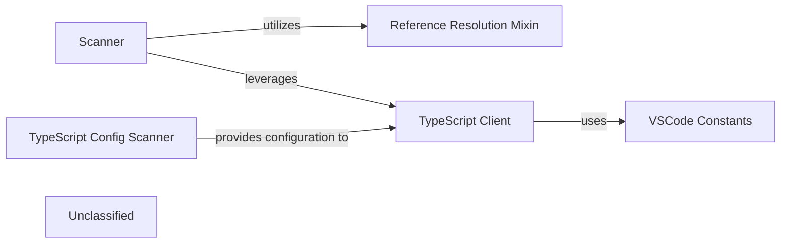
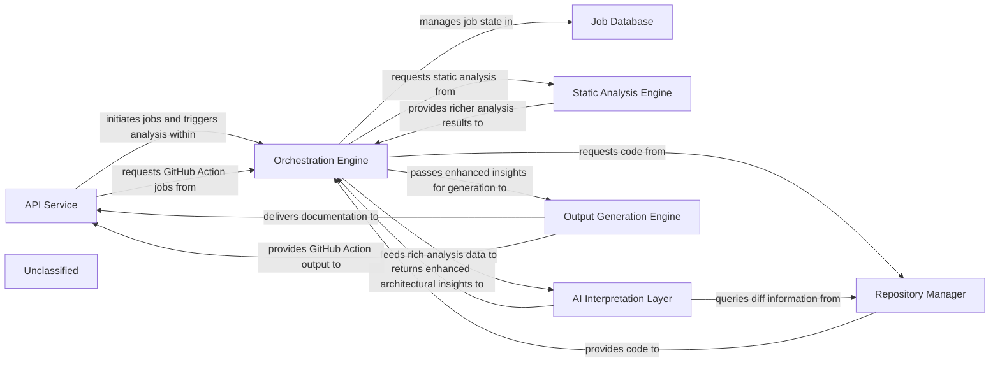

```mermaid
graph LR
    Repository_Manager["Repository Manager"]
    Orchestration_Engine["Orchestration Engine"]
    Static_Analysis_Engine["Static Analysis Engine"]
    AI_Interpretation_Layer["AI Interpretation Layer"]
    Output_Generation_Engine["Output Generation Engine"]
    API_Service["API Service"]
    Job_Database["Job Database"]
    Configuration_Management["Configuration Management"]
    Unclassified["Unclassified"]
    Repository_Manager -- "provides fetched source code to" --> Static_Analysis_Engine
    Repository_Manager -- "queries to retrieve settings for repository access" --> Configuration_Management
    Orchestration_Engine -- "instructs to fetch or update codebase" --> Repository_Manager
    Orchestration_Engine -- "dispatches analysis tasks to" --> Static_Analysis_Engine
    Orchestration_Engine -- "submits jobs to for tracking and persistence" --> Job_Database
    Static_Analysis_Engine -- "sends extracted code insights to for further processing" --> AI_Interpretation_Layer
    Static_Analysis_Engine -- "retrieves analysis rules and configurations from" --> Configuration_Management
    AI_Interpretation_Layer -- "sends interpreted insights and documentation drafts to" --> Output_Generation_Engine
    Output_Generation_Engine -- "provides final documentation and diagrams to for delivery" --> API_Service
    Output_Generation_Engine -- "uses templates and styling rules from" --> Configuration_Management
    API_Service -- "submits new analysis jobs to" --> Orchestration_Engine
    API_Service -- "retrieves final outputs from" --> Output_Generation_Engine
    Job_Database -- "is queried by for job status and results" --> API_Service
    click Repository_Manager href "https://github.com/CodeBoarding/CodeBoarding/blob/main/.codeboarding/Repository_Manager.md" "Details"
    click Orchestration_Engine href "https://github.com/CodeBoarding/CodeBoarding/blob/main/.codeboarding/Orchestration_Engine.md" "Details"
    click Static_Analysis_Engine href "https://github.com/CodeBoarding/CodeBoarding/blob/main/.codeboarding/Static_Analysis_Engine.md" "Details"
    click AI_Interpretation_Layer href "https://github.com/CodeBoarding/CodeBoarding/blob/main/.codeboarding/AI_Interpretation_Layer.md" "Details"
    click Output_Generation_Engine href "https://github.com/CodeBoarding/CodeBoarding/blob/main/.codeboarding/Output_Generation_Engine.md" "Details"
    click API_Service href "https://github.com/CodeBoarding/CodeBoarding/blob/main/.codeboarding/API_Service.md" "Details"
```

## Details

The system orchestrates a Retrieval-Augmented Generation (RAG) process, managed by the `Application Orchestrator`. User queries are first processed by the `QueryProcessor` and embedded for similarity search within the `VectorStore`. The `DocumentRetriever` then fetches relevant documents, which are passed back to the `Application Orchestrator`. The `ResponseGenerator` crafts the final natural language response, leveraging a `PromptFactory` that centralizes and provides structured prompts for various Large Language Models, including specialized prompts for both Gemini Flash and Claude models. A separate `Static Analyzer` component operates independently, focusing on TypeScript configuration scanning.

### Application Orchestrator
Manages the overall application flow, coordinating interactions between QueryProcessor, DocumentRetriever, ResponseGenerator, and leveraging the PromptFactory for agent prompt generation. It receives user queries and delivers final responses, adapting its agent coordination mechanisms due to recent core agent logic refactoring and the new prompt management system.

**Related Classes/Methods**:

- <a href="https://github.com/CodeBoarding/CodeBoarding/blob/mainagents/agent.py" target="_blank" rel="noopener noreferrer">`agents.agent`</a>

### QueryProcessor
Handles incoming user queries, embeds them, and prepares them for similarity search, potentially utilizing refined prompts from the PromptFactory for enhanced query understanding.

**Related Classes/Methods**:

- <a href="https://github.com/CodeBoarding/CodeBoarding/blob/main." target="_blank" rel="noopener noreferrer">`langchain_core.embeddings.Embeddings:embed_query`</a>

### VectorStore
Stores and retrieves document embeddings based on similarity search.

**Related Classes/Methods**:

- `langchain_community.vectorstores.chroma.Chroma:similarity_search`

### DocumentRetriever
Retrieves relevant documents from the vector store.

**Related Classes/Methods**:

- <a href="https://github.com/CodeBoarding/CodeBoarding/blob/main." target="_blank" rel="noopener noreferrer">`langchain_core.retrievers.BaseRetriever:get_relevant_documents`</a>

### ResponseGenerator
Generates a natural language response using a large language model based on the query and retrieved documents, now significantly enhanced by leveraging structured prompts from the PromptFactory, including specialized prompts for models like Gemini Flash and Claude.

**Related Classes/Methods**:

- <a href="https://github.com/CodeBoarding/CodeBoarding/blob/main." target="_blank" rel="noopener noreferrer">`langchain_core.language_models.llms.BaseLLM:invoke`</a>

### PromptFactory
Centralizes the creation and management of prompts for various agents and language models through an abstract factory pattern. It provides a structured and standardized approach to prompt generation, leveraging an AbstractPromptFactory interface and specialized implementations like GeminiFlashPromptsBidirectional, GeminiFlashPromptsUnidirectional, ClaudePromptsBidirectional, and ClaudePromptsUnidirectional. This ensures consistent and optimized interactions with LLMs, notably for Gemini Flash and Claude models, by managing an expanded library of prompts.

**Related Classes/Methods**:

- <a href="https://github.com/CodeBoarding/CodeBoarding/blob/mainagents/prompts/prompt_factory.py#L29-L98" target="_blank" rel="noopener noreferrer">`prompt_factory.PromptFactory`:29-98</a>

### Static Analyzer
A new, independent functional area responsible for performing static analysis, specifically focusing on scanning TypeScript configurations. This component operates in parallel to the core RAG system, providing distinct capabilities without directly altering the RAG data flow.

**Related Classes/Methods**:

- <a href="https://github.com/CodeBoarding/CodeBoarding/blob/mainstatic_analyzer/typescript_config_scanner.py" target="_blank" rel="noopener noreferrer">`static_analyzer.typescript_config_scanner`</a>

### Unclassified
Component for all unclassified files and utility functions (Utility functions/External Libraries/Dependencies)

**Related Classes/Methods**: _None_

### [FAQ](https://github.com/CodeBoarding/GeneratedOnBoardings/tree/main?tab=readme-ov-file#faq)

## Details

The system is built around a `FastAPI Application` that serves as the central entry point for all client interactions. It exposes various API endpoints, including those for general job management and specialized `GitHub Action Endpoints`. The `FastAPI Application` delegates the creation of new documentation generation jobs to the `Job Creator`, which initializes job records and interacts with the `Job Database Interface` for persistent storage. The `Job Status Manager` is crucial for tracking the lifecycle of each job, with updates and retrievals facilitated through the `Job Database Interface`. The core logic for processing documentation generation is encapsulated within the `Job Processor`, an asynchronous component that orchestrates the entire pipeline, from repository cloning to content generation, and reports its progress and results back via the `Job Status Manager` and `Job Database Interface`. The `GitHub Action Endpoints` specifically leverage the `Job Creator` and `Job Processor` to automate documentation generation within GitHub workflows and retrieve job statuses from the `Job Database Interface`.

### FastAPI Application
The core web server, responsible for defining and managing API endpoints, handling incoming HTTP requests, and routing them to appropriate handlers for job initiation, status retrieval, and external integrations. It serves as the primary entry point for all client interactions.

**Related Classes/Methods**:

- <a href="https://github.com/CodeBoarding/CodeBoarding/blob/mainlocal_app.py" target="_blank" rel="noopener noreferrer">`local_app.app`</a>

### Job Creator
Responsible for initializing new documentation generation job records. It assigns unique identifiers and sets the initial status (e.g., PENDING) for each new job, preparing it for processing.

**Related Classes/Methods**:

- <a href="https://github.com/CodeBoarding/CodeBoarding/blob/mainlocal_app.py" target="_blank" rel="noopener noreferrer">`local_app.make_job`</a>

### Job Status Manager
Defines and manages the lifecycle states of documentation generation jobs (e.g., PENDING, RUNNING, COMPLETED, FAILED). It provides a consistent mechanism for updating and retrieving the current status of any job within the system.

**Related Classes/Methods**:

- <a href="https://github.com/CodeBoarding/CodeBoarding/blob/mainlocal_app.py" target="_blank" rel="noopener noreferrer">`local_app.JobStatus`</a>
- <a href="https://github.com/CodeBoarding/CodeBoarding/blob/mainduckdb_crud.py" target="_blank" rel="noopener noreferrer">`duckdb_crud.update_job`</a>
- <a href="https://github.com/CodeBoarding/CodeBoarding/blob/mainduckdb_crud.py" target="_blank" rel="noopener noreferrer">`duckdb_crud.fetch_job`</a>

### Job Database Interface
Provides an abstraction layer for persistent storage and retrieval of job-related data. It encapsulates CRUD (Create, Read, Update, Delete) operations for job records, ensuring data integrity and accessibility across the API service.

**Related Classes/Methods**:

- <a href="https://github.com/CodeBoarding/CodeBoarding/blob/mainduckdb_crud.py" target="_blank" rel="noopener noreferrer">`duckdb_crud.init_db`</a>
- <a href="https://github.com/CodeBoarding/CodeBoarding/blob/mainduckdb_crud.py" target="_blank" rel="noopener noreferrer">`duckdb_crud.insert_job`</a>
- <a href="https://github.com/CodeBoarding/CodeBoarding/blob/mainduckdb_crud.py" target="_blank" rel="noopener noreferrer">`duckdb_crud.fetch_job`</a>
- <a href="https://github.com/CodeBoarding/CodeBoarding/blob/mainduckdb_crud.py" target="_blank" rel="noopener noreferrer">`duckdb_crud.update_job`</a>
- <a href="https://github.com/CodeBoarding/CodeBoarding/blob/mainduckdb_crud.py" target="_blank" rel="noopener noreferrer">`duckdb_crud.fetch_all_jobs`</a>

### Job Processor
An asynchronous component that orchestrates the end-to-end documentation generation pipeline for a single job. It handles repository cloning, invokes the core analysis and generation logic, and manages the processing results, updating job status throughout its execution.

**Related Classes/Methods**:

- <a href="https://github.com/CodeBoarding/CodeBoarding/blob/mainlocal_app.py" target="_blank" rel="noopener noreferrer">`local_app.generate_onboarding`</a>

### GitHub Action Endpoints
A specialized set of API endpoints within the FastAPI Application designed for seamless integration with GitHub Actions workflows. These endpoints facilitate automated job initiation and status monitoring specifically for GitHub-driven documentation generation requests.

**Related Classes/Methods**:

- <a href="https://github.com/CodeBoarding/CodeBoarding/blob/mainlocal_app.py" target="_blank" rel="noopener noreferrer">`local_app.start_docs_generation_job`</a>
- <a href="https://github.com/CodeBoarding/CodeBoarding/blob/mainlocal_app.py" target="_blank" rel="noopener noreferrer">`local_app.get_github_action_job_status`</a>

### Unclassified
Component for all unclassified files and utility functions (Utility functions/External Libraries/Dependencies)

**Related Classes/Methods**: _None_

### [FAQ](https://github.com/CodeBoarding/GeneratedOnBoardings/tree/main?tab=readme-ov-file#faq)

## Details

The system operates around an Orchestration Engine that manages the entire documentation generation pipeline. It initiates the process by leveraging the Project Scanner to gather static analysis data, which is then stored in Static Analysis Results. The Orchestration Engine then coordinates a suite of AI Agents, each with specialized roles, to analyze this data. These agents utilize a sophisticated Prompt Factory to construct dynamic prompts for the LLM, enabling both "bidirectional" and "unidirectional" communication patterns. Agent responses are processed by the Agent Response Processor before being fed back to the Orchestration Engine for further coordination, feedback application, and final result saving. This architecture emphasizes a modular, agent-based approach with a highly adaptable prompting mechanism for intelligent code analysis and documentation generation.

### Orchestration Engine [[Expand]](./Orchestration_Engine.md)
The central control unit that manages the entire documentation generation pipeline, coordinating all analysis and generation stages. It initializes and coordinates AI agents, handles pre-analysis, processes components, determines update needs, applies feedback, and saves results.

**Related Classes/Methods**:

- <a href="https://github.com/CodeBoarding/CodeBoarding/blob/maindiagram_analysis/diagram_generator.py" target="_blank" rel="noopener noreferrer">`diagram_generator`</a>

### Project Scanner
A component responsible for initiating and collecting static analysis data from the codebase, including specialized scanning for TypeScript configurations, serving as the primary input for the analysis pipeline.

**Related Classes/Methods**:

- <a href="https://github.com/CodeBoarding/CodeBoarding/blob/mainstatic_analyzer/scanner.py" target="_blank" rel="noopener noreferrer">`scanner`</a>
- <a href="https://github.com/CodeBoarding/CodeBoarding/blob/mainstatic_analyzer/typescript_config_scanner.py" target="_blank" rel="noopener noreferrer">`typescript_config_scanner`</a>

### Static Analysis Results
A data structure that holds the comprehensive results of static analysis, making this information accessible to the Orchestration Engine and AI agents.

**Related Classes/Methods**:

- <a href="https://github.com/CodeBoarding/CodeBoarding/blob/mainstatic_analyzer/analysis_result.py" target="_blank" rel="noopener noreferrer">`analysis_result`</a>

### AI Agents
A collective component representing all specialized AI agents (MetaAgent, AbstractionAgent, DetailsAgent, PlannerAgent, ValidatorAgent) responsible for various stages of code analysis and documentation generation. These agents now incorporate advanced prompting strategies for more complex reasoning.

**Related Classes/Methods**:

- <a href="https://github.com/CodeBoarding/CodeBoarding/blob/mainagents/meta_agent.py" target="_blank" rel="noopener noreferrer">`meta_agent`</a>
- <a href="https://github.com/CodeBoarding/CodeBoarding/blob/mainagents/abstraction_agent.py" target="_blank" rel="noopener noreferrer">`abstraction_agent`</a>
- <a href="https://github.com/CodeBoarding/CodeBoarding/blob/mainagents/details_agent.py" target="_blank" rel="noopener noreferrer">`details_agent`</a>
- <a href="https://github.com/CodeBoarding/CodeBoarding/blob/mainagents/planner_agent.py" target="_blank" rel="noopener noreferrer">`planner_agent`</a>
- <a href="https://github.com/CodeBoarding/CodeBoarding/blob/mainagents/validator_agent.py" target="_blank" rel="noopener noreferrer">`validator_agent`</a>

### Prompt Factory
Responsible for dynamically constructing and managing prompts for the LLM, supporting both "bidirectional" and "unidirectional" communication patterns, enabling sophisticated reasoning and interaction strategies for the AI Agents.

**Related Classes/Methods**:

- <a href="https://github.com/CodeBoarding/CodeBoarding/blob/mainagents/prompts/prompt_factory.py#L37-L53" target="_blank" rel="noopener noreferrer">`prompt_factory`:37-53</a>
- <a href="https://github.com/CodeBoarding/CodeBoarding/blob/mainagents/prompts/claude_prompts_bidirectional.py" target="_blank" rel="noopener noreferrer">`claude_prompts_bidirectional`</a>
- <a href="https://github.com/CodeBoarding/CodeBoarding/blob/mainagents/prompts/claude_prompts_unidirectional.py" target="_blank" rel="noopener noreferrer">`claude_prompts_unidirectional`</a>

### Agent Response Processor
Handles the parsing, validation, and structuring of responses received from the LLM, ensuring that the output is correctly interpreted and formatted for subsequent processing by the Orchestration Engine and other AI Agents.

**Related Classes/Methods**:

- <a href="https://github.com/CodeBoarding/CodeBoarding/blob/mainagents/agent_responses.py" target="_blank" rel="noopener noreferrer">`agent_responses`</a>

### Unclassified
Component for all unclassified files and utility functions (Utility functions/External Libraries/Dependencies)

**Related Classes/Methods**: _None_

### [FAQ](https://github.com/CodeBoarding/GeneratedOnBoardings/tree/main?tab=readme-ov-file#faq)

## Details

The Output Generation Engine subsystem transforms validated architectural insights into various documentation formats and integrates with external systems like GitHub Actions. The main flow involves the `github_action` component acting as the primary entry point, orchestrating the selection and execution of specific output format generators (Markdown, HTML, MDX, Sphinx/RST) based on user configuration. Its purpose is to provide diverse documentation outputs and enable seamless integration within a CI/CD environment.

### github_action
Acts as the primary entry point for initiating output generation within a GitHub Actions workflow. It orchestrates the selection and execution of specific output format generators based on user configuration.

**Related Classes/Methods**:

- <a href="https://github.com/CodeBoarding/CodeBoarding/blob/maingithub_action.py" target="_blank" rel="noopener noreferrer">`github_action`</a>

### output_generators.markdown
Generates documentation in Markdown format.

**Related Classes/Methods**:

- <a href="https://github.com/CodeBoarding/CodeBoarding/blob/mainoutput_generators/markdown.py" target="_blank" rel="noopener noreferrer">`output_generators.markdown`</a>

### output_generators.html
Generates documentation in HTML format.

**Related Classes/Methods**:

- <a href="https://github.com/CodeBoarding/CodeBoarding/blob/mainoutput_generators/html.py" target="_blank" rel="noopener noreferrer">`output_generators.html`</a>

### output_generators.mdx
Generates documentation in MDX (Markdown with JSX) format.

**Related Classes/Methods**:

- <a href="https://github.com/CodeBoarding/CodeBoarding/blob/mainoutput_generators/mdx.py" target="_blank" rel="noopener noreferrer">`output_generators.mdx`</a>

### output_generators.sphinx
Generates documentation in reStructuredText (RST) format, specifically tailored for Sphinx documentation projects, including embedded Mermaid diagrams.

**Related Classes/Methods**:

- <a href="https://github.com/CodeBoarding/CodeBoarding/blob/mainoutput_generators/sphinx.py" target="_blank" rel="noopener noreferrer">`output_generators.sphinx`</a>

### Unclassified
Component for all unclassified files and utility functions (Utility functions/External Libraries/Dependencies)

**Related Classes/Methods**: _None_

### [FAQ](https://github.com/CodeBoarding/GeneratedOnBoardings/tree/main?tab=readme-ov-file#faq)

## Details

The system is designed around a core `Orchestration Engine` that manages the entire codebase analysis workflow. This engine interacts with the `Repository Manager` to acquire source code, which is then passed to the `Static Analysis Engine` for initial processing. The raw analysis data is subsequently fed into the `AI Interpretation Layer`, where Large Language Models generate insights and documentation drafts. The `Output Generation Engine` takes these drafts and formats them into various consumable outputs. An `API Service` provides the external interface for users to initiate analysis jobs, monitor their status, and retrieve results. All job-related information is persisted in the `Job Database`, while the `Configuration Management` component centralizes system settings and credentials, ensuring consistent operation across all components.

### Repository Manager [[Expand]](./Repository_Manager.md)
Manages all interactions with source code repositories, including cloning, fetching, and extracting version differences, to provide the necessary codebase for analysis.

**Related Classes/Methods**:

- <a href="https://github.com/CodeBoarding/CodeBoarding/blob/mainagents/diff_analyzer.py#L21-L32" target="_blank" rel="noopener noreferrer">`__init__`:21-32</a>
- <a href="https://github.com/CodeBoarding/CodeBoarding/blob/mainrepo_utils/git_diff.py#L27-L76" target="_blank" rel="noopener noreferrer">`git_diff`:27-76</a>

### Orchestration Engine [[Expand]](./Orchestration_Engine.md)
Coordinates the overall workflow of codebase analysis, managing the sequence of operations from repository ingestion to final output generation. It acts as the central control for job execution.

**Related Classes/Methods**:

- <a href="https://github.com/CodeBoarding/CodeBoarding/blob/mainagents/diff_analyzer.py" target="_blank" rel="noopener noreferrer">`agents.diff_analyzer.DiffAnalyzingAgent`</a>
- <a href="https://github.com/CodeBoarding/CodeBoarding/blob/mainagents/agent.py" target="_blank" rel="noopener noreferrer">`agents.agent.CodeBoardingAgent`</a>

### Static Analysis Engine [[Expand]](./Static_Analysis_Engine.md)
Performs in-depth analysis of the source code provided by the Repository Manager, extracting structural information, dependencies, and other relevant metrics without executing the code.

**Related Classes/Methods**:

- <a href="https://github.com/CodeBoarding/CodeBoarding/blob/mainstatic_analyzer/scanner.py" target="_blank" rel="noopener noreferrer">`static_analyzer.scanner.ProjectScanner`</a>

### AI Interpretation Layer [[Expand]](./AI_Interpretation_Layer.md)
Processes the raw analysis data from the Static Analysis Engine using Large Language Models (LLMs) to interpret code context, identify architectural patterns, and generate human-readable insights and documentation drafts.

**Related Classes/Methods**:

- <a href="https://github.com/CodeBoarding/CodeBoarding/blob/mainagents/agent.py" target="_blank" rel="noopener noreferrer">`agents.agent.CodeBoardingAgent`</a>

### Output Generation Engine [[Expand]](./Output_Generation_Engine.md)
Formats and renders the interpreted insights and documentation into various output formats (e.g., Mermaid diagrams, Markdown, JSON), making them consumable by users or other systems.

**Related Classes/Methods**:

- <a href="https://github.com/CodeBoarding/CodeBoarding/blob/mainoutput_generators/markdown.py" target="_blank" rel="noopener noreferrer">`output_generators.markdown`</a>

### API Service [[Expand]](./API_Service.md)
Provides external interfaces for users and other systems to interact with the tool, enabling job submission, status monitoring, and retrieval of analysis results and generated documentation.

**Related Classes/Methods**:

- <a href="https://github.com/CodeBoarding/CodeBoarding/blob/mainagents/agent.py" target="_blank" rel="noopener noreferrer">`agents.agent.CodeBoardingAgent`</a>

### Job Database
Persists information about analysis jobs, their status, parameters, and results, ensuring durability and enabling asynchronous processing and historical tracking.

**Related Classes/Methods**:

- <a href="https://github.com/CodeBoarding/CodeBoarding/blob/mainagents/diff_analyzer.py#L39-L41" target="_blank" rel="noopener noreferrer">`agents/diff_analyzer.py`:39-41</a>
- <a href="https://github.com/CodeBoarding/CodeBoarding/blob/mainagents/diff_analyzer.py#L48-L53" target="_blank" rel="noopener noreferrer">`agents/diff_analyzer.py`:48-53</a>

### Configuration Management
Centralizes and manages all system configurations, including repository access credentials, analysis rules, LLM API keys, and output preferences, ensuring consistent behavior across components.

**Related Classes/Methods**:

- <a href="https://github.com/CodeBoarding/CodeBoarding/blob/mainagents/agent.py#L55-L64" target="_blank" rel="noopener noreferrer">`agents.agent.CodeBoardingAgent`:55-64</a>

### Unclassified
Component for all unclassified files and utility functions (Utility functions/External Libraries/Dependencies)

**Related Classes/Methods**: _None_

### [FAQ](https://github.com/CodeBoarding/GeneratedOnBoardings/tree/main?tab=readme-ov-file#faq)

## Details

The static analysis subsystem is responsible for ingesting source code, analyzing its structure, and resolving references within the codebase. The Scanner component initiates the analysis by parsing code and generating an initial understanding of the project's languages and file types. For TypeScript and JavaScript projects, the TypeScript Client interacts with an external Language Server Protocol (LSP) server to obtain rich semantic information, which is crucial for deep code understanding. The TypeScript Config Scanner plays a vital role in this process by identifying and interpreting TypeScript configuration files, providing essential context for the TypeScript Client's operations. The Reference Resolution Mixin provides the core functionality for resolving code references across different languages, enabling the system to trace definitions, usages, and call hierarchies. Finally, VSCode Constants provides configuration parameters and definitions relevant to the VS Code environment, indicating the system's integration with or dependency on the VS Code ecosystem. This architecture allows for a flexible and extensible static analysis pipeline that can adapt to various programming languages and project configurations.

### Scanner
Performs the initial parsing, lexical analysis, and Abstract Syntax Tree (AST) generation for various programming languages. It's the primary component for raw code ingestion and initial structural analysis.

**Related Classes/Methods**:

- <a href="https://github.com/CodeBoarding/CodeBoarding/blob/mainstatic_analyzer/scanner.py" target="_blank" rel="noopener noreferrer">`static_analyzer.scanner.ProjectScanner`</a>

### TypeScript Client
Manages communication with an external TypeScript Language Server (LSP). It leverages LSP capabilities to retrieve rich, semantic information about TypeScript code, such as type definitions, symbol references, and diagnostics, going beyond basic syntactic analysis.

**Related Classes/Methods**:

- <a href="https://github.com/CodeBoarding/CodeBoarding/blob/mainstatic_analyzer/lsp_client/typescript_client.py" target="_blank" rel="noopener noreferrer">`static_analyzer.lsp_client.typescript_client.TypeScriptClient`</a>

### Reference Resolution Mixin
Provides a set of functionalities or methods for resolving code references (e.g., finding definitions, usages, and call hierarchies). This is a critical capability for deep code understanding and navigation.

**Related Classes/Methods**:

- <a href="https://github.com/CodeBoarding/CodeBoarding/blob/mainstatic_analyzer/reference_resolve_mixin.py" target="_blank" rel="noopener noreferrer">`static_analyzer.reference_resolve_mixin.ReferenceResolverMixin`</a>

### TypeScript Config Scanner
Specifically designed to parse and interpret TypeScript configuration files (e.g., `tsconfig.json`). It extracts project-specific settings, module resolution strategies, and compilation options, which are crucial for accurate TypeScript analysis.

**Related Classes/Methods**:

- <a href="https://github.com/CodeBoarding/CodeBoarding/blob/mainstatic_analyzer/typescript_config_scanner.py#L8-L46" target="_blank" rel="noopener noreferrer">`static_analyzer.typescript_config_scanner.TypeScriptConfigScanner`:8-46</a>

### VSCode Constants
Defines constants, enums, or configuration parameters that are specific to the Visual Studio Code environment. Its presence indicates a strong integration or dependency on VS Code's ecosystem, influencing how analysis is performed or how results are consumed within a VS Code context.

**Related Classes/Methods**:

- <a href="https://github.com/CodeBoarding/CodeBoarding/blob/mainvscode_constants.py" target="_blank" rel="noopener noreferrer">`vscode_constants`</a>

### Unclassified
Component for all unclassified files and utility functions (Utility functions/External Libraries/Dependencies)

**Related Classes/Methods**: _None_

### [FAQ](https://github.com/CodeBoarding/GeneratedOnBoardings/tree/main?tab=readme-ov-file#faq)

## Details

The CodeBoarding project is structured around a robust, modular architecture designed for automated software documentation generation. At its core, an Orchestration Engine manages the entire workflow, from receiving user requests via the API Service to delivering final documentation through the Output Generation Engine. A critical aspect of this system is the AI Interpretation Layer, which has been significantly enhanced to support multiple Large Language Models (LLMs), including Gemini Flash and Claude, through a sophisticated and extensible prompt management system. This layer processes detailed static analysis data provided by the Static Analysis Engine and repository information from the Repository Manager to generate high-level architectural insights. All job-related data is persistently managed by the Job Database. This design emphasizes clear component boundaries, enabling efficient data flow and facilitating future expansion of supported languages, LLMs, and output formats. The CodeBoarding architecture is a pipeline-driven system centered around an Orchestration Engine that manages the automated generation of software documentation. User interactions and job requests are handled by the API Service, which then delegates the workflow to the Orchestration Engine. This engine coordinates with the Job Database for state management, the Repository Manager for source code access, and the Static Analysis Engine for in-depth code analysis. The core intelligence resides in the AI Interpretation Layer, which now robustly supports multiple LLMs, including Gemini Flash and Claude, through a sophisticated and extensible prompt management system, transforming static analysis data into high-level architectural insights. Finally, the Output Generation Engine converts these insights into various documentation formats, completing the cycle by delivering them back through the API Service. This modular design ensures scalability, maintainability, and adaptability to evolving AI models and documentation needs.

### API Service [[Expand]](./API_Service.md)
The external interface for CodeBoarding, handling user requests, job initiation, status retrieval, and integrating with GitHub Actions for automated documentation generation.

**Related Classes/Methods**:

- <a href="https://github.com/CodeBoarding/CodeBoarding/blob/mainlocal_app.py" target="_blank" rel="noopener noreferrer">`local_app`</a>

### Job Database
Persistent storage for managing the lifecycle, status, and results of all documentation generation jobs.

**Related Classes/Methods**:

- <a href="https://github.com/CodeBoarding/CodeBoarding/blob/mainduckdb_crud.py" target="_blank" rel="noopener noreferrer">`duckdb_crud`</a>

### Orchestration Engine [[Expand]](./Orchestration_Engine.md)
The central control unit that manages the entire documentation generation pipeline, coordinating all analysis and generation stages.

**Related Classes/Methods**:

- <a href="https://github.com/CodeBoarding/CodeBoarding/blob/maindiagram_analysis/diagram_generator.py" target="_blank" rel="noopener noreferrer">`diagram_generator`</a>

### Repository Manager [[Expand]](./Repository_Manager.md)
Manages all interactions with source code repositories, including cloning, fetching, and extracting version differences.

**Related Classes/Methods**:

- <a href="https://github.com/CodeBoarding/CodeBoarding/blob/mainagents/diff_analyzer.py#L21-L32" target="_blank" rel="noopener noreferrer">`__init__`:21-32</a>
- <a href="https://github.com/CodeBoarding/CodeBoarding/blob/mainrepo_utils/git_diff.py#L27-L76" target="_blank" rel="noopener noreferrer">`git_diff`:27-76</a>

### Static Analysis Engine [[Expand]](./Static_Analysis_Engine.md)
Performs deep, language-specific analysis of source code, now explicitly including reference resolution capabilities, enhanced integration with the VS Code environment, and comprehensive TypeScript configuration scanning for deeper analysis of TypeScript projects. It potentially leverages VS Code-specific settings or protocols.

**Related Classes/Methods**:

- <a href="https://github.com/CodeBoarding/CodeBoarding/blob/mainstatic_analyzer/scanner.py#L13-L82" target="_blank" rel="noopener noreferrer">`scanner`:13-82</a>
- <a href="https://github.com/CodeBoarding/CodeBoarding/blob/mainstatic_analyzer/lsp_client/typescript_client.py#L10-L214" target="_blank" rel="noopener noreferrer">`client`:10-214</a>
- <a href="https://github.com/CodeBoarding/CodeBoarding/blob/mainagents/abstraction_agent.py" target="_blank" rel="noopener noreferrer">`analysis_result`</a>
- <a href="https://github.com/CodeBoarding/CodeBoarding/blob/mainstatic_analyzer/reference_resolve_mixin.py" target="_blank" rel="noopener noreferrer">`reference_resolve_mixin`</a>
- <a href="https://github.com/CodeBoarding/CodeBoarding/blob/mainvscode_constants.py" target="_blank" rel="noopener noreferrer">`vscode_constants`</a>
- <a href="https://github.com/CodeBoarding/CodeBoarding/blob/mainstatic_analyzer/typescript_config_scanner.py" target="_blank" rel="noopener noreferrer">`typescript_config_scanner`</a>

### AI Interpretation Layer [[Expand]](./AI_Interpretation_Layer.md)
A collection of specialized AI agents that perform sophisticated interpretation of static analysis data, generating enhanced high-level architectural insights, including detailed abstractions, refined planning, robust validation, and comprehensive diff analysis. This layer now features a significantly enhanced prompt management system, utilizing an `abstract_prompt_factory` and concrete implementations (e.g., `gemini_flash_prompts_bidirectional`, `gemini_flash_prompts_unidirectional`, `claude_prompts_bidirectional`, `claude_prompts_unidirectional`) for structured prompt definition, selection, and application, supporting various language models (e.g., Gemini Flash, Claude) and prompting strategies. The `prompt_factory` has been refactored to integrate this modular and extensible system.

**Related Classes/Methods**:

- <a href="https://github.com/CodeBoarding/CodeBoarding/blob/maindiagram_analysis/diagram_generator.py" target="_blank" rel="noopener noreferrer">`meta_agent`</a>
- <a href="https://github.com/CodeBoarding/CodeBoarding/blob/mainagents/abstraction_agent.py" target="_blank" rel="noopener noreferrer">`abstraction_agent`</a>
- <a href="https://github.com/CodeBoarding/CodeBoarding/blob/mainagents/details_agent.py" target="_blank" rel="noopener noreferrer">`details_agent`</a>
- <a href="https://github.com/CodeBoarding/CodeBoarding/blob/maindiagram_analysis/diagram_generator.py" target="_blank" rel="noopener noreferrer">`planner_agent`</a>
- <a href="https://github.com/CodeBoarding/CodeBoarding/blob/maindiagram_analysis/diagram_generator.py" target="_blank" rel="noopener noreferrer">`validator_agent`</a>
- <a href="https://github.com/CodeBoarding/CodeBoarding/blob/mainagents/diff_analyzer.py" target="_blank" rel="noopener noreferrer">`diff_analyzer`</a>
- <a href="https://github.com/CodeBoarding/CodeBoarding/blob/mainagents/agent.py" target="_blank" rel="noopener noreferrer">`agent`</a>
- <a href="https://github.com/CodeBoarding/CodeBoarding/blob/mainagents/agent_responses.py" target="_blank" rel="noopener noreferrer">`agent_responses`</a>
- <a href="https://github.com/CodeBoarding/CodeBoarding/blob/mainagents/details_agent.py" target="_blank" rel="noopener noreferrer">`prompts`</a>
- <a href="https://github.com/CodeBoarding/CodeBoarding/blob/mainagents/prompts/abstract_prompt_factory.py" target="_blank" rel="noopener noreferrer">`abstract_prompt_factory`</a>
- <a href="https://github.com/CodeBoarding/CodeBoarding/blob/mainagents/prompts/gemini_flash_prompts_bidirectional.py" target="_blank" rel="noopener noreferrer">`gemini_flash_prompts_bidirectional`</a>
- <a href="https://github.com/CodeBoarding/CodeBoarding/blob/mainagents/prompts/gemini_flash_prompts_unidirectional.py" target="_blank" rel="noopener noreferrer">`gemini_flash_prompts_unidirectional`</a>
- <a href="https://github.com/CodeBoarding/CodeBoarding/blob/mainagents/prompts/claude_prompts_bidirectional.py" target="_blank" rel="noopener noreferrer">`claude_prompts_bidirectional`</a>
- <a href="https://github.com/CodeBoarding/CodeBoarding/blob/mainagents/prompts/claude_prompts_unidirectional.py" target="_blank" rel="noopener noreferrer">`claude_prompts_unidirectional`</a>
- <a href="https://github.com/CodeBoarding/CodeBoarding/blob/mainagents/prompts/prompt_factory.py#L37-L53" target="_blank" rel="noopener noreferrer">`prompt_factory`:37-53</a>

### Output Generation Engine [[Expand]](./Output_Generation_Engine.md)
Transforms the final, validated architectural insights into various human-readable and diagram-friendly documentation formats, with enhanced capabilities for specific output formats and external integrations like GitHub Actions.

**Related Classes/Methods**:

- <a href="https://github.com/CodeBoarding/CodeBoarding/blob/maingithub_action.py#L37-L51" target="_blank" rel="noopener noreferrer">`html`:37-51</a>
- <a href="https://github.com/CodeBoarding/CodeBoarding/blob/maingithub_action.py#L20-L34" target="_blank" rel="noopener noreferrer">`markdown`:20-34</a>
- <a href="https://github.com/CodeBoarding/CodeBoarding/blob/maingithub_action.py#L54-L68" target="_blank" rel="noopener noreferrer">`mdx`:54-68</a>
- <a href="https://github.com/CodeBoarding/CodeBoarding/blob/mainoutput_generators/sphinx.py" target="_blank" rel="noopener noreferrer">`sphinx`</a>
- <a href="https://github.com/CodeBoarding/CodeBoarding/blob/maingithub_action.py" target="_blank" rel="noopener noreferrer">`github_action`</a>

### Unclassified
Component for all unclassified files and utility functions (Utility functions/External Libraries/Dependencies)

**Related Classes/Methods**: _None_

### Unclassified
Component for all unclassified files and utility functions (Utility functions/External Libraries/Dependencies)

**Related Classes/Methods**: _None_

### Unclassified
Component for all unclassified files and utility functions (Utility functions/External Libraries/Dependencies)

**Related Classes/Methods**: _None_

### [FAQ](https://github.com/CodeBoarding/GeneratedOnBoardings/tree/main?tab=readme-ov-file#faq)

