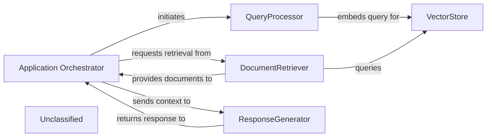
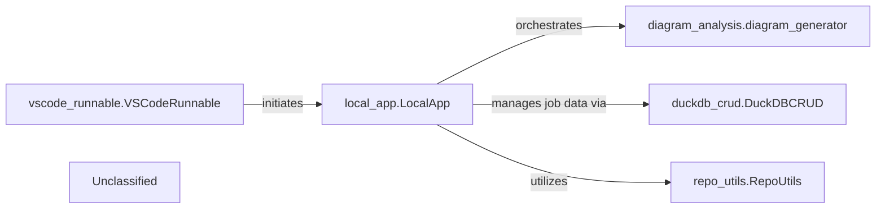
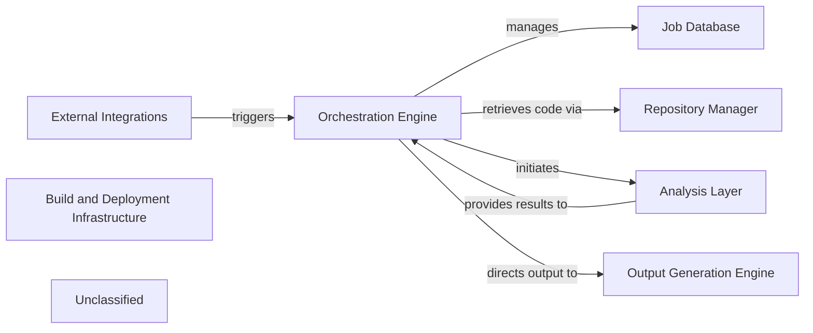
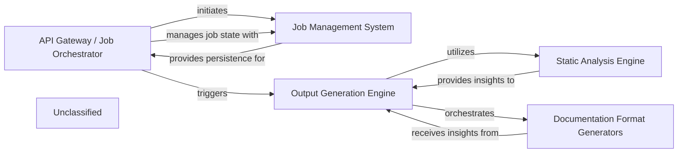
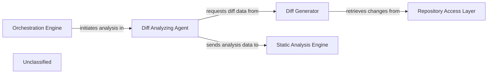
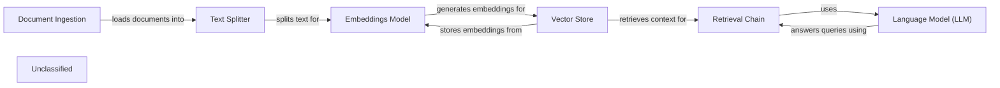
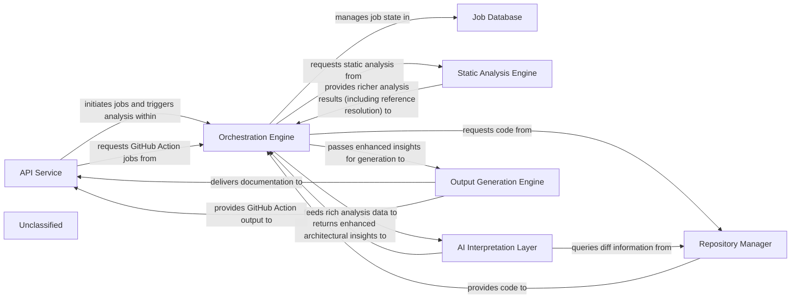

## Details

The recent architectural changes primarily involve a significant refactoring of core agent logic and an enhancement of static analysis capabilities. The refactoring in `agents/agent.py` suggests a simplification or re-organization of how agents are defined and interact, directly impacting the `Application Orchestrator`'s role in coordinating agents and the `QueryProcessor`'s utilization of agent logic. Concurrently, the `static_analyzer/reference_resolve_mixin.py` has been substantially expanded, bolstering the system's static analysis features within the `Unclassified` component. While this enhancement offers new potential, its direct integration into the primary data flow of `QueryProcessor` or `ResponseGenerator` is currently a potential rather than a confirmed critical interaction. The system's architecture is centered around an `Application Orchestrator` that manages the overall flow from user query to generated response. The `QueryProcessor` handles initial query processing and embedding, preparing data for the `VectorStore`, which serves as the central repository for document embeddings. The `DocumentRetriever` interfaces with the `VectorStore` to fetch relevant information, which is then passed to the `ResponseGenerator` for natural language output. Recent refactoring in core agent logic has streamlined how the `Application Orchestrator` coordinates agents and how the `QueryProcessor` utilizes agent-related functionalities. Additionally, the `Unclassified` component now encompasses significantly enhanced static analysis capabilities, offering potential for future integration into core processing pathways.

### Application Orchestrator
Manages the overall application flow, coordinating interactions between `QueryProcessor`, `DocumentRetriever`, and `ResponseGenerator`. It receives user queries and delivers final responses, adapting its agent coordination mechanisms due to recent core agent logic refactoring.

**Related Classes/Methods**:

- <a href="https://github.com/CodeBoarding/CodeBoarding/blob/mainagents/agent.py" target="_blank" rel="noopener noreferrer">`agents.agent`</a>

### QueryProcessor
Handles incoming user queries, embeds them, and prepares them for similarity search, now utilizing a potentially streamlined agent logic due to recent refactoring.

**Related Classes/Methods**:

### VectorStore
Stores and retrieves document embeddings based on similarity search.

**Related Classes/Methods**:

- `langchain_community.vectorstores.chroma.Chroma:similarity_search`

### DocumentRetriever
Retrieves relevant documents from the vector store.

**Related Classes/Methods**:

### ResponseGenerator
Generates a natural language response using a large language model based on the query and retrieved documents.

**Related Classes/Methods**:

### Unclassified
Component for unclassified files, external libraries, and utility functions, including significantly enhanced static analysis capabilities for reference resolution.

**Related Classes/Methods**:

- `static_analyzer.reference_resolve_mixin`

### Unclassified
Component for all unclassified files and utility functions (Utility functions/External Libraries/Dependencies)

**Related Classes/Methods**: _None_

### [FAQ](https://github.com/CodeBoarding/GeneratedOnBoardings/tree/main?tab=readme-ov-file#faq)

## Details

The CodeBoarding system's local architecture is centered around the `local_app.LocalApp`, which acts as the primary interface for users and the VS Code extension. The `vscode_runnable.VSCodeRunnable` component represents the external VS Code extension, initiating analysis jobs through `local_app.LocalApp`. Upon receiving a request, `local_app.LocalApp` orchestrates the `diagram_analysis.diagram_generator` to perform the core code analysis and diagram generation. Throughout this process, `local_app.LocalApp` interacts with `duckdb_crud.DuckDBCRUD` for managing and persisting analysis job metadata and status. Additionally, `repo_utils.RepoUtils` provides essential repository-related functionalities, such as code fetching, which `local_app.LocalApp` utilizes to prepare the codebase for analysis. This structure ensures a clear separation of concerns, with `local_app.LocalApp` coordinating the workflow, `diagram_analysis.diagram_generator` handling the core logic, `duckdb_crud.DuckDBCRUD` managing data persistence, and `repo_utils.RepoUtils` providing foundational repository operations.

### local_app.LocalApp
Serves as the primary local interface for CodeBoarding, enabling local users and the VS Code extension to initiate, manage, and retrieve the status of analysis jobs, and to trigger documentation generation. It acts as a local API endpoint, orchestrating interactions with core analysis and data management components.

**Related Classes/Methods**:

- <a href="https://github.com/CodeBoarding/CodeBoarding/blob/mainlocal_app.py" target="_blank" rel="noopener noreferrer">`local_app.LocalApp`</a>

### diagram_analysis.diagram_generator
Orchestrates the comprehensive code analysis and diagram generation workflow, initiated by the `local_app.LocalApp`. It's responsible for the core value proposition of the platform.

**Related Classes/Methods**:

- <a href="https://github.com/CodeBoarding/CodeBoarding/blob/maindiagram_analysis/diagram_generator.py" target="_blank" rel="noopener noreferrer">`diagram_analysis.diagram_generator`</a>

### duckdb_crud.DuckDBCRUD
Manages persistent storage and retrieval of analysis job metadata and status, crucial for `local_app.LocalApp` to track and report on job progress.

**Related Classes/Methods**:

- <a href="https://github.com/CodeBoarding/CodeBoarding/blob/mainduckdb_crud.py" target="_blank" rel="noopener noreferrer">`duckdb_crud.DuckDBCRUD`</a>

### repo_utils.RepoUtils
Provides repository-related operations such as cloning or fetching diffs, potentially utilized by `local_app.LocalApp` to prepare repositories for analysis.

**Related Classes/Methods**:

- <a href="https://github.com/CodeBoarding/CodeBoarding/blob/mainrepo_utils/__init__.py" target="_blank" rel="noopener noreferrer">`repo_utils.RepoUtils`</a>

### vscode_runnable.VSCodeRunnable
An external client that consumes services provided by the `local_app.LocalApp` for VS Code extension functionalities, representing a key external integration point.

**Related Classes/Methods**:

- <a href="https://github.com/CodeBoarding/CodeBoarding/blob/mainvscode_runnable.py" target="_blank" rel="noopener noreferrer">`vscode_runnable.VSCodeRunnable`</a>

### Unclassified
Component for all unclassified files and utility functions (Utility functions/External Libraries/Dependencies)

**Related Classes/Methods**: _None_

### [FAQ](https://github.com/CodeBoarding/GeneratedOnBoardings/tree/main?tab=readme-ov-file#faq)

## Details

The system is designed around a central `Orchestration Engine` that coordinates the entire documentation and diagram generation process. This engine is activated by `External Integrations` and manages job states through the `Job Database`. It retrieves source code via the `Repository Manager` and then delegates complex code understanding to the `Analysis Layer`, which encompasses static analysis, AI interpretation, and diagram-specific data extraction. Once analysis is complete, the `Orchestration Engine` directs the `Output Generation Engine` to format and produce the final documentation and visual diagrams. Underlying this operational flow, the `Build and Deployment Infrastructure` ensures the project's proper assembly, dependency management, and distribution, providing the foundational support for all runtime components.

### Orchestration Engine [[Expand]](./Orchestration_Engine.md)
The central control subsystem responsible for initiating, managing, and coordinating all analysis and documentation generation jobs, acting as the primary orchestrator for the end-to-end workflow.

**Related Classes/Methods**:

- <a href="https://github.com/CodeBoarding/CodeBoarding/blob/mainlocal_app.py" target="_blank" rel="noopener noreferrer">`local_app.py:start_generation_job`</a>
- <a href="https://github.com/CodeBoarding/CodeBoarding/blob/mainlocal_app.py" target="_blank" rel="noopener noreferrer">`local_app.py:start_docs_generation_job`</a>
- <a href="https://github.com/CodeBoarding/CodeBoarding/blob/mainlocal_app.py" target="_blank" rel="noopener noreferrer">`local_app.py:process_docs_generation_job`</a>

### Job Database
Manages the storage and retrieval of job details, including status updates, for the documentation generation pipeline.

**Related Classes/Methods**:

- <a href="https://github.com/CodeBoarding/CodeBoarding/blob/mainduckdb_crud.py" target="_blank" rel="noopener noreferrer">`duckdb_crud.py`</a>

### Repository Manager [[Expand]](./Repository_Manager.md)
Handles repository operations suchs as cloning code repositories and retrieving code differences for analysis.

**Related Classes/Methods**:

- <a href="https://github.com/CodeBoarding/CodeBoarding/blob/mainrepo_utils/git_diff.py" target="_blank" rel="noopener noreferrer">`repo_utils.git_diff.py`</a>

### Analysis Layer
Performs comprehensive code analysis, encompassing static code analysis, AI-driven interpretation, and specialized data extraction for diagram generation.

**Related Classes/Methods**:

- <a href="https://github.com/CodeBoarding/CodeBoarding/blob/mainstatic_analyzer/scanner.py" target="_blank" rel="noopener noreferrer">`static_analyzer.scanner.py`</a>
- <a href="https://github.com/CodeBoarding/CodeBoarding/blob/mainagents/agent.py" target="_blank" rel="noopener noreferrer">`agents.agent.py`</a>
- <a href="https://github.com/CodeBoarding/CodeBoarding/blob/maindiagram_analysis/diagram_generator.py" target="_blank" rel="noopener noreferrer">`diagram_analysis/diagram_generator.py:generate_analysis`</a>

### Output Generation Engine [[Expand]](./Output_Generation_Engine.md)
Responsible for the final formatting and generation of documentation and diagrams in various formats.

**Related Classes/Methods**:

- <a href="https://github.com/CodeBoarding/CodeBoarding/blob/mainoutput_generators/markdown.py" target="_blank" rel="noopener noreferrer">`output_generators.markdown.py`</a>

### External Integrations
Provides interfaces for external systems, such as VSCode and GitHub Actions, to trigger analysis workflows.

**Related Classes/Methods**:

- <a href="https://github.com/CodeBoarding/CodeBoarding/blob/maingithub_action.py" target="_blank" rel="noopener noreferrer">`github_action.py`</a>
- <a href="https://github.com/CodeBoarding/CodeBoarding/blob/mainvscode_runnable.py" target="_blank" rel="noopener noreferrer">`vscode_runnable.py`</a>

### Build and Deployment Infrastructure
Encompasses the project's packaging, dependency management, and build processes, defining how the system is assembled, distributed, and integrated. This component underpins the operational readiness of all other components.

**Related Classes/Methods**:

- <a href="https://github.com/CodeBoarding/CodeBoarding/blob/mainsetup.py" target="_blank" rel="noopener noreferrer">`setup.py`</a>

### Unclassified
Component for all unclassified files and utility functions (Utility functions/External Libraries/Dependencies)

**Related Classes/Methods**: _None_

### [FAQ](https://github.com/CodeBoarding/GeneratedOnBoardings/tree/main?tab=readme-ov-file#faq)

## Details

The system is designed around a core documentation generation workflow, initiated and managed by the `API Gateway / Job Orchestrator`. This component handles incoming requests and orchestrates the lifecycle of documentation generation jobs, relying on the `Job Management System` for persistent state management. The `Output Generation Engine` is central to the documentation process, leveraging the `Static Analysis Engine` to extract comprehensive architectural insights from the codebase. These insights are then fed to the `Documentation Format Generators`, which are responsible for producing the final documentation in various specified formats. The recent significant expansion of external dependencies, as indicated by changes in `setup.py`, suggests an enhancement of capabilities across these core components, particularly within static analysis, output formatting, and job orchestration, with new underlying utilities residing in the `Unclassified` component.

### API Gateway / Job Orchestrator
This FastAPI application serves as the API Gateway and Job Orchestrator. It handles incoming requests for documentation generation, manages job lifecycles (pending, running, completed, failed), and interacts with the `Output Generation Engine`. It also uses the `Job Management System` for persistent job storage and retrieval, potentially leveraging new external libraries for enhanced job management or API capabilities.

**Related Classes/Methods**:

### Job Management System
The `Job Management System` provides persistence for job states and results, ensuring reliable tracking and retrieval of documentation generation tasks. It may now incorporate new external libraries for more robust or scalable job state management.

**Related Classes/Methods**:

- `external_job_library`:10-20

### Static Analysis Engine [[Expand]](./Static_Analysis_Engine.md)
The `Static Analysis Engine` extracts architectural insights from the codebase, now with enhanced capabilities in reference resolution, providing richer input for the documentation generation process. It might integrate new static analysis tools or libraries.

**Related Classes/Methods**:

- `static_analysis_tool`

### Output Generation Engine [[Expand]](./Output_Generation_Engine.md)
The `Output Generation Engine` orchestrates the entire documentation creation process. It leverages the enhanced `Static Analysis Engine` for richer architectural insights and then passes these to the `Documentation Format Generators`. The refactoring of its internal agent framework streamlines how it defines and interacts with specialized agents for documentation generation, potentially utilizing new external frameworks.

**Related Classes/Methods**:

### Documentation Format Generators
The `Documentation Format Generators` receive processed insights from the `Output Generation Engine` and are responsible for producing documentation in various formats (HTML, Markdown, MDX, reStructuredText) and integrating with platforms like GitHub Actions. Its internal agents benefit from the refactored agent framework, leading to potentially refined or simplified responsibilities, possibly through new external libraries for format generation or integration.

**Related Classes/Methods**:

- `format_generator_library`

### Unclassified
This component encompasses all unclassified files, utility functions, and, significantly, new or updated external libraries and dependencies that extend the system's capabilities in areas suchs as static analysis, output generation, or job management.

**Related Classes/Methods**:

- `unclassified_dependency`

### Unclassified
Component for all unclassified files and utility functions (Utility functions/External Libraries/Dependencies)

**Related Classes/Methods**: _None_

### [FAQ](https://github.com/CodeBoarding/GeneratedOnBoardings/tree/main?tab=readme-ov-file#faq)

## Details

The core of the subsystem revolves around the `Diff Analyzing Agent`, which acts as the central orchestrator for analyzing code changes. Initiated by an external `Orchestration Engine`, the `Diff Analyzing Agent` delegates the task of generating raw diff data to the `Diff Generator`. The `Diff Generator`, in turn, interacts with the `Repository Access Layer` to retrieve the necessary version control information. Once the diff data is processed and analyzed by the `Diff Analyzing Agent`, the resulting insights and updates are then transmitted to the `Static Analysis Engine` for further, more in-depth code examination. This architecture ensures a clear separation of concerns, with dedicated components for managing the analysis workflow, generating diffs, and interacting with the repository.

### Diff Analyzing Agent
This component is responsible for orchestrating the analysis of code differences within a repository. It retrieves diff data, filters it for relevance, and uses an internal agent to generate insights and determine the degree of update required for existing analyses or components. It acts as the primary interface for initiating and managing diff-based analysis.

**Related Classes/Methods**:

- <a href="https://github.com/CodeBoarding/CodeBoarding/blob/mainagents/diff_analyzer.py" target="_blank" rel="noopener noreferrer">`DiffAnalyzingAgent`</a>

### Diff Generator
This component specializes in computing and extracting detailed differences between various versions or branches of source code within a repository. It directly interacts with the underlying version control system to obtain raw diff information.

**Related Classes/Methods**:

- <a href="https://github.com/CodeBoarding/CodeBoarding/blob/mainrepo_utils/git_diff.py" target="_blank" rel="noopener noreferrer">`get_git_diff`</a>

### Repository Access Layer
This component handles the direct, low-level interactions with the underlying version control system (e.g., Git). It encapsulates the specifics of executing VCS commands and managing local repository copies, providing the raw data for diff generation.

**Related Classes/Methods**:

- <a href="https://github.com/CodeBoarding/CodeBoarding/blob/mainrepo_utils/git_diff.py" target="_blank" rel="noopener noreferrer">`get_git_diff`</a>

### Orchestration Engine [[Expand]](./Orchestration_Engine.md)
This external component initiates and manages the overall code analysis workflow. It sends instructions to the `Diff Analyzing Agent` to start or update analyses.

**Related Classes/Methods**:

- `Orchestration Engine`:1-10

### Static Analysis Engine [[Expand]](./Static_Analysis_Engine.md)
This external component receives and processes data from the `Diff Analyzing Agent`, likely performing deeper static code analysis based on the identified changes.

**Related Classes/Methods**:

### Unclassified
Component for all unclassified files and utility functions (Utility functions/External Libraries/Dependencies)

**Related Classes/Methods**: _None_

### [FAQ](https://github.com/CodeBoarding/GeneratedOnBoardings/tree/main?tab=readme-ov-file#faq)

## Details

This graph represents the core functionality of a document processing and question-answering system. The main flow involves ingesting documents, processing them into a searchable format, and then using a language model to answer user queries based on the ingested content. Its purpose is to provide an intelligent interface for users to retrieve information from a collection of documents.

### Document Ingestion
Handles the loading and initial processing of various document types.

**Related Classes/Methods**:

- `langchain_community.document_loaders.pdf.PyPDFLoader`
- `langchain_community.document_loaders.csv_loader.CSVLoader`

### Text Splitter
Breaks down large documents into smaller, manageable chunks for efficient processing and embedding.

**Related Classes/Methods**:

- `langchain.text_splitter.RecursiveCharacterTextSplitter`

### Vector Store
Stores and retrieves document embeddings, enabling semantic search.

**Related Classes/Methods**:

- `langchain_community.vectorstores.chroma.Chroma`

### Embeddings Model
Generates numerical representations (embeddings) of text chunks.

**Related Classes/Methods**:

- `langchain_community.embeddings.ollama.OllamaEmbeddings`

### Language Model (LLM)
Processes user queries and generates answers based on retrieved context.

**Related Classes/Methods**:

- `langchain_community.llms.ollama.Ollama`

### Retrieval Chain
Orchestrates the retrieval of relevant document chunks and passes them to the LLM for answer generation.

**Related Classes/Methods**:

- `langchain.chains.retrieval.create_retrieval_chain`

### Unclassified
Component for all unclassified files and utility functions (Utility functions/External Libraries/Dependencies)

**Related Classes/Methods**: _None_

### [FAQ](https://github.com/CodeBoarding/GeneratedOnBoardings/tree/main?tab=readme-ov-file#faq)

## Details

The CodeBoarding architecture is designed for automated documentation generation, centered around an `Orchestration Engine` that manages the entire pipeline. User interactions are handled by the `API Service`, which initiates jobs stored in the `Job Database`. The `Repository Manager` provides source code and versioning information for analysis. The `Static Analysis Engine` performs deep, language-specific code analysis, now significantly enhanced with reference resolution capabilities, to extract comprehensive structural data. This detailed information is then processed by the `AI Interpretation Layer`, a suite of specialized AI agents operating on a refined and more robust framework, to generate high-level architectural insights. Finally, the `Output Generation Engine` transforms these insights into various documentation formats, including outputs for GitHub Actions, which are then delivered back to the user via the `API Service`.

### API Service [[Expand]](./API_Service.md)
The external interface for CodeBoarding, handling user requests, job initiation, status retrieval, and integrating with GitHub Actions for automated documentation generation.

**Related Classes/Methods**:

- `local_app`

### Job Database
Persistent storage for managing the lifecycle, status, and results of all documentation generation jobs.

**Related Classes/Methods**:

- `duckdb_crud`

### Orchestration Engine [[Expand]](./Orchestration_Engine.md)
The central control unit that manages the entire documentation generation pipeline, coordinating all analysis and generation stages.

**Related Classes/Methods**:

- `diagram_generator`

### Repository Manager [[Expand]](./Repository_Manager.md)
Manages all interactions with source code repositories, including cloning, fetching, and extracting version differences.

**Related Classes/Methods**:

- `__init__`:21-32
- `git_diff`:27-76

### Static Analysis Engine [[Expand]](./Static_Analysis_Engine.md)
Performs deep, language-specific analysis of source code, now explicitly including **reference resolution capabilities**, to extract richer, more detailed, and comprehensive structural information without semantic interpretation.

**Related Classes/Methods**:

- `scanner`:13-82
- `client`:10-214
- `analysis_result`
- `reference_resolve_mixin`

### AI Interpretation Layer [[Expand]](./AI_Interpretation_Layer.md)
A collection of specialized AI agents that perform sophisticated interpretation of static analysis data, generating enhanced high-level architectural insights, including detailed abstractions, refined planning, robust validation, and comprehensive diff analysis, now operating on a **streamlined and more robust underlying agent framework**.

**Related Classes/Methods**:

- `meta_agent`
- `abstraction_agent`
- `details_agent`
- `planner_agent`
- `validator_agent`
- `diff_analyzer`
- `agent`
- `agent_responses`
- `prompts`

### Output Generation Engine [[Expand]](./Output_Generation_Engine.md)
Transforms the final, validated architectural insights into various human-readable and diagram-friendly documentation formats, with enhanced capabilities for specific output formats and external integrations like GitHub Actions.

**Related Classes/Methods**:

- `html`:37-51
- `markdown`:20-34
- `mdx`:54-68
- `sphinx`
- `github_action`

### Unclassified
Component for all unclassified files and utility functions (Utility functions/External Libraries/Dependencies)

**Related Classes/Methods**: _None_

### Unclassified
Component for all unclassified files and utility functions (Utility functions/External Libraries/Dependencies)

**Related Classes/Methods**: _None_

### [FAQ](https://github.com/CodeBoarding/GeneratedOnBoardings/tree/main?tab=readme-ov-file#faq)

