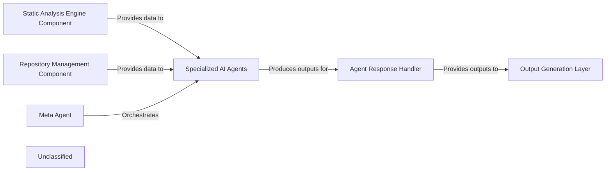
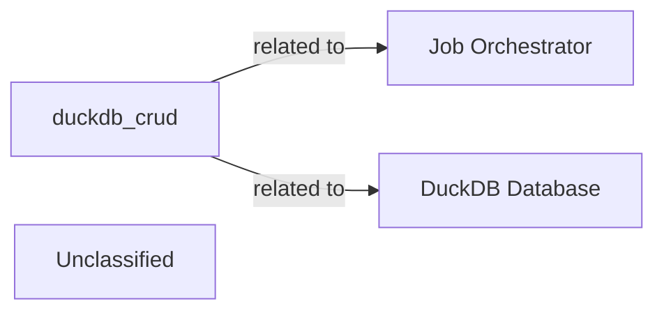
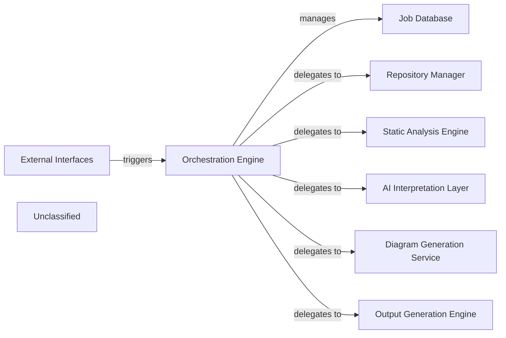
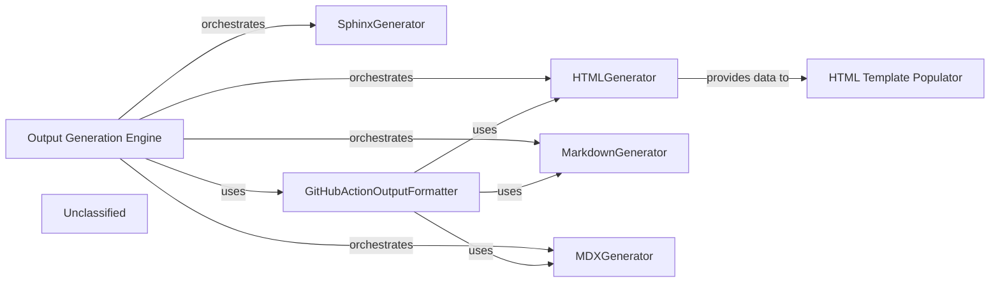
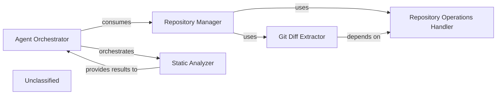
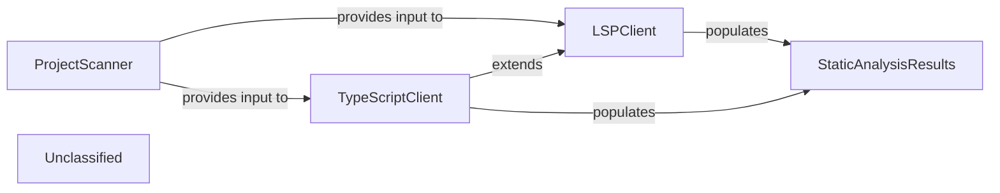
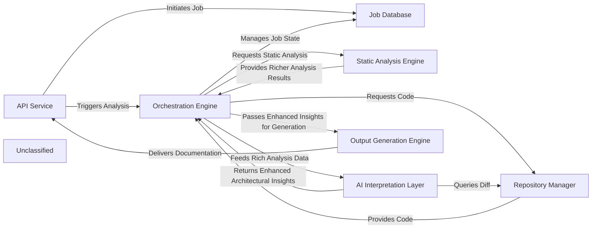

## Details

The system's architecture is centered around an AI Interpretation Layer orchestrated by the Meta Agent. This layer processes raw code data and repository information, provided by the Static Analysis Engine Component and Repository Management Component, respectively. A suite of Specialized AI Agents (including Abstraction, Details, Planner, Validator, and Diff Analyzer agents) performs targeted analysis under the Meta Agent's guidance. Their diverse outputs are then collected and standardized by the Agent Response Handler, which acts as a crucial intermediary before insights are passed to the Output Generation Layer for producing architectural diagrams and comprehensive documentation. This design ensures a clear separation of concerns, from data acquisition and intelligent analysis to structured output generation.

### Static Analysis Engine Component
This component is responsible for performing static analysis on the codebase, extracting structural information, control flow graphs (CFG), class hierarchies, and raw source code. It acts as a primary data source for the AI interpretation layer.

**Related Classes/Methods**: _None_

### Repository Management Component
Manages access to the code repository, providing functionalities like retrieving different versions of the codebase and generating code differences (diffs) between them. It's a crucial data source for analyzing changes.

**Related Classes/Methods**: _None_

### Meta Agent
The central orchestrator of the AI Interpretation Layer. It determines the overall analysis strategy, sequences the execution of specialized agents, and synthesizes their individual outputs to achieve the analysis goals.

**Related Classes/Methods**: _None_

### Specialized AI Agents
This component represents a collection of distinct AI agents, each with a specialized function: `Abstraction Agent` for high-level architectural views, `Details Agent` for fine-grained implementation insights, `Planner Agent` for formulating analysis strategies, `Validator Agent` for ensuring accuracy and consistency, and `Diff Analyzer Agent` for identifying architectural changes from code differences. They process data from the input components under the Meta Agent's guidance.

**Related Classes/Methods**:

- <a href="https://github.com/CodeBoarding/CodeBoarding/blob/main/agents/diff_analyzer.py#L20-L136" target="_blank" rel="noopener noreferrer">`agent`:20-136</a>

### Agent Response Handler
Responsible for collecting, standardizing, and managing the structured outputs generated by all specialized AI agents. It ensures that the insights are in a consistent and consumable format for downstream components.

**Related Classes/Methods**: _None_

### Output Generation Layer
This layer consumes the standardized outputs from the `Agent Response Handler`. It includes components like the `Diagram Analysis Component` for generating visual architectural diagrams and the `Output Generation Engine Component` for producing various forms of documentation and reports.

**Related Classes/Methods**: _None_

### Unclassified
Component for all unclassified files and utility functions (Utility functions/External Libraries/Dependencies)

**Related Classes/Methods**: _None_

### [FAQ](https://github.com/CodeBoarding/GeneratedOnBoardings/tree/main?tab=readme-ov-file#faq)

## Details

This analysis aims to identify and define the `duckdb_crud` component, which is currently well-defined in terms of its purpose but lacks specific source code references. The analysis also seeks to incorporate related components, `Job Orchestrator` and `DuckDB Database`, which are currently missing from the analysis. The main flow involves examining the file structure of relevant directories to locate potential source files for `duckdb_crud` to ensure all related components are properly defined and validated.

### duckdb_crud
A component responsible for CRUD operations on DuckDB, currently lacking specific source code references.

**Related Classes/Methods**: _None_

### Job Orchestrator
A component related to `duckdb_crud`, currently not present in the analysis.

**Related Classes/Methods**: _None_

### DuckDB Database
A database component related to `duckdb_crud`, currently not present in the analysis.

**Related Classes/Methods**: _None_

### Unclassified
Component for all unclassified files and utility functions (Utility functions/External Libraries/Dependencies)

**Related Classes/Methods**: _None_

### [FAQ](https://github.com/CodeBoarding/GeneratedOnBoardings/tree/main?tab=readme-ov-file#faq)

## Details

The component analysis is being refined to address the feedback regarding the `Orchestration Engine` and missing destination components. The `Orchestration Engine`'s role is central to the documentation generation pipeline, and its implementation details are crucial for accurate representation.

### Orchestration Engine [[Expand]](./Orchestration_Engine.md)
The central component responsible for managing the documentation generation pipeline, including job status and delegating the core generation process to other pipeline stages.

**Related Classes/Methods**:

- <a href="https://github.com/CodeBoarding/CodeBoarding/blob/main/local_app.py#L92-L129" target="_blank" rel="noopener noreferrer">`local_app.generate_onboarding`:92-129</a>
- <a href="https://github.com/CodeBoarding/CodeBoarding/blob/main/demo.py#L78-L97" target="_blank" rel="noopener noreferrer">`demo.generate_docs_remote`:78-97</a>

### Job Database [[Expand]](./Job_Database.md)
Manages the persistence and status of documentation generation jobs.

**Related Classes/Methods**: _None_

### External Interfaces
Provides API endpoints for interacting with the documentation generation system.

**Related Classes/Methods**: _None_

### Repository Manager [[Expand]](./Repository_Manager.md)
Manages access and retrieval of code repositories for analysis within the documentation generation pipeline.

**Related Classes/Methods**: _None_

### Static Analysis Engine [[Expand]](./Static_Analysis_Engine.md)
Performs static code analysis to extract structural and semantic information from source code.

**Related Classes/Methods**: _None_

### AI Interpretation Layer [[Expand]](./AI_Interpretation_Layer.md)
Interprets analysis results and generates insights using AI models for documentation content.

**Related Classes/Methods**: _None_

### Diagram Generation Service
Generates visual diagrams based on the interpreted code structure and relationships.

**Related Classes/Methods**: _None_

### Output Generation Engine [[Expand]](./Output_Generation_Engine.md)
Formats and produces the final documentation output in various formats.

**Related Classes/Methods**: _None_

### Unclassified
Component for all unclassified files and utility functions (Utility functions/External Libraries/Dependencies)

**Related Classes/Methods**: _None_

### [FAQ](https://github.com/CodeBoarding/GeneratedOnBoardings/tree/main?tab=readme-ov-file#faq)

## Details

The Output Generation Engine subsystem is responsible for transforming processed architectural insights into various documentation formats. It orchestrates specialized generators for HTML, Markdown, MDX, and Sphinx, ensuring that the insights are presented in a structured and accessible manner. The GitHubActionOutputFormatter then adapts these outputs for seamless integration into GitHub Actions workflows. This modular design allows for flexible and extensible documentation generation across different platforms and tools.

### Output Generation Engine [[Expand]](./Output_Generation_Engine.md)
The primary component responsible for orchestrating the overall process of generating documentation in various formats. It handles repository cloning, initiates the analysis generation, and dispatches the actual documentation generation to specific format generators based on the desired output.

**Related Classes/Methods**:

- <a href="https://github.com/CodeBoarding/CodeBoarding/blob/main/demo.py#L57-L80" target="_blank" rel="noopener noreferrer">`demo.py`:57-80</a>
- <a href="https://github.com/CodeBoarding/CodeBoarding/blob/main/demo.py#L82-L101" target="_blank" rel="noopener noreferrer">`demo.py`:82-101</a>

### HTMLGenerator
This component is dedicated to converting the processed architectural insights into a structured HTML format. It handles the rendering of diagrams, text, and other elements into web-friendly documentation. It prepares data (e.g., Cytoscape.js compatible JSON) for interactive architectural diagrams.

**Related Classes/Methods**: _None_

### MarkdownGenerator
Responsible for generating documentation in standard Markdown format. This component ensures that architectural insights are presented in a widely compatible and easily readable text-based format, suitable for various platforms and tools. It includes embedded Mermaid diagrams and basic component details.

**Related Classes/Methods**: _None_

### MDXGenerator
This component extends Markdown generation by incorporating JSX capabilities, allowing for more dynamic and interactive documentation. It transforms insights into MDX, enabling the embedding of React components within the documentation, including Mermaid diagrams and frontmatter.

**Related Classes/Methods**: _None_

### SphinxGenerator
Focuses on generating documentation in reStructuredText (RST) format, specifically tailored for use with the Sphinx documentation generator. This component ensures compatibility with Sphinx's powerful features for technical documentation, including embedded Mermaid diagrams and structured component information.

**Related Classes/Methods**: _None_

### GitHubActionOutputFormatter
This component acts as an integration layer, specifically formatting and preparing the generated documentation for consumption within GitHub Actions workflows. It leverages the capabilities of the other generators (HTML, Markdown, MDX) to produce output suitable for GitHub's environment.

**Related Classes/Methods**: _None_

### HTML Template Populator
Integrates generated architectural data (like Cytoscape JSON and component-specific HTML snippets) into a predefined HTML template to produce the final, complete, and styled HTML output.

**Related Classes/Methods**: _None_

### Unclassified
Component for all unclassified files and utility functions (Utility functions/External Libraries/Dependencies)

**Related Classes/Methods**: _None_

### [FAQ](https://github.com/CodeBoarding/GeneratedOnBoardings/tree/main?tab=readme-ov-file#faq)

## Details

The system's architecture is centered around the `Repository Manager`, which provides foundational access to source code repositories through its `Repository Operations Handler` and `Git Diff Extractor` sub-components. Building upon this foundation, the `Agent Orchestrator` acts as the primary intelligence layer, consuming repository data to drive complex processing workflows. It leverages the `Static Analyzer` to perform in-depth code analysis, receiving structured results that inform its decision-making and response generation. This integrated approach allows for sophisticated analysis and intelligent interaction with the codebase, with the `Agent Orchestrator` serving as the central coordinator for both repository interactions and static analysis.

### Repository Manager [[Expand]](./Repository_Manager.md)
This is the top-level component responsible for orchestrating all interactions with source code repositories. It provides a unified interface for the rest of the system to access repository functionalities, including cloning, checking out versions, and initiating diff operations. It acts as a facade, delegating specific tasks to its sub-components.

**Related Classes/Methods**:

- <a href="https://github.com/CodeBoarding/CodeBoarding/blob/main/repo_utils" target="_blank" rel="noopener noreferrer">`repo_utils`</a>
- `repo_utils.git_diff`

### Repository Operations Handler
Manages the fundamental, low-level operations related to local Git repositories. This includes cloning repositories from remote URLs, sanitizing repository URLs, verifying the existence of remote repositories, checking out specific branches or commits, and retrieving essential repository metadata (e.g., current commit hash, branch name). It also handles authentication tokens and the uploading of generated materials.

**Related Classes/Methods**:

- <a href="https://github.com/CodeBoarding/CodeBoarding/blob/main/repo_utils/__init__.py" target="_blank" rel="noopener noreferrer">`repo_utils.clone_repository`</a>
- <a href="https://github.com/CodeBoarding/CodeBoarding/blob/main/repo_utils/__init__.py" target="_blank" rel="noopener noreferrer">`repo_utils.checkout_repo`</a>
- <a href="https://github.com/CodeBoarding/CodeBoarding/blob/main/repo_utils/__init__.py" target="_blank" rel="noopener noreferrer">`repo_utils.sanitize_repo_url`</a>
- <a href="https://github.com/CodeBoarding/CodeBoarding/blob/main/repo_utils/__init__.py" target="_blank" rel="noopener noreferrer">`repo_utils.remote_repo_exists`</a>
- <a href="https://github.com/CodeBoarding/CodeBoarding/blob/main/repo_utils/__init__.py" target="_blank" rel="noopener noreferrer">`repo_utils.get_git_commit_hash`</a>
- <a href="https://github.com/CodeBoarding/CodeBoarding/blob/main/repo_utils/__init__.py" target="_blank" rel="noopener noreferrer">`repo_utils.get_branch`</a>
- <a href="https://github.com/CodeBoarding/CodeBoarding/blob/main/repo_utils/__init__.py" target="_blank" rel="noopener noreferrer">`repo_utils.upload_onboarding_materials`</a>

### Git Diff Extractor
Focuses specifically on extracting and processing differences between various versions of the codebase within a Git repository. It identifies changes at the file and line level (additions, deletions, modifications) and structures this information for further analysis by other components of the system.

**Related Classes/Methods**:

- <a href="https://github.com/CodeBoarding/CodeBoarding/blob/main/repo_utils/git_diff.py" target="_blank" rel="noopener noreferrer">`repo_utils.git_diff.git_diff`</a>
- <a href="https://github.com/CodeBoarding/CodeBoarding/blob/main/repo_utils/git_diff.py#L9-L24" target="_blank" rel="noopener noreferrer">`repo_utils.git_diff.FileChange`:9-24</a>

### Agent Orchestrator
Manages the overall agent-based processing logic, consuming data from the `Repository Manager` and orchestrating operations with the `Static Analyzer`. It is responsible for complex task execution, processing repository information, and generating refined responses based on analysis.

**Related Classes/Methods**: _None_

### Static Analyzer
Performs various static analysis tasks on source code provided by the `Agent Orchestrator`. It processes code to identify patterns, build graphs, and extract structural information, which is then returned for further agent-based processing.

**Related Classes/Methods**: _None_

### Unclassified
Component for all unclassified files and utility functions (Utility functions/External Libraries/Dependencies)

**Related Classes/Methods**: _None_

### [FAQ](https://github.com/CodeBoarding/GeneratedOnBoardings/tree/main?tab=readme-ov-file#faq)

## Details

The static analysis subsystem is designed to systematically extract comprehensive code intelligence from a project. It starts with the `ProjectScanner` component, which is responsible for initial project introspection and file identification. The identified files are then handed over to language-specific analysis clients, primarily the `LSPClient` and its specialized extension, `TypeScriptClient`. These clients leverage the Language Server Protocol to perform deep static analysis, generating detailed insights into the codebase, such as call graphs, class hierarchies, and symbol references. All the generated analysis data is then consolidated and managed by the `StaticAnalysisResults` component, which acts as a central, language-agnostic repository for structured analysis outcomes, making them readily available for subsequent processing and consumption by other parts of the system.

### ProjectScanner
Initiates the static analysis process by scanning the project repository. It identifies relevant source files, determines programming languages used, and extracts basic project metadata. This component acts as the initial data gatherer, preparing the input for more detailed LSP-based analysis.

**Related Classes/Methods**:

- <a href="https://github.com/CodeBoarding/CodeBoarding/blob/main/static_analyzer/scanner.py#L13-L66" target="_blank" rel="noopener noreferrer">`ProjectScanner`:13-66</a>

### LSPClient
Serves as the generic Language Server Protocol client. It manages the communication lifecycle with an LSP server (initialization, sending requests, receiving responses, shutdown). It orchestrates the detailed static analysis for individual files and the entire workspace, extracting symbols, imports, call graphs, and class hierarchies. It populates the `StaticAnalysisResults` with its findings.

**Related Classes/Methods**:

- <a href="https://github.com/CodeBoarding/CodeBoarding/blob/main/static_analyzer/lsp_client/client.py#L37-L924" target="_blank" rel="noopener noreferrer">`LSPClient`:37-924</a>

### TypeScriptClient
A specialized implementation of `LSPClient` tailored for TypeScript projects. It handles TypeScript-specific initialization parameters, workspace configuration (e.g., processing `tsconfig.json`), and file discovery, ensuring the LSP server is correctly set up for TypeScript analysis. This component exemplifies the extensibility of the static analysis engine for different programming languages and also populates `StaticAnalysisResults`.

**Related Classes/Methods**:

- <a href="https://github.com/CodeBoarding/CodeBoarding/blob/main/static_analyzer/lsp_client/typescript_client.py#L10-L214" target="_blank" rel="noopener noreferrer">`TypeScriptClient`:10-214</a>

### StaticAnalysisResults
This central component acts as a repository for all aggregated static analysis results across different programming languages. It collects and manages various types of analysis data, including class hierarchies, control flow graphs, package dependencies, and source code references, provided by the LSP clients. It offers methods to add and retrieve these structured results for downstream processing and consumption.

**Related Classes/Methods**:

- <a href="https://github.com/CodeBoarding/CodeBoarding/blob/main/static_analyzer/analysis_result.py#L6-L171" target="_blank" rel="noopener noreferrer">`StaticAnalysisResults`:6-171</a>

### Unclassified
Component for all unclassified files and utility functions (Utility functions/External Libraries/Dependencies)

**Related Classes/Methods**: _None_

### [FAQ](https://github.com/CodeBoarding/GeneratedOnBoardings/tree/main?tab=readme-ov-file#faq)

## Details

The CodeBoarding system operates through a robust, multi-layered architecture designed for comprehensive code analysis and documentation generation. The API Service serves as the primary external interface, initiating jobs and managing user interactions. All job lifecycle and status information is persistently stored and managed by the Job Database. The Orchestration Engine acts as the central coordinator, driving the entire documentation pipeline. It interacts with the Repository Manager to retrieve source code and then dispatches requests to the Static Analysis Engine. The Static Analysis Engine performs deep, language-specific analysis, now providing richer and more detailed structural information. This enhanced data is then fed by the Orchestration Engine to the AI Interpretation Layer. This layer, comprising specialized AI agents, performs sophisticated interpretation, generating enhanced high-level architectural insights, and may query the Repository Manager for diff analysis. Finally, the Orchestration Engine passes these refined insights to the Output Generation Engine, which transforms them into various documentation formats with enhanced capabilities, including integration with GitHub Actions, before delivering the final output back through the API Service. This updated architecture reflects significant internal enhancements in analysis depth and output quality, particularly within the AI interpretation and static analysis components.

### API Service
The external interface for CodeBoarding, handling user requests, job initiation, and status retrieval.

**Related Classes/Methods**:

- `local_app`

### Job Database [[Expand]](./Job_Database.md)
Persistent storage for managing the lifecycle, status, and results of all documentation generation jobs.

**Related Classes/Methods**:

- `duckdb_crud`

### Orchestration Engine [[Expand]](./Orchestration_Engine.md)
The central control unit that manages the entire documentation generation pipeline, coordinating all analysis and generation stages.

**Related Classes/Methods**:

- <a href="https://github.com/CodeBoarding/CodeBoarding/blob/main/diagram_analysis/diagram_generator.py" target="_blank" rel="noopener noreferrer">`diagram_generator`</a>

### Repository Manager [[Expand]](./Repository_Manager.md)
Manages all interactions with source code repositories, including cloning, fetching, and extracting version differences.

**Related Classes/Methods**:

- <a href="https://github.com/CodeBoarding/CodeBoarding/blob/main/agents/diff_analyzer.py#L21-L32" target="_blank" rel="noopener noreferrer">`__init__`:21-32</a>
- <a href="https://github.com/CodeBoarding/CodeBoarding/blob/main/repo_utils/git_diff.py#L27-L76" target="_blank" rel="noopener noreferrer">`git_diff`:27-76</a>

### Static Analysis Engine [[Expand]](./Static_Analysis_Engine.md)
Performs deep, language-specific analysis of source code to extract richer, more detailed, and comprehensive structural information without semantic interpretation.

**Related Classes/Methods**:

- <a href="https://github.com/CodeBoarding/CodeBoarding/blob/main/static_analyzer/scanner.py#L13-L66" target="_blank" rel="noopener noreferrer">`scanner`:13-66</a>
- <a href="https://github.com/CodeBoarding/CodeBoarding/blob/main/static_analyzer/lsp_client/typescript_client.py#L10-L214" target="_blank" rel="noopener noreferrer">`client`:10-214</a>
- <a href="https://github.com/CodeBoarding/CodeBoarding/blob/main/agents/abstraction_agent.py" target="_blank" rel="noopener noreferrer">`analysis_result`</a>

### AI Interpretation Layer [[Expand]](./AI_Interpretation_Layer.md)
A collection of specialized AI agents that perform sophisticated interpretation of static analysis data, generating enhanced high-level architectural insights, including detailed abstractions, refined planning, robust validation, and comprehensive diff analysis, with structured outputs.

**Related Classes/Methods**:

- <a href="https://github.com/CodeBoarding/CodeBoarding/blob/main/diagram_analysis/diagram_generator.py" target="_blank" rel="noopener noreferrer">`meta_agent`</a>
- <a href="https://github.com/CodeBoarding/CodeBoarding/blob/main/diagram_analysis/diagram_generator.py" target="_blank" rel="noopener noreferrer">`abstraction_agent`</a>
- <a href="https://github.com/CodeBoarding/CodeBoarding/blob/main/diagram_analysis/diagram_generator.py" target="_blank" rel="noopener noreferrer">`details_agent`</a>
- <a href="https://github.com/CodeBoarding/CodeBoarding/blob/main/diagram_analysis/diagram_generator.py" target="_blank" rel="noopener noreferrer">`planner_agent`</a>
- <a href="https://github.com/CodeBoarding/CodeBoarding/blob/main/diagram_analysis/diagram_generator.py" target="_blank" rel="noopener noreferrer">`validator_agent`</a>
- <a href="https://github.com/CodeBoarding/CodeBoarding/blob/main/agents/diff_analyzer.py" target="_blank" rel="noopener noreferrer">`diff_analyzer`</a>
- <a href="https://github.com/CodeBoarding/CodeBoarding/blob/main/agents/diff_analyzer.py#L20-L136" target="_blank" rel="noopener noreferrer">`agent`:20-136</a>
- <a href="https://github.com/CodeBoarding/CodeBoarding/blob/main/agents/agent_responses.py" target="_blank" rel="noopener noreferrer">`agent_responses`</a>
- <a href="https://github.com/CodeBoarding/CodeBoarding/blob/main/agents/details_agent.py" target="_blank" rel="noopener noreferrer">`prompts`</a>

### Output Generation Engine [[Expand]](./Output_Generation_Engine.md)
Transforms the final, validated architectural insights into various human-readable and diagram-friendly documentation formats, with enhanced capabilities for specific output formats and external integrations like GitHub Actions.

**Related Classes/Methods**:

- <a href="https://github.com/CodeBoarding/CodeBoarding/blob/main/github_action.py#L37-L51" target="_blank" rel="noopener noreferrer">`html`:37-51</a>
- <a href="https://github.com/CodeBoarding/CodeBoarding/blob/main/github_action.py#L20-L34" target="_blank" rel="noopener noreferrer">`markdown`:20-34</a>
- <a href="https://github.com/CodeBoarding/CodeBoarding/blob/main/github_action.py#L54-L68" target="_blank" rel="noopener noreferrer">`mdx`:54-68</a>
- <a href="https://github.com/CodeBoarding/CodeBoarding/blob/main/output_generators/sphinx.py" target="_blank" rel="noopener noreferrer">`sphinx`</a>
- `github_action`

### Unclassified
Component for all unclassified files and utility functions (Utility functions/External Libraries/Dependencies)

**Related Classes/Methods**: _None_

### [FAQ](https://github.com/CodeBoarding/GeneratedOnBoardings/tree/main?tab=readme-ov-file#faq)

