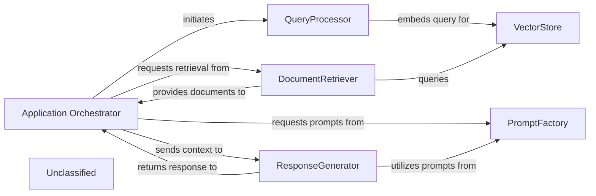
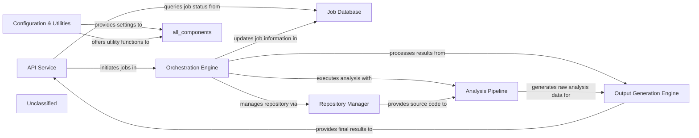
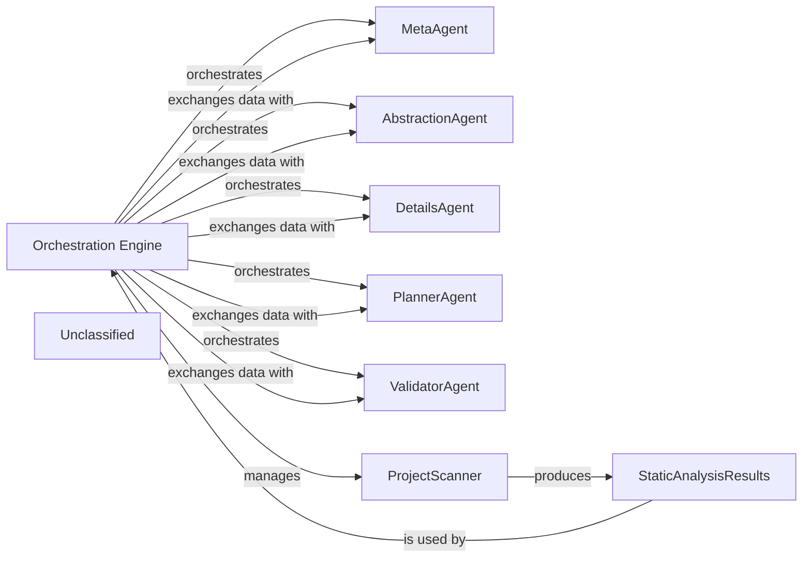
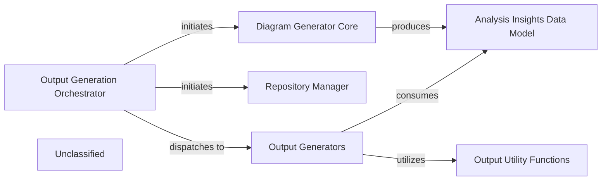
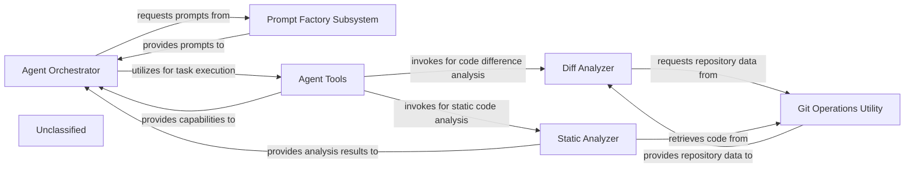
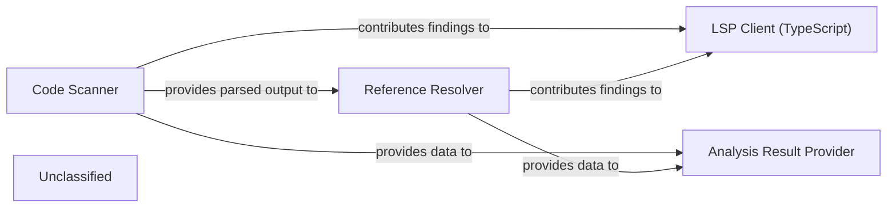
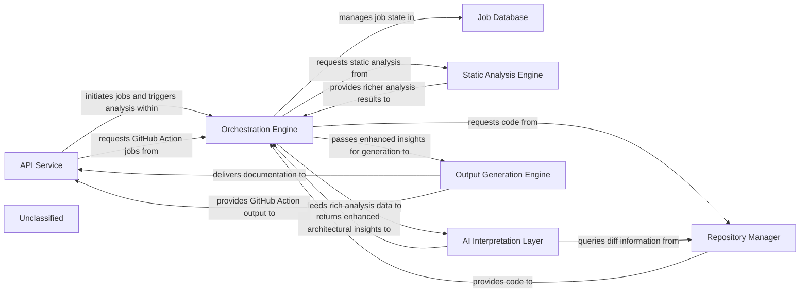

## Details

The system operates with an Application Orchestrator at its core, managing the overall flow from user query to final response. It initiates the QueryProcessor to handle and embed incoming queries, which are then used by the DocumentRetriever to query the VectorStore for relevant documents. A key enhancement is the PromptFactory, which now employs an abstract factory pattern to centralize and standardize prompt generation for various agents and language models, including specialized prompts for Gemini Flash. The Application Orchestrator and ResponseGenerator both interact with the PromptFactory to obtain optimized prompts, enabling the ResponseGenerator to craft accurate and contextually rich natural language responses based on the retrieved documents and the user's query. This modular design ensures extensibility and consistent interaction with large language models.

### Application Orchestrator
Manages the overall application flow, coordinating interactions between QueryProcessor, DocumentRetriever, ResponseGenerator, and now leveraging the PromptFactory for agent prompt generation. It receives user queries and delivers final responses, adapting its agent coordination mechanisms due to recent core agent logic refactoring and the new prompt management system.

**Related Classes/Methods**:

- <a href="https://github.com/CodeBoarding/CodeBoarding/blob/mainagents/agent.py" target="_blank" rel="noopener noreferrer">`agents.agent`</a>

### QueryProcessor
Handles incoming user queries, embeds them, and prepares them for similarity search, potentially utilizing refined prompts from the PromptFactory for enhanced query understanding.

**Related Classes/Methods**:

- <a href="https://github.com/CodeBoarding/CodeBoarding/blob/main." target="_blank" rel="noopener noreferrer">`langchain_core.embeddings.Embeddings:embed_query`</a>

### VectorStore
Stores and retrieves document embeddings based on similarity search.

**Related Classes/Methods**:

- `langchain_community.vectorstores.chroma.Chroma:similarity_search`

### DocumentRetriever
Retrieves relevant documents from the vector store.

**Related Classes/Methods**:

- <a href="https://github.com/CodeBoarding/CodeBoarding/blob/main." target="_blank" rel="noopener noreferrer">`langchain_core.retrievers.BaseRetriever:get_relevant_documents`</a>

### ResponseGenerator
Generates a natural language response using a large language model based on the query and retrieved documents, now significantly enhanced by leveraging structured prompts from the PromptFactory, including specialized prompts for models like Gemini Flash.

**Related Classes/Methods**:

- <a href="https://github.com/CodeBoarding/CodeBoarding/blob/main." target="_blank" rel="noopener noreferrer">`langchain_core.language_models.llms.BaseLLM:invoke`</a>

### PromptFactory
Centralizes the creation and management of prompts for various agents and language models through an abstract factory pattern. It provides a structured and standardized approach to prompt generation, leveraging an AbstractPromptFactory interface and specialized implementations like GeminiFlashPromptsBidirectional and GeminiFlashPromptsUnidirectional. This ensures consistent and optimized interactions with LLMs, notably for Gemini Flash, by managing an expanded library of prompts.

**Related Classes/Methods**:

- <a href="https://github.com/CodeBoarding/CodeBoarding/blob/mainagents/prompts/prompt_factory.py#L29-L90" target="_blank" rel="noopener noreferrer">`prompt_factory.PromptFactory`:29-90</a>

### Unclassified
Component for all unclassified files and utility functions (Utility functions/External Libraries/Dependencies)

**Related Classes/Methods**: _None_

### [FAQ](https://github.com/CodeBoarding/GeneratedOnBoardings/tree/main?tab=readme-ov-file#faq)

## Details

The CodeBoarding system operates with an `API Service` as its entry point, handling user requests and initiating code analysis jobs. These jobs are managed by an `Orchestration Engine` which coordinates the entire workflow, from fetching code via the `Repository Manager` to executing the `Analysis Pipeline` (encompassing static analysis and AI interpretation). The `Job Database` maintains the state and metadata of all ongoing and completed jobs. Once the analysis is complete, the `Output Generation Engine` formats the results into user-consumable documentation and visualizations, which are then retrieved by the `API Service`. A `Configuration & Utilities` component provides essential services and settings across the entire system, ensuring consistent operation and reusability. This architecture supports an asynchronous, pipeline-driven approach to code documentation and analysis.

### API Service [[Expand]](./API_Service.md)
The API Service acts as the primary external interface for CodeBoarding, responsible for receiving and processing user requests related to code analysis and visualization. It handles the initiation of new analysis jobs, provides mechanisms for users to retrieve the status of ongoing jobs, and serves the final analysis results, including generated documentation and visualizations. Furthermore, it integrates with external systems like GitHub Actions to trigger automated documentation generation workflows. This component is crucial for orchestrating the interaction between users and the backend analysis pipeline, aligning with the project's pipeline/event-driven and producer-consumer architectural patterns.

**Related Classes/Methods**:

- <a href="https://github.com/CodeBoarding/CodeBoarding/blob/mainlocal_app.py" target="_blank" rel="noopener noreferrer">`local_app.app`</a>

### Job Database
Manages the state and metadata of all analysis jobs, including their status, progress, and associated results. It acts as a central ledger for asynchronous operations, ensuring persistence and traceability of analysis tasks.

**Related Classes/Methods**:

- <a href="https://github.com/CodeBoarding/CodeBoarding/blob/mainduckdb_crud.py" target="_blank" rel="noopener noreferrer">`duckdb_crud`</a>

### Orchestration Engine [[Expand]](./Orchestration_Engine.md)
Coordinates the execution of analysis tasks, managing the flow of data and control between different engines. It's responsible for task scheduling, dependency management, and overall workflow execution, embodying the pipeline/event-driven architecture.

**Related Classes/Methods**:

- <a href="https://github.com/CodeBoarding/CodeBoarding/blob/mainlocal_app.py" target="_blank" rel="noopener noreferrer">`local_app.generate_onboarding`</a>

### Repository Manager [[Expand]](./Repository_Manager.md)
Handles interactions with code repositories (e.g., GitHub), including cloning, fetching, and managing local copies of the source code to be analyzed. It ensures the analysis engines have access to the correct code versions.

**Related Classes/Methods**:

- <a href="https://github.com/CodeBoarding/CodeBoarding/blob/mainrepo_utils" target="_blank" rel="noopener noreferrer">`repo_utils`</a>

### Analysis Pipeline
This component encapsulates the core logic for static analysis and AI-driven interpretation of the codebase. It takes the raw source code, extracts structural information, and then uses AI models to generate insights, summaries, and initial documentation drafts.

**Related Classes/Methods**:

- <a href="https://github.com/CodeBoarding/CodeBoarding/blob/maindemo.py" target="_blank" rel="noopener noreferrer">`demo.generate_docs_remote`</a>

### Output Generation Engine [[Expand]](./Output_Generation_Engine.md)
Responsible for formatting and generating the final outputs, such as documentation (e.g., Markdown, HTML), visualizations (e.g., Mermaid.js diagrams), and structured data. It transforms processed information into user-consumable formats.

**Related Classes/Methods**:

- <a href="https://github.com/CodeBoarding/CodeBoarding/blob/mainlocal_app.py" target="_blank" rel="noopener noreferrer">`local_app.generate_onboarding`</a>

### Configuration & Utilities
Provides common utilities, configuration management, and helper functions used across various components. This component ensures consistency and reusability of common functionalities.

**Related Classes/Methods**:

- <a href="https://github.com/CodeBoarding/CodeBoarding/blob/mainutils.py" target="_blank" rel="noopener noreferrer">`utils`</a>

### Unclassified
Component for all unclassified files and utility functions (Utility functions/External Libraries/Dependencies)

**Related Classes/Methods**: _None_

### [FAQ](https://github.com/CodeBoarding/GeneratedOnBoardings/tree/main?tab=readme-ov-file#faq)

## Details

The core of the system is the `Orchestration Engine`, which centrally manages the documentation generation pipeline. It begins by managing the `ProjectScanner` to collect raw static analysis data, which is then stored in `StaticAnalysisResults`. The `Orchestration Engine` then iteratively orchestrates a suite of specialized AI agents—`MetaAgent`, `AbstractionAgent`, `DetailsAgent`, `PlannerAgent`, and `ValidatorAgent`—exchanging data with them to progressively refine the architectural understanding. This iterative process, driven by the `Orchestration Engine`, ensures comprehensive analysis, from initial metadata gathering and high-level abstraction to detailed component examination, workflow planning, and final validation, culminating in accurate and consistent architectural documentation.

### Orchestration Engine [[Expand]](./Orchestration_Engine.md)
The central control unit that manages the entire documentation generation pipeline, coordinating all analysis and generation stages. It initializes and coordinates AI agents, handles pre-analysis, processes components, determines update needs, applies feedback, and saves results.

**Related Classes/Methods**:

- <a href="https://github.com/CodeBoarding/CodeBoarding/blob/maindiagram_analysis/diagram_generator.py" target="_blank" rel="noopener noreferrer">`diagram_generator`</a>

### MetaAgent
An AI agent responsible for performing initial project metadata analysis, providing foundational context for subsequent analysis stages.

**Related Classes/Methods**:

- <a href="https://github.com/CodeBoarding/CodeBoarding/blob/mainagents/meta_agent.py" target="_blank" rel="noopener noreferrer">`meta_agent`</a>

### AbstractionAgent
An AI agent that generates high-level architectural abstractions from the analyzed code, identifying major components and their relationships.

**Related Classes/Methods**:

- <a href="https://github.com/CodeBoarding/CodeBoarding/blob/mainagents/abstraction_agent.py" target="_blank" rel="noopener noreferrer">`abstraction_agent`</a>

### DetailsAgent
An AI agent that provides detailed analysis of individual components, delving into their responsibilities, internal structure, and specific interactions.

**Related Classes/Methods**:

- <a href="https://github.com/CodeBoarding/CodeBoarding/blob/mainagents/details_agent.py" target="_blank" rel="noopener noreferrer">`details_agent`</a>

### PlannerAgent
An AI agent that plans the next set of components to analyze, optimizing the analysis workflow based on dependencies and previous results.

**Related Classes/Methods**:

- <a href="https://github.com/CodeBoarding/CodeBoarding/blob/mainagents/planner_agent.py" target="_blank" rel="noopener noreferrer">`planner_agent`</a>

### ValidatorAgent
An AI agent that validates the generated analysis and provides feedback, ensuring accuracy and consistency of the documentation.

**Related Classes/Methods**:

- <a href="https://github.com/CodeBoarding/CodeBoarding/blob/mainagents/validator_agent.py" target="_blank" rel="noopener noreferrer">`validator_agent`</a>

### ProjectScanner
A component responsible for initiating and collecting static analysis data from the codebase, serving as the primary input for the analysis pipeline.

**Related Classes/Methods**:

- <a href="https://github.com/CodeBoarding/CodeBoarding/blob/mainstatic_analyzer/scanner.py" target="_blank" rel="noopener noreferrer">`scanner`</a>

### StaticAnalysisResults
A data structure that holds the comprehensive results of static analysis, making this information accessible to the Orchestration Engine and AI agents.

**Related Classes/Methods**:

- <a href="https://github.com/CodeBoarding/CodeBoarding/blob/mainstatic_analyzer/analysis_result.py" target="_blank" rel="noopener noreferrer">`analysis_result`</a>

### Unclassified
Component for all unclassified files and utility functions (Utility functions/External Libraries/Dependencies)

**Related Classes/Methods**: _None_

### [FAQ](https://github.com/CodeBoarding/GeneratedOnBoardings/tree/main?tab=readme-ov-file#faq)

## Details

The system's architecture is centered around the Output Generation Orchestrator, which serves as the primary entry point for generating architectural documentation. This orchestrator first leverages the Repository Manager for repository setup and then initiates the Diagram Generator Core to perform static analysis and produce the Analysis Insights Data Model. Once insights are generated, the orchestrator dispatches tasks to the Output Generators component, which is responsible for transforming these insights into various documentation formats (Markdown, HTML, MDX, RST/Sphinx). The Output Generators component relies on Output Utility Functions for common formatting and data handling. The Unclassified component manages foundational project configurations, external dependencies, and environment-specific constants, supporting the overall system operations.

### Output Generation Orchestrator
This component, primarily `github_action.py`, orchestrates the entire output generation process within a GitHub Actions context. It handles repository preparation, initial analysis, and dispatches generation tasks to format-specific functions within the `Output Generators` component. It serves as the primary entry point for the subsystem.

**Related Classes/Methods**:

- <a href="https://github.com/CodeBoarding/CodeBoarding/blob/maingithub_action.py" target="_blank" rel="noopener noreferrer">`github_action.py`</a>
- <a href="https://github.com/CodeBoarding/CodeBoarding/blob/mainrepo_utils/__init__.py" target="_blank" rel="noopener noreferrer">`repo_utils.clone_repository`</a>
- <a href="https://github.com/CodeBoarding/CodeBoarding/blob/mainrepo_utils/__init__.py" target="_blank" rel="noopener noreferrer">`repo_utils.checkout_repo`</a>
- <a href="https://github.com/CodeBoarding/CodeBoarding/blob/maindiagram_analysis/diagram_generator.py" target="_blank" rel="noopener noreferrer">`diagram_analysis.diagram_generator.DiagramGenerator`</a>

### Output Generators
This component is responsible for generating documentation in various formats (Markdown, HTML, MDX, reStructuredText/Sphinx). It processes `AnalysisInsights` objects and applies format-specific rules, including the generation of corresponding output files. This component encapsulates the high-level generation logic and specific formatting functions for all supported output types.

**Related Classes/Methods**:

- <a href="https://github.com/CodeBoarding/CodeBoarding/blob/mainoutput_generators/markdown.py" target="_blank" rel="noopener noreferrer">`output_generators.markdown.generate_markdown_file`</a>
- <a href="https://github.com/CodeBoarding/CodeBoarding/blob/mainoutput_generators/html.py" target="_blank" rel="noopener noreferrer">`output_generators.html.generate_html_file`</a>
- <a href="https://github.com/CodeBoarding/CodeBoarding/blob/mainoutput_generators/mdx.py" target="_blank" rel="noopener noreferrer">`output_generators.mdx.generate_mdx_file`</a>
- <a href="https://github.com/CodeBoarding/CodeBoarding/blob/mainoutput_generators/sphinx.py" target="_blank" rel="noopener noreferrer">`output_generators.sphinx.generate_rst_file`</a>
- <a href="https://github.com/CodeBoarding/CodeBoarding/blob/mainagents/agent_responses.py" target="_blank" rel="noopener noreferrer">`agents.agent_responses.AnalysisInsights`</a>

### Repository Manager [[Expand]](./Repository_Manager.md)
Manages repository operations such as cloning and checking out branches. It provides utilities for interacting with the Git repository.

**Related Classes/Methods**:

- <a href="https://github.com/CodeBoarding/CodeBoarding/blob/mainrepo_utils/__init__.py" target="_blank" rel="noopener noreferrer">`repo_utils.clone_repository`</a>
- <a href="https://github.com/CodeBoarding/CodeBoarding/blob/mainrepo_utils/__init__.py" target="_blank" rel="noopener noreferrer">`repo_utils.checkout_repo`</a>

### Diagram Generator Core
The core component responsible for generating the architectural analysis and diagrams. It utilizes various agents to perform static analysis, abstract components, plan analysis, and validate insights.

**Related Classes/Methods**:

- <a href="https://github.com/CodeBoarding/CodeBoarding/blob/maindiagram_analysis/diagram_generator.py" target="_blank" rel="noopener noreferrer">`diagram_analysis.diagram_generator.DiagramGenerator`</a>

### Analysis Insights Data Model
Defines the data structure for storing and representing the architectural analysis insights, including components, relationships, and referenced source code.

**Related Classes/Methods**:

- <a href="https://github.com/CodeBoarding/CodeBoarding/blob/mainagents/agent_responses.py" target="_blank" rel="noopener noreferrer">`agents.agent_responses.AnalysisInsights`</a>

### Output Utility Functions
Provides common utility functions used across different output generators, such as sanitizing names for diagram IDs and checking for the existence of analysis JSON files.

**Related Classes/Methods**:

- <a href="https://github.com/CodeBoarding/CodeBoarding/blob/mainoutput_generators/__init__.py" target="_blank" rel="noopener noreferrer">`output_generators.sanitize`</a>
- <a href="https://github.com/CodeBoarding/CodeBoarding/blob/mainutils.py" target="_blank" rel="noopener noreferrer">`utils.contains_json`</a>

### Unclassified
This component encompasses foundational project aspects, including packaging configuration (`setup.py`), external dependencies, and environment-specific constants (`vscode_constants.py`). It also serves as a catch-all for unclassified files and general utility functions not directly tied to core functional components.

**Related Classes/Methods**:

- <a href="https://github.com/CodeBoarding/CodeBoarding/blob/mainsetup.py" target="_blank" rel="noopener noreferrer">`setup.py`</a>
- <a href="https://github.com/CodeBoarding/CodeBoarding/blob/mainvscode_constants.py" target="_blank" rel="noopener noreferrer">`vscode_constants.py`</a>

### Unclassified
Component for all unclassified files and utility functions (Utility functions/External Libraries/Dependencies)

**Related Classes/Methods**: _None_

### [FAQ](https://github.com/CodeBoarding/GeneratedOnBoardings/tree/main?tab=readme-ov-file#faq)

## Details

The system is designed around an `Agent Orchestrator` that directs intelligent agents. This orchestrator dynamically acquires prompts from the `Prompt Factory Subsystem` to guide agent behavior. For task execution and information gathering, the `Agent Orchestrator` interacts with `Agent Tools`, which encapsulate various functionalities. These tools include the `Diff Analyzer` for identifying and processing code changes, and the `Static Analyzer` for performing in-depth code analysis without execution. Both the `Diff Analyzer` and `Static Analyzer` depend on the `Git Operations Utility` to access and retrieve necessary code from repositories. The insights generated by the `Static Analyzer` are then fed back to the `Agent Orchestrator` to inform subsequent decision-making and actions.

### Agent Orchestrator
The central component responsible for driving the intelligent agents. It orchestrates the agent's logic, utilizing prompts and tools to execute tasks and make decisions based on gathered information and analysis results.

**Related Classes/Methods**:

- <a href="https://github.com/CodeBoarding/CodeBoarding/blob/mainagents/agent.py" target="_blank" rel="noopener noreferrer">`agents.agent:Agent`</a>

### Prompt Factory Subsystem
Manages the creation and retrieval of various prompt templates. It implements an Abstract Factory pattern to provide flexible and extensible prompt generation tailored to specific agent requirements.

**Related Classes/Methods**:

- <a href="https://github.com/CodeBoarding/CodeBoarding/blob/mainagents/prompts/abstract_prompt_factory.py" target="_blank" rel="noopener noreferrer">`agents.prompts.abstract_prompt_factory:AbstractPromptFactory`</a>
- <a href="https://github.com/CodeBoarding/CodeBoarding/blob/mainagents/prompts/prompt_factory.py" target="_blank" rel="noopener noreferrer">`agents.prompts.prompt_factory:PromptFactory`</a>
- <a href="https://github.com/CodeBoarding/CodeBoarding/blob/mainagents/prompts/gemini_flash_prompts_bidirectional.py" target="_blank" rel="noopener noreferrer">`agents.prompts.gemini_flash_prompts_bidirectional`</a>
- <a href="https://github.com/CodeBoarding/CodeBoarding/blob/mainagents/prompts/gemini_flash_prompts_unidirectional.py" target="_blank" rel="noopener noreferrer">`agents.prompts.gemini_flash_prompts_unidirectional`</a>

### Agent Tools
Provides a collection of specialized tools that agents can utilize to interact with the environment, gather information, or perform specific actions. These tools encapsulate functionalities like reading files, analyzing code structures, and fetching Git diffs, and static analysis results.

**Related Classes/Methods**:

- <a href="https://github.com/CodeBoarding/CodeBoarding/blob/mainagents/tools/read_file.py" target="_blank" rel="noopener noreferrer">`agents.tools.read_file`</a>
- <a href="https://github.com/CodeBoarding/CodeBoarding/blob/mainagents/tools/read_git_diff.py" target="_blank" rel="noopener noreferrer">`agents.tools.read_git_diff`</a>
- <a href="https://github.com/CodeBoarding/CodeBoarding/blob/mainagents/tools/read_source.py" target="_blank" rel="noopener noreferrer">`agents.tools.read_source`</a>

### Diff Analyzer
Orchestrates the process of identifying, analyzing, and preparing code differences from repositories. It leverages lower-level Git utilities to fetch raw data and then processes it into a usable format for subsequent analysis stages.

**Related Classes/Methods**:

- <a href="https://github.com/CodeBoarding/CodeBoarding/blob/mainagents/diff_analyzer.py" target="_blank" rel="noopener noreferrer">`agents.diff_analyzer:__init__`</a>

### Git Operations Utility
Provides low-level, atomic functionalities for interacting directly with Git repositories. This includes operations such as cloning repositories, fetching updates, and generating detailed version differences (diffs). It abstracts the complexities of Git commands.

**Related Classes/Methods**:

- <a href="https://github.com/CodeBoarding/CodeBoarding/blob/mainrepo_utils/git_diff.py" target="_blank" rel="noopener noreferrer">`repo_utils.git_diff:git_diff`</a>

### Static Analyzer
A new component responsible for performing static analysis on codebases. It identifies potential issues, patterns, or metrics without executing the code, providing valuable insights for the `Agent Orchestrator`.

**Related Classes/Methods**:

- <a href="https://github.com/CodeBoarding/CodeBoarding/blob/mainstatic_analyzer/__init__.py" target="_blank" rel="noopener noreferrer">`static_analyzer`</a>

### Unclassified
Component for all unclassified files and utility functions (Utility functions/External Libraries/Dependencies)

**Related Classes/Methods**: _None_

### [FAQ](https://github.com/CodeBoarding/GeneratedOnBoardings/tree/main?tab=readme-ov-file#faq)

## Details

The Static Analysis Engine subsystem is responsible for performing deep, language-specific analysis of source code, including reference resolution and integration with the VS Code environment. It processes raw source code and produces structured analysis results for downstream components.

### Code Scanner
This component performs the initial lexical and syntactical analysis of source code. It breaks down raw code into tokens and constructs an intermediate representation (e.g., an Abstract Syntax Tree), serving as the foundational input for further analysis.

**Related Classes/Methods**:

- <a href="https://github.com/CodeBoarding/CodeBoarding/blob/mainstatic_analyzer/scanner.py" target="_blank" rel="noopener noreferrer">`static_analyzer.scanner`</a>

### Reference Resolver
This component identifies and resolves symbolic references within the code, such as variable declarations, function calls, class definitions, and imports. It builds a comprehensive understanding of how different code elements relate to each other, crucial for semantic analysis.

**Related Classes/Methods**:

- <a href="https://github.com/CodeBoarding/CodeBoarding/blob/mainstatic_analyzer/reference_resolve_mixin.py" target="_blank" rel="noopener noreferrer">`static_analyzer.reference_resolve_mixin`</a>

### LSP Client (TypeScript)
This component acts as the interface for integrating the static analysis capabilities with the VS Code environment, specifically tailored for TypeScript. It communicates via the Language Server Protocol (LSP) to enable real-time code intelligence features like go-to-definition, hover information, and diagnostics.

**Related Classes/Methods**:

- <a href="https://github.com/CodeBoarding/CodeBoarding/blob/mainstatic_analyzer/lsp_client/typescript_client.py" target="_blank" rel="noopener noreferrer">`static_analyzer.lsp_client.typescript_client`</a>
- <a href="https://github.com/CodeBoarding/CodeBoarding/blob/mainvscode_constants.py" target="_blank" rel="noopener noreferrer">`vscode_constants`</a>

### Analysis Result Provider
This component is responsible for gathering and formatting the comprehensive output from the `Code Scanner` and `Reference Resolver`. It structures the analysis results into a consumable format specifically designed for subsequent processing by the `AI Interpretation Layer` to generate architectural insights and documentation.

**Related Classes/Methods**:

- <a href="https://github.com/CodeBoarding/CodeBoarding/blob/mainagents/abstraction_agent.py" target="_blank" rel="noopener noreferrer">`agents.abstraction_agent`</a>

### Unclassified
Component for all unclassified files and utility functions (Utility functions/External Libraries/Dependencies)

**Related Classes/Methods**: _None_

### [FAQ](https://github.com/CodeBoarding/GeneratedOnBoardings/tree/main?tab=readme-ov-file#faq)

## Details

The CodeBoarding system operates through a robust, multi-component architecture designed for automated documentation generation. The API Service acts as the primary external interface, handling user requests and initiating documentation jobs. These jobs are managed by the Orchestration Engine, which coordinates the entire pipeline, leveraging the Job Database for persistent state management. Code acquisition and version control interactions are handled by the Repository Manager. Deep, language-specific code analysis, now with enhanced VS Code integration, is performed by the Static Analysis Engine, providing detailed structural information. This data is then fed to the AI Interpretation Layer, a sophisticated collection of AI agents that generate high-level architectural insights, utilizing a modular prompt management system. Finally, the Output Generation Engine transforms these insights into various documentation formats, delivering them back to the API Service and integrating with GitHub Actions.

### API Service [[Expand]](./API_Service.md)
The external interface for CodeBoarding, handling user requests, job initiation, status retrieval, and integrating with GitHub Actions for automated documentation generation.

**Related Classes/Methods**:

- <a href="https://github.com/CodeBoarding/CodeBoarding/blob/mainlocal_app.py" target="_blank" rel="noopener noreferrer">`local_app`</a>

### Job Database
Persistent storage for managing the lifecycle, status, and results of all documentation generation jobs.

**Related Classes/Methods**:

- <a href="https://github.com/CodeBoarding/CodeBoarding/blob/mainduckdb_crud.py" target="_blank" rel="noopener noreferrer">`duckdb_crud`</a>

### Orchestration Engine [[Expand]](./Orchestration_Engine.md)
The central control unit that manages the entire documentation generation pipeline, coordinating all analysis and generation stages.

**Related Classes/Methods**:

- <a href="https://github.com/CodeBoarding/CodeBoarding/blob/maindiagram_analysis/diagram_generator.py" target="_blank" rel="noopener noreferrer">`diagram_generator`</a>

### Repository Manager [[Expand]](./Repository_Manager.md)
Manages all interactions with source code repositories, including cloning, fetching, and extracting version differences.

**Related Classes/Methods**:

- <a href="https://github.com/CodeBoarding/CodeBoarding/blob/mainagents/diff_analyzer.py#L21-L32" target="_blank" rel="noopener noreferrer">`__init__`:21-32</a>
- <a href="https://github.com/CodeBoarding/CodeBoarding/blob/mainrepo_utils/git_diff.py#L27-L76" target="_blank" rel="noopener noreferrer">`git_diff`:27-76</a>

### Static Analysis Engine [[Expand]](./Static_Analysis_Engine.md)
Performs deep, language-specific analysis of source code, now explicitly including **reference resolution capabilities** and **enhanced integration with the VS Code environment**, potentially leveraging VS Code-specific settings or protocols.

**Related Classes/Methods**:

- <a href="https://github.com/CodeBoarding/CodeBoarding/blob/mainstatic_analyzer/scanner.py#L13-L82" target="_blank" rel="noopener noreferrer">`scanner`:13-82</a>
- <a href="https://github.com/CodeBoarding/CodeBoarding/blob/mainstatic_analyzer/lsp_client/typescript_client.py#L10-L214" target="_blank" rel="noopener noreferrer">`client`:10-214</a>
- <a href="https://github.com/CodeBoarding/CodeBoarding/blob/mainagents/abstraction_agent.py" target="_blank" rel="noopener noreferrer">`analysis_result`</a>
- <a href="https://github.com/CodeBoarding/CodeBoarding/blob/mainstatic_analyzer/reference_resolve_mixin.py" target="_blank" rel="noopener noreferrer">`reference_resolve_mixin`</a>
- <a href="https://github.com/CodeBoarding/CodeBoarding/blob/mainvscode_constants.py" target="_blank" rel="noopener noreferrer">`vscode_constants`</a>

### AI Interpretation Layer [[Expand]](./AI_Interpretation_Layer.md)
A collection of specialized AI agents that perform sophisticated interpretation of static analysis data, generating enhanced high-level architectural insights, including detailed abstractions, refined planning, robust validation, and comprehensive diff analysis. This layer now features a **significantly enhanced prompt management system**, utilizing an `abstract_prompt_factory` and concrete implementations (e.g., `gemini_flash_prompts_bidirectional`, `gemini_flash_prompts_unidirectional`) for structured prompt definition, selection, and application, supporting various language models (e.g., Gemini Flash) and prompting strategies. The `prompt_factory` has been refactored to integrate this modular and extensible system.

**Related Classes/Methods**:

- <a href="https://github.com/CodeBoarding/CodeBoarding/blob/maindiagram_analysis/diagram_generator.py" target="_blank" rel="noopener noreferrer">`meta_agent`</a>
- <a href="https://github.com/CodeBoarding/CodeBoarding/blob/mainagents/abstraction_agent.py" target="_blank" rel="noopener noreferrer">`abstraction_agent`</a>
- <a href="https://github.com/CodeBoarding/CodeBoarding/blob/mainagents/details_agent.py" target="_blank" rel="noopener noreferrer">`details_agent`</a>
- <a href="https://github.com/CodeBoarding/CodeBoarding/blob/maindiagram_analysis/diagram_generator.py" target="_blank" rel="noopener noreferrer">`planner_agent`</a>
- <a href="https://github.com/CodeBoarding/CodeBoarding/blob/maindiagram_analysis/diagram_generator.py" target="_blank" rel="noopener noreferrer">`validator_agent`</a>
- <a href="https://github.com/CodeBoarding/CodeBoarding/blob/mainagents/diff_analyzer.py" target="_blank" rel="noopener noreferrer">`diff_analyzer`</a>
- <a href="https://github.com/CodeBoarding/CodeBoarding/blob/mainagents/agent.py" target="_blank" rel="noopener noreferrer">`agent`</a>
- <a href="https://github.com/CodeBoarding/CodeBoarding/blob/mainagents/agent_responses.py" target="_blank" rel="noopener noreferrer">`agent_responses`</a>
- <a href="https://github.com/CodeBoarding/CodeBoarding/blob/mainagents/details_agent.py" target="_blank" rel="noopener noreferrer">`prompts`</a>
- <a href="https://github.com/CodeBoarding/CodeBoarding/blob/mainagents/prompts/abstract_prompt_factory.py" target="_blank" rel="noopener noreferrer">`abstract_prompt_factory`</a>
- <a href="https://github.com/CodeBoarding/CodeBoarding/blob/mainagents/prompts/gemini_flash_prompts_bidirectional.py" target="_blank" rel="noopener noreferrer">`gemini_flash_prompts_bidirectional`</a>
- <a href="https://github.com/CodeBoarding/CodeBoarding/blob/mainagents/prompts/gemini_flash_prompts_unidirectional.py" target="_blank" rel="noopener noreferrer">`gemini_flash_prompts_unidirectional`</a>
- <a href="https://github.com/CodeBoarding/CodeBoarding/blob/mainagents/prompts/prompt_factory.py#L37-L46" target="_blank" rel="noopener noreferrer">`prompt_factory`:37-46</a>

### Output Generation Engine [[Expand]](./Output_Generation_Engine.md)
Transforms the final, validated architectural insights into various human-readable and diagram-friendly documentation formats, with enhanced capabilities for specific output formats and external integrations like GitHub Actions.

**Related Classes/Methods**:

- <a href="https://github.com/CodeBoarding/CodeBoarding/blob/maingithub_action.py#L37-L51" target="_blank" rel="noopener noreferrer">`html`:37-51</a>
- <a href="https://github.com/CodeBoarding/CodeBoarding/blob/maingithub_action.py#L20-L34" target="_blank" rel="noopener noreferrer">`markdown`:20-34</a>
- <a href="https://github.com/CodeBoarding/CodeBoarding/blob/maingithub_action.py#L54-L68" target="_blank" rel="noopener noreferrer">`mdx`:54-68</a>
- <a href="https://github.com/CodeBoarding/CodeBoarding/blob/mainoutput_generators/sphinx.py" target="_blank" rel="noopener noreferrer">`sphinx`</a>
- <a href="https://github.com/CodeBoarding/CodeBoarding/blob/maingithub_action.py" target="_blank" rel="noopener noreferrer">`github_action`</a>

### Unclassified
Component for all unclassified files and utility functions (Utility functions/External Libraries/Dependencies)

**Related Classes/Methods**: _None_

### Unclassified
Component for all unclassified files and utility functions (Utility functions/External Libraries/Dependencies)

**Related Classes/Methods**: _None_

### [FAQ](https://github.com/CodeBoarding/GeneratedOnBoardings/tree/main?tab=readme-ov-file#faq)

