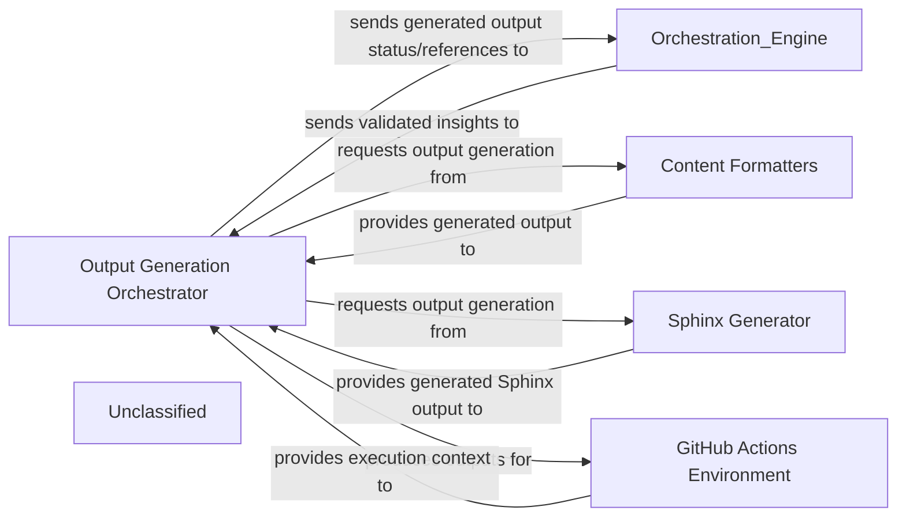
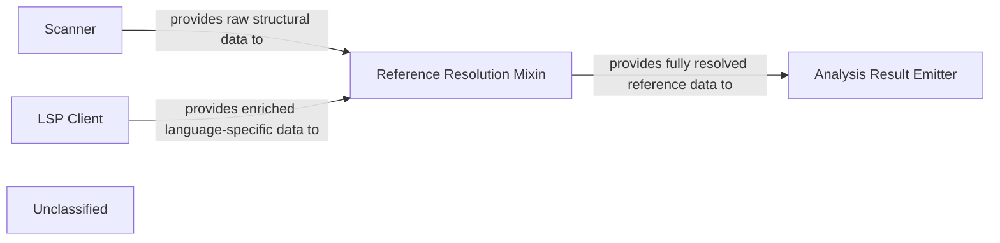

## Details

The system operates around an `Application Orchestrator` that manages the overall flow from user query to response. User queries are initially processed by the `QueryProcessor`, which embeds them for efficient retrieval from the `VectorStore`. The `DocumentRetriever` then fetches relevant documents, which are passed back to the `Application Orchestrator`. A key architectural enhancement is the introduction of the `PromptFactory`, which centralizes and standardizes the generation of prompts for various agents and language models. The `Application Orchestrator` and `ResponseGenerator` both leverage the `PromptFactory` to obtain optimized prompts, enabling the `ResponseGenerator` to craft natural language responses based on the query and retrieved documents, including specialized prompts for models like Gemini Flash. This structured prompt management significantly refines how the system interacts with large language models, ensuring consistency and adaptability.

### Application Orchestrator
Manages the overall application flow, coordinating interactions between `QueryProcessor`, `DocumentRetriever`, `ResponseGenerator`, and now leveraging the `PromptFactory` for agent prompt generation. It receives user queries and delivers final responses, adapting its agent coordination mechanisms due to recent core agent logic refactoring and the new prompt management system.

**Related Classes/Methods**:

- <a href="https://github.com/CodeBoarding/CodeBoarding/blob/mainagents/agent.py" target="_blank" rel="noopener noreferrer">`agents.agent`</a>

### QueryProcessor
Handles incoming user queries, embeds them, and prepares them for similarity search, potentially utilizing refined prompts from the `PromptFactory` for enhanced query understanding.

**Related Classes/Methods**:

- <a href="https://github.com/CodeBoarding/CodeBoarding/blob/main." target="_blank" rel="noopener noreferrer">`langchain_core.embeddings.Embeddings:embed_query`</a>

### VectorStore
Stores and retrieves document embeddings based on similarity search.

**Related Classes/Methods**:

- `langchain_community.vectorstores.chroma.Chroma:similarity_search`

### DocumentRetriever
Retrieves relevant documents from the vector store.

**Related Classes/Methods**:

- <a href="https://github.com/CodeBoarding/CodeBoarding/blob/main." target="_blank" rel="noopener noreferrer">`langchain_core.retrievers.BaseRetriever:get_relevant_documents`</a>

### ResponseGenerator
Generates a natural language response using a large language model based on the query and retrieved documents, now significantly enhanced by leveraging structured prompts from the `PromptFactory`, including specialized prompts for models like Gemini Flash.

**Related Classes/Methods**:

- <a href="https://github.com/CodeBoarding/CodeBoarding/blob/main." target="_blank" rel="noopener noreferrer">`langchain_core.language_models.llms.BaseLLM:invoke`</a>

### PromptFactory
Centralizes the creation and management of prompts for various agents and language models. It provides a structured and standardized approach to prompt generation, including an expanded library of prompts, notably for Gemini Flash, ensuring consistent and optimized interactions with LLMs.

**Related Classes/Methods**:

- <a href="https://github.com/CodeBoarding/CodeBoarding/blob/mainagents/prompts/prompt_factory.py#L27-L77" target="_blank" rel="noopener noreferrer">`prompt_factory.PromptFactory`:27-77</a>

### Unclassified
Component for all unclassified files and utility functions (Utility functions/External Libraries/Dependencies)

**Related Classes/Methods**: _None_

### [FAQ](https://github.com/CodeBoarding/GeneratedOnBoardings/tree/main?tab=readme-ov-file#faq)

## Details

The CodeBoarding platform is orchestrated by `local_app.LocalApp`, which serves as the primary interface for users and the VS Code extension (`vscode_runnable.VSCodeRunnable`). `local_app.LocalApp` initiates and manages analysis jobs, leveraging `duckdb_crud.DuckDBCRUD` for persistent storage of job metadata and `repo_utils.RepoUtils` for repository operations. The core analysis and diagram generation workflow is handled by `diagram_analysis.diagram_generator`. A significant internal enhancement is the `agents.prompts.PromptFactory`, which centralizes and dynamically manages prompts for the various agents utilized by `diagram_analysis.diagram_generator` when interacting with LLMs, ensuring modularity and configurability in prompt management. This structured approach to prompt handling is crucial for the system's interaction with LLMs, which underpins the `diagram_analysis.diagram_generator`'s function.

### local_app.LocalApp
Serves as the primary local interface for CodeBoarding, enabling local users and the VS Code extension to initiate, manage, and retrieve the status of analysis jobs, and to trigger documentation generation. It acts as a local API endpoint, orchestrating interactions with core analysis and data management components.

**Related Classes/Methods**:

- <a href="https://github.com/CodeBoarding/CodeBoarding/blob/mainlocal_app.py" target="_blank" rel="noopener noreferrer">`local_app.LocalApp`</a>

### diagram_analysis.diagram_generator
Orchestrates the comprehensive code analysis and diagram generation workflow, initiated by the `local_app.LocalApp`. It's responsible for the core value proposition of the platform, leveraging various agents and LLMs for analysis.

**Related Classes/Methods**:

- <a href="https://github.com/CodeBoarding/CodeBoarding/blob/maindiagram_analysis/diagram_generator.py" target="_blank" rel="noopener noreferrer">`diagram_analysis.diagram_generator`</a>

### agents.prompts.PromptFactory
Manages the dynamic selection and retrieval of prompts used by various agents for interacting with Large Language Models (LLMs). It centralizes prompt definitions, enhancing modularity, configurability, and maintainability of LLM interactions.

**Related Classes/Methods**:

- <a href="https://github.com/CodeBoarding/CodeBoarding/blob/mainagents/prompts/prompt_factory.py#L27-L77" target="_blank" rel="noopener noreferrer">`agents.prompts.prompt_factory.PromptFactory`:27-77</a>

### duckdb_crud.DuckDBCRUD
Manages persistent storage and retrieval of analysis job metadata and status, crucial for `local_app.LocalApp` to track and report on job progress.

**Related Classes/Methods**:

- <a href="https://github.com/CodeBoarding/CodeBoarding/blob/mainduckdb_crud.py" target="_blank" rel="noopener noreferrer">`duckdb_crud.DuckDBCRUD`</a>

### repo_utils.RepoUtils
Provides repository-related operations such as cloning or fetching diffs, potentially utilized by `local_app.LocalApp` to prepare repositories for analysis.

**Related Classes/Methods**:

- <a href="https://github.com/CodeBoarding/CodeBoarding/blob/mainrepo_utils/__init__.py" target="_blank" rel="noopener noreferrer">`repo_utils.RepoUtils`</a>

### vscode_runnable.VSCodeRunnable
An external client that consumes services provided by the `local_app.LocalApp` for VS Code extension functionalities, representing a key external integration point.

**Related Classes/Methods**:

- <a href="https://github.com/CodeBoarding/CodeBoarding/blob/mainvscode_runnable.py" target="_blank" rel="noopener noreferrer">`vscode_runnable.VSCodeRunnable`</a>

### Unclassified
Component for all unclassified files and utility functions (Utility functions/External Libraries/Dependencies)

**Related Classes/Methods**: _None_

### [FAQ](https://github.com/CodeBoarding/GeneratedOnBoardings/tree/main?tab=readme-ov-file#faq)

## Details

The system operates with an Orchestration Engine at its core, initiating and managing all documentation generation jobs. This engine interacts with a Job Database to maintain job status and details. Code repositories are handled by the Repository Manager, which provides the necessary code for analysis. The Analysis Layer performs comprehensive code analysis, including static analysis and AI-driven interpretation, now significantly enhanced by a dedicated prompt management system for AI agents. The results from the Analysis Layer are then passed back to the Orchestration Engine, which directs them to the Output Generation Engine for final documentation and diagram creation. External systems can trigger these workflows through the External Integrations component. The entire system is supported by the Build and Deployment Infrastructure, ensuring its operational readiness.

### Orchestration Engine [[Expand]](./Orchestration_Engine.md)
The central control subsystem responsible for initiating, managing, and coordinating all analysis and documentation generation jobs, acting as the primary orchestrator for the end-to-end workflow.

**Related Classes/Methods**:

- <a href="https://github.com/CodeBoarding/CodeBoarding/blob/mainlocal_app.py" target="_blank" rel="noopener noreferrer">`local_app.py:start_generation_job`</a>
- <a href="https://github.com/CodeBoarding/CodeBoarding/blob/mainlocal_app.py" target="_blank" rel="noopener noreferrer">`local_app.py:start_docs_generation_job`</a>
- <a href="https://github.com/CodeBoarding/CodeBoarding/blob/mainlocal_app.py" target="_blank" rel="noopener noreferrer">`local_app.py:process_docs_generation_job`</a>

### Job Database
Manages the storage and retrieval of job details, including status updates, for the documentation generation pipeline.

**Related Classes/Methods**:

- <a href="https://github.com/CodeBoarding/CodeBoarding/blob/mainduckdb_crud.py" target="_blank" rel="noopener noreferrer">`duckdb_crud.py`</a>

### Repository Manager [[Expand]](./Repository_Manager.md)
Handles repository operations suchs as cloning code repositories and retrieving code differences for analysis.

**Related Classes/Methods**:

- <a href="https://github.com/CodeBoarding/CodeBoarding/blob/mainrepo_utils/git_diff.py" target="_blank" rel="noopener noreferrer">`repo_utils.git_diff.py`</a>

### Analysis Layer
Performs comprehensive code analysis, encompassing static code analysis, AI-driven interpretation, and specialized data extraction for diagram generation. This layer now includes a dedicated and structured prompt management system for generating and managing prompts for AI agents, enhancing modularity and scalability.

**Related Classes/Methods**:

- <a href="https://github.com/CodeBoarding/CodeBoarding/blob/mainstatic_analyzer/scanner.py" target="_blank" rel="noopener noreferrer">`static_analyzer.scanner.py`</a>
- <a href="https://github.com/CodeBoarding/CodeBoarding/blob/mainagents/agent.py" target="_blank" rel="noopener noreferrer">`agents.agent.py`</a>
- <a href="https://github.com/CodeBoarding/CodeBoarding/blob/maindiagram_analysis/diagram_generator.py" target="_blank" rel="noopener noreferrer">`diagram_analysis/diagram_generator.py:generate_analysis`</a>
- <a href="https://github.com/CodeBoarding/CodeBoarding/blob/mainagents/prompts/gemini_flash_prompts_bidirectional.py" target="_blank" rel="noopener noreferrer">`agents.prompts.gemini_flash_prompts_bidirectional.py`</a>
- <a href="https://github.com/CodeBoarding/CodeBoarding/blob/mainagents/prompts/gemini_flash_prompts_unidirectional.py" target="_blank" rel="noopener noreferrer">`agents.prompts.gemini_flash_prompts_unidirectional.py`</a>
- <a href="https://github.com/CodeBoarding/CodeBoarding/blob/mainagents/prompts/prompt_factory.py" target="_blank" rel="noopener noreferrer">`agents.prompts.prompt_factory.py`</a>

### Output Generation Engine [[Expand]](./Output_Generation_Engine.md)
Responsible for the final formatting and generation of documentation and diagrams in various formats.

**Related Classes/Methods**:

- <a href="https://github.com/CodeBoarding/CodeBoarding/blob/mainoutput_generators/markdown.py" target="_blank" rel="noopener noreferrer">`output_generators.markdown.py`</a>

### External Integrations
Provides interfaces for external systems, such as VSCode and GitHub Actions, to trigger analysis workflows.

**Related Classes/Methods**:

- <a href="https://github.com/CodeBoarding/CodeBoarding/blob/maingithub_action.py" target="_blank" rel="noopener noreferrer">`github_action.py`</a>
- <a href="https://github.com/CodeBoarding/CodeBoarding/blob/mainvscode_runnable.py" target="_blank" rel="noopener noreferrer">`vscode_runnable.py`</a>

### Build and Deployment Infrastructure
Encompasses the project's packaging, dependency management, and build processes, defining how the system is assembled, distributed, and integrated. This component underpins the operational readiness of all other components.

**Related Classes/Methods**:

- <a href="https://github.com/CodeBoarding/CodeBoarding/blob/mainsetup.py" target="_blank" rel="noopener noreferrer">`setup.py`</a>

### Unclassified
Component for all unclassified files and utility functions (Utility functions/External Libraries/Dependencies)

**Related Classes/Methods**: _None_

### [FAQ](https://github.com/CodeBoarding/GeneratedOnBoardings/tree/main?tab=readme-ov-file#faq)

## Details

This subsystem, primarily driven by the Output Generation Orchestrator within a GitHub Actions Environment, is responsible for transforming validated architectural insights into various documentation formats. An external Orchestration Engine initiates this process by providing the necessary insights. The orchestrator then intelligently delegates content generation to internal Content Formatters for standard formats like Markdown, HTML, and MDX, and to a specialized Sphinx Generator for comprehensive technical documentation. Upon completion, the orchestrator provides the generated outputs to the GitHub Actions Environment for deployment or publishing, and communicates the status back to the Orchestration Engine.

### Output Generation Orchestrator
The central component responsible for receiving validated architectural insights, determining the required output formats, coordinating the invocation of specific format generators, and managing the generated outputs within the GitHub Actions environment.

**Related Classes/Methods**:

- <a href="https://github.com/CodeBoarding/CodeBoarding/blob/maingithub_action.py" target="_blank" rel="noopener noreferrer">`github_action`</a>

### Content Formatters
A collection of internal functions or modules within the orchestrator responsible for transforming architectural insights into various documentation formats such as Markdown, HTML, and MDX.

**Related Classes/Methods**:

- <a href="https://github.com/CodeBoarding/CodeBoarding/blob/maingithub_action.py#L20-L68" target="_blank" rel="noopener noreferrer">`github_action`:20-68</a>

### Sphinx Generator
A dedicated component that produces documentation artifacts compatible with the Sphinx documentation generator, commonly used for comprehensive technical project documentation.

**Related Classes/Methods**:

- <a href="https://github.com/CodeBoarding/CodeBoarding/blob/mainoutput_generators/sphinx.py" target="_blank" rel="noopener noreferrer">`output_generators.sphinx`</a>

### GitHub Actions Environment
The runtime environment provided by GitHub Actions, which hosts the Output Generation Orchestrator. It manages the execution context, handles inputs and outputs, and facilitates subsequent deployment or publishing of the generated documentation.

**Related Classes/Methods**:

- <a href="https://github.com/CodeBoarding/CodeBoarding/blob/maingithub_action.py" target="_blank" rel="noopener noreferrer">`github_action`</a>

### Unclassified
Component for all unclassified files and utility functions (Utility functions/External Libraries/Dependencies)

**Related Classes/Methods**: _None_

### [FAQ](https://github.com/CodeBoarding/GeneratedOnBoardings/tree/main?tab=readme-ov-file#faq)

## Details

The system's core functionality revolves around analyzing code changes. The `Git Operations Utility` serves as the foundational layer, providing raw repository data and diffs to the `Diff Analyzer`. The `Diff Analyzer` then processes this raw information, transforming it into structured code artifacts and contextual data. These processed outputs are subsequently routed to two distinct downstream components: the `Static Analysis Engine` for identifying code quality and security issues, and the `AI Interpretation Layer` for advanced, AI-driven insights and recommendations based on the code changes. This architecture ensures a clear separation of concerns, with the `Diff Analyzer` acting as a central hub for preparing data for specialized analysis.

### Diff Analyzer
Orchestrates the process of identifying, analyzing, and preparing code differences from repositories. It leverages lower-level Git utilities to fetch raw data and then processes it into a usable format for subsequent analysis stages.

**Related Classes/Methods**:

- <a href="https://github.com/CodeBoarding/CodeBoarding/blob/mainagents/diff_analyzer.py" target="_blank" rel="noopener noreferrer">`agents.diff_analyzer:__init__`</a>

### Git Operations Utility
Provides low-level, atomic functionalities for interacting directly with Git repositories. This includes operations such as cloning repositories, fetching updates, and generating detailed version differences (diffs). It abstracts the complexities of Git commands.

**Related Classes/Methods**:

- <a href="https://github.com/CodeBoarding/CodeBoarding/blob/mainrepo_utils/git_diff.py" target="_blank" rel="noopener noreferrer">`repo_utils.git_diff:git_diff`</a>

### Unclassified
Component for all unclassified files and utility functions (Utility functions/External Libraries/Dependencies)

**Related Classes/Methods**: _None_

### [FAQ](https://github.com/CodeBoarding/GeneratedOnBoardings/tree/main?tab=readme-ov-file#faq)

## Details

The Static Analysis Engine subsystem is designed to process source code and generate detailed structural analysis results. It begins with the `Scanner` component, which performs initial parsing and lexical analysis to produce a raw structural representation, such as an Abstract Syntax Tree (AST). Concurrently, the `LSP Client` integrates with Language Server Protocol servers to gather enriched language-specific data, including symbol information and type definitions. Both the raw structural data from the `Scanner` and the enriched data from the `LSP Client` are fed into the `Reference Resolution Mixin`. This central component is responsible for linking declarations to their usages, identifying call sites, and constructing a comprehensive code graph. Finally, the `Analysis Result Emitter` component acts as the output interface, packaging and emitting the fully resolved structural analysis results for consumption by downstream systems. This architecture ensures a robust and detailed understanding of the codebase's structure and interdependencies.

### Scanner
This is the foundational component responsible for the initial parsing and lexical analysis of source code. It generates a basic structural representation, such as an Abstract Syntax Tree (AST), which serves as the raw input for further analysis stages.

**Related Classes/Methods**:

- <a href="https://github.com/CodeBoarding/CodeBoarding/blob/mainstatic_analyzer/scanner.py" target="_blank" rel="noopener noreferrer">`Scanner`</a>

### LSP Client
This component acts as an integration point with Language Server Protocol (LSP) servers. It enables the Static Analysis Engine to leverage language-specific intelligence, retrieving rich symbol information, type definitions, and other advanced structural details that are crucial for comprehensive analysis, especially for complex languages like TypeScript.

**Related Classes/Methods**:

- <a href="https://github.com/CodeBoarding/CodeBoarding/blob/mainstatic_analyzer/lsp_client/typescript_client.py" target="_blank" rel="noopener noreferrer">`LSP Client`</a>

### Reference Resolution Mixin
A core logic component that takes the structural information provided by the `Scanner` and the enriched data from the `LSP Client` to perform comprehensive code reference resolution. Its primary responsibility is to link declarations to their usages, identify call sites, and build a detailed code graph, fulfilling the subsystem's explicit reference resolution capabilities.

**Related Classes/Methods**:

- <a href="https://github.com/CodeBoarding/CodeBoarding/blob/mainstatic_analyzer/reference_resolve_mixin.py" target="_blank" rel="noopener noreferrer">`Reference Resolution Mixin`</a>

### Analysis Result Emitter
This component represents the output interface of the Static Analysis Engine. It is responsible for packaging and emitting the final, detailed structural analysis results, including all resolved references, to downstream components.

**Related Classes/Methods**:

- <a href="https://github.com/CodeBoarding/CodeBoarding/blob/mainstatic_analyzer/analysis_result.py" target="_blank" rel="noopener noreferrer">`Analysis Result Emitter`</a>

### Unclassified
Component for all unclassified files and utility functions (Utility functions/External Libraries/Dependencies)

**Related Classes/Methods**: _None_

### [FAQ](https://github.com/CodeBoarding/GeneratedOnBoardings/tree/main?tab=readme-ov-file#faq)

## Details

The CodeBoarding project is structured around a robust pipeline for automated software documentation and diagram generation. At its core, the system processes source code through static analysis, interprets the results using specialized AI agents, and then generates various output formats. The recent architectural enhancements significantly bolster the `AI Interpretation Layer`, particularly in how it manages and applies prompts for interacting with diverse AI models. The main flow begins with the `API Service` receiving user requests, which are then managed by the `Orchestration Engine`. This engine coordinates the entire process, from fetching code via the `Repository Manager` to performing `Static Analysis`. The results of this analysis, now enriched with reference resolution, are fed into the `AI Interpretation Layer`. This layer, comprising multiple AI agents, interprets the data to produce high-level architectural insights. A key update here is the introduction of a sophisticated `Prompt Management System` within this layer, centralizing prompt creation and enabling support for various language models and prompting strategies. Finally, these insights are passed to the `Output Generation Engine` to produce documentation in desired formats, which can then be delivered back via the `API Service` or integrated with external systems like GitHub Actions.

### API Service [[Expand]](./API_Service.md)
The external interface for CodeBoarding, handling user requests, job initiation, status retrieval, and integrating with GitHub Actions for automated documentation generation.

**Related Classes/Methods**:

- <a href="https://github.com/CodeBoarding/CodeBoarding/blob/mainlocal_app.py" target="_blank" rel="noopener noreferrer">`local_app`</a>

### Job Database
Persistent storage for managing the lifecycle, status, and results of all documentation generation jobs.

**Related Classes/Methods**:

- <a href="https://github.com/CodeBoarding/CodeBoarding/blob/mainduckdb_crud.py" target="_blank" rel="noopener noreferrer">`duckdb_crud`</a>

### Orchestration Engine [[Expand]](./Orchestration_Engine.md)
The central control unit that manages the entire documentation generation pipeline, coordinating all analysis and generation stages.

**Related Classes/Methods**:

- <a href="https://github.com/CodeBoarding/CodeBoarding/blob/maindiagram_analysis/diagram_generator.py" target="_blank" rel="noopener noreferrer">`diagram_generator`</a>

### Repository Manager [[Expand]](./Repository_Manager.md)
Manages all interactions with source code repositories, including cloning, fetching, and extracting version differences.

**Related Classes/Methods**:

- <a href="https://github.com/CodeBoarding/CodeBoarding/blob/mainagents/diff_analyzer.py#L21-L32" target="_blank" rel="noopener noreferrer">`__init__`:21-32</a>
- <a href="https://github.com/CodeBoarding/CodeBoarding/blob/mainrepo_utils/git_diff.py#L27-L76" target="_blank" rel="noopener noreferrer">`git_diff`:27-76</a>

### Static Analysis Engine [[Expand]](./Static_Analysis_Engine.md)
Performs deep, language-specific analysis of source code, now explicitly including **reference resolution capabilities**, to extract richer, more detailed, and comprehensive structural information without semantic interpretation.

**Related Classes/Methods**:

- <a href="https://github.com/CodeBoarding/CodeBoarding/blob/mainstatic_analyzer/scanner.py#L13-L82" target="_blank" rel="noopener noreferrer">`scanner`:13-82</a>
- <a href="https://github.com/CodeBoarding/CodeBoarding/blob/mainstatic_analyzer/lsp_client/typescript_client.py#L10-L214" target="_blank" rel="noopener noreferrer">`client`:10-214</a>
- <a href="https://github.com/CodeBoarding/CodeBoarding/blob/mainagents/abstraction_agent.py" target="_blank" rel="noopener noreferrer">`analysis_result`</a>
- <a href="https://github.com/CodeBoarding/CodeBoarding/blob/mainstatic_analyzer/reference_resolve_mixin.py" target="_blank" rel="noopener noreferrer">`reference_resolve_mixin`</a>

### AI Interpretation Layer [[Expand]](./AI_Interpretation_Layer.md)
A collection of specialized AI agents that perform sophisticated interpretation of static analysis data, generating enhanced high-level architectural insights, including detailed abstractions, refined planning, robust validation, and comprehensive diff analysis. This layer now features a **significantly enhanced prompt management system**, utilizing a `prompt_factory` for structured prompt definition, selection, and application, supporting various language models (e.g., Gemini Flash) and prompting strategies.

**Related Classes/Methods**:

- <a href="https://github.com/CodeBoarding/CodeBoarding/blob/maindiagram_analysis/diagram_generator.py" target="_blank" rel="noopener noreferrer">`meta_agent`</a>
- <a href="https://github.com/CodeBoarding/CodeBoarding/blob/mainagents/abstraction_agent.py" target="_blank" rel="noopener noreferrer">`abstraction_agent`</a>
- <a href="https://github.com/CodeBoarding/CodeBoarding/blob/mainagents/details_agent.py" target="_blank" rel="noopener noreferrer">`details_agent`</a>
- <a href="https://github.com/CodeBoarding/CodeBoarding/blob/maindiagram_analysis/diagram_generator.py" target="_blank" rel="noopener noreferrer">`planner_agent`</a>
- <a href="https://github.com/CodeBoarding/CodeBoarding/blob/maindiagram_analysis/diagram_generator.py" target="_blank" rel="noopener noreferrer">`validator_agent`</a>
- <a href="https://github.com/CodeBoarding/CodeBoarding/blob/mainagents/diff_analyzer.py" target="_blank" rel="noopener noreferrer">`diff_analyzer`</a>
- <a href="https://github.com/CodeBoarding/CodeBoarding/blob/mainagents/agent.py" target="_blank" rel="noopener noreferrer">`agent`</a>
- <a href="https://github.com/CodeBoarding/CodeBoarding/blob/mainagents/agent_responses.py" target="_blank" rel="noopener noreferrer">`agent_responses`</a>
- <a href="https://github.com/CodeBoarding/CodeBoarding/blob/mainagents/details_agent.py" target="_blank" rel="noopener noreferrer">`prompts`</a>

### Output Generation Engine [[Expand]](./Output_Generation_Engine.md)
Transforms the final, validated architectural insights into various human-readable and diagram-friendly documentation formats, with enhanced capabilities for specific output formats and external integrations like GitHub Actions.

**Related Classes/Methods**:

- <a href="https://github.com/CodeBoarding/CodeBoarding/blob/maingithub_action.py#L37-L51" target="_blank" rel="noopener noreferrer">`html`:37-51</a>
- <a href="https://github.com/CodeBoarding/CodeBoarding/blob/maingithub_action.py#L20-L34" target="_blank" rel="noopener noreferrer">`markdown`:20-34</a>
- <a href="https://github.com/CodeBoarding/CodeBoarding/blob/maingithub_action.py#L54-L68" target="_blank" rel="noopener noreferrer">`mdx`:54-68</a>
- <a href="https://github.com/CodeBoarding/CodeBoarding/blob/mainoutput_generators/sphinx.py" target="_blank" rel="noopener noreferrer">`sphinx`</a>
- <a href="https://github.com/CodeBoarding/CodeBoarding/blob/maingithub_action.py" target="_blank" rel="noopener noreferrer">`github_action`</a>

### Unclassified
Component for all unclassified files and utility functions (Utility functions/External Libraries/Dependencies)

**Related Classes/Methods**: _None_

### Unclassified
Component for all unclassified files and utility functions (Utility functions/External Libraries/Dependencies)

**Related Classes/Methods**: _None_

### [FAQ](https://github.com/CodeBoarding/GeneratedOnBoardings/tree/main?tab=readme-ov-file#faq)

