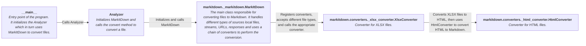

```mermaid
flowchart LR
    __main__[<b>__main__</b><br><i>Entry point of the program. It initializes the Analyzer which in turn uses MarkItDown to convert files.</i>] -- Calls Analyzer --> Analyzer[<b>Analyzer</b><br><i>Initializes MarkItDown and calls the convert method to convert a file.</i>]
    Analyzer[<b>Analyzer</b><br><i>Initializes MarkItDown and calls the convert method to convert a file.</i>] -- Initializes and calls MarkItDown --> markitdown._markitdown.MarkItDown[<b>markitdown._markitdown.MarkItDown</b><br><i>The main class responsible for converting files to Markdown. It handles different types of sources local files, streams, URLs, responses and uses a chain of converters to perform the conversion.</i>]
    markitdown._markitdown.MarkItDown[<b>markitdown._markitdown.MarkItDown</b><br><i>The main class responsible for converting files to Markdown. It handles different types of sources local files, streams, URLs, responses and uses a chain of converters to perform the conversion.</i>] -- Registers converters, accepts different file types, and calls the appropriate converter. --> markitdown.converters._xlsx_converter.XlsxConverter[<b>markitdown.converters._xlsx_converter.XlsxConverter</b><br><i>Converter for XLSX files.</i>]
    markitdown.converters._xlsx_converter.XlsxConverter[<b>markitdown.converters._xlsx_converter.XlsxConverter</b><br><i>Converter for XLSX files.</i>] -- Converts XLSX files to HTML, then uses HtmlConverter to convert HTML to Markdown. --> markitdown.converters._html_converter.HtmlConverter[<b>markitdown.converters._html_converter.HtmlConverter</b><br><i>Converter for HTML files.</i>]
```